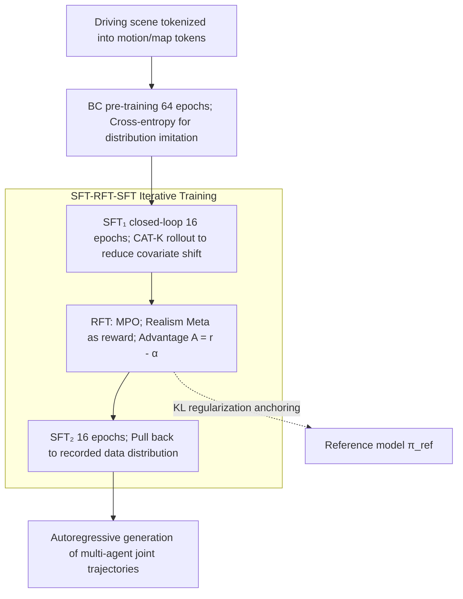

# SMART-R1: Advancing Multi-agent Traffic Simulation via R1-Style Reinforcement Fine-Tuning

**Conference**: ICLR 2026  
**arXiv**: [2509.23993](https://arxiv.org/abs/2509.23993)  
**Code**: None  
**Area**: Autonomous Driving / Reinforcement Learning  
**Keywords**: Multi-agent traffic simulation, R1-style, Reinforcement Fine-Tuning, Next-token prediction, Policy optimization

## TL;DR
SMART-R1 introduces R1-style Reinforcement Fine-Tuning (RFT) to multi-agent traffic simulation for the first time, proposing the Metric-oriented Policy Optimization (MPO) algorithm and an "SFT-RFT-SFT" iterative training strategy. It achieved first place on the WOSAC 2025 leaderboard with a Realism Meta score of 0.7858.

## Background & Motivation

**Background**: Mainstream multi-agent traffic simulation methods utilize Next-Token Prediction (NTP) based autoregressive models (e.g., SMART), generating joint behaviors through discretized trajectory tokens. Training typically involves two stages: Behavior Cloning (BC) pre-training and closed-loop SFT (CAT-K rollout).

**Limitations of Prior Work**: (a) Training objectives (cross-entropy loss) for BC and SFT are not directly aligned with final evaluation metrics (Realism Meta scores involving collision rates, off-road rates, etc.), which are scalar, sparse, and non-differentiable; (b) Covariate shift in autoregressive generation leads to error accumulation during closed-loop simulation; (c) Direct application of RL methods like GRPO or PPO yields poor results as they rely on sampling comparisons or actor-critic architectures.

**Key Challenge**: A gap exists between the NTP model training objective (imitating data distribution) and evaluation goals (safety and realism metrics), where the latter cannot serve directly as differentiable loss functions for gradient optimization.

**Goal**: How to incorporate non-differentiable evaluation metrics into the training of NTP-based traffic simulation models?

**Key Insight**: Borrowing the multi-stage training strategy from DeepSeek-R1 to design an "SFT $\to$ RFT $\to$ SFT" iterative training pipeline, utilizing a simplified policy optimization algorithm for direct metric alignment.

**Core Idea**: Simplify advantage estimation using known reward expectations and leverage SFT-RFT-SFT iterations to prevent catastrophic forgetting.

## Method

### Overall Architecture
SMART-R1 follows the backbone of NTP-based traffic simulation: tokenizing a driving scene into motion tokens (agent trajectories) and map tokens (static environment), which are processed by a Transformer with self-attention and cross-attention to predict motion token logits. It generates joint behaviors autoregressively. The primary contribution is a four-stage training pipeline inspired by DeepSeek-R1: BC pre-training (64 epochs), closed-loop SFT (16 epochs), an RFT phase using MPO for direct metric optimization, and a final SFT (16 epochs) to realign with recorded data. The objective shifts from "imitating token distributions" to "aligning with non-differentiable Realism Meta metrics" while maintaining learned priors.

### Key Designs

**1. Metric-oriented Policy Optimization (MPO): Direct reward optimization with task-specific priors**

Standard RL often relies on complex sampling or value networks to estimate baselines. MPO utilizes the observation that reward expectations in traffic simulation are relatively concentrated (baseline models average ~0.77). It simplifies advantage estimation to $\mathcal{A} = r - \alpha$, where $r$ is the Realism Meta score from a full rollout and $\alpha = 0.77$ is an empirical threshold. Rollouts exceeding this threshold are positively reinforced. The total loss is:

$$\mathcal{L}_{\text{MPO}} = -\left(\frac{\pi_\theta}{\bar{\pi}_\theta}\mathcal{A} - \beta D_{\text{KL}}[\pi_\theta \,\|\, \pi_{\text{ref}}]\right).$$

Unlike GRPO, which uses group-average normalization, or PPO, which requires a value model, MPO uses a fixed threshold $\alpha$ for stability and simplicity.

**2. R1-Style "SFT-RFT-SFT" Iterative Training: Sandwiching RFT to prevent forgetting**

Optimizing solely for metrics during RFT can cause the policy to deviate from the data distribution learned during SFT. SMART-R1 organizes training into three complementary segments: the first SFT reduces covariate shift; RFT uses MPO to align metrics; and the final SFT repairs potential distribution shifts introduced by RFT.

**3. KL Regularization: Anchoring policies via per-token KL penalties**

To prevent the policy from deviating too far from BC/SFT priors, MPO incorporates a $\beta D_{\text{KL}}$ term using an unbiased KL estimator:

$$D_{\text{KL}} = \frac{\pi_{\text{ref}}}{\pi_\theta} - \log\frac{\pi_\theta}{\pi_{\text{ref}}} - 1,$$

with $\beta = 0.04$ providing a balance between prior retention and metric optimization.

### Loss & Training
- **BC/SFT Stage**: Standard cross-entropy loss to align token distributions.
- **RFT Stage**: MPO loss comprising advantage-weighted policy gradients and KL regularization.
- **Schedule**: Total epochs match baseline (64 + 32), splitting the final 32 epochs into SFT (16), RFT, and SFT (16).

## Key Experimental Results

### Main Results
WOSAC 2025 Leaderboard (Test Set):

| Method | Realism Meta↑ | Kinematics↑ | Interaction↑ | Map↑ | minADE↓ | Params |
| :--- | :--- | :--- | :--- | :--- | :--- | :--- |
| SMART-base | 0.7725 | 0.472 | 0.804 | 0.912 | 1.393 | 7M |
| SMART-SFT (CAT-K) | 0.7846 | 0.493 | 0.811 | 0.918 | 1.307 | 7M |
| TrajTok | 0.7852 | 0.489 | 0.812 | 0.921 | 1.318 | 10M |
| **SMART-R1** | **0.7858** | **0.494** | 0.811 | 0.920 | **1.289** | 7M |

### Ablation Study

| Training Strategy | Realism Meta↑ | Description |
| :--- | :--- | :--- |
| BC only | 0.7725 | Baseline |
| SFT | 0.7812 | Gain from closed-loop SFT |
| SFT $\to$ RFT | 0.7848 | Further gain with RFT |
| SFT $\to$ SFT (No RFT) | 0.7809 | Continuous SFT performs worse than RFT insertion |
| **SFT $\to$ RFT $\to$ SFT** | **0.7859** | Best R1-style performance |

Policy Optimization Comparison (Post-SFT):

| Method | Realism Meta↑ |
| :--- | :--- |
| SFT baseline | 0.7812 |
| + PPO | Decrease | (Unstable training) |
| + DPO | Decrease | (Sampling bias) |
| + GRPO | Decrease | (Unstable group comparison) |
| **+ MPO** | **0.7848** | (Uses task-prior guidance) |

### Key Findings
- RFT yields the most significant improvements in safety-critical metrics (collision, off-road, traffic light violations) which are not directly optimized by BC/SFT.
- Standard RL algorithms (PPO/DPO/GRPO) failed in this task; MPO succeeded by leveraging predictable reward expectations.
- $\alpha = 0.77$ and $\beta = 0.04$ were identified as the optimal threshold and regularization coefficient, respectively.

## Highlights & Insights
- **"Task Prior Knowledge Simplifies RL"**: When reward distributions are concentrated, a fixed threshold is more stable than group comparisons used in GRPO.
- **SFT-RFT-SFT Paradigm**: Validates that the "Distribution Alignment $\to$ Metric Optimization $\to$ Distribution Restoration" sequence is effective beyond LLMs, providing a template for RLHF in autonomous driving.
- **Efficiency**: Achieved SOTA results on the WOSAC leaderboard with only 7M parameters, without requiring model ensembles or post-processing.

## Limitations & Future Work
- The threshold $\alpha$ in MPO requires manual tuning and depends on the baseline's average performance.
- Evaluation was limited to the 7M parameter model; effectiveness on larger scales is unverified.
- Whether the Realism Meta metric truly reflects driving realism remains a point of academic debate.

## Related Work & Insights
- **vs SMART/CAT-K**: RFT improves Realism Meta from 0.7846 to 0.7858 without increasing parameter count.
- **vs RLFTSim (Ahmadi et al., 2025)**: SMART-R1 outperforms previous RL fine-tuning attempts (0.7858 vs 0.7844) due to the MPO design.
- **vs DeepSeek-R1**: Demonstrates that LLM training paradigms can be successfully transferred to the domain of autonomous driving simulation.

## Rating
- Novelty: ⭐⭐⭐⭐ 
- Experimental Thoroughness: ⭐⭐⭐⭐⭐ 
- Writing Quality: ⭐⭐⭐⭐ 
- Value: ⭐⭐⭐⭐ 

<!-- RELATED:START -->

## Related Papers

- [\[CVPR 2026\] RLFTSim: Realistic and Controllable Multi-Agent Traffic Simulation via Reinforcement Learning Fine-Tuning](../../CVPR2026/autonomous_driving/rlftsim_realistic_and_controllable_multi-agent_traffic_simulation_via_reinforcem.md)
- [\[ICLR 2026\] DriveAgent-R1: Advancing VLM-based Autonomous Driving with Active Perception and Hybrid Thinking](driveagent-r1_advancing_vlm-based_autonomous_driving_with_active_perception_and_.md)
- [\[ICLR 2026\] Plan-R1: Safe and Feasible Trajectory Planning as Language Modeling](plan-r1_safe_and_feasible_trajectory_planning_as_language_modeling.md)
- [\[AAAI 2026\] WorldRFT: Latent World Model Planning with Reinforcement Fine-Tuning for Autonomous Driving](../../AAAI2026/autonomous_driving/worldrft_latent_world_model_planning_with_reinforcement_fine-tuning_for_autonomo.md)
- [\[ECCV 2024\] Improving Agent Behaviors with RL Fine-tuning for Autonomous Driving](../../ECCV2024/autonomous_driving/improving_agent_behaviors_with_rl_fine-tuning_for_autonomous_driving.md)

<!-- RELATED:END -->
