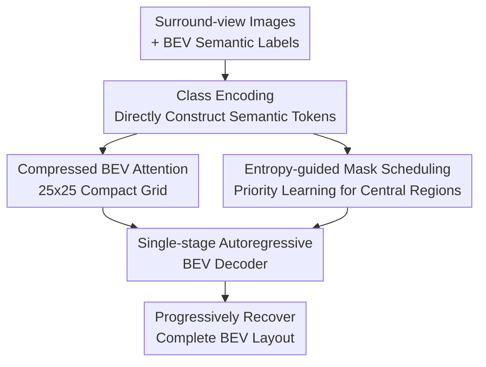

# ARINBEV: Bird's-Eye View Layout Estimation with Conditional Autoregressive Model

**Conference**: ICLR2026  
**OpenReview**: [https://openreview.net/forum?id=l9i6q2bXnj](https://openreview.net/forum?id=l9i6q2bXnj)  
**Code**: No public code provided  
**Area**: Autonomous Driving / BEV Map Estimation  
**Keywords**: BEV Layout Estimation, Autoregressive Model, Semantic Map, Mask Scheduling, Multi-view Perception  

## TL;DR

ARINBEV treats the BEV semantic map in autonomous driving as a discretized sequence of structured tokens, replaces VQ-VAE tokenization with class encoding, and utilizes entropy-guided masked autoregressive decoding to achieve higher mIoU, fewer parameters, and faster training on nuScenes and Argoverse2.

## Background & Motivation

**Background**: A common objective in BEV perception is to align surround-view camera images into a unified bird's-eye view coordinate system and predict map elements such as drivable areas, pedestrian crossings, lane lines, stop lines, and parking areas on this plane. Traditional methods mainly focus on geometric projection, depth estimation, cross-view attention, or BEV encoder design. A representative approach involves extracting features from multi-view images, fusing these features into a dense BEV representation, and finally outputting the layout using a segmentation head or map decoder.

**Limitations of Prior Work**: Recently, generative BEV map methods have attempted to enhance structural consistency using VQ-VAE, VQGAN, diffusion models, or generative decoders. However, these methods often treat BEV maps as natural images. Two-stage VQ series require training a discrete codebook followed by a transformer to predict tokens; while encoder-decoder generative models skip some tokenization, they introduce additional decoders or diffusion iterations. The issue is that BEV maps are not natural images; they consist of large background areas and sparse structural elements with clear semantic constraints. Force-learning a visual codebook easily results in computation being wasted on low-information regions.

**Key Challenge**: Conditional dependencies do exist between BEV traffic elements (e.g., stop lines typically appear before pedestrian crossings, lane dividers extend along road curvature, and pedestrian crossings align with sidewalks and intersection structures), making them suitable for autoregressive modeling. However, if VQ-VAE discretization is performed first to utilize an autoregressive transformer, problems such as low entropy in BEV maps, insufficient codebook utilization, and weakened supervision signals arise. In other words, the task requires structural dependency modeling but not necessarily natural-image-style discrete representation learning.

**Goal**: The authors aim to answer two specific questions: first, whether BEV maps truly require a first stage of discrete representation learning; and second, how to construct semantic tokens for autoregressive models without relying on VQ-VAE tokens while prioritizing the learning of the most informative regional dependencies.

**Key Insight**: The paper starts with VQ-VAE codebook utilization and Shannon entropy, verifying that semantic information in BEV maps is primarily concentrated in central areas such as roads, intersections, and boundaries, while background and peripheral areas have very low entropy. This observation suggests a direct design direction: since labels are already sparse, discrete, and semantically clear structures, embeddings can be constructed directly from category labels instead of learning an underutilized codebook.

**Core Idea**: Replace two-stage discrete tokenization with "class encoding + entropy-guided mask scheduling," re-formulating BEV map estimation as a single-stage decoder-only conditional autoregressive prediction problem.

## Method

### Overall Architecture

The inputs to ARINBEV are surround-view camera images and ground-truth BEV semantic maps available during training, while the output is a multi-class binary semantic layout on a $200\times200$ BEV grid. Instead of training a VQ-VAE or a separate generative decoder, the model transforms BEV semantic labels into initial tokens via lightweight embeddings, obscures certain positions according to a mask schedule, and allows a decoder-only autoregressive BEV decoder to progressively restore the complete map conditioned on multi-view images.

During training, class encoding provides semantic BEV tokens; entropy-guided Halton masking places more learning pressure on high-information central regions while retaining random masking to prevent overfitting to fixed priors. The autoregressive decoder performs global self-attention on a compressed BEV grid and reads multi-view image features via deformable cross-attention. During inference, the model starts from a fully masked BEV map and progressively fills the layout through a small number of sampling steps, with 3-step sampling used by default.

The four contribution nodes in this diagram correspond to the four key designs: class encoding replaces VQ tokens, compressed BEV attention controls computational costs, the single-stage autoregressive BEV decoder models conditional dependencies between map elements, and entropy-guided mask scheduling determines which positions deserve priority learning during training and sampling.

### Key Designs

**1. Class Encoding: Converting BEV Labels Directly into Semantic Tokens**

The implicit assumption of two-stage VQ methods is that visual signals must first be compressed into discrete codes before a transformer models them. However, BEV map input labels are already category grids $M\in\{0,1\}^{C\times H\times W}$. Unlike natural image pixels, each channel already corresponds to explicit traffic semantics. ARINBEV therefore uses a learnable embedding table $E\in\mathbb{R}^{(C+1)\times D}$ for direct lookups, where one extra entry is reserved for the mask token.

Specifically, binary label maps are first weighted by class index weights $F\in\mathbb{R}^{1\times C\times1\times1}$ to obtain $C=M\odot F$. Then, the class indices at each position are used for lookup to obtain $S\in\mathbb{R}^{C\times H\times W\times D}$. After averaging across the category dimension, multi-channel category embeddings are normalized using bounded non-linearity: $Z=(2\cdot\sigma(S_{avg})-1)\cdot\beta$, where $\beta=0.01$. This scaling is critical: appendix experiments show $\beta=0.01$ achieves 64.3 mIoU, while larger or learnable scales decrease training stability and accuracy.

This step addresses how to obtain tokens without VQ-VAE. It avoids treating the map as image compression and instead acknowledges that the BEV layout is already a semantically discrete structure, directly projecting category labels into a continuous embedding space manageable by transformers. Compared to VQ codebooks, it avoids under-utilization and prevents background regions from consuming large amounts of discrete code capacity.

**2. Compressed BEV Attention: Retaining Global Dependencies on a Compact Grid**

The original BEV map is a $200\times200$ grid; performing self-attention directly at full resolution would be computationally heavy. ARINBEV compresses the class-encoded $Z$ to $25\times25$, an 8x spatial reduction, and performs global self-attention on this compact grid. Since the number of tokens is significantly reduced, the model can utilize global self-attention to capture long-range relationships between road structures, lane boundaries, and lateral elements without relying on local windows or complex sparse strategies.

Compression is not a simple downsampling. The paper compares three layers of $3\times3$ convolutions, a single $8\times8$ stride-8 convolution, pure bilinear downsampling, and a hybrid "bilinear downsampling + $3\times3$ convolution" scheme. The hybrid scheme eventually adopted reaches 64.3 mIoU, higher than pure interpolation (62.8) and slightly higher than the convolutional scheme. This suggests that smooth interpolation preserves the continuous geometric shape of the layout, while subsequent convolutions recover local context, making the combination better suited for compressing sparse BEV semantics into a computable token grid.

**3. Single-stage Autoregressive BEV Decoder: Fusing Perception Conditions and Restoring Layouts with One Decoder**

The autoregressive goal of ARINBEV is to learn the token distribution $p(x\mid c)$ conditioned on multi-view images $c$, and predict masked positions step-by-step according to the mask schedule $S$: $p(x\mid c)=\prod_{s=1}^{S}p(x_s\mid x_{<s},c)$. Here, $x_s$ is not a fixed left-to-right 1D sequence but a set of BEV positions specified by the mask schedule; $x_{<s}$ represents map tokens recovered in previous steps.

Structurally, the model inherits designs from BEVFormer and DETR but merges the BEV encoder and generative decoder into a single-stage decoder-only framework. Compressed BEV tokens pass through pre-normalized attention blocks for global self-attention and then through deformable cross-attention to access multi-view image features using camera parameters and learned offsets. Consequently, the model can observe image evidence while using recovered map elements as context to progressively complete obscured traffic structures.

This design differs clearly from two types of baselines: compared to two-stage models like MapPrior and VQ-Map, it does not require training a discrete representation learning module; compared to encoder-decoder or diffusion frameworks like DDP and DiffBEV, it lacks a heavy additional generative process. The paper reports that ARINBEV has 63.4M parameters and a training time of 73 GPU hours, while MapPrior has 719.1M parameters with over 200 hours of training, and DDP's MACs reach 614.1G. Thus, ARINBEV's autoregression does not exchange performance for a larger generator but reduces unnecessary stages in the task structure.

**4. Entropy-guided Mask Scheduling: Concentrating Model Capacity on High-Information BEV Regions**

BEV maps contain many background regions; random masking would allocate a large training budget to easily predictable blank positions. The paper first constructs soft assignments using VQ-VAE features and codebook cosine similarity, then calculates the Shannon entropy for each spatial position: $H(h,w)=-\sum_{i=1}^{K}p_i(h,w)\log p_i(h,w)$. The average entropy map shows that high-entropy regions are mainly concentrated in high semantic variability areas like central roads, intersections, and boundaries, while peripheral and large background areas have lower entropy.

Instead of directly memorizing the dataset's average entropy map, ARINBEV uses a central Gaussian prior $S\in\mathbb{R}^{H\times W}$ as a more robust approximation, with a default standard deviation of $\sigma=0.5$. For each batch, a ratio $r\sim U(0,1)$ is sampled to obtain the masking ratio $\rho_b=\frac{2}{\pi}\arccos(r)$; then, random Halton sequences generate candidate coordinates, and positions to be masked are sampled without replacement with probability $p_k=\frac{S_{y_k,x_k}}{\sum_j S_{y_j,x_j}}$. To prevent the model from only adapting to the central prior, this entropy-guided masking is mixed with standard random arccosine masking at a probability of $p=0.5$.

The value of this strategy is intuitive in the ablation study: pure random arccosine masking yields 62.9 mIoU, pure entropy-guided masking yields only 61.1, while the hybrid strategy reaches 64.3. This indicates that high-information central regions are worth focused modeling, but total reliance on the prior harms generalization; the combination of half entropy-guided and half random masking encourages learning traffic structure dependencies while maintaining coverage of atypical regions.

### Loss & Training

The training objective employs per-token classification with binary focal loss to mitigate imbalance among BEV semantic categories. The paper does not focus on loss design as its primary innovation; the key lies in how input tokens are constructed, how masking is scheduled, and how the single-stage decoder-only structure handles multi-view image conditions.

For data and implementation, nuScenes and Argoverse2 are used in a camera-only configuration. The BEV perception range is $[-50m, 50m]$ in X/Y directions with a resolution of 0.5m per pixel, resulting in a $200\times200$ output grid. The backbone is Swin-Tiny, using the AdamW optimizer with a weight decay of 0.01. Training lasts 20 epochs, including 8 warm-up epochs, on 4 A100 GPUs with a batch size of 8 per card and an initial learning rate of $5\times10^{-5}$ using a one-cycle schedule. Inference defaults to 3 Halton scheduler sampling steps.

In the final epoch, a strategy similar to DDP is adopted to alleviate sampling drift: model predictions $Z_{model}$ are obtained from unmasked inputs, and training is performed with masking applied to $Z_{model}$, allowing the model to adapt to the inference distribution where inputs come from its own predictions. However, experiments show that performance plateau after 3 steps, and more iterations may introduce cumulative errors.

## Key Experimental Results

### Main Results

| Dataset | Metric | Ours | Prev. SOTA | Gain |
|--------|------|------|----------|------|
| nuScenes validation | mIoU | 64.3 | VQ-Map 62.2 | +2.1 |
| Argoverse2 validation | mIoU | 65.6 | DDP 63.5 | +2.1 |
| nuScenes validation | Drivable IoU | 85.0 | VQ-Map 83.8 | +1.2 |
| nuScenes validation | Stopline IoU | 60.8 | VQ-Map 57.7 | +3.1 |
| Argoverse2 validation | Ped. Cross. IoU | 61.4 | DDP 58.1 | +3.3 |
| Argoverse2 validation | Divider IoU | 51.6 | DDP 48.8 | +2.8 |

| Method | Params (M) | MACs (G) | Train Time (h) | nuScenes mIoU |
|------|------------|----------|----------------|---------------|
| BEVFusion | 50.1 | 155.5 | 100 | 56.6 |
| MapPrior | 719.1 | 396.0 | >200 | 56.7 |
| DDP | 53.6 | 614.1 | 160 | 59.4 |
| VQ-Map | 108.3 | 231.6 | 131 | 62.2 |
| ARINBEV | 63.4 | 215.8 | 73 | 64.3 |

Per-class results on nuScenes show ARINBEV outperforms VQ-Map across all six categories, including drivable area (85.0), pedestrian crossing (62.4), sidewalk (66.5), stopline (60.8), parking area (59.7), and divider (51.2). Notably, the largest gains are not just in large-scale drivable areas but in context-dependent structural elements like stoplines and pedestrian crossings, consistent with the paper's emphasis on conditional dependencies.

Argoverse2 results support the conclusion that removing VQ tokenization is more robust. MapPrior and VQ-Map only have 3 semantic categories available on this dataset, where discrete representation learning is more prone to the effects of few categories and low-entropy information; ARINBEV maintains a lead in all categories as it does not rely on a first-stage codebook.

### Ablation Study

| Configuration | Key Metric | Description |
|------|---------|------|
| Random arccosine masking | 62.9 mIoU | Wide coverage but ignores high-information central regions |
| Pure entropy-guided masking | 61.1 mIoU | Over-reliant on central prior; generalization inferior to hybrid strategy |
| Hybrid entropy-guided masking | 64.3 mIoU | Final scheme, mixing entropy-guided and random masking at $p=0.5$ |
| 3-layer $3\times3$ Conv Compression | 63.9 mIoU | Learnable compression is effective but slightly lower than hybrid |
| Single $8\times8$ stride Conv | 64.0 mIoU | Large-stride convolution approaches final performance |
| Pure bilinear downsampling | 62.8 mIoU | Lacks learnable local refinement; performance drops significantly |
| Bilinear downsampling + $3\times3$ Conv | 64.3 mIoU | Final scheme, balances smooth geometry and local context |
| Channel-wise binary encoding | 61.0 mIoU | Simple binary indexing fails to express multi-class structures |

| Additional Analysis | Setting | mIoU | Conclusion |
|----------|------|------|------|
| Class encoding scale | 0.01 | 64.3 | Optimal scale, most stable training |
| Class encoding scale | 0.1 | 63.2 | Performance drops as values increase |
| Class encoding scale | 1.0 | 61.2 | Embedding magnitude interferes with optimization |
| Class encoding scale | learned | 57.2 | Learnable scale is worst, indicating stability boundaries are key |
| Gaussian $\sigma$ | 0.3 | 62.1 | Central area too narrow, masking prior too strong |
| Gaussian $\sigma$ | 0.5 | 64.3 | Optimal setting |
| Sampling steps | 1 / 2 / 3 / 4 | 59.8 / 63.4 / 64.3 / 64.3 | 3 steps sufficient, more iterations yield no gain |

### Key Findings

- Class encoding is not a minor replacement but the key to ARINBEV bypassing two-stage training. The alternative channel-wise binary encoding yields only 61.0 mIoU, 3.3 lower than the final scheme, suggesting that learned class embeddings are more stable than direct integer compression.
- Entropy-guided masking must be mixed with random masking. Pure entropy guidance performs worse than pure random masking, suggesting that the central prior alone is not a universal solution; the true effectiveness lies in pulling the model's attention toward dense road structures while maintaining training coverage for non-central and long-tail layouts.
- Computational efficiency is a strong selling point. ARINBEV's training time of 73 hours is lower than BEVFusion (100), VQ-Map (131), DDP (160), and MapPrior (200+), while achieving the highest mIoU. This indicates the improvements are not due to stacking larger generative models.
- Visualizations show ARINBEV generates more coherent road structures across daytime, rainy, and nighttime conditions, especially in occluded and low-light scenes, exhibiting fewer fractures and artifacts than BEVFusion.

## Highlights & Insights

- **Treating BEV maps as structured tokens rather than natural images**: The most valuable observation is that the sparse, discrete, and engineering constraints of BEV layouts distinguish them from natural images. This allows the authors to confidently remove VQ-VAE instead of optimizing the codebook.
- **Supporting architecture simplification with entropy analysis**: The paper does not simply claim "two stages are too complex" but first uses codebook utilization and Shannon entropy to demonstrate that discrete representation learning on BEV maps results in insufficient information utility. This analysis makes class encoding and mask scheduling natural choices.
- **Autoregressive modeling for traffic element dependencies**: Elements like stop lines and pedestrian crossings are not independent pixel categories; they follow road design standards and spatial adjacency. Conditioning the next batch of tokens on previously predicted ones is more aligned with the layout generation process than single-pass dense segmentation.
- **Efficiency gains from removing incorrect abstraction layers**: Many generative perception works attribute performance to complex generative frameworks. ARINBEV conversely proves that on low-entropy structured outputs like BEV maps, removing unnecessary tokenization and decoder stages is superior.

## Limitations & Future Work

- Inference speed is still affected by the number of autoregressive sampling steps. The appendix notes that at 1 step, FPS is highest (near real-time), but the optimal 64.3 mIoU requires 3 steps (~7.5 FPS); further optimization via sampling or distillation is needed for strict real-time systems.
- Current work handles 2D BEV maps only, without direct extension to 3D occupancy. Autoregressive dependency modeling is attractive for 3D voxel grids, but direct generation in dense 3D space would incur higher costs, possibly requiring sparse voxels, hierarchical decoding, or hybrid 2D-3D representations.
- The entropy-guided prior is based on the statistical importance of central regions, which might require recalibration for different countries, camera configurations, or non-urban scenarios. Although random masking helps, cross-domain generalization requires further validation.
- Data-driven analysis of failure cases is somewhat lacking. While visualizations show robustness in rain or night, statistics on IoU categorized by weather, traffic density, or occlusion levels would better pinpoint where autoregressive dependencies help most.
- Discrete diffusion is mentioned as a future direction. ARINBEV uses mask tokens and autoregressive recovery, whereas discrete diffusion or continuous noise processes might offer stronger global generation capabilities; balancing efficiency and generation quality remains an open question.

## Related Work & Insights

- **vs BEVFusion / BEVFormer**: These works primarily address geometric fusion from multi-view images to BEV representations. ARINBEV inherits this cross-view conditional fusion but changes the output to autoregressive layout recovery, emphasizing semantic dependencies between map elements.
- **vs MapPrior**: MapPrior uses VQGAN-style generative models to introduce map priors but requires two-stage training and high model complexity. ARINBEV argues that BEV map labels are inherently discrete enough that direct class encoding avoids codebook under-utilization while significantly reducing parameters and training time.
- **vs VQ-Map**: VQ-Map also targets tokenized BEV layouts but relies on first-stage vector quantization. ARINBEV's experiments prove that skipping the first stage not only results in no loss but improves mIoU, especially on category-scarce datasets like Argoverse2.
- **vs DDP / DiffBEV**: These represent diffusion-based dense prediction or BEV perception, offering strong generation but heavy computation. ARINBEV achieves lower MACs and shorter training time via masked autoregressive decoding, suitable for efficiency-sensitive autonomous driving tasks.

## Rating

- Novelty: ⭐⭐⭐⭐☆ Clear and purposeful approach by removing the VQ stage based on BEV map entropy, though core components draw from mature modules like MaskGIT and BEVFormer.
- Experimental Thoroughness: ⭐⭐⭐⭐☆ Comprehensive results across two datasets with thorough ablations on masking, compression, and encoding; more detailed scene-based robustness analysis would be even stronger.
- Writing Quality: ⭐⭐⭐⭐☆ Motivations and efficiency comparisons are clear; the entropy analysis supports methodological choices well, though failure modes could be expanded.
- Value: ⭐⭐⭐⭐⭐ Practical for autonomous driving BEV layout estimation, providing a lighter, faster, and better-performing generative perception solution while prompting a re-evaluation of the necessity of complex tokenizers for BEV outputs.

<!-- RELATED:START -->

## Related Papers

- [\[ICLR 2026\] Bird's-eye-view Informed Reasoning Driver (BIRDriver)](birds-eye-view_informed_reasoning_driver.md)
- [\[CVPR 2026\] CycleBEV: Regularizing View Transformation Networks via View Cycle Consistency for Bird's-Eye-View Semantic Segmentation](../../CVPR2026/autonomous_driving/cyclebev_regularizing_view_transformation_networks_via_view_cycle_consistency_fo.md)
- [\[CVPR 2026\] BEV-CAR: Enhancing Monocular Bird's Eye View Segmentation with Context-Aware Rasterization](../../CVPR2026/autonomous_driving/bev-car_enhancing_monocular_birds_eye_view_segmentation_with_context-aware_raste.md)
- [\[CVPR 2026\] Spe-BEVHead: Rethinking the Detection Head Design for Bird's-Eye-View Object Detection](../../CVPR2026/autonomous_driving/spe-bevhead_rethinking_the_detection_head_design_for_birds-eye-view_object_detec.md)
- [\[ICLR 2026\] Astra: General Interactive World Model with Autoregressive Denoising](astra_general_interactive_world_model_with_autoregressive_denoising.md)

<!-- RELATED:END -->
