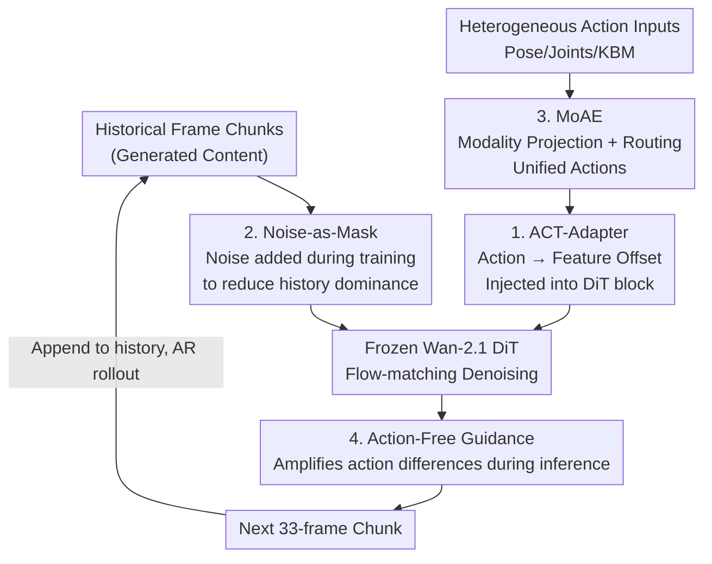

# Astra: General Interactive World Model with Autoregressive Denoising

**Conference**: ICLR 2026  
**arXiv**: [2512.08931](https://arxiv.org/abs/2512.08931)  
**Code**: [https://github.com/EternalEvan/Astra](https://github.com/EternalEvan/Astra)  
**Area**: Autonomous Driving / Video Generation  
**Keywords**: world model, autoregressive denoising, action control, interactive video, mixture of experts

## TL;DR
Ours proposes Astra, a general interactive world model that enables action-conditioned long-range video prediction on pre-trained video diffusion models through an autoregressive denoising framework. It introduces ACT-Adapter (action injection), noise-enhanced historical memory (alleviating visual inertia), and Mixture of Action Experts (unifying heterogeneous action modalities), achieving SOTA fidelity and action-following capabilities across autonomous driving, robotic manipulation, and scene exploration.

## Background & Motivation
**Background**: Video diffusion models (e.g., Wan-2.1) can generate high-quality short videos but lack interactivity—they cannot dynamically adjust generation based on action inputs. A true world model needs to respond to arbitrary actions at any moment.

**Limitations of Prior Work**: (1) Standard T2V/I2V models generate only fixed segments without long-range rollouts; (2) Autoregressive diffusion hybrid methods face error accumulation and temporal drift; (3) Increasing historical condition length improves temporal consistency but weakens action responsiveness—the "visual inertia" problem; (4) Real-world environments involve heterogeneous action modalities (camera poses, robot joints, keyboard commands), which are difficult to unify in a single model.

**Key Challenge**: Long-term temporal consistency vs. action responsiveness—models tend to smoothly extrapolate from past frames while ignoring new action control signals.

**Goal**: Construct a general world model capable of generating interactive long-range videos based on various action types in multiple real-world scenarios.

**Key Insight**: Attach lightweight adapters to pre-trained video diffusion models to inject action signals + use noise-enhanced historical frames to alleviate visual inertia + employ MoE to route heterogeneous actions.

**Core Idea**: Use noise to reduce the dominance of historical frames, use adapters to inject action signals, and use MoE to unify multi-modal actions—transforming video diffusion models into interactive world models.

## Method

### Overall Architecture
Astra aims to transform a video diffusion model that only generates fixed short clips into an interactive world model that responds to actions during execution. It directly reuses the pre-trained Wan-2.1 and decomposes the generation process into chunk-wise autoregression: each step predicts only the next 33-frame video block, which is then appended to the history to predict the next block, aggregating past content via temporal causal attention. Thus, long-range rollout becomes "chunk-by-chunk" rolling generation. The core difficulty lies not in how to continue, but in ensuring the continuation follows new action commands rather than just extrapolating from the past. The following four designs address this: **Noise-as-Mask** reduces the influence of history, **MoAE** unifies heterogeneous actions, **ACT-Adapter** injects them into the frozen DiT, and **AFG** amplifies the action impact during inference.

### Key Designs

**1. ACT-Adapter: Treating action as a feature offset in latent space**

To make a frozen video diffusion model understand actions, the most efficient way is to interpret the action's impact as a translation in the latent space—similar to optical flow, where actions shift image content in a specific direction. Based on this intuition, ACT-Adapter uses an action encoder to project actions into a feature space aligned with video latents, then performs element-wise addition with video features in each DiT block instead of using cross-attention. During training, most parameters are frozen, only fine-tuning self-attention layers and a linear adapter initialized with an identity matrix. Identity initialization ensures the pre-trained capability is not destroyed initially while the model gradually learns action injection.

**2. Noise-as-Mask: Using noise to suppress history and force the model to attend to actions**

Longer historical conditions lead to better temporal consistency, but at the cost of "visual inertia," where the model ignores new action signals. Noise-as-Mask injects random noise into historical condition frames during training. This noise is independent of the diffusion noise and serves to degrade the information quality of historical frames. As history becomes blurred, the model cannot rely solely on copying past frames and must depend on action signals to correctly generate the next chunk. During inference, clean historical frames are used to maintain fidelity. Compared to token masking, this merely "dims" the history without modifying the architecture or adding parameters.

**3. Mixture of Action Experts (MoAE): Unifying diverse action structures via expert routing**

Action modalities vary significantly—7D camera poses for driving, 7D joint angles for robotics, or keyboard/mouse commands. MoAE assigns a modality-specific projector to each type to map them into a shared space, followed by a routing network that calculates gating scores to select the top-K experts (independent MLPs). This allows a single model to handle both camera poses and joint angles using shared weights.

**4. Action-Free Guidance (AFG): Applying CFG logic to action conditions to amplify effects**

To strengthen action influence during inference, Astra adopts the classifier-free guidance approach: randomly dropping action conditions during training to learn both "action-conditioned" and "unconditional" predictions. During inference, the difference is amplified by a guidance scale $s$:

$$v_{guided} = v_\emptyset + s \cdot (v_a - v_\emptyset)$$

where $v_a$ is the action-conditioned prediction and $v_\emptyset$ is the action-free prediction.

### Loss & Training
Flow matching loss. Based on Wan-2.1 pre-training, trained on 8 GPUs for 30 epochs (~24h). Data: ~397K videos (360 hours), covering nuScenes, Sekai, SpatialVID, RT-1, and Multi-Cam Video.

## Key Experimental Results

### Main Results (Astra-Bench, 480×832, 96 frames)

| Method | Instruction Following↑ | Subject Consistency↑ | Motion Smoothness↑ |
|:---|:---:|:---:|:---:|
| Wan-2.1 | 0.061 | 0.854 | 0.958 |
| MatrixGame | 0.268 | 0.916 | 0.981 |
| YUME | 0.652 | 0.936 | 0.985 |
| **Ours (Astra)** | **0.669** | **0.939** | **0.989** |

### Ablation Study

| Configuration | Effect |
|:---|:---|
| w/o ACT-Adapter (using cross-attn) | Significant drop in action following |
| w/o AFG | Weakened action response |
| w/o Noise-as-Mask | Increased visual inertia; actions ignored |
| w/o MoAE | Inability to handle multi-modal actions; performance drop |

### Key Findings
- Astra surpasses SOTA across all 6 metrics, especially leading by a large margin in Instruction Following (0.669 vs 0.061 for Wan-2.1).
- Astra maintains stability in long-range rollouts (96+ frames), while competing methods exhibit drift and degradation.
- The noise enhancement strategy is simpler (no architectural changes) and more effective than token masking.
- MoAE allows a single model to handle autonomous driving and robotic manipulation simultaneously.
- AFG effectively amplifies the influence of action conditions, analogous to CFG.

## Highlights & Insights
- **"Visual Inertia" as a Core Challenge**: First to name and systematically solve the contradiction between long-term consistency and action responsiveness.
- **Simplicity of Noise-as-Mask**: No architectural changes or extra parameters; it balances information source weights by degrading history quality during training.
- **Unified Multi-Scenario Ambition**: A single model for driving, robotics, and first-person exploration achieved via MoAE.

## Limitations & Future Work
- Training data is biased toward driving and exploration; complex physical interactions (e.g., fluids, collisions) may be insufficient.
- Error accumulation might still occur in extremely long rollouts (> hundreds of frames).
- Further analysis is needed to determine if the MoAE routing mechanism truly performs meaningful modality differentiation.
- Instruction Following evaluation relies on human assessment, which has limited scalability.

## Related Work & Insights
- **vs. YUME**: YUME uses masked video diffusion transformers; Astra uses noise-as-mask, which is simpler.
- **vs. MatrixGame**: MatrixGame uses causal action guidance; Astra’s ACT-Adapter injects actions more directly.
- **vs. Genie2/UniSim (Large-scale World Models)**: Astra achieves competitive performance with significantly less data (~400K vs. millions).

## Rating
- Novelty: ⭐⭐⭐⭐ (Noise-enhanced history, ACT-Adapter, and MoAE are creative)
- Experimental Thoroughness: ⭐⭐⭐⭐⭐ (5 datasets, multi-scenario, complete ablations, human evaluation)
- Writing Quality: ⭐⭐⭐⭐ (Clear architecture diagrams and intuitive concepts like "visual inertia")
- Value: ⭐⭐⭐⭐⭐ (Practical framework for general interactive world models; code open-sourced)

<!-- RELATED:START -->

## Related Papers

- [\[ICCV 2025\] Epona: Autoregressive Diffusion World Model for Autonomous Driving](../../ICCV2025/autonomous_driving/epona_autoregressive_diffusion_world_model_for_autonomous_driving.md)
- [\[ICLR 2026\] FlowAD: Ego-Scene Interactive Modeling for Autonomous Driving](flowad_ego-scene_interactive_modeling_for_autonomous_driving.md)
- [\[ICLR 2026\] ResWorld: Temporal Residual World Model for End-to-End Autonomous Driving](resworld_temporal_residual_world_model_for_end-to-end_autonomous_driving.md)
- [\[ICLR 2026\] Rethinking Driving World Model as Synthetic Data Generator for Perception Tasks](rethinking_driving_world_model_as_synthetic_data_generator_for_perception_tasks.md)
- [\[AAAI 2026\] Difficulty-Aware Label-Guided Denoising for Monocular 3D Object Detection](../../AAAI2026/autonomous_driving/difficulty-aware_label-guided_denoising_for_monocular_3d_object_detection.md)

<!-- RELATED:END -->
