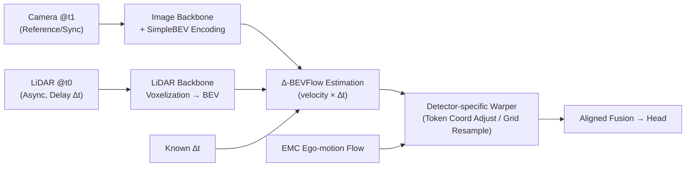

# AsyncBEV: Cross-modal Flow Alignment in Asynchronous 3D Object Detection

**Conference**: ICLR 2026  
**OpenReview**: [https://openreview.net/forum?id=JINemP2BQP](https://openreview.net/forum?id=JINemP2BQP)  
**Code**: [https://github.com/tudelft-iv/AsyncBEV](https://github.com/tudelft-iv/AsyncBEV)  
**Area**: Autonomous Driving / Multimodal 3D Object Detection / Sensor Asynchrony  
**Keywords**: BEV Detection, Sensor Asynchrony, Cross-modal Alignment, Scene Flow, LiDAR-Camera Fusion, Feature Warping  

## TL;DR
Addressing the real-world issue of imperfect sensor synchronization, AsyncBEV proposes a lightweight, plug-and-play module. By defining a new task, $\Delta$-BEVFlow, it predicts dense 2D flow fields directly from asynchronous multimodal BEV features to warp and align delayed features to the reference timestamp. Under extreme 0.5s asynchrony, it improves the dynamic object NDS of CMT by 16.6% compared to the EMC baseline.

## Background & Motivation
**Background**: On-vehicle 3D object detection relies on fusing multiple sensors like LiDAR and cameras. Almost all detectors—whether grid-based (BEVFusion/UniBEV) or token-based (CMT)—assume that inputs are **perfectly synchronized**. Training datasets (e.g., nuScenes) are carefully curated to exclude scenes with poor synchronization quality.

**Limitations of Prior Work**: In reality, perfect synchronization is nearly impossible. Different sensor sampling frequencies (many radars cannot be trigger-synced), computational resource competition leading to frame drops/latencies, and sensor failures or adversarial attacks introduce a time offset $\Delta t$. Once a modality is delayed, detectors trained on synchronous data suffer severe **spatial misalignment**, which is particularly fatal for dynamic objects. At a 0.5s offset, the dynamic object NDS of CMT plummets from 47.5% to 26.1%.

**Key Challenge**: Existing compensation methods have significant gaps. **Ego-motion Compensation (EMC)** can only align **static objects** based on known vehicle motion, remaining ineffective for dynamic objects (under 0.5s delay, CMT's dynamic mAP only rises from 9.0% to 11.9%). **Scene flow** estimation can account for dynamic motion but requires **two frames of point clouds** and assumes a **fixed time interval**, failing to handle "cross-modal, continuously varying $\Delta t$" asynchronous settings. Asynchronous fusion in cooperative perception (CoBEVFlow/UniV2X) depends on the quality of object proposals and has only been validated for single-modality homogeneous features, making it unsuitable for on-vehicle multimodal settings.

**Goal**: Design a lightweight alignment module that can be seamlessly embedded into any multimodal detector, remains robust to arbitrary time offsets, and specifically targets dynamic objects.

**Core Idea**: **Transfer the "scene flow" concept from point clouds to the BEV feature space**. Define a new task, $\Delta$-BEVFlow, to predict dense 2D flow fields directly from asynchronous multimodal BEV features and a known $\Delta t$. This compensates for the "dynamic object motion" ignored by EMC.

## Method

### Overall Architecture
AsyncBEV is inserted **before multimodal fusion**. A reference sensor (e.g., camera) triggers inference at $t_1$, while an asynchronous sensor (e.g., LiDAR) provides the latest data from an earlier $t_0$, where $\Delta t = t_1 - t_0$. The module first applies EMC to align static components, then uses $\Delta$-BEVFlow to predict the additional motion of dynamic objects on the BEV plane. Finally, a "detector-specific warper" aligns the asynchronous feature space to $t_1$. The entire detector can be frozen while only AsyncBEV is trained using standard detection losses.

### Key Designs

**1. $\Delta$-BEVFlow: Adapting Scene Flow to "$\Delta t$-conditioned BEV Feature Flow"** — This is the core task definition. Traditional scene flow is formalized as $V^{t\to t+\Delta t}=\theta_{\text{SceneFlow}}(P^t, P^{t+\Delta t})$, requiring two point cloud frames and a fixed $\Delta t$. AsyncBEV rewrites this as $V^{t_0\to t_1}_{\text{BEV}}=\theta_{\Delta\text{-BEVFlow}}(F^{m_0,t_0}_{\text{BEV}}, F^{m_1,t_1}_{\text{BEV}}, \Delta t)$ with three key changes: the flow is **explicitly conditioned on arbitrary $\Delta t$** (allowing continuous variation at runtime), the input consists of **multimodal BEV feature maps** rather than raw point clouds, and the output is a **2D BEV flow** rather than 3D point-level motion. This naturally supports various modality combinations and varying $\Delta t$ without retraining.

**2. Velocity Estimation (BEV-VE) over Motion Estimation (BEV-ME): Using Physical Priors as Regularization** — This is the key technique for effective learning. A direct approach (Motion Estimation) would regress displacement from concatenated features and $\Delta t$: $E_{\text{me}}=\phi(\text{cat}(F^{C,t_1}_{\text{BEV}}, F^{L,t_0}_{\text{BEV}}, \Delta t)), V^{t_0\to t_1}_{\text{BEV}}=\psi(E_{\text{me}})$, where $\phi$ is an encoder and $\psi$ is a U-Net. Instead, Ours predicts a **$\Delta t$-independent per-grid velocity, then multiplies it by $\Delta t$** to obtain displacement: $E_{\text{ve}}=\phi(\text{cat}(F^{C,t_1}_{\text{BEV}}, F^{L,t_0}_{\text{BEV}})), V^{t_0\to t_1}_{\text{vel}}=\psi(E_{\text{ve}}), V^{t_0\to t_1}_{\text{BEV}}=V^{t_0\to t_1}_{\text{vel}}\times\Delta t$. This leverages the physics relationship "displacement = velocity $\times$ time". When $\Delta t \to 0$ (near synchronization), the displacement is **forced to zero**, minimizing performance degradation in synchronous scenarios while simplifying the learning task. Ablations show BEV-VE drops only 1.0% NDS at 0s (vs. 2.5% for BEV-ME) and performs better at 0.5s.

**3. Detector-specific Warper: Adapting One Flow to Token/Grid Architectures** — This enables "universality". AsyncBEV outputs a unified BEV flow, but different detectors consume features differently. **Token-based** models (e.g., CMT) encode spatial positions in 3D position embeddings; thus, the predicted flow $V^{t_0\to t_1}_{\text{BEV}}$ plus EMC flow is used to **correct the 3D coordinates** $C^{m,t_1}_{3D}$ of each sparse token. **Grid-based** models (e.g., UniBEV) encode position implicitly in grid indices; thus, a lookup table is built: starting from the $t_1$ standard grid $G^{t_1}_{\text{BEV}}$, EMC flow is added to get $G^{t_1,\text{EMC}}_{\text{BEV}}$, followed by reverse flow to get $G^{t_1\to t_0}_{\text{BEV}}$. Finally, `grid_sample` is used to **resample** the $t_0$ features into aligned pseudo-features $\hat{F}^{m,t_1}_{\text{BEV}}$.

**4. Lightweight Image BEV Encoding + Optional Flow Supervision** — To support token-based detectors (which don't explicitly build image BEV features), AsyncBEV uses **SimpleBEV** to project image features to BEV using extrinsics/intrinsics, avoiding heavy operations like depth estimation. This ensures the module is lightweight (FPS drop is negligible: CMT 6.7 $\to$ 6.3). For training, in addition to standard focal and L1 losses, an **optional** flow loss $\mathcal{L}_{\text{flow}}$ from DeFlow can be used (calculating L2 loss against GT flow generated from 3D boxes).

## Key Experimental Results

Dataset: nuScenes (750/150/150 scenes). Modality: LiDAR-Camera fusion. Metrics: NDS / mAP. Results are categorized by Dynamic/Static objects (0.2 m/s threshold). During training, $\Delta t$ is uniformly sampled between 0–0.5s.

### Main Results (nuScenes val, LiDAR Asynchronous, Camera Reference)

| Method | All NDS 0s | All NDS 0.5s | Dynamic NDS 0s | Dynamic NDS 0.5s | FPS |
|:---|:---:|:---:|:---:|:---:|:---:|
| CMT (vanilla) | 72.9 | 43.2 | 47.5 | 26.1 | 6.7 |
| CMT + EMC | 72.9 | 63.3 | 47.5 | 26.8 | 6.7 |
| CMT + DA | 71.5 | 67.6 | 45.8 | 41.5 | 6.7 |
| **CMT + AsyncBEV** | 72.5 | **70.0** | 47.1 | **43.4** | 6.3 |
| UniBEV (vanilla) | 66.7 | 39.7 | 42.4 | 25.3 | 2.8 |
| UniBEV + EMC | 66.7 | 58.9 | 42.4 | 25.9 | 2.8 |
| **UniBEV + AsyncBEV** | 65.7 | **63.3** | 41.0 | **37.8** | 2.7 |

- Under 0.5s extreme asynchrony, CMT+AsyncBEV improves All NDS by 26.8% over vanilla and 6.7% over EMC; Dynamic NDS improves by **16.6%** over EMC.
- AsyncBEV introduces marginal latency (FPS remains stable), whereas StreamingFlow achieves only 1.0 FPS due to GRU-ODE processing.

### Ablation Study ($\Delta$-BEVFlow Design, UniBEV)

| EMC+DA | Motion(ME) | Velocity(VE) | All NDS 0s | All NDS 0.5s |
|:---:|:---:|:---:|:---:|:---:|
| ✗ | ✗ | ✗ | 66.7 | 39.7 |
| ✓ | ✗ | ✓ | **65.7** | **63.3** |

### Key Findings
- **EMC saves static objects, not dynamic ones**: At 0.5s, EMC restores CMT static NDS to 67.5% (close to the 69.0% at sync), but dynamic performance remains stagnant.
- **Velocity formulation acts as a physical regularizer**: BEV-VE loses less performance in synchronous scenarios (−1.0% vs −2.5%) and performs better in asynchronous scenarios compared to BEV-ME.
- **AsyncBEV at 0.5s asynchrony** outperforms vanilla CMT at 50ms slight asynchrony.

## Highlights & Insights
- **Problem Formulation as a Contribution**: By formalizing "multimodal 3D detection under sensor asynchrony" and proposing the $\Delta$-BEVFlow task, the paper fills the gap between EMC (static only) and scene flow (requires dual point cloud frames and fixed $\Delta t$).
- **Smart Physical Prior**: The "velocity $\times$ $\Delta t$" decomposition forces the model to be "harmless" during synchronization, a low-cost yet significant design insight transferable to other temporal alignment tasks.
- **True Plug-and-Play**: A single BEV flow adapts to two major detection paradigms via different warpers, and the detector can remain frozen, making it engineering-friendly.

## Limitations & Future Work
- **Two-sensor Assumption**: Real-world scenarios may involve $>2$ sensors with multiple simultaneous delays; the current setup is a simplification.
- **Data Construction**: As nuScenes excludes poor synchronization, asynchronous data is synthesized by using older frames, which might differ from real-world frame drop distributions.
- **Radar Integration**: The authors plan to extend this to a fully streaming framework that integrates the latest data from all sensors (including Radar).

## Related Work & Insights
- **EMC Temporal Aggregation** (nuScenes / BEVDet4D): Established the paradigm of using ego-motion to align static features; AsyncBEV complements this for dynamic objects.
- **Scene Flow Estimation** (DeFlow / FastFlow3D): Provided tools for dynamic motion modeling; Ours moves this from point clouds to BEV features and conditions it on $\Delta t$.
- **On-vehicle Asynchronous Fusion** (StreamingFlow / Fan et al. 2025): StreamingFlow uses heavy GRU-ODE; Fan et al. implicitly compensates by concatenating $\Delta t$ to point features. AsyncBEV is lighter and more accurate by explicitly building flow from a single latest asynchronous observation.

## Rating
- **Novelty**: ⭐⭐⭐⭐ — First to systematically formalize the task; the velocity-based regularization is clever.
- **Experimental Thoroughness**: ⭐⭐⭐⭐ — Covers different architectures and time offsets with solid evidence, though limited to the nuScenes dataset.
- **Writing Quality**: ⭐⭐⭐⭐ — Clear motivation, well-explained formulas, and effective qualitative flow visualizations.
- **Value**: ⭐⭐⭐⭐ — Directly addresses a deployment pain point with a lightweight, high-performance solution.

## Related Papers

- [\[CVPR 2026\] Look Before You Fuse: 2D-Guided Cross-Modal Alignment for Robust 3D Detection](../../CVPR2026/autonomous_driving/look_before_you_fuse_2d-guided_cross-modal_alignment_for_robust_3d_detection.md)
- [\[ECCV 2024\] GraphBEV: Towards Robust BEV Feature Alignment for Multi-Modal 3D Object Detection](../../ECCV2024/autonomous_driving/graphbev_towards_robust_bev_feature_alignment_for_multi-modal_3d_object_detectio.md)
- [\[CVPR 2026\] LiDAR-to-4DRadar Diffusion Bridge via Cross-Modal Alignment and Translation in Latent Space](../../CVPR2026/autonomous_driving/lidar-to-4dradar_diffusion_bridge_via_cross-modal_alignment_and_translation_in_l.md)
- [\[AAAI 2026\] DriveFlow: Rectified Flow Adaptation for Robust 3D Object Detection in Autonomous Driving](../../AAAI2026/autonomous_driving/driveflow_rectified_flow_adaptation_for_robust_3d_object_detection_in_autonomous.md)
- [\[CVPR 2026\] x2-Fusion: Cross-Modality and Cross-Dimension Flow Estimation in Event Edge Space](../../CVPR2026/autonomous_driving/x2-fusion_cross-modality_and_cross-dimension_flow_estimation_in_event_edge_space.md)

<!-- RELATED:END -->

<!-- RELATED:START -->

## Related Papers

- [\[CVPR 2026\] Look Before You Fuse: 2D-Guided Cross-Modal Alignment for Robust 3D Detection](../../CVPR2026/autonomous_driving/look_before_you_fuse_2d-guided_cross-modal_alignment_for_robust_3d_detection.md)
- [\[ECCV 2024\] GraphBEV: Towards Robust BEV Feature Alignment for Multi-Modal 3D Object Detection](../../ECCV2024/autonomous_driving/graphbev_towards_robust_bev_feature_alignment_for_multi-modal_3d_object_detectio.md)
- [\[CVPR 2026\] CCF: Complementary Collaborative Fusion for Domain Generalized Multi-Modal 3D Object Detection](../../CVPR2026/autonomous_driving/ccf_complementary_collaborative_fusion_for_domain_generalized_multi-modal_3d_obj.md)
- [\[ICLR 2026\] PTN: Proposal-centric Transformer Network for 3D Object Detection](ptnet_a_proposal-centric_transformer_net-_work_for_3d_object_detection.md)
- [\[CVPR 2026\] LiDAR-to-4DRadar Diffusion Bridge via Cross-Modal Alignment and Translation in Latent Space](../../CVPR2026/autonomous_driving/lidar-to-4dradar_diffusion_bridge_via_cross-modal_alignment_and_translation_in_l.md)

<!-- RELATED:END -->
