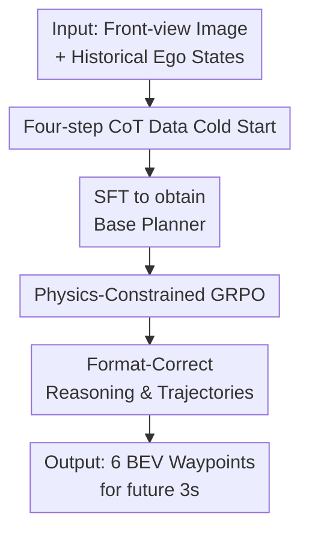

# AutoDrive-R²: Incentivizing Reasoning and Self-Reflection Capacity for VLA Model in Autonomous Driving

**Conference**: ICLR2026  
**OpenReview**: [https://openreview.net/forum?id=KVWaCzJrrq](https://openreview.net/forum?id=KVWaCzJrrq)  
**Code**: To be confirmed  
**Area**: Autonomous Driving / VLA Reasoning / Trajectory Planning  
**Keywords**: Autonomous Driving, VLA, Chain-of-Thought, Self-Reflection, GRPO, Physics-Constrained Reward  

## TL;DR
AutoDrive-R² employs a four-step CoT + self-reflection data for cold-starting an autonomous driving VLA, followed by post-training using GRPO with spatial, kinetic, and temporal smoothness constraints. This enables the model to explain its driving decisions while outputting trajectories that adhere to vehicle physical constraints.

## Background & Motivation
**Background**: Autonomous driving planning is shifting from traditional modular pipelines (perception, prediction, planning) to end-to-end models. Traditional systems suffer from error accumulation between modules, whereas end-to-end methods optimize the entire pipeline using a single objective. Recently, VLM/VLA models have integrated linguistic reasoning into driving decisions, enabling models to provide both trajectories and underlying rationale.

**Limitations of Prior Work**: Many VLM/VLA driving models treat trajectories as plain text responses. While they may identify red lights or lane lines, the resulting waypoints often exhibit physically infeasible jumps, such as sudden lateral shifts or discontinuous velocity changes. Some methods introduce meta-actions or latent tokens to mitigate this, but at the cost of end-to-end simplicity and increased complexity in intermediate representations.

**Key Challenge**: Autonomous driving VLAs must satisfy two conflicting requirements: they need readable situational reasoning (converting visual inputs into decisions) while ensuring final trajectories obey vehicle kinematics and temporal continuity. Pure SFT often learns surface-level formats, while pure RL struggles to explore reliable multi-step logic in high-dimensional reasoning spaces.

**Goal**: This work aims to bridge the gap between "explaining" and "driving." The objective is to enable the VLA to organize observations, calculations, and logic during the supervision phase, and then explicitly incorporate trajectory error, steering, and smoothness into rewards during reinforcement learning to reduce physically infeasible trajectories.

**Key Insight**: Driving CoT should not be generic safety statements; it must consist of a fixed chain involving image observation, kinematic calculations based on history, traffic rule inference, and back-verification. This provides a cognitive skeleton during SFT, while GRPO uses verifiable physical rewards to filter superior candidates.

**Core Idea**: Replace simple trajectory regression with "Structured CoT Cold Start + Physics-Constrained GRPO" to grant the driving VLA interpretable reasoning, self-reflection, and executable trajectory generation capabilities.

## Method

### Overall Architecture
AutoDrive-R² takes front-view images $F$ and historical ego states $H$ (position, acceleration, velocity, steering) as input. It outputs a BEV trajectory $T=M(H,F)$ for the next 3 seconds at 0.5s intervals. Training consists of two stages: first, constructing nuScenesR²-6K to extend image-trajectory pairs into "Observation → Calculation → Logic → Reflection" CoTs for fine-tuning Qwen2.5-VL; second, performing GRPO where candidates are scored by format and physics-constrained rewards to ensure trajectory stability.

The approach transforms a general Qwen2.5-VL into a driving VLA. The model writes the reasoning process in `<think>` and the waypoint sequence in `<answer>`. Training requires parseable formats and waypoints that closely match ground truth in position, steering, velocity, and timing.

### Key Designs
**1. Four-step CoT Cold Start: Structured Driving Reasoning**

The nuScenesR²-6K dataset contains 6,000 samples with high-quality CoTs. A "generate-then-verify" pipeline filters initial reasoning from Qwen2.5-VL-72B using Qwen-VL-Max as an expert verifier to remove factual errors or logical inconsistencies.

Each reasoning chain follows exactly four steps: Observation (identifying lanes, obstacles, signals); Calculation (kinematic estimation using history); Logic (connecting traffic rules to action choices); and Reflection (verifying self-consistency). This forces the model to learn the intermediate process of deriving waypoints.

**2. Self-Reflection Verification: Correcting Driving Assumptions**

In autonomous driving, initial judgments are often overturned by local visual cues. AutoDrive-R² includes a Reflection step to check: Is the required speed reachable? Does the trajectory cross lane lines? Are signals or pedestrians ignored? Corrections are made before finalizing the answer.

This "Aha Moment" allows the model to re-examine lane lines or obstacles at image edges, realization of road structures, and subsequent correction of plans. This mechanism exposes errors in text reasoning rather than hiding them in uninterpretable waypoint sequences.

**3. Physics-Constrained GRPO: Optimizing Executability**

The second stage uses GRPO. For an input $q$, the policy samples $G$ candidates $o_1,\ldots,o_G$. Each is assigned a reward $r_i=r_i^{acc}+r_i^{format}$. Format rewards ensure compliance with tags, while accuracy rewards focus on physical constraints.

GRPO uses relative comparisons within the candidate group:

$$
A_i=\frac{r_i-\mathrm{mean}(\{r_i\}_{i=1}^{G})}{\mathrm{std}(\{r_i\}_{i=1}^{G})}.
$$

The policy is updated via a clipped ratio objective with a KL divergence constraint against the reference model. This is suitable for trajectory planning as rules can directly provide verification rewards without requiring a separate value network.

**4. Multi-dimensional Physics Reward: Spatial and Temporal Constraints**

Accuracy rewards consist of four terms. Spatial alignment $r_{pos}$ is the mean squared Euclidean distance: $r_{pos}=\frac{1}{N}\sum_i((x_i-x_i^{gt})^2+(y_i-y_i^{gt})^2)$. To prevent non-executable paths, steering error $r_{ste}$ and velocity error $r_{vel}$ are added.

The temporal smoothness term $r_{tem}$ penalizes sudden changes: $r_{tem}=\frac{1}{N}\sum_j(\theta_j-\theta_{j-1})^2+\frac{1}{N}\sum_k(v_k-v_{k-1})^2$. The total reward is $r_{acc}=\lambda_{pos}r_{pos}+\lambda_{ste}r_{ste}+\lambda_{vel}r_{vel}+\lambda_{tem}r_{tem}$.

### A Complete Example
Given a scenario with a red light and pedestrians, a standard VLM might simply state "caution" and provide forward coordinates. AutoDrive-R²'s Observation identifies the light and pedestrian; Calculation estimates displacement; Logic prioritizes the red light; and Reflection verifies if proceeding would cause a collision. If an error is found, the reflection adjusts the 6 waypoints to a stop trajectory near $[0,0]$.

### Loss & Training
Stage one uses SFT on nuScenesR²-6K for structured output. Stage two uses the TRL framework for GRPO with a maximum length of 4096, $G=6$ candidates per input, and 750 iterations (approx. 18 hours).

The GRPO objective includes policy updates based on relative advantage and a $D_{KL}(\pi_\theta\Vert\pi_{ref})$ term with $\beta=0.04$. The learning rate is $5\times10^{-7}$ with an accumulated batch size of 8.

## Key Experimental Results

### Main Results
Evaluation includes nuScenes open-loop prediction, Waymo zero-shot generalization, and NAVSIM closed-loop planning.

| Dataset / Setting | Metric | AutoDrive-R² 7B | Prev. SOTA | Gain |
|--------|------|------|----------|------|
| nuScenes | Avg. L2 Error ↓ | 0.19 m | EMMA+ 0.29 m | ~34.5% Reduction |
| nuScenes | Avg. Collision Rate ↓ | 0.07% | DriveVLM-Dual 0.10% | Improved Safety |
| Waymo zero-shot | Avg. L2 Error ↓ | 0.20 m | EMMA+ 0.30 m | ~33.3% Reduction |
| Waymo zero-shot | Avg. L2 Error ↓ | 0.20 m | Qwen2.5-VL-7B 2.13 m | ~90.6% Reduction |
| NAVSIM closed-loop | PDMS ↑ | 89.1 | TransFuser 84.1 | ~5.0 Points |

AutoDrive-R² achieves the best results on nuScenes with significantly less data than EMMA+ (6k vs 103k samples). Strong zero-shot performance on Waymo demonstrates high generalization.

### Ablation Study
| Configuration | nuScenes Avg. L2 Error ↓ | Insight |
|------|---------|------|
| Qwen2.5-VL-7B | 1.45 | Pre-trained VLM lacks planning precision |
| Qwen2.5-VL-7B + SFT | 0.27 | CoT cold start provides primary gain |
| Qwen2.5-VL-7B + RL | 0.33 | RL only is insufficient without SFT |
| SFT: w/o Four-step | 0.25 | Structural logic is beneficial |
| SFT: w/o Self-reflection | 0.23 | Reflection contributes to accuracy |
| RL: w/o $r_{pos}$ | 0.53 | Spatial constraint is most critical |
| RL: w/o $r_{tem}$ | 0.24 | Smoothness reduces control jitter |
| AutoDrive-R² 7B | 0.19 | Full two-stage training is optimal |

### Key Findings
- SFT is an essential cold-start phase; logic chains cannot be easily explored from scratch using only rewards.
- Among physical rewards, $r_{pos}$ is dominant. Removing it increases error to 0.53, confirming that geometric position remains the core of planning.
- Self-reflection is functional, not decorative; removing it increases error from 0.19 to 0.23.
- The 7B model outperforms the 3B model, but the framework significantly improves both.
- Visualization shows the model accurately follows lane curvature and handles lighting changes better than baselines.

## Highlights & Insights
- Adapting CoT to driving-specific structures (Observation-Calculation-Logic-Reflection) aligns closely with real-world decision-making.
- Addressing the VLA failure mode where models "understand but don't act correctly" by incorporating steering and velocity into GRPO rewards.
- Self-reflection increases auditability for safety-critical tasks.
- Remarkable data efficiency: achieving competitive results with only 6k samples by focusing on reasoning quality.

## Limitations & Future Work
- Simplification of input to front-view only; real systems require multi-sensor fusion (LiDAR, maps).
- High cost of generating and verifying high-quality CoT data.
- Offline physical rewards are not perfectly equivalent to real-world interactive risks.
- CoT text increases generation latency, which may affect real-time deployment.
- Future work could incorporate multi-agent game theory into CoT and reward design to model interactions.

## Related Work & Insights
- **Comparison to UniAD/VAD**: Unlike BEV-centered regression models, this work emphasizes linguistic reasoning and self-reflection.
- **Comparison to DriveVLM**: AutoDrive-R² explicitly aligns reasoning to waypoints via GRPO rewards rather than just high-level behavior.
- **Comparison to EMMA+**: Demonstrates that high-quality reasoning can compensate for smaller data scales.
- **Comparison to DeepSeek-R1**: Adapts the GRPO objective from mathematical correctness to physical verifiability for embodied AI.

## Rating
- Novelty: ⭐⭐⭐⭐☆ Combines self-reflective CoT with physics-constrained GRPO specifically for VLA driving.
- Experimental Thoroughness: ⭐⭐⭐⭐☆ Strong results across multiple datasets and comprehensive ablations.
- Writing Quality: ⭐⭐⭐⭐☆ Clear methodology; some implementation details on reward normalization could be more explicit.
- Value: ⭐⭐⭐⭐⭐ High value for embodied AI planning tasks beyond autonomous driving.

<!-- RELATED:START -->

## Related Papers

- [\[CVPR 2026\] Counterfactual VLA: Self-Reflective Vision-Language-Action Model with Adaptive Reasoning](../../CVPR2026/autonomous_driving/counterfactual_vla_self-reflective_vision-language-action_model_with_adaptive_re.md)
- [\[CVPR 2026\] Unleashing VLA Potentials in Autonomous Driving via Explicit Learning from Failures](../../CVPR2026/autonomous_driving/unleashing_vla_potentials_in_autonomous_driving_via_explicit_learning_from_failu.md)
- [\[CVPR 2026\] MindDriver: Introducing Progressive Multimodal Reasoning for Autonomous Driving](../../CVPR2026/autonomous_driving/minddriver_introducing_progressive_multimodal_reasoning_for_autonomous_driving.md)
- [\[ICLR 2026\] $AutoDrive\text{-}P^3$: Unified Chain of Perception-Prediction-Planning Thought via Reinforcement Fine-Tuning](autodrivetext-p3_unified_chain_of_perceptionpredictionplanning_thought_via_reinf.md)
- [\[ICLR 2026\] DriveMamba: Task-Centric Scalable State Space Model for Efficient End-to-End Autonomous Driving](drivemamba_task-centric_scalable_state_space_model_for_efficient_end-to-end_auto.md)

<!-- RELATED:END -->
