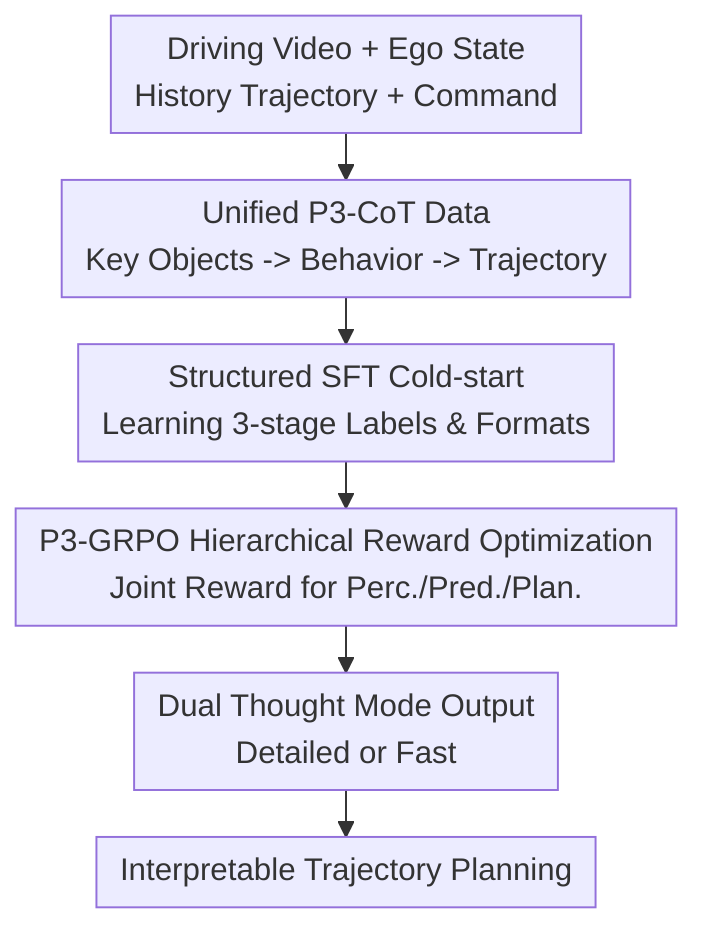

# $AutoDrive\text{-}P^3$: Unified Chain of Perception-Prediction-Planning Thought via Reinforcement Fine-Tuning

**Conference**: ICLR 2026  
**OpenReview**: [https://openreview.net/forum?id=CMU8GxwpUL](https://openreview.net/forum?id=CMU8GxwpUL)  
**Paper**: OpenReview Conference Paper  
**Code**: https://github.com/haha-yuki-haha/AutoDrive-P3  
**Area**: Autonomous Driving  
**Keywords**: End-to-end Autonomous Driving, Vision-Language Models, Perception-Prediction-Planning, Reinforcement Fine-Tuning, Chain-of-Thought  

## TL;DR
AutoDrive-P3 organizes perception, prediction, and planning of autonomous driving VLMs into a unified $P^3$ chain-of-thought reasoning, utilizing GRPO rewards spanning all three stages for reinforcement fine-tuning. It simultaneously improves trajectory accuracy, collision rates, and closed-loop planning scores on nuScenes and NAVSIM.

## Background & Motivation
**Background**: Autonomous driving systems have evolved along two paths: modular pipelines (perception, then prediction, then planning) and end-to-end models (direct sensor-to-trajectory mapping). Recently, VLMs introduced to driving tasks have provided stronger semantic understanding and long-tail adaptation, using natural language or structured text to describe objects, behaviors, and decisions.

**Limitations of Prior Work**: The core issue of current VLM-based driving is not whether they can output trajectories, but "where the trajectories come from." One class of methods generates planning directly from images and ego-states, lacking inspectable reasoning and turning decisions into a black box. Another class answers perception, prediction, and planning through separate Q&As, where perception results do not naturally inform predictions, nor do predictions constrain planning.

**Key Challenge**: Real-world driving decisions require stage dependency: first identify critical objects, then predict their movements, and finally generate a trajectory based on ego-state and traffic instructions. Optimizing only for final planning error treats the first two steps as byproducts, leading models to "accidentally" find a trajectory via unreliable intermediate understanding; conversely, disjointed Q&A lacks the guidance of end-to-end planning goals.

**Goal**: This paper aims to solve three problems: constructing a unified $P^3$ CoT format for VLM training; enabling the model to learn driving domain inputs, labels, and reasoning formats during a cold-start phase; and explicitly rewarding critical object perception and behavior prediction alongside planning during reinforcement fine-tuning.

**Key Insight**: Driving reasoning is treated as a $P^3$ chain: Perception provides critical targets and locations, Prediction determines their future behaviors, and Planning generates the ego-vehicle trajectory. This approach ensures that VLM interpretability is not merely an auxiliary explanation but an intermediate structure embedded in supervised data and RL rewards.

**Core Idea**: Utilizing unified $P^3$-CoT data and a three-stage P3-GRPO reward, a VLM capable of perception, prediction, and planning is trained as an end-to-end model that makes collaborative decisions in a "perception $\rightarrow$ prediction $\rightarrow$ planning" sequence.

## Method

### Overall Architecture
The input to AutoDrive-P3 includes driving video, ego-vehicle state, historical trajectories, navigation commands, and prompts. The output is a structured sequence of perception, prediction, and planning CoT with corresponding answers. The model learns the unified output format via P3-CoT data, performs driving domain cold-start through SFT, and undergoes reinforcement fine-tuning using P3-GRPO on all three stages. It supports dual inference modes: detailed thinking and fast thinking.

The process involves formatting nuScenes/NAVSIM samples into three-stage labels focused on key objects, generating coherent CoT via a strong VLM, and fine-tuning Qwen2.5-VL-3B to produce $\langle perception, prediction, planning \rangle$ sequences. Finally, multiple responses are sampled per query to calculate format, perception, prediction, and planning rewards for policy updates using group relative advantage.

### Key Designs
**1. P3-CoT Unified Chain Data: Integrating Key Objects, Future Behaviors, and Ego Trajectory**

Existing driving VLM data suffers from over-generalized targets or fragmented Q&A. P3-CoT extracts key objects that truly impact driving, mapping them to 2D bounding boxes (perception labels), future motion labels like stop, straight, left, or right (prediction labels), and ego waypoints (planning labels). Crucially, it enforces stage dependency: prediction relies on identified objects, and planning relies on both.

**2. Structured SFT Cold-start: Learning Driving Domain Output Syntax**

To stabilize RL on a general VLM, the model is first fine-tuned using P3-CoT. Inputs $x=[x_{ego};x_{video};x_{cmd};x_{prompt}]$ are mapped to outputs $y=[y_{perception};y_{prediction};y_{planning}]$, where each module includes $y_{module}=[y_{thinking};y_{answer}]$. This phase bridges the gap between the VLM and the autonomous driving task, ensuring the model outputs reliable, parsable structures.

**3. P3-GRPO Hierarchical Reward Optimization: Rewarding Correct Reasoning Behind Trajectories**

The core design extends GRPO to a three-stage joint reward: $R(q,a)=\lambda_{format}R_{format}+\lambda_{perc}R_{perc}+\lambda_{pred}R_{pred}+\lambda_{plan}R_{plan}$, with weights $1:2:2:5$.
- **Perception Reward ($R_{perc}$)**: Calculated based on IoU, precision, and recall of predicted boxes against ground truth.
- **Prediction Reward ($R_{pred}$)**: Requires correct future action labels for matched boxes, weighting action accuracy by IoU.
- **Planning Reward ($R_{plan}$)**: Measured by L2 distance between predicted and ground truth trajectories, incorporating PDMS signals for NAVSIM.

**4. Dual Thought Mode Output: Decoupling Interpretability and Latency**

AutoDrive-P3 provides "detailed thinking" for full reasoning/analysis and "fast thinking" for real-time needs. The Fast mode skips or minimizes the explicit `thinking` text while maintaining the structured perception-prediction-planning answer format. In nuScenes, Fast mode slightly increases L2 (0.33 to 0.34) but doubles the FPS from 0.5 to 1.0.

### Loss & Training
Training consists of two stages:
1. **SFT Cold-start**: Minimizes negative log-likelihood on P3-CoT data. nuScenes uses 3s video (6 frames, $448 \times 252$); NAVSIM uses 2s video from three views (4 frames per view, $672 \times 168$).
2. **P3-GRPO**: Samples 8 P3-CoT responses per scene. Policy updates use the clipped surrogate objective with KL constraint ($\beta=0.01$). Optimization is performed using AdamW on 8 A100 GPUs.

## Key Experimental Results

### Main Results
Evaluated on open-loop nuScenes and closed-loop style NAVSIMv1/v2.

| Dataset / Metric | Ours (Detailed) | Ours (Fast) | Prev. SOTA (Reference) | Gain |
|--------|------|------|----------|------|
| nuScenes Avg. L2 ↓ | 0.33 | 0.34 | OmniDrive: 0.33 | Parity with SOTA using smaller model |
| nuScenes Avg. Collision ↓ | 0.06% | 0.08% | OpenDriveVLA: 0.10% | Significant reduction in collision |
| NAVSIMv1 PDMS ↑ | 90.6 | 90.2 | WoTE: 88.3 | Surpasses strong BEV/World models |
| NAVSIMv2 EPDMS ↑ | 86.2 / 89.9 | 85.2 / 88.7 | DiffusionDrive: 84.7 / 88.2 | Higher across human penalty filters |

### Ablation Study
| Configuration | Key Metrics | Mechanism |
|------|---------|------|
| Only SFT | Perception 0.33, Pred. 0.23, Collision 0.17% | Basic planning capability but weak intermediate tasks |
| SFT + Only Planning GRPO | Avg Collision 0.12% | Planning improves, but no gain in perc./pred. |
| SFT + P3-GRPO | Perception 0.64, Pred. 0.54, Collision 0.06% | Best performance across all stages |
| Group size 4 | Avg L2 0.38, Collision 0.13% | Lower sample diversity weakens relative advantage signals |

### Key Findings
- P3-GRPO significantly rectifies intermediate modules: Perception improves from 0.33 to 0.64, and Prediction improves from 0.23 to 0.54.
- Planning-only GRPO is limited; results confirm that planning quality correlates with reliable object identification and behavior prediction.
- Fast mode maintains high performance while improving efficiency, making it more practical for real deployment.

## Highlights & Insights
- **CoT as a Trainable Intermediate Structure**: CoT is treated as a verifiable format rather than just explanatory text, allowing for direct supervision and reward optimization.
- **Causal Driving Reward Design**: Rewards follow the logical chain of driving decisions (Perc $\rightarrow$ Pred $\rightarrow$ Plan), pushing the model to fix foundational errors.
- **Focus on Critical Objects**: Training on sparse, critical targets reduces noise and mimics human driving attention.
- **Switchable Reasoning Budget**: The Detailed/Fast modes allow a trade-off between interpretability and latency within a single framework.

## Limitations & Future Work
- **Reasoning Hallucination**: CoT descriptions might appear logical but can still contain factual errors (e.g., misidentified traffic lights).
- **Offline/Pseudo-Closed Loop**: Training is not yet conducted in fully interactive real-world environments.
- **Simplified Inputs**: Future work should explore more camera views, LiDAR fusion, and complex urban scenarios.
- **Inference Speed**: 1.0 FPS is still slow for high-frequency control; a VLM-planner hybrid for hierarchical control may be necessary.

## Rating
- Novelty: ⭐⭐⭐⭐☆
- Experimental Thoroughness: ⭐⭐⭐⭐⭐
- Writing Quality: ⭐⭐⭐⭐☆
- Value: ⭐⭐⭐⭐⭐

<!-- RELATED:START -->

## Related Papers

- [\[ICLR 2026\] SMART-R1: Advancing Multi-agent Traffic Simulation via R1-Style Reinforcement Fine-Tuning](advancing_multi-agent_traffic_simulation_via_r1-style_reinforcement_fine-tuning.md)
- [\[AAAI 2026\] WorldRFT: Latent World Model Planning with Reinforcement Fine-Tuning for Autonomous Driving](../../AAAI2026/autonomous_driving/worldrft_latent_world_model_planning_with_reinforcement_fine-tuning_for_autonomo.md)
- [\[CVPR 2026\] RLFTSim: Realistic and Controllable Multi-Agent Traffic Simulation via Reinforcement Learning Fine-Tuning](../../CVPR2026/autonomous_driving/rlftsim_realistic_and_controllable_multi-agent_traffic_simulation_via_reinforcem.md)
- [\[ICLR 2026\] RAP: 3D Rasterization Augmented End-to-End Planning](rap_3d_rasterization_augmented_end-to-end_planning.md)
- [\[CVPR 2026\] DrivePI: Spatial-aware 4D MLLM for Unified Autonomous Driving Understanding, Perception, Prediction and Planning](../../CVPR2026/autonomous_driving/drivepi_spatial-aware_4d_mllm_for_unified_autonomous_driving_understanding_perce.md)

<!-- RELATED:END -->
