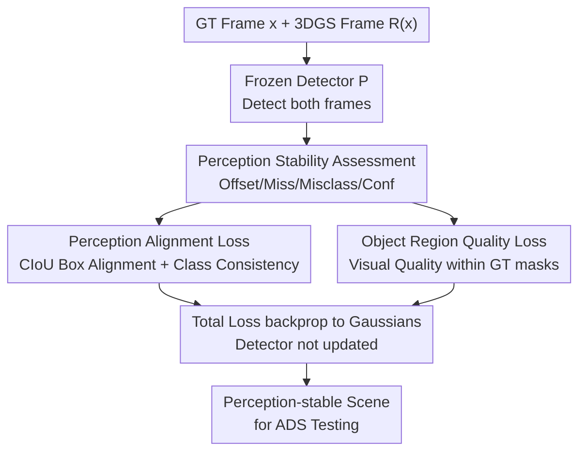

# Beyond Visual Reconstruction Quality: Object Perception-aware 3D Gaussian Splatting for Autonomous Driving

**Conference**: ICLR2026  
**OpenReview**: [https://openreview.net/forum?id=PmQlMTBmpa](https://openreview.net/forum?id=PmQlMTBmpa)  
**Code**: https://github.com/Shanicky-RenzhiWang/Perception-aware-3DGS  
**Area**: Autonomous Driving / 3D Reconstruction  
**Keywords**: 3D Gaussian Splatting, Autonomous Driving Simulation, Perception Stability, Object Region Reconstruction, Scene Generation

## TL;DR
This paper points out that the assumption "higher reconstruction fidelity leads to better reproduction of autonomous driving system (ADS) behavior" is a strong, unverified hypothesis. It proposes replacing pure visual similarity with **perception stability** (consistency of perception model outputs between reconstructed and ground truth images) as the optimization objective. Two plug-and-play losses—Perception Alignment Loss and Object Region Quality Loss—are introduced to significantly improve perception consistency in reconstructed scenes without sacrificing visual quality.

## Background & Motivation
**Background**: 3D Gaussian Splatting (3DGS) has become a primary tool for generating test scenarios for ADSs due to its ability to produce photorealistic scenes from multi-view images. However, existing street-view 3DGS methods (StreetGaussian, DrivingGaussian, S3Gaussian, OmniRe, EMD, etc.) almost exclusively follow optimization goals from general reconstruction, focusing on global image similarity metrics like SSIM, PSNR, and LPIPS.

**Limitations of Prior Work**: High global image similarity does not guarantee the utility of a reconstructed scene for ADS. ADS decisions depend on the position, scale, and category of **objects** (especially NPC vehicles/pedestrians), which often occupy small areas in an image. Global metrics systematically underestimate their importance. Preliminary experiments using three detectors (YOLOv8, Faster R-CNN, RT-DETR) showed that while visual metrics were high (SSIM 0.92–0.96), detector outputs on reconstructed images often diverged significantly from those on ground truth images.

**Key Challenge**: Current works rely on an **unverified implicit assumption**: higher image similarity $\to$ more consistent ADS behavior. The authors calculated the Pearson correlation coefficient between pixel-level metrics (SSIM/PSNR/LPIPS) and detection stability (mAP/mean IoU). Although statistically significant ($p<5\times10^{-3}$), the correlation coefficients were only between $0.3\sim0.6$, indicating a weak relationship where visual improvement does not reliably predict perception stability.

**Goal**: The goal of reconstruction should not just be "looking similar," but ensuring the perception model's output on the reconstructed scene is **consistent** with the original—even if the model initially made an error on the original image (since ADS testing aims to expose perception flaws, not fix them).

**Key Insight**: Since the entry point for ADS is the perception module, the difference in perception outputs should be integrated into the reconstruction objective. The authors term this **perception-aware reconstruction**, formulated as a constrained optimization problem: minimize perception discrepancy while ensuring visual quality remains above a certain threshold.

**Core Idea**: Replace "visual similarity" with "perception stability" as the optimization target. Two complementary loss terms—one directly aligning detection outputs and another strengthening object region reconstruction—are integrated into 3DGS training. The perception model remains frozen, providing only gradients to the Gaussians.

## Method

### Overall Architecture
The problem is formulated as a constrained optimization: given a ground truth image $x$ and a 3DGS model $R$, rather than just minimizing $L_{recon}=d_{img}(R(x),x)$, the goal is to minimize perception discrepancy $L_{perc}=d_{perc}(P(R(x)),P(x))$, where $P$ is a frozen detection model:

$$\min_{R}\ \mathbb{E}_x\big[d_{perc}(P(R(x)),P(x))\big]\quad \text{s.t.}\quad \mathbb{E}_x\big[d_{img}(R(x),x)\big]\le\varepsilon$$

The authors first use a **perception stability assessment** to quantify inconsistencies into four types (box offset, missed detection, misclassification, confidence difference). They then provide two optimization routes. **Perception Alignment Loss** directly penalizes differences between detection results of reconstructed and ground truth frames but requires online detection during training. **Object Region Quality Loss** serves as an efficient alternative, using offline ground truth detection boxes as masks to apply additional visual quality losses only in object regions, incurring negligible overhead.

### Key Designs

**1. Perception Stability: Redefining Reconstruction Utility as Consistency**

This is the conceptual foundation. Instead of aligning reconstruction to dataset annotations, the authors define reconstruction quality based on whether a model $P$ yields consistent outputs for $x$ and $R(x)$: $L_{perc}=d_{perc}(P(R(x)),P(x))$. Crucially, the reference is $P(x)$, not the ground truth label. If a detector misses an object in the original image, the ideal reconstruction should **reproducible that error**. This is because 3DGS in ADS is used to expose perception flaws; "fixing" errors in reconstruction would mislead testers.

**2. Perception Alignment Loss: Integrating Detector Discrepancy into Training**

This loss penalizes differences in predicted boxes and class labels:

$$L_{perc}=\sum_i\big(\lambda_{box}\cdot L_{box}(B(x),B(R(x)))+\lambda_{cls}\cdot L_{cls}(C(x),C(R(x)))\big)$$

For box regression, **CIoU (Complete IoU)** is used because it penalizes overlap, center point distance, and aspect ratio—all critical for downstream tracking and prediction. The classification loss checks for consistency in predicted categories. This loss is applied during the fine-tuning stage of 3DGS with a frozen detector.

**3. Object Region Quality Loss: Mask-based Object Fidelity Enhancement**

This design targets the root cause of perception instability: "structural fractures" or "blurring" in object regions due to 3DGS's reliance on sparse LiDAR/point clouds. Since object regions are small compared to background elements like sky or buildings, they receive less optimization focus. This loss applies visual similarity measures specifically to masked object regions:

$$L_{obj\text{-}vis}=d_{vis}(R(x)\odot B(x),\ x\odot B(x))$$

Using offline masks $B(x)$ eliminates the need for online detection, making it computationally efficient while focusing the model's attention on edges and textures critical for perception.

### Loss & Training
All weights $\lambda$ are set to 1 to demonstrate the inherent effectiveness of the losses without hyperparameter tuning. Training follows standard 3DGS routines: 5,000 coarse steps and 30,000 fine steps, with the new losses introduced in the fine stage. The perception model remains frozen throughout.

## Key Experimental Results

Experiments were conducted on the Waymo dataset using S3Gaussian, OmniRe, and EMD as base models. YOLOv8 was used as the guiding model, while Faster R-CNN and RT-DETR were used as **black-box** detectors to verify generalization.

### Main Results: Perception Alignment Loss

| Base | Detector | mAP↑ (Orig→+Lperc) | mean IoU↑ (Orig→+Lperc) | Missed↓ |
|------|--------|------|------|------|
| S3Gaussian | YOLOv8 | 0.550 → 0.593 | 0.803 → 0.840 | 1.5 → 0.83 |
| S3Gaussian | Faster R-CNN | 0.171 → 0.229 | 0.620 → 0.632 | 2.0 → 0.7 |
| EMD(S3G) | RT-DETR | 0.518 → 0.674 | 0.770 → 0.875 | 0.0 → 0.0 |
| OmniRe | Faster R-CNN | 0.320 → 0.360 | 0.718 → 0.722 | 0.3 → 0.0 |

Key takeaway: mAP and mean IoU improved not only on the training model (YOLOv8) but also on unseen black-box detectors, proving that reconstruction quality—not just detector overfitting—was enhanced. Visual quality (SSIM) remained stable within $\pm 1\%$.

### Main Results: Object Region Quality Loss (YOLOv8)

| Base | SSIM↑ | Obj SSIM↑ | mAP↑ | mean IoU↑ | Missed↓ |
|------|------|------|------|------|------|
| S3Gaussian | 0.924 | 0.877 | 0.550 | 0.803 | 1.5 |
| S3Gaussian + Lobj-vis | 0.937 | 0.921 | 0.672 | 0.862 | 0.4 |
| S3Gaussian + Lperc + Lobj-vis | 0.941 | 0.924 | **0.700** | **0.872** | **0.0** |

This loss significantly improves Object SSIM and, surprisingly, global SSIM as well. Combining both losses yields the best results, effectively reducing missed detections to zero in several cases.

### Runtime Analysis

| Base | Time per 100 epochs (s) Orig / +Lperc / +Lobj-vis | Total Time (min) Orig / +Lperc / +Lobj-vis |
|------|------|------|
| S3G | 25.20 / 26.67 / 25.30 | 204.4 / 232.2 / 205.4 |
| EMD | 44.94 / 46.45 / 45.00 | 364.5 / 413.2 / 364.9 |

Method 1 (+Lperc) increases training time by ~13.6% due to online inference. Method 2 (+Lobj-vis) has nearly zero overhead, making it highly efficient.

### Key Findings
- **Black-box Generalization**: Improving properties for one detector benefits others, indicating genuine physical reconstruction improvements in critical regions.
- **Efficiency of Method 2**: Using offline masks effectively bypasses the cost of online detection while contributing positively to global visual quality.
- **Zero Missed Detections**: The combined approach practically eliminated missed detections across multiple configurations, which is vital for safety-critical ADS testing.

## Highlights & Insights
- **Challenging Domain Assumptions**: Using statistical evidence (Pearson $r \approx 0.3\sim0.6$) to debunk the long-held assumption that visual similarity equals perception consistency.
- **Counter-intuitive "Error Reproduction"**: Shifting the paradigm to favor fidelity toward perception model artifacts rather than dataset ground truth, aligning with the actual goals of system stress testing.
- **Scalable Efficiency**: Replacing expensive online model supervision with offline "pseudo-masks" is a transferable strategy for any training scenario involving frozen model guidance.

## Limitations & Future Work
- **Weight Trade-offs**: Fixed weights ($\lambda=1$) were used; future work could explore adaptive weighting for different scene types (e.g., many small objects vs. few large objects).
- **Single Task Focus**: Only object detection was verified; the effect on segmentation, depth estimation, or tracking remains unexplored.
- **Mask Dependence**: The quality of Method 2 depends on the quality of initial detection; poor original detections lead to biased masks.
- **Dataset Diversity**: Evaluation was limited to the Waymo dataset; cross-dataset generalization (nuScenes, KITTI) is unproven.

## Related Work & Insights
- **Comparison to StreetGaussian/OmniRe**: While current leaders focus on visual fidelity, this work demonstrates that general reconstruction objectives are insufficient for ADS utility and offers a perception-aligned alternative.
- **NPC Enhancement**: Unlike prior efforts that only ensure correctly detected NPCs are reconstructed, this method insists on reproducing existing detection errors to accurately reflect the perception module's limitations.

## Rating
- Novelty: ⭐⭐⭐⭐ Replacing visual metrics with perception stability and advocating for "error reproduction" is a fresh and convincing perspective.
- Experimental Thoroughness: ⭐⭐⭐⭐ Comprehensive cross-detector and runtime analysis, though limited to one dataset and task.
- Writing Quality: ⭐⭐⭐⭐ Strong logical flow from motivation to falsification and verification.
- Value: ⭐⭐⭐⭐ Highly practical, especially Method 2, which offers plug-and-play improvements with zero overhead.

<!-- RELATED:START -->

## Related Papers

- [\[ICCV 2025\] AD-GS: Object-Aware B-Spline Gaussian Splatting for Self-Supervised Autonomous Driving](../../ICCV2025/autonomous_driving/ad-gs_object-aware_b-spline_gaussian_splatting_for_self-supervised_autonomous_dr.md)
- [\[CVPR 2026\] ParkGaussian: Surround-view 3D Gaussian Splatting for Autonomous Parking](../../CVPR2026/autonomous_driving/parkgaussian_surround-view_3d_gaussian_splatting_for_autonomous_parking.md)
- [\[ICCV 2025\] EMD: Explicit Motion Modeling for High-Quality Street Gaussian Splatting](../../ICCV2025/autonomous_driving/emd_explicit_motion_modeling_for_high-quality_street_gaussian_splatting.md)
- [\[ICLR 2026\] GaussianFusion: Unified 3D Gaussian Representation for Multi-Modal Fusion Perception](gaussianfusion_unified_3d_gaussian_representation_for_multi-modal_fusion_percept.md)
- [\[AAAI 2026\] LiDAR-GS++: Improving LiDAR Gaussian Reconstruction via Diffusion Priors](../../AAAI2026/autonomous_driving/lidar-gsimproving_lidar_gaussian_reconstruction_via_diffusion_priors.md)

<!-- RELATED:END -->
