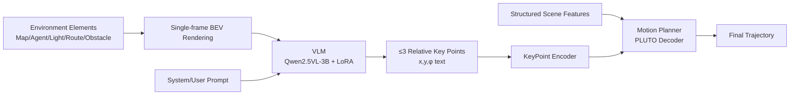

# Bird's-eye-view Informed Reasoning Driver (BIRDriver)

**Conference**: ICLR 2026  
**OpenReview**: [https://openreview.net/forum?id=TuU95FWkyH](https://openreview.net/forum?id=TuU95FWkyH)  
**Code**: To be confirmed  
**Area**: Autonomous Driving / VLM Motion Planning  
**Keywords**: Autonomous Driving, Motion Planning, BEV, Vision-Language Models, Long-tail Scenarios, Key points, Weighted SFT  

## TL;DR
BIRDriver compresses the entire driving scene into a single-frame Bird's-Eye-View (BEV) top-down image fed into a VLM. The VLM outputs no more than three relative coordinate key points to express driving intentions, which are then refined into a trajectory by a motion planner. This low-cost approach grafts the VLM's commonsense reasoning onto long-tail driving scenarios.

## Background & Motivation
- **Background**: Autonomous driving motion planning is currently dominated by rule-based and imitation learning methods, achieving strong closed-loop performance in common scenarios (e.g., PLUTO and Diffusion Planner are near SOTA on nuPlan).
- **Limitations of Prior Work**: These planners rely solely on structured inputs (agent states, map elements) and lack human-like contextual understanding. They often fail in long-tail scenarios not present in the training data, such as bypassing stalled vehicles or navigating construction zones.
- **Key Challenge**: While VLMs/LLMs possess powerful commonsense and zero-shot generalization, the three existing paradigms for integrating them into planners have significant drawbacks: meta-actions (e.g., Senna) are too coarse; latent features (e.g., AsyncDriver) are abstract and uninterpretable; and direct waypoint sequence output (e.g., DriveVLM) is redundant and fails to benefit from internet-scale pre-training (as trajectory capability stems from domain data rather than general corpora).
- **Goal**: To design a hierarchical framework that preserves the safety of real-time planners while allowing the VLM to inject high-level intentions in a way that leverages pre-trained knowledge without relying on domain-specific encoders or expensive alignment.
- **Core Idea**: **Use a single-frame BEV image instead of textual descriptions + use $\le3$ relative key points instead of dense trajectories.** The BEV image serves as the sole visual input carrying all scene information (the text contains no scene details), bypassing cross-vehicle sensor alignment issues and utilizing VLM's top-down image understanding. Sparse key points convey intention with minimal "language," leaving the heavy lifting of trajectory refinement to a specialized planner.

## Method

### Overall Architecture
BIRDriver is a two-stage hierarchical architecture comprising a VLM and a motion planner, achieving closed-loop driving through **decoupled training and serial inference**. The VLM takes a single-frame BEV image and system/user prompts to output textual key points. These points are encoded by a KeyPoint Encoder and fused with structured scene features in the motion planner (based on PLUTO) to decode the final trajectory.

### Key Designs

**1. Single-frame BEV Representation: Packing the Scene into One Image**
Instead of multi-frame surround cameras, BIRDriver renders five categories of environmental information into a unified top-down view: Maps (lanes, dividers, sidewalks, discrete waypoints), Agents (ego in orange, others in blue, cyclists in pink, pedestrians in brown with heading arrows; non-ego agents include 2s history as solid green lines), Traffic Lights (encoded as intersection stop line colors), Routes (drivable areas filled in light blue + purple arrow reference lines), and Obstacles (construction signs/barriers/cones as black boxes). The semantic meanings of all symbols are explained to the VLM via the system prompt. This allows the VLM to master the scene using a single image, avoiding heterogeneous sensor alignment and simplifying deployment across different platforms.

**2. RDP Key Point Extraction: Compressing Intent into Sparse Geometric Points**
Future trajectories are dense pose sequences $(x_i, y_i, \phi_i)_{i=1}^N$. BIRDriver employs the Ramer–Douglas–Peucker (RDP) algorithm to extract sparse key points. RDP recursively connects endpoints and calculates the perpendicular distance of intermediate points to the line: $d_i = \frac{|(P_N - P_1)\times(P_i - P_1)|}{\|P_N - P_1\|}$. If the maximum distance $d_{max}$ exceeds a tolerance $\epsilon$ (set to 0.02), the curve is split at that point; otherwise, only endpoints are kept. The number of points (maximum 3) adapts to the maneuver complexity (lane keep vs. turn), and the trajectory endpoint is always retained. Except for the endpoint, key points are **time-independent**, describing only geometry in relative $(x, y, \phi)$ coordinates.

**3. Triple-task Composite Dataset: Addressing Spatial Sensing and Scene Understanding**
Initial fine-tuning revealed high key point errors due to the VLM's lack of mapping between BEV pixels and physical distance, as well as insufficient scene classification. BIRDriver uses LoRA fine-tuning and constructs three types of datasets: the **Key Point Dataset** (main task: BEV+prompt $\to$ key points); the **Spatial Localization Dataset**, which tasks the VLM with predicting relative poses of random vehicles to bridge the pixel-to-physical gap; and the **Driving Scene Stepwise Dataset**, which requires the VLM to classify the scene type before predicting points. These are mixed in a 10:1:2 ratio (838k samples).

**4. Weighted SFT Loss: Prioritizing Numerical Token Precision**
Standard SFT treats all tokens equally, but numerical precision is critical for key points. BIRDriver assigns higher weights to numeric, decimal, and sign tokens. Since high-order digits are more important, it implements **hierarchical linear decay** weights: within a numeric segment, weights decay linearly from $(\alpha + d_n)$ at the most significant digit to 1 at the least. The sign bit receives the maximum weight, and non-numeric tokens are set to 1:

$$\mathcal{L}_{SFT}(\theta) = \frac{1}{T}\sum_{t=1}^{T} w_t \big(-\log p_\theta(y_t \mid y_{<t}, X)\big)$$

where $\alpha > 0$ (set to 5), $d_n$ is the number of digits in segment $n$. This approach avoids soft labels or standardizing formats, making it easier to implement without damaging the VLM's general language capabilities.

**5. Noise-augmented Planner Fine-tuning: Teaching the Planner to Tolerate VLM Errors**
The motion planner (PLUTO) is fine-tuned independently to follow key points. During training, zero-mean Gaussian noise $\epsilon_i \sim \mathcal{N}(0, \Sigma)$ with $\Sigma = \mathrm{diag}(\sigma_x^2, \sigma_y^2, \sigma_\phi^2)$ (matching the VLM's mean absolute error) is added to the ground-truth RDP points. This makes the planner robust to VLM prediction offsets. During inference, the final planned point from the previous step is fed as an additional key point to enhance temporal consistency.

## Key Experimental Results

### Main Results (nuPlan, Closed-Loop Score CLS, 0-100)

| Type | Method | T14-rand NR | T14-rand R | T14-hard NR | T14-hard R | InterPlan R |
|------|------|------|------|------|------|------|
| Rule | PDM-Closed | 90.05 | 91.64 | 65.07 | 75.18 | 43.51 |
| IL | PLUTO (Baseline) | 91.87 | 90.03 | 80.03 | 76.92 | 48.92 |
| IL | Diffusion Planner | 93.85 | 91.73 | 78.82 | 81.42 | 39.85 |
| LLM | InstructDriver | 70.31 | 66.96 | 57.37 | 52.95 | 32.31 |
| VLM | PlanAgent | - | - | 72.51 | 76.82 | - |
| **VLM-IL** | **BIRDriver (PLUTO)** | 91.46 | **91.26*** | **80.56*** | **80.33*** | **55.29*** |

\* Indicates outperforming the PLUTO baseline. On the long-tail InterPlan benchmark, BIRDriver achieves SOTA, outperforming PLUTO and Diffusion Planner by **13.0%** and **38.8%** respectively. It generally exceeds baselines except in the Test14-random (CLS-NR) metric. VLM backbone: Qwen2.5VL-3B.

### Ablation Study
Impact of dataset design and weighted loss on key point error (Qwen2.5VL-3B, Test14-hard 272 clips):

| Configuration | x error | y error | φ error |
|------|------|------|------|
| KeyPoint Only | 4.27m | 1.35m | 4.23° |
| +Driving Scene Stepwise | 4.17m | 1.28m | 4.20° |
| ++Spatial Localization | **3.76m** | **1.08m** | **3.80°** |
| Full (No Weighted SFT) | 4.22m | 1.19m | 4.13° |

The combination of three datasets reduced $x/y/\phi$ errors by 11.9%/20.0%/10.2% compared to the baseline. Weighted loss further reduced internal errors by 10.9%/9.2%/8.0%.

Key point extraction method (InternVL2.5-4B, InterPlan):

| Method | InterPlan |
|------|------|
| RDP (Ours) | **53.81** |
| Endpoint Only | 34.72 |

### Key Findings
- **Spatial Localization Dataset has the highest contribution**: Closing the gap between BEV pixels and physical distance is more effective at reducing key point error than simply enhancing scene understanding.
- **Using only the endpoint performs worse than the baseline** (34.72 < PLUTO's 48.92): Without intermediate key points, the planner cannot generate reasonable trajectories to reach a single endpoint, proving the necessity of sparse intermediate points.
- **VLM scale hits a threshold**: While InternVL2.5 sees massive gains moving from 2B to 4B, Qwen2.5VL shows negligible improvement between 3B and 7B. The 3B model was chosen for the balance of accuracy and efficiency.

## Highlights & Insights
- **BEV as a "Universal Language"**: Representing the scene as a single top-down image with zero textual scene detail is the most clever aspect. It leverages the VLM's internet-scale pre-trained image understanding while avoiding cross-vehicle sensor alignment.
- **Minimalist Interface (≤3 points)**: This finds the "sweet spot" between meta-actions (too coarse) and waypoint sequences (too redundant). Time-independent geometric points are both interpretable and lightweight.
- **Targeted Weighted SFT Loss**: This directly addresses the VLM's weakness in generating precise numbers. By modifying weights rather than the distribution, it improves performance without harming general reasoning.

## Limitations & Future Work
- **Temporal dynamics loss in single-frame BEV**: While history lines are used, a single-frame representation may limit predictive power in high-speed or rapidly changing scenes.
- **Dependence on upstream BEV quality**: The rendering requires accurate perception; errors there will propagate to the VLM.
- **Simulation only**: Validated only on nuPlan, lacking real-vehicle closed-loop or cross-dataset generalization. Real-time performance for high-frequency planning in a serial VLM-planner setup remains a concern.
- **Key point capacity**: Whether a 3-point limit is sufficient for all complex maneuvers requires further exploration.

## Related Work & Insights
- **Three Paradigms of VLM Planning**: Meta-actions (Senna), latent features (AsyncDriver), and waypoints (DriveVLM). This work establishes a fourth path: "BEV + Key Points."
- **BEV grounding VLMs**: While PlanAgent and others have used BEV, they often rely on additional modalities or focus on scene queries. BIRDriver is the first pure BEV-input hierarchical VLM-planner framework.
- **Insight**: When a general model struggles with precise output (numerical coordinates), a successful strategy is "changing the representation to one it masters (images) + using minimal symbolic output + targeted weighting in the loss function."

## Rating
- **Novelty**: ⭐⭐⭐⭐ — The combination of single-frame BEV as the sole VLM input and the $\le3$ relative key point interface is a new paradigm.
- **Experimental Thoroughness**: ⭐⭐⭐⭐ — Includes three benchmarks and four ablation studies, though limited to nuPlan simulation.
- **Writing Quality**: ⭐⭐⭐⭐ — Clear motivation, logical progression, and rigorous formulation.
- **Value**: ⭐⭐⭐⭐ — Achieves SOTA in long-tail scenarios with a deployment-friendly approach (bypassing sensor alignment).

<!-- RELATED:START -->

## Related Papers

- [\[ICLR 2026\] ARINBEV: Bird's-Eye View Layout Estimation with Conditional Autoregressive Model](arinbev_birds-eye_view_layout_estimation_with_conditional_autoregressive_model.md)
- [\[CVPR 2026\] CycleBEV: Regularizing View Transformation Networks via View Cycle Consistency for Bird's-Eye-View Semantic Segmentation](../../CVPR2026/autonomous_driving/cyclebev_regularizing_view_transformation_networks_via_view_cycle_consistency_fo.md)
- [\[CVPR 2026\] BEV-SLD: Self-Supervised Scene Landmark Detection for Global Localization with LiDAR Bird's-Eye View Images](../../CVPR2026/autonomous_driving/bev-sld_self-supervised_scene_landmark_detection_for_global_localization_with_li.md)
- [\[CVPR 2026\] Spe-BEVHead: Rethinking the Detection Head Design for Bird's-Eye-View Object Detection](../../CVPR2026/autonomous_driving/spe-bevhead_rethinking_the_detection_head_design_for_birds-eye-view_object_detec.md)
- [\[CVPR 2026\] BEV-CAR: Enhancing Monocular Bird's Eye View Segmentation with Context-Aware Rasterization](../../CVPR2026/autonomous_driving/bev-car_enhancing_monocular_birds_eye_view_segmentation_with_context-aware_raste.md)

<!-- RELATED:END -->
