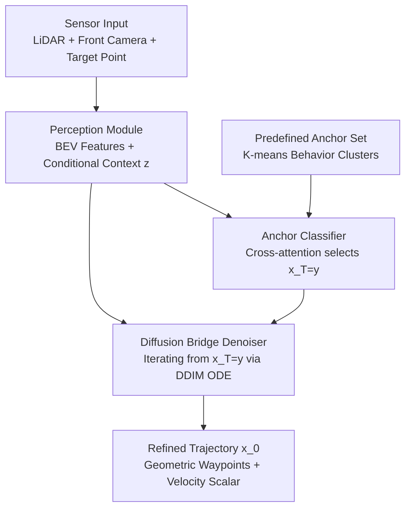

# BridgeDrive: Diffusion Bridge Policy for Closed-Loop Trajectory Planning in Autonomous Driving

**Conference**: ICLR 2026  
**arXiv**: [2509.23589](https://arxiv.org/abs/2509.23589)  
**Code**: [https://github.com/shuliu-ethz/BridgeDrive](https://github.com/shuliu-ethz/BridgeDrive)  
**Area**: Autonomous Driving  
**Keywords**: Diffusion Bridge Model, Anchor Trajectory Guidance, Closed-Loop Planning, Geometric Waypoints, Bench2Drive  

## TL;DR
BridgeDrive proposes replacing truncated diffusion with a diffusion bridge to achieve anchor-guided trajectory planning in autonomous driving. This ensures theoretical symmetry between forward and backward processes, achieving success rates of 74.99% (PDM-Lite) and 89.25% (LEAD) in Bench2Drive closed-loop evaluations, surpassing previous SOTA by 7.72% and 2.45%, respectively.

## Background & Motivation

**Background**: Diffusion models have become a powerful paradigm for autonomous driving planning due to their ability to model multi-modal behavior distributions. DiffusionDrive introduced anchor trajectories (K-means clustering centers representing typical human driving behavior) to guide the diffusion process, achieving SOTA performance.

**Limitations of Prior Work**: DiffusionDrive utilizes a truncated diffusion schedule, starting denoising from a noisy version of an anchor rather than pure Gaussian noise. This leads to a theoretical asymmetry between the forward process (adding noise to anchors) and the denoising process (recovering ground-truth trajectories)—the denoiser is trained to regress from a noisy anchor to a real trajectory rather than reversing a forward diffusion process.

**Key Challenge**: This asymmetry deviates from the core principles of diffusion models, potentially leading to unpredictable behavior and performance degradation. How can the advantages of anchor guidance be maintained while ensuring the theoretical consistency of the diffusion model?

**Goal**: (a) Design a theoretically consistent anchor-guided diffusion framework; (b) select a trajectory representation better suited for diffusion models; (c) achieve real-time closed-loop deployment.

**Key Insight**: Define the planning task as a diffusion bridge—learning a diffusion process that explicitly connects an anchor trajectory to a refined planned trajectory, ensuring perfect symmetry between forward and backward processes.

**Core Idea**: Replace truncated diffusion with a diffusion bridge, making anchor guidance an intrinsic part of the diffusion model rather than an external hack.

## Method

### Overall Architecture
The input consists of sensor data (LiDAR + front camera + target points), which passes through a perception module to extract BEV features and conditional information $z$. Planning is performed in two steps: (1) An anchor classifier $h_\phi$ selects the best anchor from a predefined set $\mathcal{Y}$ as the starting point $x_T = y$; (2) A diffusion bridge denoiser $x_\theta$ iteratively transforms the anchor $x_T = y$ into a refined trajectory $x_0$ via a DDIM first-order ODE. The trajectory itself is represented by "geometric waypoints + velocity scalars." Three key designs are integrated throughout this pipeline: the denoising process is reformulated as a theoretically symmetric **diffusion bridge**, the output trajectory is replaced with a decoupled **geometric waypoint representation**, and the starting point is provided by a learned **anchor classifier**.

### Key Designs

**1. Diffusion Bridge Formulation: Making anchor guidance an intrinsic endpoint of the process**

The issue with DiffusionDrive's truncated diffusion is that its noisy anchor $y_t = \alpha_t y + \sigma_t \epsilon$ only adds noise around the anchor $y$ for all $t$, without ever truly passing through the ground-truth trajectory $x$. Thus, the denoiser learns to "regress from a noisy anchor to ground truth" rather than "reversing a noise-adding process," violating the foundation of diffusion reversibility. BridgeDrive instead uses the Doob h-transform to construct a conditional diffusion process explicitly connecting two endpoints: planning is defined as a diffusion bridge from anchor $x_T = y$ to ground-truth $x_0 = x$. The transition kernel follows a Gaussian form $q(x_t|x_0, x_T) = \mathcal{N}(x_t \mid a_t x_T + b_t x_0,\, c_t^2 I)$, where coefficients $a_t, b_t, c_t$ are given by the noise schedule.

$$x_t = a_t\, y + b_t\, x + c_t\, \epsilon$$

Both ends of this path are precisely fixed: at $t=0$, $a_0 = c_0 = 0, b_0 = 1$, returning to the ground-truth trajectory; at $t=T$, it falls exactly on the anchor. The training objective remains a standard weighted MSE $\min_\theta \mathbb{E}[w(t)\|x_\theta(x_t, t, x_T, z) - x_0\|^2]$, which is simulation-free. The fundamental difference from DiffusionDrive lies in the training samples: BridgeDrive's $x_t$ depends on both the ground truth and the anchor, whereas DiffusionDrive's $y_t$ depends only on the anchor. This inclusion of $x$ determines whether the backward process is truly reversible or merely a regression.

**2. Geometric Waypoint Representation: Decoupling path shape from velocity**

The coordinates used for the diffusion model significantly impact performance. The standard approach uses temporal waypoints $x^{\text{temp}} \in \mathbb{R}^{N \times 2}$ at equal time intervals. For the same geometric path, different speeds result in different point densities, forcing the model to re-learn stretched/compressed distributions for every speed, which harms generalization and risks violating topological constraints. BridgeDrive adopts geometric waypoints with a scalar velocity $(x^{\text{geo}}, v) \in \mathbb{R}^{N \times 2} \times \mathbb{R}$. Path shape is decoupled from speed; overtaking at different speeds becomes "similar geometric patterns + different velocity scalars," allowing the geometric part to be reused. This simple substitution brought significant gains across all diffusion methods, contributing +15.09% SR to BridgeDrive.

**3. Anchor Classifier: Learning a predictor to select the correct starting point**

The starting point of the diffusion bridge $x_T = y$ is an anchor. During training, the anchor closest to ground truth can be used as supervision. At inference, ground truth is unavailable, so a predictor is required. BridgeDrive uses a classifier $h_\phi(z, \mathcal{Y})$ with cross-attention to allow conditional information to interact with all predefined anchors and BEV features. It outputs probabilities for each anchor and runs only once before the denoising iterations begin, adding no iterative overhead. Accuracy is critical: the diffusion bridge refines from the selected anchor; if the anchor is wrong, the denoiser may be led toward an entirely incorrect trajectory, causing catastrophic failure.

### Loss & Training
- Denoiser Loss: Weighted MSE $\mathbb{E}[w(t)\|x_\theta(x_t, t, x_T, z) - x_0\|^2]$
- Classifier Loss: Cross-entropy loss, with labels being the anchor closest to the ground truth.
- Inference: Uses a DDIM first-order ODE solver, requiring only a few function evaluations to generate trajectories.

## Key Experimental Results

### Main Results
Bench2Drive closed-loop evaluation (CARLA Leaderboard 2.0, 220 routes):

| Method | Dataset | VLA | Diffusion | DS | SR(%) |
|------|--------|-----|------|-----|-------|
| DriveTransformer | Think2Drive | ✘ | ✘ | 63.46 | 35.01 |
| ORION | Think2Drive | ✓ | ✘ | 77.74 | 54.62 |
| DiffusionDrive-geo | PDM-Lite | ✘ | ✓ | 80.79 | 58.18 |
| SimLingo | PDM-Lite | ✓ | ✘ | 85.07 | 67.27 |
| TransFuser++ | PDM-Lite | ✘ | ✘ | 84.21 | 67.27 |
| **BridgeDrive** | PDM-Lite | ✘ | ✓ | **87.99** | **74.99** |
| **BridgeDrive** | LEAD | ✘ | ✓ | **96.34** | **89.25** |

### Ablation Study

| Configuration | DS | SR(%) | Description |
|------|-----|-------|------|
| DiffusionDrive-temp | 77.68 | 52.72 | Truncated Diffusion + Temporal Waypoints |
| DiffusionDrive-geo | 80.79 | 58.18 | Truncated Diffusion + Geometric Waypoints (+5.46%) |
| Full Diffusion-geo | 83.85 | 67.27 | Full Diffusion + Geometric Waypoints |
| **BridgeDrive-geo** | **87.99** | **74.99** | Diffusion Bridge + Geometric Waypoints (+15.09% vs temp) |

### Key Findings
- Geometric waypoints outperform temporal waypoints in all diffusion methods, with the largest improvement in BridgeDrive (+15.09% SR).
- Full diffusion outperforms truncated diffusion (proving the importance of theoretical consistency), and diffusion bridge further outperforms full diffusion (proving the value of anchor guidance).
- BridgeDrive shows the most significant improvement in merging scenarios (+11.17) because anchor guidance provides strong priors in ambiguous situations.
- Inference speed meets real-time deployment requirements; the DDIM first-order solver is sufficient.

## Highlights & Insights
- **Theory-driven methodological improvement**: Rather than stacking modules, the authors identified theoretical flaws in DiffusionDrive starting from the mathematical principles of diffusion models and provided a "correct" solution via diffusion bridge formulation.
- **The choice of decoupled path and speed representation** is critical: a seemingly simple representation change (geometric vs. temporal waypoints) led to a 15% SR boost, showing that inductive bias selection is vital in diffusion planning.
- **Anchors as boundary conditions for the diffusion bridge**, rather than external guidance signals, represent a more elegant integration that could be transferred to other conditional generation tasks.

## Limitations & Future Work
- Performance on "Comfortness" and "Give Way" metrics is suboptimal; the model tends to brake frequently, prioritizing safety at the expense of comfort.
- No integration with VLA (Vision-Language-Action), which the authors identify as a future direction.
- Anchor classifier accuracy is a performance bottleneck—incorrect anchor selection leads to catastrophic failure.
- Improvement on open-loop evaluation (NAVSIM) is less significant than in closed-loop, suggesting the method's primary advantage lies in handling feedback loops and interactions.

## Related Work & Insights
- **vs DiffusionDrive (Liao et al., 2025)**: The core difference is theoretical consistency. DiffusionDrive's truncated diffusion introduces asymmetry, while BridgeDrive eliminates this via a diffusion bridge, increasing SR from 58.18% to 74.99%.
- **vs SimLingo (Renz et al., 2025)**: SimLingo relies on VLA Large Language Models. BridgeDrive's pure diffusion approach surpasses it without VLA, suggesting the potential of diffusion models in planning is undervalued.
- **vs ORION (Fu et al., 2025)**: ORION is enhanced by VLA + VQA, but its diffusion version (46.54% SR) is worse, indicating that the correct application of diffusion models is paramount.

## Rating
- Novelty: ⭐⭐⭐⭐ The application of diffusion bridges in autonomous driving planning is novel, though the underlying technology (diffusion bridge) exists.
- Experimental Thoroughness: ⭐⭐⭐⭐⭐ Comprehensive closed-loop and open-loop evaluations, detailed ablations, and cross-dataset validation.
- Writing Quality: ⭐⭐⭐⭐⭐ The analysis of DiffusionDrive's flaws is very clear, and the algorithmic pseudocode comparison is intuitive.
- Value: ⭐⭐⭐⭐⭐ Achieves significant improvements on challenging closed-loop benchmarks with a concise and efficient method.

<!-- RELATED:START -->

## Related Papers

- [\[NeurIPS 2025\] Model-Based Policy Adaptation for Closed-Loop End-to-End Autonomous Driving](../../NeurIPS2025/autonomous_driving/model-based_policy_adaptation_for_closed-loop_end-to-end_autonomous_driving.md)
- [\[ICLR 2026\] Plan-R1: Safe and Feasible Trajectory Planning as Language Modeling](plan-r1_safe_and_feasible_trajectory_planning_as_language_modeling.md)
- [\[ICLR 2026\] VADv2: End-to-End Vectorized Autonomous Driving via Probabilistic Planning](vadv2_end-to-end_vectorized_autonomous_driving_via_probabilistic_planning.md)
- [\[ECCV 2024\] NeuroNCAP: Photorealistic Closed-Loop Safety Testing for Autonomous Driving](../../ECCV2024/autonomous_driving/neuroncap_photorealistic_closed-loop_safety_testing_for_autonomous_driving.md)
- [\[ICLR 2026\] Discrete Diffusion for Reflective Vision-Language-Action Models in Autonomous Driving](discrete_diffusion_for_reflective_vision-language-action_models_in_autonomous_dr.md)

<!-- RELATED:END -->
