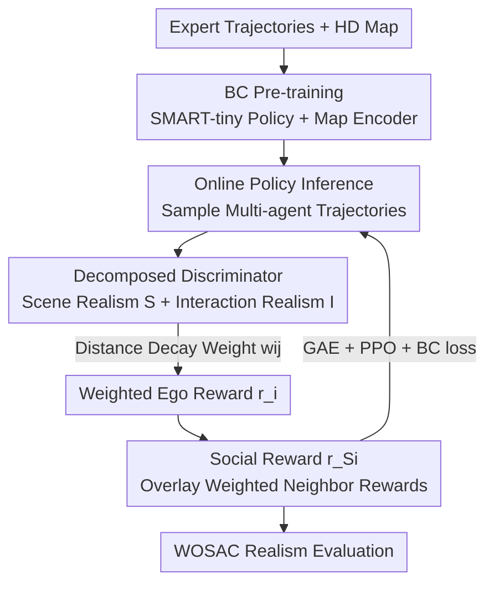

# DecompGAIL: Learning Realistic Traffic Behaviors with Decomposed Multi-Agent Generative Adversarial Imitation Learning

**Conference**: ICLR 2026  
**OpenReview**: [https://openreview.net/forum?id=AcDx2tUZPb](https://openreview.net/forum?id=AcDx2tUZPb)  
**Code**: None  
**Area**: Autonomous Driving / Traffic Simulation / Multi-Agent Imitation Learning  
**Keywords**: Traffic behavior simulation, Multi-agent GAIL, Discriminator decomposition, Social PPO, WOMD Sim Agents

## TL;DR
Addressing the training instability of multi-agent GAIL in traffic simulation, this paper identifies "irrelevant interaction misguidance" (where the discriminator is misled by neighbor-neighbor interactions weakly related to ego actions) as the root cause. It proposes DecompGAIL, which explicitly decomposes realism into "ego-map" and "ego-neighbor" components alongside distance-weighted social rewards, achieving SOTA realism on the WOMD Sim Agents 2025 leaderboard.

## Background & Motivation
**Background**: Realistic traffic simulation is fundamental for autonomous driving evaluation and urban planning. Prevailing methods model it as multi-agent imitation learning: either using Behavior Cloning (BC) to treat imitation as supervised learning from expert trajectories, or using Inverse Reinforcement Learning (IRL), specifically GAIL—training a discriminator to distinguish expert from policy trajectories and using its score as a reward to drive the policy.

**Limitations of Prior Work**: BC suffers from covariate shift, where state distributions deviate over time, leading to collisions or off-road behavior. GAIL theoretically mitigates this by aligning distributions but is notoriously unstable in multi-agent scenarios. Prior works used parameter sharing or curriculum learning (gradually increasing agents or duration) to alleviate this, but these are heuristic fixes rather than root-cause solutions.

**Key Challenge**: The paper identifies the true source of instability as **irrelevant interaction misguidance**. In decentralized setups, each agent's discriminator evaluates local observations including neighbors. When a policy-controlled neighbor behaves unrealistically (e.g., colliding with another vehicle), the discriminator penalizes the ego vehicle with a low realism score simply because such neighbor-behavior is absent in expert data—even if the ego vehicle's own action was perfectly realistic. This leads to the paradox where **realistic ego behavior is penalized**. Furthermore, the number of neighbor-neighbor interactions grows quadratically with neighbor count, making rewards increasingly noisy.

**Goal**: To ensure the discriminator only rewards/penalizes signals causally related to ego actions by removing weakly correlated higher-order interactions, thereby obtaining stable and informative rewards.

**Key Insight**: The signals implicitly represented by the discriminator are conceptually decomposed into four terms: ego-map (scene realism $\phi_1$), ego-neighbor (interaction realism $\phi_2$), neighbor-map/neighbor-neighbor ($\phi_3$), and higher-order terms ($\phi_4$). Among these, $\phi_3$ is weakly related to ego actions but expands quadratically, serving as the primary noise source.

**Core Idea**: Use a "Decomposed Discriminator" that focuses only on $\phi_1$ and $\phi_2$ by design, naturally shielding against $\phi_3/\phi_4$, and utilize distance-weighted social rewards to allow agents to improve their own realism without degrading that of their neighbors.

## Method

### Overall Architecture
DecompGAIL is built upon the lightweight SMART-tiny backbone, treating traffic simulation as "tokenized multi-agent sequence prediction + adversarial fine-tuning." The process has two stages: BC pre-training of the map encoder and policy network for a strong initialization, followed by online fine-tuning with DecompGAIL. During fine-tuning, the **Decomposed Discriminator** calculates scene realism $S_t^i$ for "ego-map" pairs and interaction realism $I_t^{ij}$ for each "ego-neighbor" pair, explicitly omitting neighbor-neighbor terms. The ego reward is a weighted sum of scene and pairwise interaction scores. Finally, **Social PPO** optimizes the policy using a "social reward" that overlays distance-weighted neighbor rewards onto the ego reward.

The pipeline follows a loop: "Pre-training → Inference Sampling → Decomposed Discriminator Scoring → Distance-weighted Reward Construction → Socialized Reward Construction → PPO Update":

### Key Designs

**1. Decomposed Discriminator: Severing irrelevant interactions at the input level**

To solve "realistic ego being penalized by neighbor mistakes," this paper replaces the single global discriminator (PS-GAIL) with independent heads. PS-GAIL fuses map and all neighbor tokens into one ego feature, forcing the discriminator to represent $\phi_1+\phi_2+\phi_3+\phi_4$, where signals are entangled. DecompGAIL uses two independent MLP heads: **Scene Realism** consumes only ego and map attention features $S_t^i = \phi_1(a^i_{\le t}, m) = \text{MLP}(\text{map}^i_t)$; **Interaction Realism** is calculated for each ego-neighbor pair $I_t^{ij} = \phi_2(a^i_{\le t}, a^j_{\le t}) = \text{MLP}([\text{temp}^i_t, \text{RPE}^{ij}_t, \text{temp}^j_t])$. Since neighbor-neighbor pairs are never input together, the design structurally prevents the representation of $\phi_3$ and $\phi_4$, cutting off the noise channel. The discriminator loss uses BCE for both paths:

$$L_D = \mathbb{E}_{\pi_E}\Big[\log S_t^i + \sum_{j\in N_i} w_{ij}\log I_t^{ij}\Big] + \mathbb{E}_{\pi_\theta}\Big[\log(1-S_t^i) + \sum_{j\in N_i} w_{ij}\log(1-I_t^{ij})\Big].$$

**2. Distance Decay Weighting: Focusing rewards on causally relevant neighbors**

Causal correlation between distant neighbors and ego actions is weak. This paper applies a distance decay weight $w_{ij} = \alpha\exp(-d(i,j)/\beta)$, where $d(i,j)$ is the inter-vehicle distance and $\alpha, \beta$ are hyperparameters. This emphasizes neighbors likely to have a causal impact. The final ego reward is:

$$r_t^i = -\log(1-S_t^i) - \sum_{j\in N_i} w_{ij}\log(1-I_t^{ij}).$$

Experiments show performance is more sensitive to the decay range $\beta$ than the scale $\alpha$; values too small or large harm realism by over/under-emphasizing neighbor proximity. Replacing distance weights with a simple mean significantly degrades performance.

**3. Social PPO: Preventing "Selfish" optimization via social rewards**

Using Independent PPO (IPPO) can lead to agents improving their own scores while forcing neighbors into unrealistic states. This paper defines a **Social Reward** that overlays distance-weighted neighbor rewards onto the ego reward:

$$r_{S_t}^i = r_t^i + \sum_{j\in N_i}\lambda_{ij} r_t^j,$$

where $\lambda_{ij}$ is also a distance decay weight. Training follows the IPPO workflow but replaces individual rewards with social rewards. Advantages are estimated using GAE, and the value function utilizes the agent-agent attention features from the policy network. To stabilize training, a BC loss is mixed into the PPO loss. This encourages swarm-level realism.

### Loss & Training
- **Pre-training**: BC maximizes the log-likelihood of expert joint actions $L_{BC}=\mathbb{E}_{\pi_E}[\log\pi_\theta(a_t\mid a_{<t}, m)]$. All agents share a policy $\pi_\theta$ with actions modeled as categorical distributions over a shared motion-token vocabulary.
- **Fine-tuning**: Alternating updates between the discriminator (BCE) and the policy (PPO clipped surrogate loss + value loss + BC loss). Optimal hyperparameters for interaction weights were found at $\alpha=10, \beta=2.5$.

## Key Experimental Results

### Main Results
WOSAC 2025 Leaderboard test split (Realism metametric is the primary indicator):

| Model | Metametric ↑ | Kinematic ↑ | Interactive ↑ | Map-based ↑ | minADE ↓ |
|------|------|------|------|------|------|
| **SMART-tiny-DecompGAIL (Ours)** | **0.7864** | 0.4919 | **0.8152** | 0.9176 | 1.4209 |
| SMART-R1 | 0.7858 | 0.4944 | 0.8110 | 0.9201 | 1.2885 |
| SMART-tiny-RLFTSim | 0.7857 | 0.4927 | 0.8129 | 0.9183 | 1.3252 |
| TrajTok | 0.7852 | 0.4887 | 0.8116 | 0.9207 | 1.3179 |
| SMART-tiny-CLSFT | 0.7846 | 0.4931 | 0.8106 | 0.9177 | 1.3065 |
| SMART-tiny (Baseline) | 0.7814 | 0.4854 | 0.8089 | 0.9153 | 1.3931 |

DecompGAIL achieves the highest realism metametric and consistently leads in Interaction metrics. The higher minADE is an expected trade-off as the method prioritizes feature distribution alignment over point-wise distance optimization.

### Ablation Study
Ablation on WOSAC 2% validation set:

| Configuration | Metametric ↑ | Interactive ↑ | Collision Likelihood ↑ | Description |
|------|------|------|------|------|
| DecompGAIL (Full) | **0.7889** | 0.8283 | 0.9837 | Full model |
| w/o DecompGAIL | 0.7836 | 0.8204 | 0.9667 | BC pre-training only |
| w/o scene realism | 0.7801 | 0.8248 | 0.9794 | Map-based dropped to 0.8795 |
| w/o interact realism | 0.7772 | 0.8132 | 0.9573 | Significant drop in Interaction/Collision |
| mean interact realism | 0.7819 | 0.8153 | 0.9635 | Distance weighting replaced by mean |
| w/o neighborhood reward | 0.7871 | 0.8258 | 0.9788 | Removed neighbor term from social reward |
| mean neighborhood reward | 0.7882 | 0.8282 | 0.9812 | Neighbor reward mean instead of decay |

### Key Findings
- **Interaction realism is the biggest contributor**: Removing it causes the Interactive metric to drop from 0.8283 to 0.8132 and Collision Likelihood from 0.9837 to 0.9573, proving explicit "ego-neighbor" modeling is vital.
- **Scene realism governs map compliance**: Removing it primarily hurts map-based metrics (0.8795 vs 0.8948), correlating with off-road/lane-crossing errors.
- **Distance weighting is consistently effective**: Replacing decay with a uniform mean results in performance loss for both interaction terms and social rewards.
- **Stability**: Unlike PS-GAIL, which shows increased discriminator variance and performance degradation as neighbor count increases, DecompGAIL maintains low variance and centers scores near 0.5 even with all neighbors, showing steady realism growth during training.

## Highlights & Insights
- **Formalizing instability as a decomposable structure**: Equation (6) decomposes the signal into four sub-terms, pinpointing $\phi_3$ as the noise source. This "locate root cause then solve" approach is more principled than engineering fixes like curriculum learning.
- **Shielding noise via input design**: Instead of adding Wasserstein regularization or manual penalties, the model prevents the representation of $\phi_3$ by excluding neighbor-neighbor pairs from the input structure.
- **Transferability**: The strategy of decomposing multi-agent rewards by interaction target and applying distance decay is transferable to any multi-agent RL/IL scenario where ego behavior might be misled by weakly related peer interactions (e.g., UAV swarms).

## Limitations & Future Work
- **Higher minADE**: Prioritizing distribution matching over point-wise distance might be disadvantageous for tasks requiring precise trajectory replication.
- **Distance as a causal proxy**: Inter-vehicle distance $d(i,j)$ is used to approximate causal correlation, but distance does not always equal interaction intensity (e.g., parallel driving).
- **Hard-coded decomposition**: The two-path design (scene/interaction) might lose expressiveness in scenarios where complex higher-order coordination (e.g., multi-car negotiation) is essential.
- **Limited validation scope**: Tested only on the SMART-tiny backbone and the WOMD dataset.

## Related Work & Insights
- **vs. PS-GAIL (Parameter Sharing GAIL)**: PS-GAIL uses a single discriminator on the ego's local observation, entangling four signal terms. DecompGAIL severs $\phi_3/\phi_4$ at the input, remaining stable with many neighbors.
- **vs. Centralized Multi-Agent GAIL**: Centralized discriminators output a shared reward, which suffers from credit assignment issues. DecompGAIL is decentralized and decomposed, providing sparse and interpretable rewards.
- **vs. BM3IL (Mean-Field Approximation)**: BM3IL uses mean-field actions to reduce variance but loses fine-grained interaction. DecompGAIL preserves pairwise interactions while managing variance via decomposition and distance weighting.
- **vs. Manual Reward Engineering**: Manual penalties for off-road/collisions introduce bias. This method arrives at realistic behavior via decomposed adversarial rewards + social rewards without manual heuristics.

## Rating
- Novelty: ⭐⭐⭐⭐ (Formalizing multi-agent GAIL instability as "irrelevant interaction misguidance" and solving it via decomposition is clear and effective)
- Experimental Thoroughness: ⭐⭐⭐⭐ (SOTA results, stability curves, and comprehensive ablation, though limited to one backbone)
- Writing Quality: ⭐⭐⭐⭐ (Logical flow from contradiction to decomposition to solution)
- Value: ⭐⭐⭐⭐ (Directly improves traffic simulation realism for AD testing with a transferable logic)

<!-- RELATED:START -->

## Related Papers

- [\[CVPR 2026\] RLFTSim: Realistic and Controllable Multi-Agent Traffic Simulation via Reinforcement Learning Fine-Tuning](../../CVPR2026/autonomous_driving/rlftsim_realistic_and_controllable_multi-agent_traffic_simulation_via_reinforcem.md)
- [\[ICLR 2026\] SMART-R1: Advancing Multi-agent Traffic Simulation via R1-Style Reinforcement Fine-Tuning](advancing_multi-agent_traffic_simulation_via_r1-style_reinforcement_fine-tuning.md)
- [\[ICLR 2026\] Map as a Prompt: Learning Multi-Modal Spatial-Signal Foundation Models for Cross-scenario Wireless Localization](map_as_a_prompt_learning_multi-modal_spatial-signal_foundation_models_for_cross-.md)
- [\[ICLR 2026\] EgoDex: Learning Dexterous Manipulation from Large-Scale Egocentric Video](egodex_learning_dexterous_manipulation_from_large-scale_egocentric_video.md)
- [\[CVPR 2026\] Beyond Rule-Based Agents: Active Markov Games for Realistic Multi-Agent Interaction in Autonomous Driving](../../CVPR2026/autonomous_driving/beyond_rule-based_agents_active_markov_games_for_realistic_multi-agent_interacti.md)

<!-- RELATED:END -->
## Related Papers

- [\[CVPR 2026\] RLFTSim: Realistic and Controllable Multi-Agent Traffic Simulation via Reinforcement Learning Fine-Tuning](../../CVPR2026/autonomous_driving/rlftsim_realistic_and_controllable_multi-agent_traffic_simulation_via_reinforcem.md)
- [\[ICLR 2026\] SMART-R1: Advancing Multi-agent Traffic Simulation via R1-Style Reinforcement Fine-Tuning](advancing_multi-agent_traffic_simulation_via_r1-style_reinforcement_fine-tuning.md)
- [\[ICLR 2026\] Map as a Prompt: Learning Multi-Modal Spatial-Signal Foundation Models for Cross-scenario Wireless Localization](map_as_a_prompt_learning_multi-modal_spatial-signal_foundation_models_for_cross-.md)
- [\[ICLR 2026\] EgoDex: Learning Dexterous Manipulation from Large-Scale Egocentric Video](egodex_learning_dexterous_manipulation_from_large-scale_egocentric_video.md)
- [\[CVPR 2026\] Beyond Rule-Based Agents: Active Markov Games for Realistic Multi-Agent Interaction in Autonomous Driving](../../CVPR2026/autonomous_driving/beyond_rule-based_agents_active_markov_games_for_realistic_multi-agent_interacti.md)

<!-- RELATED:END -->
