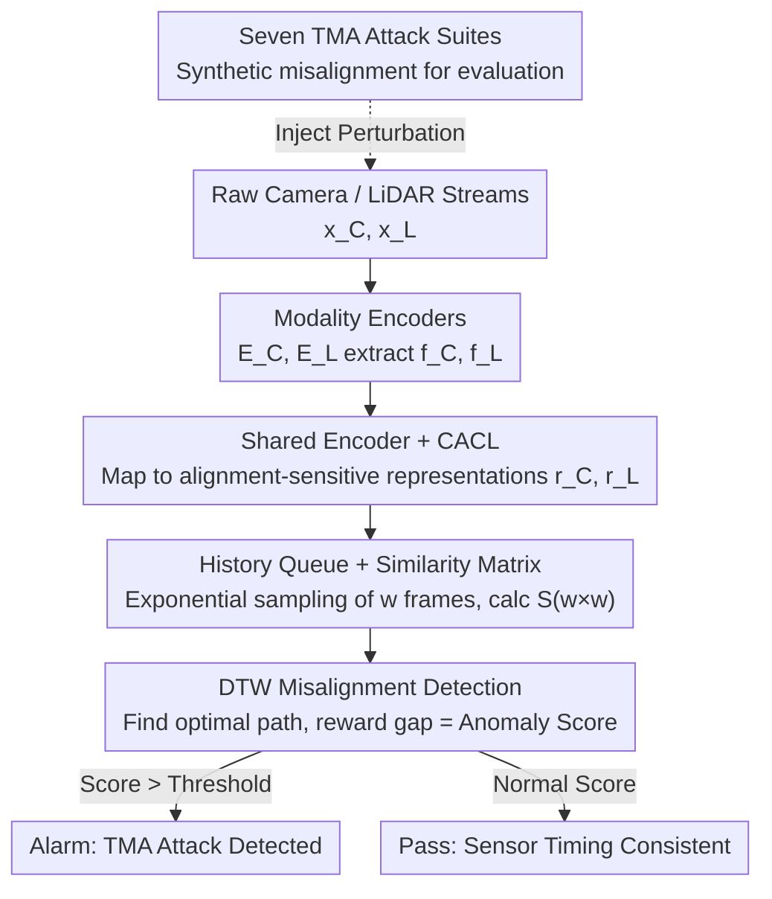

# Detecting Temporal Misalignment Attacks in Multimodal Fusion for Autonomous Driving

**Conference**: ICLR2026  
**OpenReview**: [https://openreview.net/forum?id=SWlCJab9gZ](https://openreview.net/forum?id=SWlCJab9gZ)  
**Code**: https://github.com/shahriar0651/AION  
**Area**: Autonomous Driving / AI Security / Multimodal Perception  
**Keywords**: Temporal Misalignment Attack, Multimodal Fusion, Dynamic Time Warping, Contrastive Learning, Autonomous Driving Security

## TL;DR
Addressing the vulnerability of camera-LiDAR fusion’s dependence on precise time synchronization, this paper proposes AION, a lightweight plug-and-play defense. AION utilizes "Continuity-Aware Contrastive Learning" to train a shared multimodal encoder and employs Dynamic Time Warping (DTW) to track the alignment path of dual-sensor representations. Deviations from the diagonal are converted into anomaly scores, achieving an average AUROC of 0.92–0.95 against seven types of temporal misalignment attacks on KITTI/nuScenes, with an inference overhead of only ~3.26 ms.

## Background & Motivation

**Background**: Autonomous driving perception generally relies on Multimodal Fusion (MMF), integrating the semantic textures of cameras with the geometric depth of LiDAR for reliable scene understanding. Fusion requires precise temporal alignment between sensors. Middlewares like ROS 2 typically utilize an "approximate-time synchronizer," which pairs messages as long as their timestamp difference falls within a tolerance window $\tau$.

**Limitations of Prior Work**: This "pairing by timestamp" mechanism constitutes an attack surface. Attackers do not need to tamper with raw sensor data (images, point clouds) or model parameters; by injecting timestamp perturbations $\delta_t^{(i)}$ so the system receives $\tilde t_S^{(i)} = t_S^{(i)} + \delta_S^{(i)}$, they can induce the synchronizer to pair camera and LiDAR frames with significant real-time differences. Although the reported difference $|\tilde t_C - \tilde t_L|$ remains within the tolerance window, the true difference $\Delta_{\text{true}}$ can be large. This results in misaligned feature semantics, leading to missed or false detections. Prior work by the authors demonstrated that delaying LiDAR by just one frame can drop the mean average precision (mAP) of multiple detection models by over 88%.

**Key Challenge**: Existing research on temporal inconsistency almost exclusively assumes "benign scenarios." One category involves calibration/jitter compensation (filtering, offline timestamp alignment), which is effective only for clock drift or noise and assumes cooperative parties and trusted timestamps. Another category focused on adversarial defense targets adversarial patches, sensor spoofing, or spatial/semantic consistency, leaving a gap in the security of the "temporal dimension" of fusion. In other words, all defenses assume timestamps are honest, leaving them helpless against network-layer latency manipulation.

**Goal**: To create a task-agnostic detector that can be integrated directly into existing perception models to monitor cross-modal temporal consistency. Use cases must meet three criteria: accurate detection of desynchronization, generalization across architectures and modalities, and minimal overhead to avoid slowing down real-time pipelines.

**Key Insight**: The authors observe that in autonomous driving, adjacent frames are temporally close and semantically similar. Therefore, **cross-modal semantic continuity can serve as a ground truth for alignment**, replacing untrusted network timestamps. However, standard contrastive learning (CL) strictly classifies sample pairs as positive or negative, failing to capture subtle misalignments like "one-frame differences."

**Core Idea**: "Continuity-Aware Contrastive Learning" is used to teach the encoder smooth temporal transitions (penalizing negative pairs lighter if they are temporally closer). Subsequently, DTW is applied to find the optimal alignment path on the cross-modal similarity matrix. In benign cases, the optimal path follows the diagonal with high rewards; under attack, the path deviates from the diagonal, causing a drop in rewards, which is then used as an anomaly score.

## Method

### Overall Architecture

AION is an independent "detection patch" that can run in parallel or series with any MMF perception model without modifying downstream tasks. Its core consists of a shared Multimodal Representation Encoder (MRE) $E_{mm}$, which maps features from any modality into the same latent space. The goal is to make temporally aligned cross-modal pairs similar and misaligned pairs dissimilar in this space. The process consists of two stages:

- **Development stage**: Training the MRE using contrastive learning. Given features $f_C, f_L$ extracted from camera/LiDAR encoders, the MRE projects them into shared representations $r_C^{(i)} = E_{mm}(f_C^{(i)})$ and $r_L^{(j)} = E_{mm}(f_L^{(j)})$. Thresholds are calibrated by running detection on benign data.
- **Deployment stage**: A historical representation queue of the last $w$ frames is maintained for each modality. A $w\times w$ cross-modal similarity matrix $S$ is calculated in real-time. As each new message arrives, $r_C, r_L, S$ are updated. DTW سپس identifies the optimal alignment path. The "ideal diagonal reward minus actual path reward" is used as the anomaly score to determine if an attack is occurring.

The overall data flow is as follows:

### Key Designs

**1. Continuity-Aware Contrastive Learning (CACL) + Three Sample Pair Types: Learning fine-grained differences**

Standard contrastive learning treats sample pairs in a binary (positive/negative) manner. In autonomous driving, adjacent frames have high semantic overlap; a "one-frame difference" negative pair is pushed away as strongly as a "ten-frame difference" pair, preventing the encoder from learning representations sensitive to subtle temporal shifts. The authors categorize pairs by temporal misalignment: **Positive pairs** $T_p$ ($i=j$), **Near-negative pairs** $T_{nn}$ ($i\neq j$ but $i\approx j$, partial semantic overlap), and **Far-negative pairs** $T_{fn}$ ($|i-j|\gg 0$, no semantic overlap).

During training, the cross-modal cosine similarity matrix $S_{ij} = \frac{r_C^{(i)}\cdot r_L^{(j)}}{\lVert r_C^{(i)}\rVert\,\lVert r_L^{(j)}\rVert}$ is calculated. The positive loss pulls the diagonal toward 1: $L_{pos} = \sum_i (S_{ii}-1)^2$. The negative loss applies graded penalties based on temporal distance:

$$L_{neg} = \sum_{\substack{i,j\\ i\neq j}} \big(\max(0, S_{ij})\big)^2 \cdot \lambda_{ij}, \qquad \lambda_{ij} = \tanh\!\Big(\frac{|i-j|}{\tau}\Big)$$

The weight $\lambda_{ij}$ is the essence of CACL: it is a smooth, differentiable function of temporal distance. As $|i-j|$ increases, the penalty becomes heavier; as it decreases, the penalty lightens. This allows "one-frame differences" to be treated gently while "far-off frames" are pushed away aggressively. The total loss is $L_{total} = L_{pos} + L_{neg}$. This approach is based on relaxed contrastive (ReCo) ideas but explicitly binds the "relaxation level" to temporal distance.

**2. History Queue + Exponentially Sampled Similarity Matrix: Visualizing alignment within a window**

During deployment, single-frame representations are insufficient; the evolution of alignment over time must be observed. AION maintains a history queue of length $w$ for each modality using **exponential sampling**: sampling indices $n_i = \psi^i$ ($\psi$ is the sampling base). This makes sampling dense for recent moments and sparse for distant ones, preserving fine-grained changes while covering a longer history with fewer samples. The sequences $r_C = \{r_C^{(n_1)},\dots,r_C^{(n_w)}\}$ and $r_L$ are used to construct the $w\times w$ similarity matrix $S$.

The diagonal $S_{ii}$ represents aligned pairs; deviations from the diagonal represent misalignment. Under attack (e.g., delaying the camera stream), high similarity values will deviate from the diagonal within the attack window. This converts the abstract synchronization problem into a geometric one: determining if the high similarity "path" has shifted away from the diagonal.

**3. DTW-based Detection and Anomaly Score: Quantifying attacks via alignment reward gaps**

To compress the "diagonal deviation" into a scalar, Dynamc Time Warping (DTW) is used. DTW is a classic method for measuring similarity between sequences that may vary in phase or speed, making it naturally robust to distortions like latency, drift, and jitter. The authors use it in reverse: finding the path $P$ on $S$ that **maximizes cumulative similarity (defined as reward $\phi$)**, rather than minimizing cost.

Ideally, the optimal path is the diagonal $P^* = \{(1,1),(2,2),\dots,(w,w)\}$, with reward $\phi^* = \sum_i S_{ii} \approx w$. In benign scenarios, actual reward $\phi_{ben} \approx \phi^*$, and the anomaly score $a_{ben}\approx 0$. During malicious misalignment, the optimal path must include terms where $i\neq j$, leading to $S_{ij}\ll 1$, thus $\phi_{mal} < \sum_i S_{ii}$, and the anomaly score $a_{mal} = \phi^* - \phi_{mal} \gg 0$. DTW runs on the CPU with complexity $O(w^2)$, which is nearly zero overhead given the small window.

**4. Seven TMA Attack Suites: Systematizing network latency threats**

The authors abstract various real-world latency/desynchronization causes into seven TMA attacks: **Constant** (frozen frames/dropped frames), **Random** (randomly replaced/corrupted frames), **Jitter** (network jitter), **Reversal** (packet reordering), **Burst** (intermittent freezing), **Drift** (clock drift/gradual desynchronization, $\delta_j=\lfloor r\times j\rfloor$), and **Scheduler** (CPU scheduling/prioritization). This suite covers both benign faults and adversarial patterns, serving as a unified benchmark for evaluating AION's robustness.

### Loss & Training
The training objective is the CACL loss $L_{total} = L_{pos} + L_{neg}$. On KITTI, the MRE uses a dual-branch CNN + Global Average Pooling + shared projection head, with ResNet-50 and PointPillars as inputs, outputting a 256-dimensional representation. On nuScenes, AION is built atop BEVFusion, compressing BEV features to $256\times23\times23$ before a lightweight Transformer with self-attention and mean pooling. Deployment hyperparameters: window $w=3$, sampling base $\psi=2$.

## Key Experimental Results

### Main Results
Evaluations were conducted on KITTI and nuScenes across three attack settings (Camera, LiDAR, Bimodal), using AUROC as the primary metric.

| Setting (nuScenes) | Constant | Random | Drift | Jitter | Reversal | Burst | Scheduler |
|--------|--------|--------|--------|--------|--------|--------|--------|
| Camera Attack | 0.9791 | 0.9572 | 0.9463 | 0.9283 | 0.9554 | 0.9541 | 0.9494 |
| LiDAR Attack | 0.9781 | 0.9577 | 0.9497 | 0.9280 | 0.9552 | 0.9505 | 0.9518 |
| Bimodal Attack | **0.0983** | 0.9394 | 0.9433 | 0.9060 | **0.5095** | 0.9365 | 0.9369 |

Trends on KITTI are consistent, with single-modality AUROCs ranging from 0.92 to 0.97. Results are similar across datasets, indicating that AION does not rely on specific motion statistics or sensor characteristics.

### Ablation Study

| Component | Latency | Throughput | GPU Memory |
|------|------|------|---------|
| MRE Inference | 1.74 ms | 574 inf/s | 42.5 MB |
| DTW Detection | 1.52 ms | 659 inf/s | — (CPU) |
| **Total** | **3.26 ms** | 307 inf/s | 42.5 MB |

AION has only ~1.97 million parameters (~7.9 MB in FP32), making it extremely lightweight compared to backbones like BEVFusion (>30M parameters). A 3.26 ms overhead accounts for only 3.3%–6.5% of the frame budget in typical 10–20 Hz MMF pipelines.

### Key Findings
- **DTW is highly sensitive to Drift attacks**: Gradual synchronization errors (clock drift) yield very high AUROCs, demonstrating DTW's ability to capture cumulative reward gaps.
- **Critical Blind Spot — Perfect Bimodal Synchronization Attack**: When Constant or Reversal attacks are applied identically to both Camera and LiDAR, AUROC drops to 0.098/0.51. In these cases, cross-modal similarity remains highest along the diagonal.
- **Window Size**: $w=3 \sim 5$ is sufficient. Larger windows increase $O(w^2)$ costs and dilute temporal granularity.

## Highlights & Insights
- **Replacing untrusted timestamps with trusted semantic continuity**: The core insight is that physical priors (semantic similarity between adjacent frames) are more reliable than network timestamps for verifying alignment.
- **DTW as an Anomaly Detector**: Instead of minimizing cost, AION maximizes rewards and uses the "reward gap" as an interpretable detection signal with monotonicity guarantees.
- **CACL Graded Penalty**: The $\lambda_{ij}=\tanh(|i-j|/\tau)$ formulation is versatile for any task where adjacent samples are ordered and require fine-grained differentiation.
- **Plug-and-Play**: The 3 ms overhead and task-agnostic design make the patch highly suitable for practical deployment.

## Limitations & Future Work
- **Synchronized Bimodal Weakness**: AION fails against Constant/Reversal attacks that shift both modalities identically. The authors suggest integrating other reference sources (IMU, CAN) for cross-verification.
- **Synthetic Attack Injection**: TMA attacks were synthesized on test sequences. End-to-end validation on real compromised ECU/ROS 2 deployments is still needed.
- **Threat Model Assumption**: The defense assumes an attacker has access to data streams upstream of the fusion node.
- **Limited Modality Scope**: The method relies on semantic redundancy between Camera and LiDAR; its performance on modalities with weak semantic overlap remains to be explored.

## Related Work & Insights
- **vs. Calibration/Jitter Compensation**: These methods handle benign clock drift and assume trusted timestamps. AION addresses adversarial timestamp forgery, which is a blind spot for traditional calibration.
- **vs. Spatio-temporal Consistency Detection**: While other works track label consistency or detect context violations, they often miss subtle desynchronization within the tolerance window. AION targets the most hidden "timestamp manipulation" dimension.
- **vs. ReCo**: CACL improves upon ReCo by explicitly binding the relaxation of contrastive hardness to temporal distance $|i-j|$.

## Rating
- **Novelty**: ⭐⭐⭐⭐ First system to systematically defend against adversarial desynchronization in the temporal dimension of fusion.
- **Experimental Thoroughness**: ⭐⭐⭐⭐ Comprehensive coverage of datasets, backbones, and 7 attack types, with honest reporting of blind spots.
- **Writing Quality**: ⭐⭐⭐⭐ Clear threat model, derivation of anomaly scores, and overhead analysis.
- **Value**: ⭐⭐⭐⭐ Practical for safety-critical perception due to being plug-and-play with 3 ms overhead.

<!-- RELATED:START -->

## Related Papers

- [\[ICLR 2026\] UniSplat: Unified Spatio-Temporal Fusion via 3D Latent Scaffolds for Dynamic Driving Scene Reconstruction](unisplat_unified_spatio-temporal_fusion_via_3d_latent_scaffolds_for_dynamic_driv.md)
- [\[ICLR 2026\] ResWorld: Temporal Residual World Model for End-to-End Autonomous Driving](resworld_temporal_residual_world_model_for_end-to-end_autonomous_driving.md)
- [\[AAAI 2026\] CaTFormer: Causal Temporal Transformer with Dynamic Contextual Fusion for Driving Intention Prediction](../../AAAI2026/autonomous_driving/catformer_causal_temporal_transformer_with_dynamic_contextual_fusion_for_driving.md)
- [\[CVPR 2026\] MindDriver: Introducing Progressive Multimodal Reasoning for Autonomous Driving](../../CVPR2026/autonomous_driving/minddriver_introducing_progressive_multimodal_reasoning_for_autonomous_driving.md)
- [\[ECCV 2024\] Detecting As Labeling: Rethinking LiDAR-camera Fusion in 3D Object Detection](../../ECCV2024/autonomous_driving/detecting_as_labeling_rethinking_lidar-camera_fusion_in_3d_object_detection.md)

<!-- RELATED:END -->
