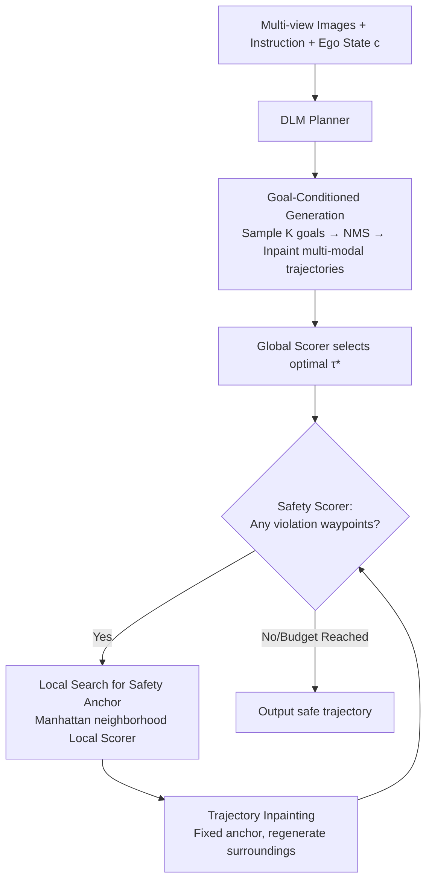

# Discrete Diffusion for Reflective Vision-Language-Action Models in Autonomous Driving

**Conference**: ICLR 2026  
**OpenReview**: [https://openreview.net/forum?id=XJxXSMLDoZ](https://openreview.net/forum?id=XJxXSMLDoZ)  
**Code**: To be confirmed  
**Area**: Autonomous Driving / VLA / Discrete Diffusion Planning  
**Keywords**: ReflectDrive, Discrete Diffusion, Reflection Mechanism, Safety Trajectory Generation, NAVSIM, Trajectory Inpainting  

## TL;DR
ReflectDrive discretizes 2D driving space into an action codebook, uses a pre-trained Diffusion Language Model (DLM) for VLA trajectory planning, and layers a gradient-free "reflection mechanism"—performing local searches on unsafe tokens to find safety anchors, followed by diffusion inpainting to regenerate surrounding trajectories. It achieves a PDMS of 91.1 (approaching the human score of 94.8) on the NAVSIM closed-loop benchmark.

## Background & Motivation
- **Background**: End-to-end (E2E) has become the mainstream in autonomous driving. VLA models further introduce the pre-trained world knowledge of VLMs, enabling them to understand visual scenes and human instructions to directly output planned trajectories, thereby improving generalization in long-tail scenarios.
- **Limitations of Prior Work**: These methods essentially rely on imitation learning/behavioral cloning and **cannot inherently encode physical rules** (collision avoidance, drivable area constraints) during training. A trajectory might have a high probability under the model distribution while violating critical safety constraints. Existing remedies have significant drawbacks: ① Reliance on heavy post-processing with trajectory anchors/rule-based paths; ② Reinforcement learning mostly remains in simulation as real-world deployment requires unsafe online rollouts and training is unstable for large models; ③ Diffusion guidance for controllable generation during inference requires gradients, slow sampling, sensitivity to hyperparameters, and numerical instability.
- **Key Challenge**: Achieving "verifiable and controllable" safety guarantees without introducing expensive gradient calculations or simulation training detached from real-world data—continuous action spaces are naturally difficult to inject with hard constraints.
- **Goal**: Perform planning within a **discrete action space**, allowing safety constraints to be seamlessly injected via discrete operations such as search, masking, and sampling, transforming black-box planning into trustworthy and interpretable decision-making.
- **Core Idea**: **[Discretization + Reflection]** First, quantize trajectories into codebook tokens to allow a pre-trained Diffusion Language Model (DLM) to perform planning; then, design a **gradient-free reflection mechanism**—assessment → local search for safety anchors → inpainting regeneration, iteratively self-correcting until the trajectory is safe.

## Method

### Overall Architecture
ReflectDrive consists of three steps: (a) **Trajectory Discretization + DLM Planner**—quantizing 2D waypoints into codebook tokens and fine-tuning a pre-trained DLM as a VLA planner; (b) **Goal-Conditioned Generation**—sampling multiple spatially diverse goal points, performing inpainting for multimodal candidate trajectories, and selecting the optimal one based on scores; (c) **Safety-Guided Regeneration**—repeatedly applying "safety assessment → anchor search → inpainting repair" on the selected trajectory, iterating to safety without gradients.

### Key Designs

**1. Trajectory Discretization into Action Codebook: Enabling Planning to Reuse Diffusion Language Models.** Continuous waypoints $(x,y)$ are split into two independent 1D codebooks for x and y. Within the spatial range $[-M,M]$, waypoints are uniformly quantized with resolution $\Delta g$. A quantizer $Q$ maps real values to the nearest tokens, flattening the entire trajectory into a token sequence $y=Q(\tau)=(y_{1,x},y_{1,y},\dots,y_{N,x},y_{N,y})\in \mathcal{A}^{2N}$. The paper uses $\Delta g=0.3$ meters and a range of $[-100,100]$, resulting in approximately 667 tokens per dimension. While discretization seemingly sacrifices precision, the resolution is adjustable; more importantly, it transforms trajectories into "language sequences," allowing direct fine-tuning of pre-trained DLMs and **facilitating efficient search for feasible solutions in BEV space**—the prerequisite for discrete constraint injection in the reflection mechanism.

**2. Discrete Diffusion VLA Planner: Bidirectional Inpainting as the Foundation.** The planner is based on a discrete diffusion framework (forward masking of tokens to `[MASK]` using a cosine/linear noise schedule, and reverse learning of $p_\theta$ to predict original tokens at masked positions). The training objective is the negative log-likelihood of masked positions $L(\theta)=\mathbb{E}\big[-\sum_{i:m_i^{(s)}=1}\log p_\theta(y_i\mid \tilde y^{(s)},c,s)\big]$, where condition $c$ includes multi-view images, ego state, and language instructions. The planner is initialized with a pre-trained DLM (LLaDA-V) for supervised fine-tuning. During inference, it starts from a fully masked sequence and decodes in parallel: at each step, a batch of tokens with the highest confidence is fixed, and the rest are re-masked, completing the sequence over $S$ iterations. This non-autoregressive structure naturally supports **bidirectional inpainting**—the ability to reconstruct any masked segment while maintaining contextual consistency—which is the source of the capability to edit and repair trajectories based on safety.

**3. Goal-Conditioned Generation: Establishing Multimodal Intent before Local Repair.** Local search in the reflection phase is deliberately restricted for efficiency and cannot handle large-scale changes like "turning in a different direction at an intersection." Therefore, global intent must be established during the generation phase. The model first outputs the endpoint token distribution $p_\theta(y_N\mid c,s)$. After taking Top-$K'$, NMS is applied to obtain $K$ spatially diverse candidate goals $G=\mathrm{NMS}(\mathrm{TopK}_{K'}(p_\theta(y_N\mid c,s)),d_{\text{NMS}},K)$. For each goal $G_k$, a complete trajectory $\tau_k$ is sampled via inpainting, and the optimal $\tau^*=\arg\max_{\tau_k} S(\tau_k)$ is selected using a Global Scorer. This step ensures that subsequent steps only require safety fine-tuning without placing the burden of large-scale exploration on local search.

**4. Safety-Guided Regeneration: A Gradient-Free "Model ↔ Safety Oracle Dialogue" Closed-loop.** Although the selected $\tau^*$ is coherent, it may still violate physical constraints. An iterative repair loop is entered, driven by three types of scoring functions (Global / Safety / Local Scorer, designed based on existing driving evaluation principles). Each round: ① **Assessment**—the Safety Scorer identifies the set of violating waypoints $V=\{t\mid S_{\text{safe}}(\tau^*)_t<\tau_{\text{safe}}\}$, assigning safety scores based on the most severe violation within a local time window; ② **Anchor Search**—for the earliest violating waypoint, an efficient local search is performed within a small Manhattan neighborhood $N_\delta$ ($\delta\le 10$) of the original token to solve $(y'_{t,x},y'_{t,y})=\arg\max_{(a_x,a_y)\in N_\delta}S_{\text{local}}(a_x,a_y)$, resulting in a corrected token that maximizes the local safety score as a **safety anchor**; ③ **Inpainting Repair**—the anchor is fixed, and the diffusion model performs a single regeneration of surrounding trajectory segments, naturally restoring global coherence. The entire process does not calculate gradients and can be parallelized, looping until the trajectory is safe or the budget is reached (maximum 10 iterations, falling back to the highest safety score candidate if exceeded). Experiments show most violations are resolved within 1–3 rounds, keeping inference overhead manageable.

## Key Experimental Results

### Main Results Table (NAVSIM Closed-loop, PDMS↑)

| Method | Paradigm | Input | NC↑ | DAC↑ | TTC↑ | Comf.↑ | EP↑ | PDMS↑ |
|---|---|---|---|---|---|---|---|---|
| UniAD | E2E | Cam | 97.8 | 91.9 | 92.9 | 100.0 | 78.8 | 83.4 |
| Transfuser | E2E | C&L | 97.7 | 92.8 | 92.8 | 100.0 | 79.2 | 84.0 |
| Hydra-MDP | Augmented | C&L | 98.3 | 96.0 | 94.6 | 100.0 | 78.7 | 86.5 |
| DiffusionDrive | Diffusion | C&L | 98.2 | 96.2 | 94.7 | 100.0 | 82.2 | 88.1 |
| GoalFlow | Diffusion | C&L | 98.4 | 98.3 | 94.6 | 100.0 | 85.0 | 90.3 |
| AutoVLA (Post-RFT) | Autoregressive | Cam | 98.4 | 95.6 | 98.0 | 99.9 | 81.9 | 89.1 |
| **ReflectDrive (w/o R.I.)** | Discrete Diffusion | Cam | 96.9 | 95.4 | 92.2 | 100.0 | 79.0 | 84.8 |
| **ReflectDrive (Ours)** | Discrete Diffusion | Cam | 97.7 | **99.3** | 93.5 | 100.0 | **86.9** | **91.1** |
| ReflectDrive† (GT oracle) | Discrete Diffusion | Cam | 99.7 | 99.5 | 99.1 | 99.9 | 88.9 | 94.7 |
| Human | – | – | 100.0 | 100.0 | 100.0 | 99.9 | 87.5 | 94.8 |

- **Using only cameras**, it achieves a PDMS of 91.1, surpassing all augmented planners using Camera+LiDAR (GoalFlow 90.3) and the strongest VLA, AutoVLA (89.1).
- The reflection mechanism (R.I.) brings improvements over the base version: DAC +3.9, TTC +1.3, NC +0.8, EP +7.9—simultaneously enhancing safety and progress.
- The upper-bound version ReflectDrive† using ground-truth agents reaches 94.7, nearly matching the human score of 94.8 (with EP 88.9 even exceeding human 87.5).

### Ablation Study Table

| Module | Ablation Dimension | Observation |
|---|---|---|
| Base (w/o R.I.) | Steps 1→19 | PDMS saturates around ~84.5; excessive steps yield diminishing returns. |
| G.C.G. | Goals / NMS Threshold | Appropriate goal count + reasonable NMS distance raises score from ~84 to ~88. |
| S.G.R. | Exploratory Steps / Max Iter | Increasing exploration steps and iteration limit pushes PDMS from 89.5 to ~91. |

### Key Findings
- **Discrete representation is fundamental to safety injection**: Placing planning into a discrete token space allows gradient-free operations like search, masking, and inpainting to directly impose hard constraints.
- **Most violations converge in 1–3 rounds**, making reflection overhead manageable and meeting real-time requirements.
- TTC/NC being slightly lower than expected is due to the use of **constant velocity assumptions for agents** during safety estimation; replacing them with ground-truth agents (ReflectDrive†) results in TTC +5.6 and NC +2.0, indicating the upper bound is primarily limited by perception/prediction accuracy rather than the planning framework itself.

## Highlights & Insights
- **Transforms "safety" from a training objective into an inference-time searchable discrete problem**: No longer relies on imitation learning to internalize physical rules. Instead, it uses oracle evaluation + local search + inpainting for explicit repair in discrete space, turning black-box planning into an interpretable closed-loop.
- **Reuses Diffusion Language Models for driving planning**: Trajectory discretization allows the parallel decoding and bidirectional inpainting capabilities of DLMs to be directly transferred to planning, eliminating the need to design specialized diffusion denoisers.
- **Gradient-free guidance**: Compared to guidance methods like Diffusion Planner that require gradient calculations, the reflection mechanism relies purely on discrete search, avoiding slow sampling and numerical instability.
- Camera-only input surpasses multimodal baselines, making it deployment-friendly.

## Limitations & Future Work
- **Safety estimation depends on agent motion assumptions**: The constant velocity assumption leads to lower TTC/NC; real-world deployment requires integration with more accurate detection/prediction modules (validated by ReflectDrive†).
- **Base model shows no significant advantage**: The authors attribute this to limited training data scale and room for improvement in base VLM capabilities.
- **Limited local search capability**: The deliberately constrained neighborhood search cannot handle large-scale direction changes, relying heavily on the goal-conditioned generation phase to establish intent; failure analysis shows room for optimization in the search algorithm.
- **Shared model for goal and planning**: Used for simplicity; a dedicated goal generation model may further improve performance.

## Related Work & Insights
- **Three paths beyond imitation learning**: Trajectory anchors/rule-based paths (Hydra-MDP, DiffusionDrive), Reinforcement Learning (GIGAFLOW self-play, but hindered by sim-to-real), and Diffusion Guidance (Diffusion Planner requiring gradients). ReflectDrive offers a fourth, gradient-free path using discrete diffusion + search/mask/inpainting.
- **Discrete Diffusion** (Austin et al. 2021, etc.) as a non-autoregressive structured sequence generation paradigm; its inpainting capability is creatively applied here to "repair trajectories around safety anchors."
- Insights for other generative planning tasks requiring hard constraints (robot motion planning, constrained sequence generation): After discretizing actions, constraints can be injected as discrete search/masking, bypassing gradient guidance in continuous space.

## Rating
- **Novelty**: ⭐⭐⭐⭐ First to apply discrete diffusion to E2E driving trajectory generation and integrate it into VLA; the design of the reflection mechanism (search + inpainting self-correction) is ingenious.
- **Experimental Thoroughness**: ⭐⭐⭐⭐ NAVSIM closed-loop comparisons cover E2E, augmented, and VLA paradigms, including a GT oracle upper bound and three sets of ablations; however, it is limited to a single benchmark without multi-dataset or real-world road testing.
- **Writing Quality**: ⭐⭐⭐⭐ Clear structure, effective diagrams, and logically progressive methodology; minor typos present.
- **Value**: ⭐⭐⭐⭐ Provides a "verifiable, controllable, and gradient-free" safety planning paradigm; camera-only performance exceeds multimodal baselines, showing high deployment potential.

<!-- RELATED:START -->

## Related Papers

- [\[CVPR 2026\] Counterfactual VLA: Self-Reflective Vision-Language-Action Model with Adaptive Reasoning](../../CVPR2026/autonomous_driving/counterfactual_vla_self-reflective_vision-language-action_model_with_adaptive_re.md)
- [\[CVPR 2026\] DriveMoE: Mixture-of-Experts for Vision-Language-Action Model in End-to-End Autonomous Driving](../../CVPR2026/autonomous_driving/drivemoe_mixture-of-experts_for_vision-language-action_model_in_end-to-end_auton.md)
- [\[ICLR 2026\] DriveVLA-W0: World Models Amplify Data Scaling Law in Autonomous Driving](drivevla-w0_world_models_amplify_data_scaling_law_in_autonomous_driving.md)
- [\[CVPR 2026\] HybridDriveVLA: Vision-Language-Action Model with Visual CoT reasoning and ToT Evaluation for Autonomous Driving](../../CVPR2026/autonomous_driving/hybriddrivevla_vision-language-action_model_with_visual_cot_reasoning.md)
- [\[CVPR 2026\] Unifying Language-Action Understanding and Generation for Autonomous Driving](../../CVPR2026/autonomous_driving/unifying_language-action_understanding_and_generation_for_autonomous_driving.md)

<!-- RELATED:END -->
