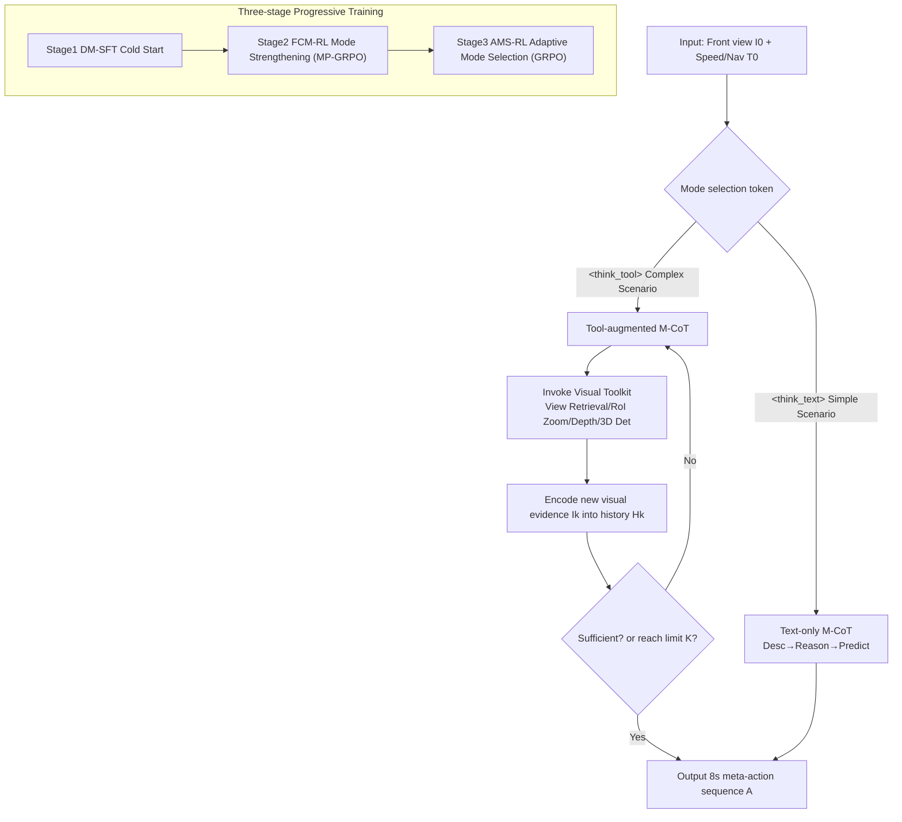

# DriveAgent-R1: Advancing VLM-based Autonomous Driving with Active Perception and Hybrid Thinking

**Conference**: ICLR 2026  
**OpenReview**: [https://openreview.net/forum?id=r2g8TV4nJy](https://openreview.net/forum?id=r2g8TV4nJy)  
**Project Page**: [https://tsinghua-mars-lab.github.io/DriveAgent-R1/](https://tsinghua-mars-lab.github.io/DriveAgent-R1/)  
**Code**: TBD  
**Area**: Autonomous Driving / VLM Agent / Active Perception  
**Keywords**: Vision-Language Models, Autonomous Driving, Active Perception, Tool-calling, Hybrid Thinking, GRPO, High-level Behavior Planning  

## TL;DR
DriveAgent-R1 enables a 3B VLM to learn to "proactively invoke tools to see clearly when details are obscure" during driving planning. By implementing active perception through a visual toolkit and a hybrid thinking framework that adaptively switches between "fast text-only inference" and "slow tool-augmented inference" based on scene complexity, the agent achieves performance comparable to GPT-5 and human drivers via three-stage progressive training with cascaded RL.

## Background & Motivation
**Background**: VLMs unify perception, reasoning, and planning into a single framework, advancing end-to-end autonomous driving, particularly in high-level behavior decision-making (predicting semantic intentions like "slow down and go straight/stop" rather than regressing continuous trajectories). The mainstream approach utilizes Multi-modal Chain-of-Thought (M-CoT) to enable the model to "think while planning."

**Limitations of Prior Work**: Most existing works are confined to the passive perception paradigm of **Text-based M-CoT**, performing textual reasoning based solely on default views (usually the front camera). This leads to a dual dilemma: (1) When the default view lacks sufficient information, the model cannot proactively acquire additional visual evidence to resolve ambiguity; (2) Feeding all multi-view data simultaneously forces the model to process redundant inputs, increasing computational overhead and introducing distractions from irrelevant cues.

**Key Challenge**: Human driving is essentially a process of **actively resolving uncertainty**—drivers check blind spots or re-verify blurry traffic lights. Furthermore, this active exploration is **selective**: simple road conditions rely on intuition, while complex scenarios trigger deliberate inspection. Existing VLMs neither seek evidence proactively nor adaptively decide whether to exert the effort to "look closely."

**Goal**: To introduce tool-based active perception into the core task of high-level behavior planning (previously unexplored) and empower the agent to adaptively switch thinking modes based on scene complexity.

**Core Idea**:
- **[Active Perception]** Equipping the agent with a visual toolkit allows it to call tools as needed during reasoning to "zoom in / change views / estimate depth / perform 3D detection," grounding decisions firmly in verifiable visual evidence.
- **[Hybrid Thinking]** Using a mode token, the agent decides whether to follow "Text-only M-CoT" (efficient) or "Tool-augmented M-CoT" (robust). This adaptive selection capability is developed through three-stage progressive training.

## Method

### Overall Architecture
DriveAgent-R1 uses Qwen2.5-VL-3B as the base model, undergoes driving domain alignment to become DriveAlign-3B, and then follows three-stage progressive training: "foundation building $\rightarrow$ mode strengthening $\rightarrow$ adaptive mode selection." During inference, given an initial front-view image $I_0$ and textual context $T_0$ (speed + navigation commands), the agent outputs a sequence of meta-actions $A=(a_1,a_2,a_3,a_4)$ for the next 8 seconds at 2-second intervals. Each meta-action $a_t=(s_t,j_t)$ consists of a speed token (accelerate/maintain/decelerate/stop) and a trajectory token (straight/right/left). The model first generates a mode token (`<think_text>` or `<think_tool>`) to select the reasoning path. Both paths follow a unified CoT structure of "description $\rightarrow$ reasoning $\rightarrow$ prediction."

### Key Designs

**1. Visual Toolkit + Multi-turn Interactive Active Perception: Grounding Decisions in Evidence.** In tool-augmented mode, the agent no longer passively accepts default views but invokes tools mid-reasoning to obtain new visual information. The toolkit includes four functions: **Retrieve View** (obtaining clear images from any camera, including historical frames within a 5s buffer), **RoI Inspection** (cropping and zooming into specific regions of interest on high-resolution images), **Depth Estimation** (providing 3D spatial sense), and **3D Object Detection** (open-vocabulary 3D object localization). The interaction iteratively updates the history context $H_k = H_{k-1} \oplus T_k \oplus I_k$. This "think-while-seeing" process allows the agent to behave like a human—"looking again if it’s unclear." In the Figure 1 example, the agent identifies a minor scrape on a vehicle via RoI zoom, correcting its initial judgment to "stop after decelerating."

**2. Hybrid Thinking Framework: Unifying Fast and Slow Reasoning with a Mode Token.** For simple, common scenarios, the agent generates `<think_text>`, relying entirely on internal knowledge and initial input for text-only reasoning to save computation and latency. For complex or uncertain scenarios, it generates `<think_tool>` to enter active perception. Both modes share a unified structure: "Description (preliminary perception) $\rightarrow$ Reasoning (logical analysis) $\rightarrow$ Prediction (sequence summary)," with the only difference being the mid-reasoning tool calls. This adaptive switch is a key upgrade over previous "one-size-fits-all passive perception" methods.

**3. Driving Domain Alignment (DriveAlign-3B): Mitigating the "Text-heavy/Vision-light" Shortcut.** The authors observe that general VLMs tend to take "shortcuts" in driving planning—relying on low-dimensional textual cues while ignoring high-dimensional visual inputs. To address this, domain alignment is performed before planning training: a driving VQA dataset of 530K QA pairs (covering scene description, traffic entity recognition, key object localization, and traffic rules/common sense) is constructed using real-world images. Qwen2.5-VL-3B is fully fine-tuned to obtain DriveAlign-3B, which is highly sensitive to visual evidence and serves as the unified initialization for subsequent stages. Ablations show that performance drops more significantly after alignment when images are removed (-15.8% vs. -11.0%), indicating decisions are truly rooted in visual evidence.

**4. Three-stage Progressive Training + Cascaded RL: From Foundation to Adaptive Selection.** The training follows the "foundation building $\rightarrow$ mode strengthening $\rightarrow$ intelligent selection" paradigm. **Stage 1 DM-SFT** (Cold Start): A three-stage pipeline splits data into a "no tool needed" set $D_{text}$ and a "tool required" set $D_{tool}$. Qwen2.5-VL-72B generates mode-specific CoT labels, filtered by a critic model to obtain 4K high-quality samples. **Stage 2 FCM-RL** (Forced Contrastive Mode RL): Based on GRPO, **Mode-Partitioned GRPO (MP-GRPO)** is proposed to prevent the agent from favoring one initially weaker mode. For each input, the model is forced to generate $G/2$ text-mode and $G/2$ tool-mode responses, forming a unified group $O(q)$ for reward normalization. This provides both intra-mode and inter-mode contrastive signals. The reward is $R=R_{acc}+R_{fmt}$ (accuracy uses weighted Levenshtein distance against GT sequences). **Stage 3 AMS-RL** (Adaptive Mode Selection RL): Using native GRPO, the agent generates the mode selection token itself. A conditional tool-use term is added to the reward: $R = R_{acc}+R_{fmt}+\mathbb{I}(\text{mode}=M_{tool})\cdot R_{tool}$. $R_{tool}$ is contrastive—rewarding tool use only when the tool trajectory accuracy exceeds the group's text-only average $\bar{Acc}_{text}$ by a margin, explicitly penalizing redundant tool calls.

## Key Experimental Results

### Main Results
Joint Accuracy on Drive-Internal and nuScenes (Parentheses show gain of tool-augmented vs. text-only):

| Model | Drive-Internal First Frame w/o→w/ Tools | Drive-Internal Seq Avg | nuScenes First Frame | nuScenes Seq Avg |
|---|---|---|---|---|
| Human | 49.59 | 49.29 | 50.48 | 48.24 |
| Qwen2.5-VL-3B | 24.06 → 23.64 (-0.42) | 24.98 → 22.63 (-2.35) | 30.18 → 28.17 | 23.48 → 21.58 |
| Qwen2.5-VL-72B | 32.76 → 32.97 (+0.21) | 38.80 → 39.61 | 43.26 → 43.87 | 39.13 → 40.47 |
| GPT-4.1 | 39.99 → 43.18 (+3.19) | 42.14 → 43.43 | 46.84 → 48.25 | 43.63 → 44.72 |
| GPT-5 | 56.30 → 56.48 (+0.18) | 47.19 → 47.97 | 48.75 → 49.11 | 44.85 → 45.14 |
| **Ours (3B)** | **45.27 → 51.34 (+6.07)** | 43.29 → 45.42 (+2.13) | **52.58 → 52.96** | 44.43 → **47.10 (+2.67)** |

- With only 3B parameters, Ours shows the largest Gain from tools (+6.07% on Drive-Internal), performing comparably to GPT-5 and human drivers; nuScenes sequence accuracy even exceeds GPT-5.
- **Tools are a double-edged sword**: While GPT-4.1/Gemini gain from tools, Qwen2.5-VL-3B/7B lose performance, indicating that effective tool use is a non-trivial skill requiring specialized training.

Low-level motion planning (nuScenes open-loop, with an external lightweight MLP head): ADE average of 0.28m, outperforming DriveVLM-Dual (0.31m) and UniAD (0.69m), with collision rates comparable to strong baselines.

### Ablation Study
Progressive Training Strategy Ablation (Drive-Internal, Seq Avg Joint Acc / MSA Mode Selection Accuracy):

| Variant | Training Stages | $M_{adaptive}$ Acc | MSA (%) |
|---|---|---|---|
| Variant-1 (SFT only) | DM-SFT | 40.88 | 45.00 |
| Variant-2 (+FCM) | +FCM-RL ×1 | 44.64 | 56.64 |
| Variant-4 (+AMS) | +AMS-RL ×1 | 43.43 | 57.55 |
| Variant-5 (+AMS ×2) | +AMS-RL ×2 | 44.13 | 61.61 |
| **Ours (FCM→AMS)** | All 3 Stages | **45.42** | **68.52** |

- The complete three-stage (FCM→AMS) sequence significantly leads in both accuracy and MSA. Training a single RL stage for more epochs cannot replace the "strengthen single modes, then learn selection" cascaded design.

### Key Findings
- Active perception captures critical visual details missed by passive paradigms: Perception score on DriveBench is 34.07, double that of DriveLM (16.85).
- The "strengthen single modes first, then learn adaptive selection" sequence in cascaded RL is crucial for MSA; simply stacking RL epochs is insufficient.

## Highlights & Insights
- **Advancing Active Perception to High-level Planning**: Unlike previous tool-use focused on VQA/Detection, this work systematically allows a planning agent to proactively verify evidence mid-decision, using contrastive tool rewards to suppress redundant calls.
- **Hybrid Thinking Aligns with Human Cognitive Efficiency**: The mode token unifies fast and slow reasoning—saving computation for simple scenes and slowing down for complex ones. The 3B model thus balances performance and deployability.
- **MP-GRPO Solves Mode Bias**: Forced sampling and unified normalization provide inter-mode contrastive signals, preventing the RL from discarding a mode just because it is initially weaker.
- **Small Model Competitive with Closed-source Giants**: 3B model matches GPT-5/human performance, and ablations strictly prove gains come from visual anchoring rather than textual shortcuts.

## Limitations & Future Work
- **Dependency on Internal Data**: Reliance on Drive-Internal (35K long-tail clips), 530K VQA, and 4K CoT data poses a high reproducibility barrier. Labels are automatically generated via GPT-4.1, inheriting its limitations.
- **Limited Toolkit and Max Calls**: The toolkit (4 tools) and max interactions (K=3) are constrained; stability in open tool spaces and longer interaction chains is unexplored.
- **Evaluation Paradigm**: Primary assessment is on high-level meta-action discrete accuracy. Closed-loop safety and real-world road test performance remain to be verified.
- The paradigm requires specialized training for base models; migrating to other/smaller models might require extensive retuning.

## Related Work & Insights
- **Extension of Drive-R1 Domain Alignment**: Addressing "visual neglect" via driving VQA before planning is a direct source for DriveAlign-3B.
- **Continuation of Tool-based M-CoT / "think-while-seeing"**: Applying multimodal tool reasoning to autonomous driving planning can inspire other embodied/robotic tasks requiring proactive verification.
- **Domain Customization of GRPO**: MP-GRPO’s "mode-partitioned sampling + unified normalization" and contrastive tool rewards serve as a reference for any agent needing to adaptively select among multiple reasoning strategies.

## Rating
- **Novelty**: ⭐⭐⭐⭐ First to introduce tool-based active perception to high-level planning with hybrid thinking + MP-GRPO cascaded RL.
- **Experimental Thoroughness**: ⭐⭐⭐⭐ Strong benchmarking against GPT-5/Human across Drive-Internal/nuScenes; comprehensive ablations. Lacks closed-loop testing and relies on private data.
- **Writing Quality**: ⭐⭐⭐⭐ Logical flow from motivation to experimental results; clear visualization of concepts.
- **Value**: ⭐⭐⭐⭐ Provides a pragmatic path for interpretable, deployable VLM-based autonomous driving using efficient small models.

<!-- RELATED:START -->

## Related Papers

- [\[ICLR 2026\] SMART-R1: Advancing Multi-agent Traffic Simulation via R1-Style Reinforcement Fine-Tuning](advancing_multi-agent_traffic_simulation_via_r1-style_reinforcement_fine-tuning.md)
- [\[ICLR 2026\] Plan-R1: Safe and Feasible Trajectory Planning as Language Modeling](plan-r1_safe_and_feasible_trajectory_planning_as_language_modeling.md)
- [\[CVPR 2026\] SpaceDrive: Infusing Spatial Awareness into VLM-based Autonomous Driving](../../CVPR2026/autonomous_driving/spacedrive_infusing_spatial_awareness_into_vlm-based_autonomous_driving.md)
- [\[CVPR 2026\] ActiveAD: Planning-Oriented Active Learning for End-to-End Autonomous Driving](../../CVPR2026/autonomous_driving/activead_planning-oriented_active_learning_for_end-to-end_autonomous_driving.md)
- [\[CVPR 2026\] LiDAS: Lighting-driven Dynamic Active Sensing for Nighttime Perception](../../CVPR2026/autonomous_driving/lidas_lighting-driven_dynamic_active_sensing_for_nighttime_perception.md)

<!-- RELATED:END -->
