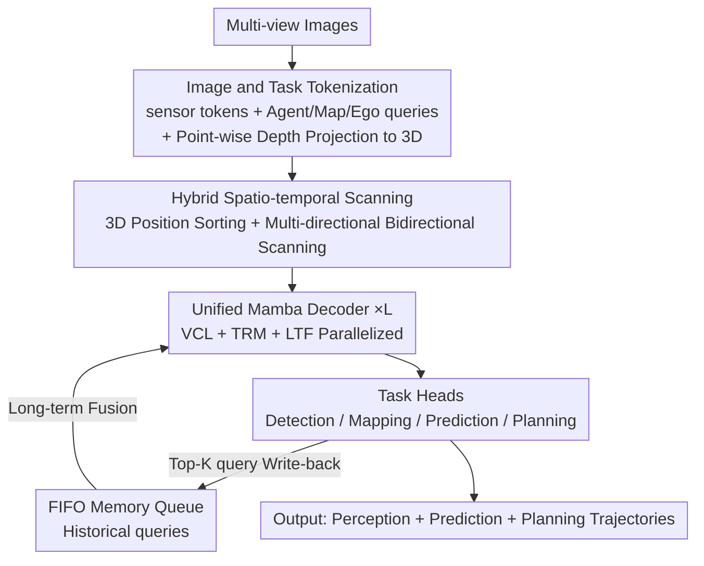

# DriveMamba: Task-Centric Scalable State Space Model for Efficient End-to-End Autonomous Driving

**Conference**: ICLR2026  
**OpenReview**: [https://openreview.net/forum?id=MY0NHvqzi2](https://openreview.net/forum?id=MY0NHvqzi2)  
**Code**: To be confirmed  
**Area**: Autonomous Driving / End-to-End Planning  
**Keywords**: End-to-end autonomous driving, State Space Models, Mamba, Task relationship modeling, Spatio-temporal scanning  

## TL;DR
DriveMamba abandons the traditional serial Transformer paradigm of "perception → prediction → planning" and costly dense BEV features. It sparsifies image features and all task queries into tokens, sorts them by 3D spatial position, and feeds them into a unified Mamba decoder. This allows for simultaneous view correspondence, task relationship modeling, and long-term temporal fusion with linear complexity. The smallest Tiny version reduces the average L2 error to 0.44m and collision rate to 0.15% on nuScenes, while achieving 17.9 FPS (approximately 10x faster than UniAD).

## Background & Motivation
**Background**: The mainstream of end-to-end autonomous driving (E2E-AD) involves integrating detection, mapping, prediction, and planning into a differentiable framework for joint optimization. Representative works like UniAD/VAD follow a serial "perception-prediction-planning" Transformer path, relying on dense BEV features to encode scenes. Later, ParaDrive introduced parallel Transformer decoders to increase module flexibility.

**Limitations of Prior Work**: Serial designs suffer from two major flaws: first, modules are linked in a fixed human-defined order, leading to information loss and error accumulation during step-by-step transmission; second, task relationships are restricted by these fixed connections, preventing the model from flexibly learning "which tasks should assist each other." While ParaDrive introduced parallelism, it still lacks explicit modeling of diverse task relationships and primarily focuses on open-loop evaluation, which fails to reflect real closed-loop driving performance.

**Key Challenge**: Beyond structural issues, there is an efficiency contradiction. BEV-Centric methods generate dense BEV features and rely on stacking historical BEVs for temporal fusion, making long-range perception and long-term temporal modeling extremely expensive. Query-Centric sparse methods are lighter, but attention still maintains quadratic complexity, leading to excessive computation and memory consumption when scaling up. Furthermore, they lack an efficient interaction order specialized for ego-vehicle planning. In short, **existing paradigms fail to simultaneously achieve "flexible task relationships + scalability + high efficiency + long-term memory."**

**Goal**: To design a unified framework that does not rely on dense BEVs or fixed module sequences, and can process spatio-temporal inputs with linear complexity, allowing perception, mapping, prediction, and planning to learn in parallel and dynamically model their relationships within a single decoder.

**Key Insight**: The authors observe that Mamba (Selective State Space Model S6) has demonstrated "linear complexity for long sequences + dynamic selectivity" in NLP and vision. By serializing image tokens and task queries into a unified spatio-temporal sequence, Mamba can handle view correspondence, task relationships, and temporal fusion in a single pass, naturally avoiding the quadratic bottleneck of attention.

**Core Idea**: A unified bidirectional Mamba decoder replaces the serial Transformer. Image and task inputs are tokenized and sorted by 3D position, then processed by linear complexity operators to model task dependencies in parallel. Simultaneously, a trajectory-guided "local-to-global" scanning mechanism is designed to preserve spatial locality from the ego-vehicle's perspective, specifically serving the planning task.

## Method

### Overall Architecture
DriveMamba takes multi-view camera images as input and outputs detection boxes, vector maps, multimodal motion trajectories, and ego-vehicle planning trajectories. The pipeline eliminates the generation of dense BEV features and follows four steps: ① **Tokenization**: Multi-view images are encoded into sensor tokens by visual encoders (ResNet/ViT/ViM), and Agent, Map, and Ego queries are predefined. Each token is assigned spatial, temporal, and task PEs, and image tokens are projected into 3D space using predicted point-wise depth for sorting. ② **Hybrid Spatio-Temporal Scanning**: Tokens are arranged into a 1D sequence based on their 3D/temporal positions and fed into Mamba using various bidirectional scanning orders (including trajectory-guided local-to-global). ③ **Unified Mamba Decoding**: Multiple layers of bidirectional Mamba are stacked to perform View Correspondence Learning (VCL), Task Relationship Modeling (TRM), and Long-Term Fusion (LTF) simultaneously, with historical queries pulled from a FIFO memory queue. ④ **Task Head Output**: Enhanced queries are sent to detection, mapping, prediction, and planning heads for iterative optimization.

The essence of this paradigm is "task-centricity": all tasks are treated equally without sequential dependencies, interacting in parallel within a single decoder, enabling single-stage end-to-end training and easy scaling by stacking layers.

### Key Designs

**1. Image and Task Tokenization: Compressing the Driving Scene into Sortable Sparse Tokens**

This design directly addresses the high cost of "dense BEVs." Instead of rendering BEVs, both perception and task components are decomposed into tokens: multi-view images are encoded as sensor tokens $T_{sensor}\in\mathbb{R}^{N_c\times H\times W\times C}$ with sequence length $G=N_c\times H\times W$. Three types of queries are predefined: Agent queries for dynamic objects, Map queries for static map elements, and Ego queries for ego-vehicle behavior and environmental interaction. Each token consists of a semantic embedding and a position embedding. Position encoding combines three components: $PE_o=\mathrm{Cat}(SE(P_o), SE(T_o), TE_o)$, representing sinusoidal encoding of the BEV reference position, timestamp encoding, and task type embedding respectively. Crucially, a depth prediction branch is added to each sensor token, projecting pixels to 3D positions via $P_{sensor}(i,k)=R_kK_k^{-1}[u_id_{i,k}, v_id_{i,k}, d_{i,k}]^T$. With accurate 3D coordinates, tokens can be sorted by spatial position, allowing Mamba's "order-sensitive" operators to scan them meaningfully.

**2. Hybrid Spatio-Temporal Scanning: Trajectory-Guided Local-to-Global Order**

Since Mamba is a 1D sequence model, the scanning order determines how much spatial locality is preserved. The authors extend 2D scanning to multiple 3D bidirectional scans: horizontal/spatial-first, vertical/temporal-first, Ego-Centric local-to-global (spiral traversal around the ego-vehicle), and most importantly, **Trajectory-Centric local-to-global**. The latter dynamically adjusts the scan order based on the relative distance between ego-vehicle future interpolated waypoints $\psi'$ and the 3D positions of task queries $P_{task}$. The importance $w_i$ of a query $Q_i$ is defined as:

$$w_i = 1 - \min(\{\|P_i-\psi'_j\|_2\}_{j=1}^{T'_e}) / \max(\{\min(\|P_i-\psi'\|_2)\}_{i=1}^{N_a+N_m})$$

This means queries closest to the ego-vehicle's planned path (potential obstacles) have the highest importance, aligning with human driving attention. Ablations (Tab. 7) show that alternating horizontal/vertical scans across layers benefits view correspondence, while trajectory-guided scans benefit task modeling and planning.

**3. Unified Mamba Decoder: Parallel VCL, TRM, and LTF**

This module implements the "task equality" concept using Bidirectional Mamba (B-Mamba) layers. **View Correspondence Learning (VCL)** allows task queries to extract semantics directly from raw sensor features with 3D PE: $\hat Q_{task}=\mathrm{VCL}([Q_{task}\!+\!PE_{task}, T_{sensor}\!+\!PE_{sensor}])$. **Task Relationship Modeling (TRM)** uses an additional B-Mamba layer to explicitly learn dynamic relationships $\hat Q_{task}=\mathrm{TRM}(Q_{task}\!+\!PE_{task})$, covering Agent-Agent, Ego-Agent, and Ego-Map interactions. **Long-Term Fusion (LTF)** maintains a FIFO queue of historical queries: $\hat Q^{t_0}_{task}=\mathrm{LTF}(\{Q^t_{task}\!+\!PE^t_{task}\}_{t=t_0-T_{queue}}^{t_0})$. Top-K queries from the previous frame are enqueued and compensated for motion using a Motion-aware LayerNorm before being transformed to the current ego-coordinate system.

**4. Iteratively Optimized Task Heads + Single-Stage E2E Training**

DriveMamba uses single-stage end-to-end training. Task heads typically consist of 2-layer FCs. Agent tokens output 3D boxes and multimodal trajectories; Map tokens regress vector map instances; Ego tokens predict $T_e=6$ waypoints. Every block's output in the decoder is supervised by explicit losses, and each block predicts relative offsets to update reference points for the next block (Iterative Optimization, IO). Residual learning (RL) is also applied to task position encodings. The total loss is: $L=\sum_{i=1}^{L}(L_{det}^i+L_{map}^i+L_{depth}^i+L_{motion}^i+L_{plan}^i)$, where the planning loss includes vectorized constraints for collision, boundary, and direction.

### Loss & Training
The model is trained in a single stage. The total loss is the sum of losses across all decoding blocks and tasks. The planning loss incorporates vectorized regularization (collision, boundary, orientation). Task weights are balanced empirically, and no multi-stage pre-training is required.

## Key Experimental Results

### Main Results
Open-loop planning on nuScenes (ST-P3 metric, excluding ego-status):

| Method | L2 Avg.(m)↓ | Collision Avg.(%)↓ | FPS↑ |
|------|-------------|--------------------|------|
| UniAD | 0.76 | 0.17 | 1.8 |
| VAD-Base | 0.72 | 0.22 | 4.5 |
| DriveMamba-Tiny | 0.44 | 0.15 | 17.9 |
| DriveMamba-Small | 0.42 | 0.12 | 11.1 |
| DriveMamba-Large | 0.40 | 0.09 | 1.7 |

The Tiny version reduces average L2 by 42.1% / 38.9% and collision rate by 11.8% / 31.8% compared to UniAD/VAD, with only 55.8ms inference time.

Closed-loop planning on Bench2Drive:

| Method | Driving Score↑ | Success Rate(%)↑ | Latency(ms) |
|------|----------------|------------------|-------------|
| UniAD-Base | 45.81 | 16.36 | 663.4 |
| DriveTransformer-Large | 63.46 | 35.01 | 211.7 |
| DriveMamba-Tiny | 53.54 | 27.27 | 55.8 |
| DriveMamba-Base | 65.50 | 36.82 | 164.3 |
| DriveMamba-Large | 66.82 | 37.73 | 599.1 |

### Ablation Study
Components of the unified Mamba decoder (nuScenes open-loop):

| Configuration | L2 Avg.(m)↓ | Coll. Avg.(%)↓ | Notes |
|------|-------------|----------------|------|
| Joint Dec. (Full) | 0.44 | 0.15 | Best performance |
| Divided Dec. | 0.46 | 0.16 | Layered modeling is slightly worse |
| w/o VCL | 0.61 | 0.39 | Most significant degradation |
| w/o LTF | 0.45 | 0.18 | Without temporal fusion |
| w/o TRM | 0.44 | 0.20 | Higher collision rate |
| w/o IO | 0.47 | 0.38 | Collision rate spikes without IO |

### Key Findings
- **VCL is the most critical module**: Without it, queries cannot extract sufficient context from sensor tokens.
- **Iterative Optimization (IO) is vital for safety**: Removing it causes collision rates to spike, indicating that block-wise supervision is key to stable planning.
- **Different roles for encoder and decoder**: Scaling the backbone improves perception (mAP/NDS), while stacking decoder layers improves closed-loop planning (Driving Score).
- **Efficiency from linear complexity**: Compared to Transformer methods, DriveMamba is 3.2× faster and uses 68.8% less GPU memory when increasing input resolution.

## Highlights & Insights
- **"Task-Centric" vs. "Serial Modules"**: By treating all tasks equally and interacting in parallel within one Mamba decoder, DriveMamba eliminates the information loss and error propagation inherent in serial paradigms.
- **Scanning Order as Inductive Bias**: The authors turn Mamba's 1D sequence constraint into an advantage. Trajectory-guided scanning encodes human-like attention priors directly into the sequence order.
- **Complete Sparsity**: By replacing historical BEV features with a FIFO queue of sparse queries, the cost of long-term temporal modeling is significantly reduced.
- **Clear Scaling Path**: Linear complexity makes stacking decoder layers a viable path for scaling. The "backbone for perception, decoder for planning" rule provides clear engineering guidance.

## Limitations & Future Work
- **Closed-loop Precision Gap**: DriveMamba-Tiny's Driving Score is lower than DriveTransformer-Large, requiring Base/Large variants to outperform it in complex interaction scenarios.
- **Weak Comfortness/Efficiency**: Comfortness scores are notably lower than UniAD/VAD, suggesting smooth trajectory generation might be sacrificed for local interaction.
- **Depth Prediction Dependency**: Token sorting relies on depth accuracy; the impact of depth estimation degradation in adverse weather remains unanalyzed.
- **Empirical Scan Design**: The optimal scanning patterns were found through experimental search rather than theoretical guidance.

## Related Work & Insights
- **vs UniAD / VAD (BEV-Centric Serial)**: DriveMamba avoids dense BEVs and fixed sequences, achieving superior L2 and FPS (0.44m/17.9FPS vs 0.76m/1.8FPS).
- **vs ParaDrive (BEV-Centric Parallel)**: DriveMamba uses TRM to explicitly learn task relationships and adds closed-loop evaluation.
- **vs DriveTransformer (Query-Centric Sparse)**: DriveMamba uses linear Mamba instead of quadratic attention and makes tokens sortable via point-wise depth for better efficiency (3.2x faster).
- **vs Vision Mamba (Visual SSM)**: DriveMamba extends bidirectional Mamba into a unified task decoder, migrating SSMs from pure perception to end-to-end planning.

## Rating
- Novelty: ⭐⭐⭐⭐⭐ 
- Experimental Thoroughness: ⭐⭐⭐⭐⭐ 
- Writing Quality: ⭐⭐⭐⭐ 
- Value: ⭐⭐⭐⭐⭐ 

<!-- RELATED:START -->

## Related Papers

- [\[ICLR 2026\] ResWorld: Temporal Residual World Model for End-to-End Autonomous Driving](resworld_temporal_residual_world_model_for_end-to-end_autonomous_driving.md)
- [\[CVPR 2026\] E3AD: An Emotion-Aware Vision-Language-Action Model for Human-Centric End-to-End Autonomous Driving](../../CVPR2026/autonomous_driving/e3ad_an_emotion-aware_vision-language-action_model_for_human-centric_end-to-end_.md)
- [\[CVPR 2026\] DriveMoE: Mixture-of-Experts for Vision-Language-Action Model in End-to-End Autonomous Driving](../../CVPR2026/autonomous_driving/drivemoe_mixture-of-experts_for_vision-language-action_model_in_end-to-end_auton.md)
- [\[CVPR 2025\] DiffusionDrive: Truncated Diffusion Model for End-to-End Autonomous Driving](../../CVPR2025/autonomous_driving/diffusiondrive_truncated_diffusion_model_for_end-to-end_autonomous_driving.md)
- [\[CVPR 2026\] Percept-WAM: Perception-Enhanced World-Awareness-Action Model for Robust End-to-End Autonomous Driving](../../CVPR2026/autonomous_driving/percept-wam_perception-enhanced_world-awareness-action_model_for_robust_end-to-e.md)

<!-- RELATED:END -->
