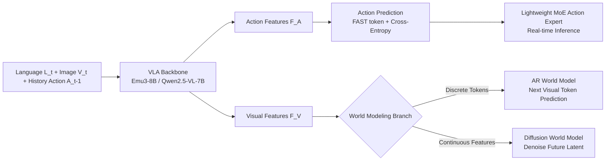

# DriveVLA-W0: World Models Amplify Data Scaling Law in Autonomous Driving

**Conference**: ICLR 2026  
**Code**: [https://github.com/BraveGroup/DriveVLA-W0](https://github.com/BraveGroup/DriveVLA-W0)  
**Area**: Autonomous Driving / End-to-End Planning / VLA  
**Keywords**: Vision-Language-Action, World Models, Data Scaling Law, Self-supervised, Autonomous Driving, NAVSIM  

## TL;DR
DriveVLA-W0 adds a "predict future images" world model task to autonomous driving VLA, using dense visual self-supervision signals to fill the "supervision deficit" left by sparse action supervision. This effectively "amplifies" the data scaling law across 70M frames, allowing the model to consistently improve rather than reaching early saturation.

## Background & Motivation
- **Background**: Current end-to-end planning in autonomous driving follows two main lines. One focuses on specialized models with BEV representations and geometric priors (e.g., UniAD, TransFuser), which are efficient but have small architectures that struggle to ingest massive data or leverage non-driving datasets. The other involves VLA models based on internet-scale pre-trained VLMs (e.g., Orion, ReCogDrive, AutoVLA), boasting large capacity and natural scaling potential.
- **Limitations of Prior Work**: The scaling potential of VLAs is largely unfulfilled. Standard paradigms rely solely on expert actions (waypoints) for supervision, forcing an 8B-scale model to compress high-dimensional perceptual inputs into a few low-dimensional control signals. This results in wasted representation capacity, termed by the authors as a **"supervision deficit."** Such sparse supervision fails to learn rich world representations, a gap that cannot be bridged by simply stacking action data; in practice, large VLAs sometimes underperform smaller specialized BEV models.
- **Key Challenge**: Massive model capacity ↔ Sparse low-dimensional supervision signals. Regardless of data volume, the "supervision deficit" prevents reaping scaling benefits as long as supervision remains limited to a few waypoints.
- **Goal**: Identify a dense, per-frame supervision signal that enables large VLAs to convert massive data into performance and generalize across domains (different action distributions).
- **Key Insight**: **[World Modeling as Dense Self-Supervision]** Require the VLA to predict future images in addition to actions. Future frame prediction provides dense self-supervised signals at every timestep, forcing the model to learn latent environment dynamics. The authors provide two instantiations: an AR world model for discrete visual tokens and a Diffusion world model for continuous visual features.

## Method

### Overall Architecture
DriveVLA-W0 layers a world modeling branch onto a standard VLA backbone (input language instructions $L_t$, front-view images $V_t$, and historical actions $A_{t-1}$ interleaved as sequence $S_t$). The backbone uses cross-entropy to predict action tokens while simultaneously reconstructing or generating the visual future. Two visual representation types are instantiated: an AR world model for discrete tokens (Emu3-8B backbone) and a diffusion world model for continuous features (Qwen2.5-VL-7B backbone). Post-training, the world modeling branch is bypassed during inference to ensure real-time performance. Finally, a lightweight MoE Action Expert decouples action generation from the large backbone to reduce latency.

### Key Designs

**1. AR World Model: Predicting future frames as next-token sequences.** For VLAs that quantize images into discrete visual vocabularies (VQ paradigm), world modeling is a natural extension. The model is tasked with autoregressively generating visual token sequences for current/future images $V_t=(v_1,\dots,v_N)$ alongside action prediction. The loss is standard next-token prediction: $L_{\text{WM-AR}}=-\sum_{i=1}^{N}\log P(v_i\mid S_{<V_t}, v_{<i})$, weighted with the action loss $L_{\text{Total}}=L_{\text{Action}}+\alpha L_{\text{WM-AR}}$. During inference, visual token generation is bypassed to maintain speed, sampled only when visualization is required for decoding via MoVQGAN. DriveVLA-W0 (VQ) serves as the default ablation model due to its architectural simplicity.

**2. Diffusion World Model: Providing pixel-level future supervision for continuous feature VLAs.** Since ViT-based VLAs lack discrete visual vocabularies, they cannot perform next-token prediction. Instead, a latent diffusion world model is introduced. Conditioned on the backbone's visual features $F^V_t$ and action features $F^A_t$, it denoises the latent of the **future frame** $I_{t+1}$ using MSE loss: $L_{\text{WM-Diff}}=\mathbb{E}_{z_{t+1},\epsilon,k}\big[\lVert\epsilon-\hat\epsilon(z_{t+1,k},k,F^V_t,F^A_t)\rVert^2\big]$. The decision to "predict the future rather than reconstruct the present" is a critical design motivation: as the condition already contains all current features, only predicting the next frame forces the model to learn predictive dynamics rather than trivial reconstruction. The total loss is $L_{\text{Total}}=L_{\text{Action}}+\beta L_{\text{WM-Diff}}$, with the diffusion process bypassed during inference.

**3. Vision-Action Interleaved Sequence: Learning causality over "blind" imagination.** The backbone input is not just visual; language, vision, and actions are deeply interleaved over $H$ historical steps as $S_t=[L_{t-H},V_{t-H},A_{t-H-1},\dots,L_t,V_t,A_{t-1}]$. This "Vision + Action" condition (6VA configuration) forces the model to predict the specific future conditioned on a specific action, anchoring visual prediction to ego-action to learn causal environment dynamics. Ablations show 6VA improves PDMS from 84.1 to 85.6 compared to vision-only (6V), with performance scaling as sequence length increases (VA→2VA→6VA).

**4. Lightweight MoE Action Expert: Decoupling action generation for low latency and decoder testing.** While large backbones are excellent for representation, their size hinders real-time control. A 500M Action Expert is combined with the 8B VLA Expert into an MoE. Deep fusion is achieved via Joint Attention: Q/K/V are calculated separately, concatenated along the sequence dimension as $Q=[Q_{\text{VLA}};Q_{\text{AE}}],\,K=[K_{\text{VLA}};K_{\text{AE}}],\,V=[V_{\text{VLA}};V_{\text{AE}}]$, and outputs are split back to respective experts. This reduces inference latency to 63.1% of the baseline VLA (117.8ms→74.3ms) while increasing PDMS from 85.6 to 88.4. Specifically, it serves as a unified testbed for three action decoders (query-based / autoregressive / flow matching), all prefixed with the previous action $A_{t-1}$ as a temporal prior.

## Key Experimental Results

### Main Results (NAVSIM v1, PDMS)

| Method | Sensors | NC↑ | DAC↑ | EP↑ | PDMS↑ |
|------|--------|-----|------|-----|-------|
| TransFuser | 3×Cam+L | 97.7 | 92.8 | 79.2 | 84.0 |
| WoTE | 3×Cam+L | 98.5 | 96.8 | 81.9 | 88.3 |
| AutoVLA | 3×Cam | 98.4 | 95.6 | 81.9 | 89.1 |
| ReCogDrive | 3×Cam | 98.2 | 97.8 | 83.5 | 89.6 |
| **DriveVLA-W0**† | **1×Cam** | 98.7 | 99.1 | 83.3 | **90.2** |
| AutoVLA† | 3×Cam | 99.1 | 97.1 | 87.6 | 92.1 |
| **DriveVLA-W0**‡ | **1×Cam** | 99.3 | 97.4 | 88.3 | **93.0** |

The model exceeds multi-view + LiDAR SOTA methods using only a single front-view camera. On NAVSIM v2, it achieves 86.1 EPDMS, outperforming DiffusionDrive (84.5).

### Ablation Study (Scaling Law, In-house 70k/700k/70M)

| Model | 70M ADE↓ | 70M Collision↓ |
|------|----------|----------------|
| VLA (VQ) Baseline | 1.4829 | 0.0488 |
| + World Model | **1.0563** (↑28.8%) | **0.0392** (↑19.7%) |
| VLA (ViT) Baseline | 1.1051 | 0.0359 |
| + World Model | 1.0640 (↑3.7%) | **0.0302** (↑15.9%) |

While the baseline saturates early with large data, the addition of the world model yields continuous improvements, with gains becoming more significant as data volume increases.

### Key Findings
- **World modeling amplifies scaling**: Moving from 70k to 70M frames, pure action supervision plateaus, whereas the world model gain accelerates (the VQ model ADE improves by 28.8% at 70M).
- **Cross-domain generalization reversal**: NuPlan pre-training causes "negative transfer" (overfitting to action distributions) for pure action baselines (TransFuser-7B, VLA-VQ) but results in positive transfer for VLA-W0 as it learns transferable visual representations.
- **Action decoder scaling reversal**: On small datasets (NAVSIM), query-based and flow-matching methods dominate. On 70M frames, the autoregressive decoder takes the lead (reducing Collision by another 34.9% vs. query-based) due to its modeling capacity and teacher-forcing efficiency.
- **Efficiency**: The MoE Action Expert reduces latency to 63.1% while improving performance.

## Highlights & Insights
- **Precise Problem Definition**: The term "supervision deficit" effectively explains the structural contradiction between large models and sparse actions, offering a more fundamental explanation than "insufficient data."
- **Unified Approach for Dual VLA Types**: AR and Diffusion world models serve discrete and continuous visual representations respectively, proving the paradigm's generality over a single-point trick.
- **Authentic Scaling Experiments**: Utilizing 70M frames (680x larger than academic baselines) for scaling research provides much higher credibility than small-scale benchmarks.
- **Actionable Counter-intuitive Findings**: The reversal in decoder preference as data scales suggests a practical trade-off: use flow matching for small data and AR for massive data.

## Limitations & Future Work
- **Single Front Camera**: While surpassing multi-camera SOTA is impressive, the lack of surround-view or LiDAR limits perception in occlusion or far-field scenarios.
- **Lower Comfort (HC/EC)**: On NAVSIM v2, History Comfort (93.2) and particularly Extended Comfort (58.9) are notably low; smoothness remains a weakness.
- **World Prediction Overhead**: World modeling is only used during training and bypassed during inference; however, training costs (64 GPUs, 50k+30k steps) are high, and multi-step or long-horizon prediction was not fully explored.
- **Closed-source Data**: Key conclusions regarding 70M frame scaling rely on private in-house datasets, setting a high bar for replication.

## Related Work & Insights
- **VLA in Driving**: Evolves from DriveGPT4 (explanation only) → Modular Language-to-Action → End-to-end VLA (Orion, ReCogDrive, AutoVLA). This work falls into the end-to-end category while adding dense visual supervision.
- **Two Roads of World Models**: Serving as data synthesizers (GAIA-1, DrivingGPT, Doe-1) vs. self-supervised targets for representation learning (VaVAM, UniVLA, WorldVLA, LAW). This work follows the latter but differs from LAW's latent prediction by directly supervising **future image pixels** for denser signals.
- **Inspiration**: When model capacity far exceeds the dimensionality of supervision signals, introducing dense self-supervised auxiliary tasks (like future prediction) may be the universal key to unlocking scaling. This approach is transferable to robotics and embodied AI, which also face "action sparsity."

## Rating
- **Novelty**: ⭐⭐⭐⭐ — Clear perspective on "supervision deficit." While world modeling + VLA isn't entirely new in driving, covering both AR/Diffusion paradigms and systematically verifying scaling/decoder reversals is innovative.
- **Experimental Thoroughness**: ⭐⭐⭐⭐⭐ — Covers three scales (NAVSIM v1/v2 + 70M frames) with complete ablations on main results, scaling laws, cross-domain performance, decoders, latency, and sequence length.
- **Writing Quality**: ⭐⭐⭐⭐ — Logical flow from motivation to method to experiment; clear figures/tables. Some notation is dense and comfort metrics require more deep-dive.
- **Value**: ⭐⭐⭐⭐⭐ — Provides a viable dense supervision paradigm for big-data driven driving intelligence and several counter-intuitive practical conclusions; highly valuable for the end-to-end VLA community.

<!-- RELATED:START -->

## Related Papers

- [\[CVPR 2026\] Scaling-Aware Data Selection for End-to-End Autonomous Driving Systems](../../CVPR2026/autonomous_driving/scaling-aware_data_selection_for_end-to-end_autonomous_driving_systems.md)
- [\[ICLR 2026\] Rethinking Driving World Model as Synthetic Data Generator for Perception Tasks](rethinking_driving_world_model_as_synthetic_data_generator_for_perception_tasks.md)
- [\[ICLR 2026\] ResWorld: Temporal Residual World Model for End-to-End Autonomous Driving](resworld_temporal_residual_world_model_for_end-to-end_autonomous_driving.md)
- [\[ICLR 2026\] Discrete Diffusion for Reflective Vision-Language-Action Models in Autonomous Driving](discrete_diffusion_for_reflective_vision-language-action_models_in_autonomous_dr.md)
- [\[ICML 2025\] DriveGPT: Scaling Autoregressive Behavior Models for Driving](../../ICML2025/autonomous_driving/drivegpt_scaling_autoregressive_behavior_models_for_driving.md)

<!-- RELATED:END -->
