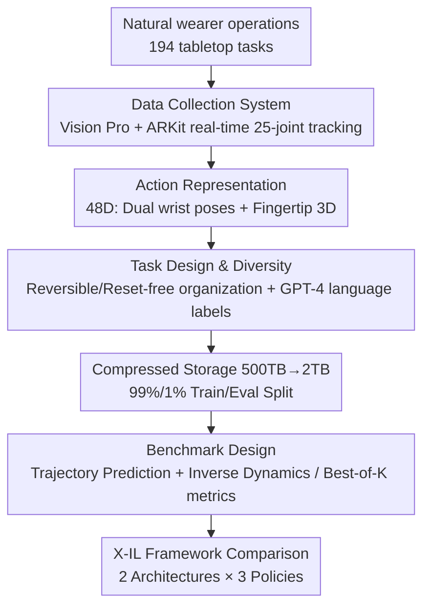

# EgoDex: Learning Dexterous Manipulation from Large-Scale Egocentric Video

**Conference**: ICLR 2026  
**arXiv**: [2505.11709](https://arxiv.org/abs/2505.11709)  
**Code**: [https://github.com/apple/ml-egodex](https://github.com/apple/ml-egodex)  
**Area**: Autonomous Driving/Robotics  
**Keywords**: Egocentric video, dexterous manipulation, imitation learning, hand pose, dataset  

## TL;DR
Apple utilized Vision Pro to collect 829 hours of egocentric video paired with 3D hand joint tracking (EgoDex), covering 194 tabletop manipulation tasks. They systematically evaluated imitation learning strategies (BC/DDPM/FM + Transformer) on this dataset, providing the largest data foundation to date for the scaling and training of dexterous manipulation.

## Background & Motivation

**Background**: Robot imitation learning faces a severe data scarcity problem. Unlike NLP and 2D vision which have internet-scale corpora, dexterous manipulation lacks large-scale datasets. Currently, the mainstream data collection method is teleoperation, such as Open X-Embodiment and DROID.

**Limitations of Prior Work**: Teleoperation is limited by physical hardware bottlenecks, making it difficult to scale further; additionally, data is tied to specific robot hardware, leading to poor generalization. Another option is internet in-the-wild videos (e.g., Ego4D), but these lack precise 3D hand pose annotations and cannot be used to train dexterous manipulation policies.

**Key Challenge**: Scalability vs. Annotation Accuracy—teleoperation has precise action annotations but is not scalable, while in-the-wild videos are scalable but lack critical dexterous annotations.

**Goal**: To build a large-scale dataset that is both passively scalable and features precise 3D hand joint annotations, while establishing a standardized benchmark to evaluate dexterous manipulation capabilities.

**Key Insight**: Leverage the multi-camera system, on-device SLAM, and ARKit of Apple Vision Pro to track the position and orientation of 25 hand joints in real-time during natural user operations, completing data collection and annotation simultaneously.

**Core Idea**: Replace the non-scalable teleoperation paradigm with large-scale egocentric video and precise hand pose data passively collected via wearable XR devices.

## Method

### Overall Architecture

The EgoDex paper addresses the data shortage in dexterous manipulation: it aims to create an adequately large dataset with precise hand annotations and provide a benchmark for fair horizontal comparison of imitation learning policies. The framework consists of two parts: the first is the dataset, using Apple Vision Pro for passive collection of 829 hours (90M frames) of egocentric video, synchronized with 30Hz 3D hand skeletons across 194 tabletop tasks totaling 338K trajectories. The second is the benchmark, defining trajectory prediction and inverse dynamics as evaluation tasks, with systematic comparisons conducted using Transformers within the X-IL framework.

The data pipeline is direct: Vision Pro records 1080p@30Hz video, while ARKit outputs 30Hz skeletal joints and camera parameters. The raw 500TB of data is compressed to 2TB using modern video encoding and split into 99%/1% for training and evaluation.

### Key Designs

**1. Data Collection System: Passive Data Collection via Natural Work**

The root cause of data deficiency in imitation learning is that teleoperation relies on active control by both robot and human, which cannot scale. EgoDex takes a different path: collectors wear Vision Pro (visionOS 2 + ARKit) and perform object manipulation naturally without extra equipment. ARKit uses the device's multi-view calibrated cameras and SLAM to track the head, arms, wrists, and the 3D position and orientation of 25 joints per hand in real-time. Recordings are organized in 10-15 minute sessions, with internal pause/resume markers defining episode boundaries. This collection is "passively scalable"—as XR glasses become popularized, massive manipulation data can accumulate naturally, unlike teleoperation which is bottle-necked by hardware throughput. Compared to methods like HaMeR that regress hand poses post-hoc from video, on-device real-time tracking utilizes known camera parameters and multi-view data for higher annotation precision.

**2. Action Representation: 48D Vector Capturing Both Wrists and Fingertips**

To learn dexterous manipulation, tracking wrist position alone is insufficient; fine finger movements are critical. EgoDex encodes the action $\mathbf{a}_t$ at each frame into 48 dimensions: for two hands, each hand = 3D wrist position + 6D wrist orientation + 3D position for each of 5 fingertips, totaling $2 \times (3 + 6 + 5 \times 3) = 48$ dimensions. Actions are expressed as relative trajectories in the current camera coordinate system. Compared to representations like EgoMimic that only capture wrist position, recording the 3D coordinates of every fingertip truly captures the fine-grained information required for dexterous manipulation.

**3. Task Design and Diversity: Eliminating Reset Overhead via Reversible Tasks**

The most time-consuming aspect of large-scale collection is often environment resets between tasks. EgoDex categorizes 194 tasks into three types to circumvent this: reversible tasks (mutually inverse operation pairs, such as plugging/unplugging a charger, where the final state of one task is the initial state of the other), reset-free tasks (where the final state naturally falls within the initial state distribution), and standard tasks requiring resets. The first two types eliminate reset steps, significantly improving collection efficiency. For annotation, GPT-4 is used to synthesize metadata filled in by collectors (task name, description, environment, objects) into structured natural language. Diversity is also superior—compared to DROID, where many action verbs appear <10 times, most verbs in EgoDex appear >1000 times.

**4. Benchmark Design: Two Evaluation Tasks + Multimodality-Resistant Best-of-K Metric**

To facilitate fair horizontal policy comparison, EgoDex defines two evaluation tasks. Trajectory prediction takes image sequences, skeleton sequences, and language descriptions to predict future $H$ steps of actions:

$$f_\theta(\mathbf{o}_{0..t}, \mathbf{s}_{0..t}, l) = \hat{\mathbf{a}}_{t:t+H}$$

Inverse dynamics adds a terminal goal image $\mathbf{o}_{t+H}$ to the prediction, which acts as an anchor for the trajectory end, reducing multimodality. The evaluation metric is "Best of K": for the same input, the model is sampled K times, and the prediction closest to the GT is chosen to calculate the mean 3D Euclidean distance across 12 keypoints (two wrists + 10 fingertips). This design accounts for the naturally multimodal nature of human motion—multiple reasonable trajectories may exist for the same initial state, and using a single GT would penalize correct but alternative predictions.

### Loss & Training

- Used the X-IL framework to train 2 architectures × 3 policies = 6 model types:
    - Architectures: Encoder-Decoder Transformer and Decoder-only Transformer.
    - Policies: Behavior Cloning (BC, deterministic), Denoising Diffusion (DDPM, stochastic), Flow Matching (FM, stochastic).
- Trained for 50K steps with a batch size of 2048 using 8×A100 GPUs.
- A total of 14 model variants were trained and evaluated (including different horizons, goal conditioning, data scales, and model sizes).

## Key Experimental Results

### Main Results

Trajectory prediction results under a 2-second prediction horizon (H=60):

| Model | Avg Dist (K=1) | Avg Dist (K=10) | Final Dist (K=1) | Final Dist (K=10) |
|------|---------------|-----------------|-------------------|-------------------|
| Dec + BC | 0.045 | 0.045 | 0.062 | 0.062 |
| Dec + DDPM | 0.053 | 0.041 | 0.071 | 0.044 |
| Dec + FM | 0.052 | 0.040 | 0.071 | 0.043 |
| EncDec + BC | **0.044** | 0.044 | **0.060** | 0.060 |
| EncDec + DDPM | 0.052 | 0.039 | 0.071 | 0.043 |
| EncDec + FM | 0.051 | **0.038** | 0.070 | **0.041** |

### Ablation Study

| Configuration | Avg Dist (m) | Final Dist (m) | Description |
|------|-------------|----------------|------|
| H=30 (1s) | 0.031 | 0.049 | Short horizon, most accurate |
| H=60 (2s) | 0.045 | 0.062 | Default horizon |
| H=90 (3s) | 0.053 | 0.069 | Long horizon, error increases |
| w/o goal image | 0.045 | 0.062 | No goal condition |
| w/ goal image | 0.035 | 0.029 | Final dist dropped by 53% |
| 200M params | 0.045 | 0.062 | Default model |
| 500M params | 0.045 | 0.062 | No gain from increasing model size |

### Key Findings
- **EncDec > Dec-only**: Encoder-decoder architectures consistently outperformed decoder-only ones across all policies, though the margin was small.
- **BC vs. Stochastic Policies**: BC was best at K=1 (deterministic predictions are better on average), but FM/DDPM were superior at K=5/10 (capable of sampling better modes); FM was 34% better than BC at K=10.
- **Goal Images Dramatically Reduce Final Error**: Visual goal conditioning reduced the final distance from 0.062 to 0.029 (↓53%), as the goal provides an "anchor" for the trajectory endpoint, alleviating multimodality.
- **Performance Scales with Data**: Performance improved continuously as the data volume increased (log-linear relationship), validating the scaling hypothesis.
- **No Difference with 500M Model**: Indicates that current 200M models are sufficient; the bottleneck lies in data rather than model capacity.

## Highlights & Insights
- **Passively Scalable Data Paradigm**: Leveraging consumer XR devices to collect manipulation data proposes a path to the "ImageNet moment" for robotics—data can accumulate naturally once XR glasses become ubiquitous. This logic can transfer to any field requiring large-scale human behavior data (e.g., gesture recognition, sign language).
- **Reversible Task Design to Eliminate Reset Overhead**: By designing mutually inverse task pairs (e.g., plugging/unplugging), the final state of one task becomes the initial state of another, significantly boosting efficiency. This trick is applicable to any data collection scenario.
- **Best-of-K Evaluation Metric**: Cleverly addresses the inherent multimodality of human motion—multiple reasonable trajectories exist for the same initial state, and single-GT evaluation would penalize correct but distinct predictions.

## Limitations & Future Work
- **Limited Scene Diversity**: All data was collected in tabletop environments, lacking diverse scenes like kitchens or outdoors. The authors suggest using generative models for visual augmentation.
- **Inaccurate Annotation under Occlusion**: In scenarios with heavy occlusion (e.g., folding towels), ARKit's hand tracking accuracy drops (which is inherently a model prediction).
- **Embodiment Gap Unverified**: The paper does not demonstrate human data → robot policy transfer experiments, only discussing potential methods (co-training, pre-training + fine-tuning). This is the most critical missing link.
- **Lack of Object Interaction Modeling**: Only hand poses are tracked; the absence of object pose and contact point annotations limits the ability to learn hand-object interaction dynamics.

## Related Work & Insights
- **vs. DROID (Teleoperation)**: DROID has 76K trajectories/86 tasks/19M frames, while EgoDex has 338K trajectories/194 tasks/90M frames, surpassing it in scale. However, DROID data can be directly used for robot training, whereas EgoDex requires cross-embodiment transfer.
- **vs. EgoMimic**: Most similar work, also using egocentric video + hand tracking. However, EgoMimic has only 4 hours of data and only tracks wrist position, while EgoDex offers 829 hours + full finger joint tracking, greatly improving scale and precision.
- **vs. Ego4D**: Ego4D has 3000 hours of video but lacks 3D hand pose annotations and does not focus on manipulation tasks, making it unsuitable for direct dexterous manipulation training.

## Rating
- Novelty: ⭐⭐⭐⭐ Using Vision Pro for large-scale dexterous manipulation data collection is a first in terms of scale and quality, though the paradigm of using wearables is not new.
- Experimental Thoroughness: ⭐⭐⭐⭐ Systematically evaluated 14 model variants and multiple ablations, but lacks the critical robot transfer experiment.
- Writing Quality: ⭐⭐⭐⭐⭐ Structured clearly with rich charts; the dataset comparison table is particularly informative.
- Value: ⭐⭐⭐⭐⭐ As a dataset paper, the potential impact is enormous—829 hours of open-source data will drive the development of the entire dexterous manipulation field.

<!-- RELATED:START -->

## Related Papers

- [\[CVPR 2026\] Learning to Drive is a Free Gift: Large-Scale Label-Free Autonomy Pretraining from Unposed In-The-Wild Videos](../../CVPR2026/autonomous_driving/learning_to_drive_is_a_free_gift_large-scale_label-free_autonomy_pretraining_fro.md)
- [\[CVPR 2026\] Ghost-FWL: A Large-Scale Full-Waveform LiDAR Dataset for Ghost Detection and Removal](../../CVPR2026/autonomous_driving/ghost-fwl_a_large-scale_full-waveform_lidar_dataset_for_ghost_detection_and_remo.md)
- [\[CVPR 2026\] SearchAD: Large-Scale Rare Image Retrieval Dataset for Autonomous Driving](../../CVPR2026/autonomous_driving/searchad_large-scale_rare_image_retrieval_dataset_for_autonomous_driving.md)
- [\[ECCV 2024\] H-V2X: A Large Scale Highway Dataset for BEV Perception](../../ECCV2024/autonomous_driving/h-v2x_a_large_scale_highway_dataset_for_bev_perception.md)
- [\[CVPR 2026\] V2U4Real: A Real-world Large-scale Dataset for Vehicle-to-UAV Cooperative Perception](../../CVPR2026/autonomous_driving/v2u4real_a_real-world_large-scale_dataset_for_vehicle-to-uav_cooperative_percept.md)

<!-- RELATED:END -->
