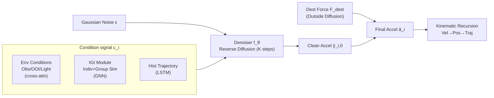

# EnvSocial-Diff: A Diffusion-Based Crowd Simulation Model with Environmental Conditioning and Individual-Group Interaction

**Conference**: ICLR 2026  
**OpenReview**: [https://openreview.net/forum?id=2XBAm3Dbnt](https://openreview.net/forum?id=2XBAm3Dbnt)  
**Code**: To be confirmed  
**Area**: Pedestrian Trajectory Prediction / Crowd Simulation  
**Keywords**: Crowd Simulation, Diffusion Model, Social Force Model, Environmental Condition, Pedestrian Trajectory Prediction, Graph Neural Network  

## TL;DR
Building upon the "social force + diffusion" framework of SPDiff, this work explicitly decomposes the environment into three categories of structured conditions: obstacles, Objects of Interest (OOI), and lighting. It supplements this with a graph-based "Individual-Group Interaction" (IGI) module for two-level social modeling, resulting in more realistic crowd trajectory simulations in complex outdoor scenarios.

## Background & Motivation
- **Background**: Crowd simulation requires simultaneous consideration of social interactions and environmental constraints. Approaches have evolved from rule-based (Boids) and Social Force Models (SFM) to data-driven methods (Social LSTM/GAN, STGCNN) and physics-informed generative methods. A recent representative, SPDiff, embeds a conditional diffusion process into the SFM, using a diffusion module to refine predicted acceleration based on historical motion and individual-level social interactions.
- **Limitations of Prior Work**: (1) **Social modeling is limited to the individual level**: it only accounts for pairwise collisions or alignment, ignoring "group conformity" which strongly influences collective motion. (2) **Environmental handling is oversimplified**: most methods, including SPDiff, use only repulsive forces or binary occupancy maps to represent obstacles, failing to explicitly encode richer context such as OOI (shops, kiosks) that act as "attractors" for path selection, or lighting, which psychology and urban design confirm affects safety perception and walking preferences.
- **Key Challenge**: Crowd behavior is shaped by multiple heterogeneous factors (obstacle avoidance, group cohesion, path selection, light perception). However, existing frameworks either compress the environment into a single repulsive force or simplify social interactions to the individual level, lacking a framework that integrates **structured environmental conditions** and **multi-level social modeling** into a generative diffusion process.
- **Goal**: To explicitly model both the environment (obstacles/OOIs/light) and two-level social interactions (individual + group) in long-term crowd simulation while maintaining physical interpretability.
- **Core Idea**: **[Structured Environmental Conditions + Individual-Group Interaction]**. The environment is decomposed into three conditional signals: obstacles (repulsion), OOI (attraction), and lighting (global context). An IGI module based on graph structures captures individual similarity and group conformity. These are used as conditions for diffusion denoising alongside historical trajectories. The destination driving force is kept outside the diffusion process and injected during rollout to maintain long-term intent.

## Method

### Overall Architecture
EnvSocial-Diff adopts the "superposition of forces" perspective from the Social Force Model (SFM), decomposing the net force on a pedestrian into four components: destination driving force $\vec{F}^{dest}_i$, historical force $\vec{F}^{hist}_i$, social force $\vec{F}^{social}_i$, and environmental force $\vec{F}^{env}_i$. The latter three are concatenated into a condition signal $c^t_i=[\vec{F}^{env}_i\oplus\vec{F}^{social}_i\oplus\vec{F}^{hist}_i]$. Conditional diffusion is performed in the **acceleration space**: the forward process adds noise, and the reverse process uses network $f_\theta$ to recover the clean acceleration $\hat{y}^t_{i,0}$. The destination force $\vec{F}^{dest}_i$ is handled separately outside the diffusion process and added during rollout to preserve long-term intent. Final acceleration is used via kinematic formulas to update velocity and position.

### Key Designs

**1. Conditional Diffusion in Acceleration Space: Treating Social Forces as Denoising Targets**  
Since acceleration is proportional to net force ($\vec{F}=m\vec{a}$), this model predicts future acceleration rather than position, achieving a physically grounded motion representation. The forward process gradually adds noise to the ground truth acceleration $y^t_{i,0}$ via $q(y_{i,k}|y_{i,k-1})=\mathcal{N}(\sqrt{1-\beta_k}\,y_{i,k-1},\beta_k I)$. The reverse process starts from Gaussian noise and iteratively denoises under condition $c^t_i$ using $p_\theta(y_{i,k-1}|y_{i,k},c^t_i)$. Crucially, the three "difficult-to-learn" forces from SFM are unified and delegated to the denoiser output, while the destination force $\vec{F}^{dest}_i=m_i\frac{v'_i n_i-v_i}{\mu}$—which has a clear analytical form and governs long-term intent—is kept outside. This prevents diffusion noise from polluting long-range goals, which is the root cause for its superior stability over pure end-to-end predictors in long-term scenarios.

**2. Structured Environmental Conditions: Heterogeneous Encoding for Obstacle Repulsion / OOI Attraction / Light Context**  
This is the core incremental contribution over SPDiff. Obstacles and OOIs are first described via GPT, with cropped image patches encoded by ResNet-50 and text encoded by BERT, then projected into features. **Obstacles** are processed through two cross-attention stages: first, individual obstacle features are enhanced by global scene features $f^{sc}$ to get $\tilde{f}^{obs}_l$; then, pedestrian states attend to these obstacles with a relative position bias $f^{ped\text{-}obs}_i=\sum_{l\in O}\text{softmax}_l\big(\frac{Q_i^\top K^{obs}_l}{\sqrt{d_1}}+b(\vec{p}^{rel}_{i,l})\big)V^{obs}_l$ to capture fine-grained avoidance. **OOI** only provides global semantic attraction (guiding path selection) and does not require precise avoidance, so position encodings and global features are simply concatenated for cross-attention. **Lighting** is treated as global context: the V-channel of the BEV map in HSV space is grid-pooled into a spatial lighting vector $f^{raw}_{light}$ and passed through a lightweight MLP to obtain $f^{enc}_{light}$. These three branches are concatenated and fused via an MLP into $\vec{F}^{env}_i=\text{MLP}(f^{ped\text{-}obs}_i\oplus f^{ped\text{-}ooi}_i\oplus f^{enc}_{light})$. This "modeling based on environmental entity roles" (repulsion vs. attraction vs. global) is significantly more detailed than binary occupancy maps.

**3. Individual-Group Interaction (IGI): Two-Level Similarity + GNN Aggregation for Social Force**  
To address the "individual-only social modeling" issue, IGI models interactions at two levels. At the **individual level**, two similarities are used: a proximity trend $sim^1_{ij}=\frac{1}{2}\big(\frac{\Delta\vec{p}_{ij}}{\|\Delta\vec{p}_{ij}\|}\cdot\frac{\vec{v}_j}{\|\vec{v}_j\|}+1\big)$ measures whether neighbor $j$ is moving toward $i$ (collision risk), and motion alignment $sim^2_{ij}$ measures the consistency of velocity directions. At the **group level**, a conformity similarity $sim^3_i=\frac{1}{2}\big(\frac{w_i}{\|w_i\|}\cdot\frac{g_i}{\|g_i\|}+1\big)$ is introduced, where $w_i=\vec{v}_i\oplus\vec{a}_i$ is the motion state of $i$ and $g_i$ is the average neighbor motion, reflecting $i$'s adherence to surrounding group dynamics. These, along with relative motion descriptors $r_{ij}=\Delta\vec{p}_{ij}\oplus\Delta\vec{v}_{ij}$, are fed into a multi-layer GNN. Node initialization is $h^0_i=\text{MLP}_{init}(S^t_i\oplus\epsilon^t_i\oplus g_i)$, and edge features are $e_{ij}=r_{ij}\oplus sim^1_{ij}\oplus sim^2_{ij}\oplus sim^3_i$. During node updates, the model concatenates self-features, mean neighbor messages, and normalized group features to output the final social force $\vec{F}^{social}_i$. Note that $sim^3_i$ explicitly injects the "group mean" into node initialization and updates, which is key to modeling group conformity.

## Key Experimental Results

### Main Results
On two real-world datasets, GC (indoor) and UCY (outdoor), using metrics MAE/OT/FDE/MMD/DTW/Col (number of collisions). Lower is better.

| Category | Method | GC MAE↓ | GC OT↓ | GC MMD↓ | UCY MAE↓ | UCY OT↓ | UCY MMD↓ |
|------|------|---------|--------|---------|----------|---------|----------|
| Physics | SFM | 1.2590 | 2.1140 | 0.0150 | 2.5390 | 6.5710 | 0.1290 |
| Phys-Info | PCS | 1.0320 | 1.5963 | 0.0126 | 2.3134 | 6.2336 | 0.1070 |
| Phys-Info | NSP | 0.9884 | 1.4893 | 0.0106 | 2.4006 | 6.3795 | 0.1199 |
| Phys-Info | SPDiff | 0.9116 | 1.3925 | 0.0092 | 1.8760 | 4.0564 | 0.0671 |
| Ours | **EnvSocial-Diff** | **0.8861** | **1.3339** | **0.0087** | **1.8182** | **3.7292** | **0.0598** |

### Ablation Study
Incremental addition of environmental factors (Obs/OOI/Light) and IGI similarity terms (on UCY):

| Ablation | Configuration | UCY MAE↓ | UCY OT↓ | UCY MMD↓ |
|------|------|----------|---------|----------|
| Env | Ours w/o Env | 1.8597 | 3.8945 | 0.0626 |
| Env | +Obs | 1.8337 | 3.8550 | 0.0604 |
| Env | +Obs+OOI | 1.8271 | 3.8541 | 0.0586 |
| Env | +Obs+OOI+Light (Full) | **1.8182** | **3.7292** | **0.0598** |
| IGI | Only r_ij (≈SPDiff) | 1.9055 | 4.0101 | 0.0628 |
| IGI | +sim¹ | 1.8846 | 3.8502 | 0.0588 |
| IGI | +sim¹+sim²+sim³ (Full) | **1.8182** | **3.7292** | **0.0598** |

### Key Findings
- **Gains are more significant outdoors**: On the more challenging UCY dataset, improvements over SPDiff were 3.1%/8.1%/10.9%/3.9% in MAE/OT/MMD/DTW respectively. On the indoor GC dataset (sub-scenes with minimal change), performance was already saturated by PCS/SPDiff, leading to limited gains—confirming that "explicit environmental modeling is more valuable in complex outdoor settings."
- **Each environmental factor is useful**: Adding Obstacles → OOI → Lighting sequentially yielded steady improvements. However, on UCY, adding lighting slightly increased MMD/DTW (outdoor lighting has a weaker correlation with local pedestrian dynamics), though other key metrics still improved.
- **Group conformity cannot stand alone**: IGI ablations show $sim^3_i$ alone reduces MMD on GC, but lacking $sim^1/sim^2$ degrades other metrics; all three are complementary for optimal performance.
- **Long-term Advantage**: Error curves demonstrate a widening lead over SPDiff as the prediction horizon increases.

## Highlights & Insights
- **Environmental "Role Decoupling" is insightful**: Modeling environmental entities based on their roles (Obstacles = Repulsion, OOI = Attraction, Light = Global) rather than a "one-size-fits-all" map aligns with human decision-making (avoiding vs. being attracted vs. perceiving).
- **Introducing lighting into trajectory prediction** is a rare but grounded attempt, citing psychophysical evidence regarding lighting's impact on walkability and obstacle detection.
- **Keeping destination force outside diffusion**, a design inherited from SPDiff, is critical: it ensures the diffusion process only handles "short-term learnable forces" without noise interfering with long-term intent.
- **Physically Interpretable**: All conditions correspond to named "forces" in SFM, making the model easier to diagnose than black-box end-to-end predictors.

## Limitations & Future Work
- **Small Datasets**: Evaluation was limited to GC (5 minutes) and UCY (216 seconds for Students003); generalization to large-scale or multi-scene environments is unverified.
- **Dependence on LLM Labeling**: OOI/Obstacle descriptions rely on GPT generation + ResNet/BERT encoding, which creates a heavy pipeline and introduces additional uncertainty.
- **Coarse Lighting Modeling**: Only grid-pooling of the HSV V-channel was used; gains were inconsistent in outdoor scenes (MMD/DTW occasionally rose).
- **Future Work**: The authors propose video-level generation based on predicted trajectories to serve crowd simulation, safety planning, and smart infrastructure.

## Related Work & Insights
- **Direct Baseline SPDiff**: This work is a direct extension, inheriting "Social Force + Acceleration Diffusion + External Destination Force + Multi-frame Rollout Training," primarily filling the gaps in structured environment and group-level social modeling.
- **Scene-Aware Methods (NSP/UniTraj)**: These use semantic maps or global embeddings to introduce scenes. However, NSP's environment is limited to binary occupancy repulsion, and social modeling remains individual-level. This work provides a more structured alternative using OOI and lighting.
- **Insight**: Using "domain priors (SFM force decomposition)" as the skeletal structure for diffusion conditions makes the model more controllable and interpretable than free-form diffusion—this "physical structure × generative model" paradigm is transferable to other prediction tasks with strong priors.

## Rating
- **Novelty**: ⭐⭐⭐½ — Architectural increments over SPDiff (structured env + group conformity); logic is clear, but it completes an existing framework rather than creating a new paradigm.
- **Experimental Thoroughness**: ⭐⭐⭐ — Two datasets and complete ablations with explainable results, but small dataset scale and lack of large-scale/cross-scene generalization or more SOTA comparisons.
- **Writing Quality**: ⭐⭐⭐⭐ — Smooth logic from motivation to method to experiments; formulas and diagrams are clear; the case for environmental role decoupling is persuasive.
- **Value**: ⭐⭐⭐½ — Practical value for the crowd simulation and trajectory prediction communities; the "environmental role decoupling" and "lighting inclusion" perspectives are worth referencing, though gains in indoor scenes are limited.

<!-- RELATED:START -->

## Related Papers

- [\[ICCV 2025\] LangTraj: Diffusion Model and Dataset for Language-Conditioned Trajectory Simulation](../../ICCV2025/autonomous_driving/langtraj_diffusion_model_and_dataset_for_language-conditioned_trajectory_simulat.md)
- [\[ICCV 2025\] RESCUE: Crowd Evacuation Simulation via Controlling SDM-United Characters](../../ICCV2025/autonomous_driving/rescue_crowd_evacuation_simulation_via_controlling_sdm-united_characters.md)
- [\[ICLR 2026\] SceneStreamer: Continuous Scenario Generation as Next Token Group Prediction](scenestreamer_continuous_scenario_generation_as_next_token_group_prediction.md)
- [\[AAAI 2026\] DiffRefiner: Coarse to Fine Trajectory Planning via Diffusion Refinement with Semantic Interaction for End to End Autonomous Driving](../../AAAI2026/autonomous_driving/diffrefiner_coarse_to_fine_trajectory_planning_via_diffusion_refinement_with_sem.md)
- [\[AAAI 2026\] Drive As You Like: Strategy-Level Motion Planning Based on A Multi-Head Diffusion Model](../../AAAI2026/autonomous_driving/drive_as_you_like_strategy-level_motion_planning_based_on_a_multi-head_diffusion.md)

<!-- RELATED:END -->
