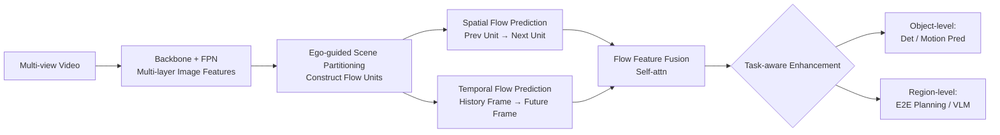

# FlowAD: Ego-Scene Interactive Modeling for Autonomous Driving

**Conference**: ICLR 2026  
**OpenReview**: [https://openreview.net/forum?id=m4JpoJRgAr](https://openreview.net/forum?id=m4JpoJRgAr)  
**Code**: To be open-sourced (Paper promises release of Code/model/configs)  
**Area**: Autonomous Driving / End-to-End Planning / World Models  
**Keywords**: Autonomous Driving, ego-scene interaction, scene flow, world models, end-to-end planning, closed-loop evaluation  

## TL;DR
FlowAD models the "feedback of ego-motion on future observations" as relative **scene flow**. By utilizing ego-guided scene partitioning and spatio-temporal flow prediction to learn these interaction dynamics in latent space, it achieves consistent performance gains in perception, end-to-end planning, and VLM analysis. It also introduces the FCP metric to specifically measure the speed of scene understanding.

## Background & Motivation
**Background**: Autonomous driving is transitioning from modular designs to end-to-end (E2E) architectures. Frameworks like UniAD, VAD, and SparseDrive use Transformer/sparse queries to link perception, prediction, and planning into a planning-centric chain. Recently, LVLMs (DriveVLM, Senna) have been introduced for high-level reasoning. Regardless of the paradigm, the planning module remains the **final step** of the pipeline: at each timestamp, it consumes environmental information from preceding modules to output an ego-plan, and then the pipeline resets for the next frame.

**Limitations of Prior Work**: This structure almost entirely ignores the **impact of the ego-car's executed motion on subsequent perception and decision-making**. A complete driving process should involve two parts: making plans based on current observations, and more importantly, shaping future sensory inputs after executing control. The lack of the second part (ego-motion feedback) is the root cause of the gap between open-loop and closed-loop environments. Open-loop training uses fixed pre-recorded data where planned trajectories are not actually executed, severing the link between actions and subsequent observations. The paper provides counter-intuitive experimental evidence (Tab.1): removing temporal fusion in UniAD has almost no impact on planning (L2 degrades only 5%) but severely hurts tracking (AMOTA -16%), indicating that existing temporal modeling does not establish an ego-feedback loop for planning.

**Key Challenge**: Closed-loop environments allow real interaction but are solely used for evaluation and are not conducive to large-scale training; open-loop data is massive but lacks ego-motion feedback. To learn closed-loop interactive capabilities from open-loop data, a representation must be found that learns ego-feedback from log-replay data without relying on simulation.

**Goal**: To propose an ego-scene interaction modeling paradigm that explicitly encodes ego-motion feedback into latent space feature learning, enabling the system to understand "how its own movements change the environment," thereby enhancing planning.

**Core Idea**: **[Relative Motion → Scene Flow]** Drawing inspiration from human sensory-motor mechanisms—where an individual's movement causes the environment to "flow" in the opposite direction—this optic flow is crucial for anticipation and navigation. The paper models ego-scene interaction as learnable relative **scene flow**. Consequently, ego-motion feedback can be learned in the latent space using existing pre-recorded data, bypassing the difficulty of generating diverse observations through simulation.

## Method

### Overall Architecture
FlowAD is a general flow-based framework comprising three stages: **Input** (multi-view video features extracted via backbone+FPN) → **Ego-Scene Interaction Modeling** (ego-guided scene partitioning to construct flow units, followed by spatial/temporal flow prediction to obtain spatio-temporal flow features) → **Task-aware Enhancement (using flow features to enhance downstream tasks via object-level and region-level strategies). It does not replace specific baselines but acts as a plugin for SparseBEV (perception), SparseDrive/DiffusionDrive (planning), and Senna (VLM).

### Key Designs

**1. Ego-guided Scene Partitioning: Encoding "ego-motion" into partition geometry**. Since overall scene flow is difficult to quantify directly, the paper slices features along the **width direction** of multi-view images into several flow units (as relative motion is primarily horizontal). Ego motion then shapes the partitioning via two mechanisms. First, the **partition origin**: the ego-car at time $t$ is placed at the coordinate origin, and six camera planes are arranged at the sensing boundaries. The forward vector is constructed using positions at $t-1/t$, and its intersection with the multi-view planes serves as the partition origin, naturally dividing the scene into ego-left/right sides. Second, **dynamic partition size adjustment**: during turning, flow speeds on the left and right sides differ, so equal-sized partitioning is kinematically incorrect. The paper assumes the turning trajectory is an arc, solving for the center and radius $r$ using positions from three frames $\{(x_{t-2},y_{t-2}),(x_{t-1},y_{t-1}),(x_t,y_t)\}$. Combined with the car width $w_{ego}$, the partition sizes for the left and right sides are determined as $P_{left}=P\times\frac{(r+w_{ego}/2)^2}{r^2}$ and $P_{right}=P\times\frac{(r-w_{ego}/2)^2}{r^2}$. Additionally, multi-layer features $\{F^l_{img}\}$ use different partition sizes $\{P^l\}$ to capture varying receptive fields, followed by **local aggregation**—concatenating each unit with its two neighbors $f^{k-1:k+1}_{unit}$ to perform self-attention across the $3P$ dimension and then reducing dimensionality $\tilde f^k_{unit}=\mathrm{MLP}(\mathrm{SelfAttention}(f^{k-1:k+1}_{unit}))$, which mitigates object fragmentation and enhances cross-view correlation.

**2. Spatial Flow Prediction: Learning displacement dynamics "forward-to-backward" within a single frame**. The first form of scene flow is spatial displacement—the environment flowing from one unit to another. The module initializes a learnable spatial flow query $Q_{spat}$ representing transition dynamics between units, split into left and right sides based on the partition origin. For the $j$-th query, cached motion information is updated autoregressively using the previous unit $\tilde f^{j-1}_{unit}$ via a GRU: $\hat q^j_{spat}=\mathrm{GRU}(q^j_{spat},\tilde f^{j-1}_{unit})$. Then, the next unit is predicted via cross-attention: $\hat f^j_{unit}=\mathrm{CrossAttention}(q=\tilde f^{j-1}_{unit},kv=\hat q^j_{spat})$. Following world model practices, predicted and ground-truth units are mapped to mean and variance in latent space, minimizing the KL divergence $L_{spat}=\mathrm{KL}(\{\hat\mu^j_{spat},\hat\sigma^j_{spat}\}\,\|\,\{\mu^j_{spat},\sigma^j_{spat}\})$, allowing the model to infer unreached regions from observed ones.

**3. Temporal Flow Prediction: Learning temporal changes "history-to-future" across frames**. The second form of scene flow is temporal change—the content of the same unit changing over time. Unlike the spatial module, the temporal module processes a multi-view video sequence with a learnable temporal query $Q^t_{tem}$. Each iteration updates the query using the previous frame's unit $\tilde F^{t-1}_{unit}$ via a GRU: $\hat Q^t_{tem}=\mathrm{GRU}(Q^t_{tem}, \tilde F^{t-1}_{unit})$, followed by cross-attention to predict the next frame's unit $\hat F^t_{unit}$, supervised by KL divergence $L_{tem}$. The output of the final iteration carries temporal dynamics and is concatenated with spatial flow features by unit, then fused via self-attention into $\hat F_{fuse}$.

**4. Task-aware Enhancement: Injecting flow dynamics into downstream tasks by granularity**. Downstream tasks are categorized into two types with corresponding enhancement strategies. **Object-level** (Detection, Motion Prediction): object queries regress to sampling points projected onto multi-view planes. Spatio-temporal dynamics are injected into query embeddings via cross-attention using the flow units covering these points. **Region-level** (ego queries for E2E planning, scene descriptions for VLM): regional features are directly concatenated with corresponding flow units, followed by channel reduction via convolution. This ensures both object and region tasks gain priors on "how ego-motion changes the environment," resulting in more agile and robust decisions.

Additionally, the paper proposes the **FCP (Frames before Correct Planning)** metric to quantify scene understanding speed: given a command, it counts how many frames the planner takes to initiate a reasonable action matching the command, $\mathrm{FCP}=\frac{1}{N_{cmd}}\sum_n\sum_f\prod_h \mathbb{1}\{|P^h_{3s}-G^h_{3s}| \ge 0.5m\}$. A smaller value indicates faster understanding of the driving process.

## Key Experimental Results

### Main Results

| Task | Dataset | Baseline | Baseline Metric | FlowAD | Gain |
|------|--------|------|----------|--------|------|
| 3D Det | nuScenes (R50) | SparseBEV | mAP 0.445 / NDS 0.553 | mAP 0.475 / NDS 0.574 | +3.0% / +2.1% |
| 3D Occ | Occ3D-nuScenes | SparseOcc | RayIoU 35.7 | RayIoU 38.4 | +2.7% |
| E2E Plan (Open) | nuScenes (R50) | SparseDrive | L2 0.61 / Col 0.08 / FCP 2.55 | L2 0.56 / Col 0.06 / FCP 1.03 | Col -19% / FCP -60% |
| E2E Plan (Closed) | Bench2Drive | SparseDrive | DS 44.54 / SR 16.71 | DS 51.77 / SR 22.02 | DS +7.23 / SR +5.31 |
| VLM Planning | nuScenes | Senna* | Acc 88.54 | Acc 90.99 | +2.45% |

On the closed-loop Bench2Drive, FlowAD's average scores across multiple capabilities (merging/overtaking/emergency braking/yielding/traffic rules) improved from 18.60 to 25.42, outperforming UniAD/VAD/SparseDrive.

### Ablation Study

| # | Start | Multi | Aggre. | Adjust | Spatial | Temporal | mAP↑ | L2@3s↓ | FCP↓ |
|---|-------|-------|--------|--------|---------|----------|------|--------|------|
| ① | | | | | | | 0.445 | 0.96 | 2.55 |
| ② | | | | | ✓ | | 0.454 | 0.93 | 2.23 |
| ③ | | | | | ✓ | ✓ | 0.459 | 0.91 | 1.87 |
| ④ | ✓ | | | | ✓ | ✓ | 0.463 | 0.88 | 1.31 |
| ⑤ | ✓ | ✓ | | | ✓ | ✓ | 0.466 | 0.87 | 1.16 |
| ⑥ | ✓ | ✓ | ✓ | | ✓ | ✓ | 0.471 | 0.86 | 1.13 |
| ⑦ | ✓ | ✓ | ✓ | ✓ | ✓ | ✓ | 0.475 | 0.84 | 1.03 |

### Key Findings
- **Spatio-temporal flow prediction is the core source of gain**: Moving from ① to ③ reduces FCP from 2.55 to 1.87, proving that "perceiving scene flow" helps understand the driving process and improves planning.
- **The four knobs of ego-guided partitioning yield cumulative benefits**: Moving from ④ to ⑦ further suppresses FCP to 1.03 and raises mAP to 0.475, showing that embedding ego motion into partition geometry (origin + multi-layer + local aggregation + dynamic size) is highly meaningful.
- **VLM shows maximum gain in turning scenarios**: F1 scores for Turn Left/Right surged from 30.53%/46.94% to 60.71%/68.17%, aligning with the motivation that relative motion is most significant during turns.
- **Manageable FPS overhead**: Compared to ①, ⑦ only drops from 21.7 to 18.9 FPS, making the overall enhancement a lightweight plugin.

## Highlights & Insights
- **Translating "action → observation" causal feedback into learnable scene flow** cleverly approximates closed-loop interactive capability using open-loop log-replay data, avoiding expensive simulation. This is the most valuable step methodologically.
- **Using kinematic geometry (arc turning, car width) to directly shape feature partitioning** ensures ego motion is not just an appended input but alters the geometric structure of feature slicing, injecting a "hard" prior.
- **FCP metric addresses an evaluation blind spot**: Traditional L2/collision rates only measure final state accuracy. FCP quantifies "how quickly the system understands and responds to commands," aligning closer to the reaction speed requirements of real driving.
- **Strong Versatility**: Consistent improvements across five types of baselines (detection, occupancy, sparse planning, diffusion planning, VLM) prove that scene flow is a task-agnostic representation of scene dynamics.

## Limitations & Future Work
- **Dependence on accurate ego-pose for partition geometry**: Both the origin and dynamic size rely on three frames of positioning and arc assumptions. Partitioning might be distorted under pose noise or non-arc maneuvers (e.g., sharp lane changes, reversing). Robustness is not discussed.
- **Boundaries of the horizontal motion assumption**: Assuming relative motion is "primarily horizontal" is a simplification. Flow in pitch/slopes/vertical structures (e.g., height limits, traffic lights) may be weakened.
- **Low VLM inference speed**: FlowAD on Senna achieves 0.38 FPS, which is far from real-time. The overhead of region-level enhancement on large models warrants further optimization.
- **Closed-loop validation limited to CARLA/Bench2Drive**: More evidence is needed to confirm if scene flow representations remain stable in real-world closed-loop or long-tail interactive scenarios.

## Related Work & Insights
- **End-to-End Autonomous Driving**: From ALVINN and ST-P3 to the Transformer pipelines of UniAD/VAD, and further to the sparse modeling of SparseDrive and probabilistic planning of VADv2, FlowAD builds upon these by filling the missing "ego-motion feedback" link.
- **World Models**: MILE, DriveDreamer, and Drive-WM use diffusion or imagination to learn and predict future driving worlds. FlowAD does not explicitly generate future frames but borrows the latent-state KL supervision idea from world models to learn spatio-temporal dynamics in feature space—making it lighter and more adaptable to downstream tasks.
- **Insight**: The idea of externalizing "ego-environment interaction" into relative motion representations can be transferred to embodied navigation, robot manipulation, and any scenario where an agent's own actions alter observations. Metrics like FCP also suggest that evaluation should move beyond final accuracy to focus on the timeliness of understanding and reaction.

## Rating
- **Novelty**: ⭐⭐⭐⭐ Modeling ego-feedback as scene flow and shaping feature partitioning with kinematic geometry is a novel and self-consistent perspective. The FCP metric is also original.
- **Experimental Thoroughness**: ⭐⭐⭐⭐ Covers five tasks, five baselines, and both open/closed-loop evaluations. Ablations clearly deconstruct each component.
- **Writing Quality**: ⭐⭐⭐⭐ The motivation is vivid (human relative motion), diagrams are rich, and the method is well-layered.
- **Value**: ⭐⭐⭐⭐ Achieves consistent gains as a task-agnostic plugin. The +7.23 DS in closed-loop evaluation is significant, offering direct reference for industrial E2E solutions.

<!-- RELATED:START -->

## Related Papers

- [\[AAAI 2026\] AdaptiveAD: Decoupling Scene Perception and Ego Status for End-to-End Autonomous Driving](../../AAAI2026/autonomous_driving/decoupling_scene_perception_and_ego_status_a_multi-context_fusion_approach_for_e.md)
- [\[NeurIPS 2025\] Flow Matching-Based Autonomous Driving Planning with Advanced Interactive Behavior Modeling](../../NeurIPS2025/autonomous_driving/flow_matching-based_autonomous_driving_planning_with_advanced_interactive_behavi.md)
- [\[ICLR 2026\] Astra: General Interactive World Model with Autoregressive Denoising](astra_general_interactive_world_model_with_autoregressive_denoising.md)
- [\[ICLR 2026\] WorldSplat: Gaussian-Centric Feed-Forward 4D Scene Generation for Autonomous Driving](worldsplat_gaussian-centric_feed-forward_4d_scene_generation_for_autonomous_driv.md)
- [\[ICLR 2026\] ResWorld: Temporal Residual World Model for End-to-End Autonomous Driving](resworld_temporal_residual_world_model_for_end-to-end_autonomous_driving.md)

<!-- RELATED:END -->
