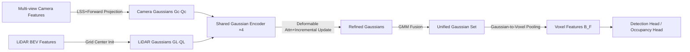

# GaussianFusion: Unified 3D Gaussian Representation for Multi-Modal Fusion Perception

**Conference**: ICLR 2026  
**OpenReview**: [https://openreview.net/forum?id=7jXxQ9bGoU](https://openreview.net/forum?id=7jXxQ9bGoU)  
**Code**: To be confirmed  
**Area**: Autonomous Driving / Multi-Modal Fusion Perception  
**Keywords**: 3D Gaussian Splatting, Multi-modal Fusion, BEV, 3D Object Detection, Semantic Occupancy Prediction, nuScenes  

## TL;DR
Ours replaces discrete BEV grids with continuous 3D Gaussian representations as a unified space for camera-LiDAR multi-modal fusion. By completing cross-modal alignment and interaction before quantization, it achieves new state-of-the-art accuracy in both 3D detection and occupancy prediction while significantly reducing memory overhead and latency.

## Background & Motivation
**Background**: Multi-sensor perception in autonomous driving typically projects features from different sensors into a shared Bird's-Eye View (BEV) space for fusion. Frameworks like BEVFusion, UniTR, and MetaBEV utilize CNN concatenation or cross-attention on BEV grids to create a unified representation of camera and LiDAR data, as BEV naturally supports downstream tasks like detection, segmentation, and occupancy.

**Limitations of Prior Work**: The essence of BEV is the discretization and quantization of data into fixed-resolution grids. This step compresses spatial information prematurely, leading to irreversible loss of edges and fine texture details. Lower resolutions exacerbate this loss, while increasing resolution causes unsustainable memory costs (Table 1: BEVFusion memory usage jumps from 3.2 GB to 20.5 GB when resolution scales from 100×100 to 400×400). Furthermore, BEV fusion often relies on simple feature concatenation or weighted sums, resulting in weak cross-modal interaction and suboptimal fusion.

**Key Challenge**: Achieving fine-grained representation in BEV requires high grid resolution, but the computational cost scales quadratically with resolution. Accuracy and efficiency are inherently conflicting in the discrete grid paradigm, and information loss from quantization occurs before fusion, fundamentally limiting cross-modal alignment.

**Goal**: To move beyond the BEV paradigm and identify a unified representation that preserves continuous geometric and semantic details, allows for full cross-modal interaction before quantization, and remains task-agnostic (sharing the same representation for both detection and occupancy).

**Core Idea**: **[Continuous Gaussian Unified Space]** Inspired by 3D Gaussian Splatting, Ours represents the entire scene using a set of continuous 3D Gaussians. Camera and LiDAR data independently initialize sets of Gaussians, which are iteratively aligned in a shared Gaussian encoder. Finally, they are naturally fused through a Gaussian Mixture Model (GMM) and voxelized for task heads—effectively delaying the "quantization" step until after fusion, allowing cross-modal interaction to occur in a high-dimensional continuous space.

## Method

### Overall Architecture
GaussianFusion consists of three stages: First, separate Gaussian sets $G_c{\leftrightarrow}Q_c$ and $G_L{\leftrightarrow}Q_L$ (Gaussian attributes and query features) are initialized for camera and LiDAR in a unified 3D space. Second, these two sets are combined along the batch dimension and fed into a **shared** Gaussian encoder. This encoder uses four stacked layers with Gaussian-prior-based deformable attention and incremental attribute updates, allowing both modalities to converge layer-by-layer toward a consistent Gaussian distribution. Finally, a GMM fuses the camera and LiDAR Gaussians into a unified set, which is converted into voxel features $B_F$ via Gaussian-to-Voxel pooling before being passed to detection or occupancy heads similar to those in BEVFusion.

### Key Designs

**1. Camera Gaussian Initialization via Forward Projection: Providing an informed geometric prior.** Each 3D Gaussian is described by a mean $\mu\in\mathbb{R}^3$, scale $s\in\mathbb{R}^3$, and rotation $r\in\mathbb{R}^4$. Its response to a point $p$ in ellipsoidal space is $g_c(p;\mu,s,r)=\exp\!\big(-\tfrac{1}{2}(p-\mu)^T\Sigma^{-1}(p-\mu)\big)\,q_c$, with covariance $\Sigma=RSS^TR^T$. Unlike GaussianFormer, which randomly scatters Gaussians, Ours feeds camera features into LSS to predict a depth distribution $D_i$. The 3D positions of depth points are used directly as Gaussian means $\mu$, while scale and rotation are randomly initialized. The inner product of the depth distribution and context network semantic features yields the query $Q_c$ for each depth point. This anchors Gaussians at plausible 3D locations from the start, avoiding optimization difficulties found in random initialization. The LiDAR side is more direct: each voxel center of the BEV grid naturally provides a mean $\mu$, and an MLP processes BEV features to obtain LiDAR queries $Q_L$.

**2. Deformable Attention with Gaussian Priors: Aligning sampling points with object shapes.** Standard deformable attention (Zhu et al. 2020) learns offsets from a regular "box/kernel" region, lacking object-specific geometric priors. Ours leverages Gaussian shape attributes: projecting 3D Gaussians onto the BEV feature map yields a prior sampling distribution encoding orientation, scale, and covariance structure. Sampling points are no longer uniformly arranged on a grid but follow a Gaussian distribution aligned with object geometry (aspect ratio, orientation, spatial uncertainty). Specifically, an offset $\Delta\mu=(\Delta x,\Delta y,\Delta z)$ is calculated from the covariance, and the reference point $\mu+\Delta\mu$ is projected to BEV for attention: $\mathrm{DeformAtt}(q_i,B_i)=\sum_{k=1}^{K}A_k\cdot W_kB_i(\mu+\Delta\mu)$. This ensures cross-modal features better align within the "potential extent of the object." Ablations show this Gaussian prior improves NDS by $+0.4$ compared to box initialization.

**3. Shared Gaussian Encoder + Incremental Attribute Update: Reducing modal variance in unified space.** Crucially, camera and LiDAR use the **same** encoder parameters (merged into the batch dimension). Since both modalities should eventually converge to similar Gaussian distributions, parameter sharing allows the model to learn cross-modal complementary uncertainties while remaining compact—shared parameters outperform separate ones by $+0.7$ mAP. Regarding updates, instead of re-predicting entire Gaussian sets per layer (as in GaussianFormer), an MLP predicts attribute **increments**: $\hat{G}_i=\mathrm{MLP}(\hat{Q})+G_i=(\Delta\mu+\mu,\Delta s+s,\Delta r+r)$. Incremental updates allow the model to gradually bridge the gap between modalities when perceiving the same object, enhancing robustness against fusion uncertainties like depth prediction errors and signal decay (predicting offsets instead of absolute attributes yields $+0.9$ mAP). Additionally, the query encodes Gaussian attributes via an MLP into a positional embedding (PE): $\hat{Q}_i=\mathrm{MLP}(G)+Q_i$ ($+0.5$ mAP).

**4. GMM Fusion and Gaussian-to-Voxel Pooling: Grounding continuous representations into task-agnostic features.** Since Gaussian points are irregularly distributed, voxelization is required for standard task heads. The unified Gaussian set is partitioned into an $H\times W$ voxel grid. For non-empty voxels containing $M$ Gaussians, MeanVFE is used to downsample, retaining one Gaussian per voxel: $\hat{g}=\tfrac{1}{M}[\sum\mu_m,\sum s_m,\sum r_m]$, $\hat{q}=\tfrac{1}{M}\sum\hat{q}_m$. Features for any point $p$ covered by $J$ Gaussians are accumulated via the mixture model: $f(p)=\sum_{i=1}^{J}\hat{g}_i(p;\mu,s,r)\hat{q}_i$. A lightweight CNN then refines this into $B_F$. GMM naturally aggregates multiple Gaussians into finer-grained distributions, elegantly unifying multi-modal representations. The final $B_F$ can be fed directly into a BEVFusion-style detection head or a BEVDet-style occupancy head.

## Key Experimental Results

### Main Results
nuScenes 3D Object Detection (C+L, 704×256, Swin-T + VoxelNet):

| Method | val NDS | val mAP | test NDS | test mAP |
|------|---------|---------|----------|----------|
| BEVFusion(M) | 71.4 | 68.5 | 72.9 | 70.2 |
| MetaBEV | 71.5 | 68.0 | - | - |
| EA-LSS | 73.1 | 71.2 | 74.4 | 72.2 |
| UniTR | 73.3 | 70.5 | 74.5 | 70.9 |
| **GaussianFusion** | **74.0** | **71.7** | **74.9** | **72.4** |

Compared to BEVFusion, Ours gains $+2.6$ NDS / $+3.2$ mAP on val, with lower latency (132 ms vs 156 ms) and memory (4271 MB vs 5140 MB). The temporal version, GaussianFusion-T, reaches 77.6 NDS / 75.0 mAP, surpassing SparseLIF-T. On Waymo, Ours achieves 80.75 mAPH-L2 vs BEVFusion's 76.33.

nuScenes Semantic Occupancy Prediction (val):

| Method | Modality | IoU | mIoU |
|------|------|-----|------|
| GaussianFormer | C | 29.83 | 19.10 |
| GaussianFusion-C | C | 32.48 | 20.65 |
| OccFusion | C+L | 43.53 | 27.55 |
| **GaussianFusion** | C+L | **44.75** | **28.65** |

### Ablation Study
Gaussian Initialization Strategies (Table 8) and Encoder Components (Table 9):

| Initialization Strategy | NDS | mAP |
|------------|-----|-----|
| Random Init | 71.2 | 68.3 |
| Back-projection | 72.4 | 70.0 |
| LiDAR projection | 73.6 | 71.1 |
| **Forward Projection** | **74.0** | **71.7** |

| Encoder Configuration | NDS | mAP |
|------------|-----|-----|
| Full (Share+DA.G+PE+Offset) | 74.0 | 71.7 |
| Separate instead of Share | 73.6 | 71.1 |
| w/o DA.G (use vanilla) | 73.6 | 71.2 |
| w/o PE | 73.4 | 71.0 |
| w/o Offset (direct prediction) | 73.2 | 70.8 |

### Key Findings
- Forward projection initialization significantly improves performance by $+2.8$ NDS compared to random initialization, highlighting that providing a depth-informed spatial prior is critical for convergence.
- Comparison with GaussianFormer (Table 7): GaussianFusion-C uses only 43K Gaussians (30%) and takes 105 ms (vs 475 ms, ~4.5× speedup) to improve mIoU from 19.10 to 20.65. This demonstrates that forward initialization + incremental updates are far more efficient than "random scatter + re-prediction."
- Shared encoder, Gaussian prior attention, PE, and incremental updates all contribute positively, with incremental updates ($+0.9$ mAP) and parameter sharing ($+0.7$ mAP) providing the largest gains.

## Highlights & Insights
- **Delaying quantization** is the core insight: The fundamental issue with BEV is not the grid itself, but that quantization happens before fusion. GaussianFusion allows cross-modal interaction in a continuous space, placing quantization (voxelization) after fusion. Consequently, low-resolution BEV maintains high detail (Table 1 shows 100×100 GaussianFusion at 73.1 NDS outperforms 400×400 BEVFusion at 72.7).
- **Covariance Matrix = Adaptive Uncertainty Modeling**: Gaussian covariance naturally captures object shape and boundary uncertainty. This provides a geometric shape prior for deformable attention and allows the two modalities to align "uncertainties" during fusion—capabilities absent in discrete grids.
- **Task-Agnostic + First GMM for Multi-modal Gaussian Fusion**: Detection and occupancy share the same representation. Treating camera/LiDAR Gaussians as components of a mixture model is a far more elegant aggregation method than concatenation or addition.

## Limitations & Future Work
- Ours still requires **voxelization** of continuous Gaussians to use common task heads. MeanVFE averages multiple Gaussians within a voxel, reintroducing quantization loss. This partially offsets the benefits of continuous representation, suggesting room for designing lossless readout heads.
- Experiments focus primarily on nuScenes (with some Waymo detection); occupancy prediction is only validated on single frames in nuScenes. The robustness of hyperparameters (e.g., number of Gaussians, encoder layers) across different sensor configurations is not fully explored.
- The temporal version, GaussianFusion-T, simply warps historical Gaussians into the same fusion formula. This "simple temporal" design is modest compared to specialized methods like SparseLIF-T, leaving room for more advanced temporal modeling.

## Related Work & Insights
- **Multi-modal 3D Perception**: Divided into object-centric (PointPainting, query-based detection) and dense BEV (BEVFusion, UniTR, MetaBEV) branches. The former struggles with dense tasks like occupancy, while the latter is limited by discrete grid information loss. GaussianFusion falls into the dense category but adopts a continuous carrier.
- **3D Gaussian Splatting**: Moving from 3D reconstruction to perception; while GaussianFormer and others use 3DGS for vision-only occupancy, they rely on random initialization and re-prediction without leveraging GMM for multi-modal fusion. Ours completes the framework with "Forward Projection Init + Incremental Update + GMM Multi-modal Fusion."
- **Inspiration**: The concept of continuous representation + delayed quantization can be extended to other multi-sensor systems. Using geometric attributes from generative representations (Gaussians/NeRF) to inform sampling priors in discriminative attention is a reusable design pattern.

## Rating
- **Novelty**: ⭐⭐⭐⭐ First framework to use unified 3D Gaussian representations for camera-LiDAR fusion. The combination of "delayed quantization + GMM fusion + forward projection initialization" is well-motivated, though individual components (3DGS, deformable attention, LSS) are established.
- **Experimental Thoroughness**: ⭐⭐⭐⭐ Covers two tasks (detection and occupancy) across two datasets (nuScenes and Waymo), including latency/memory comparisons and detailed ablations. The efficiency comparison with GaussianFormer is particularly compelling, though more sensor configuration variety would be beneficial.
- **Writing Quality**: ⭐⭐⭐⭐ Clear logic across motivation, method, and experiments. Table 1 effectively identifies the BEV resolution-memory trade-off as a pain point. Some notations (e.g., query dimensions) are slightly loose.
- **Value**: ⭐⭐⭐⭐ Simultaneously improves accuracy, latency, and memory while remaining task-agnostic. It holds direct engineering value for autonomous driving fusion and provides an inspiring paradigm for delayed quantization in continuous representations.

<!-- RELATED:START -->

## Related Papers

- [\[ECCV 2024\] UniM2AE: Multi-modal Masked Autoencoders with Unified 3D Representation for 3D Perception in Autonomous Driving](../../ECCV2024/autonomous_driving/unim2ae_multi-modal_masked_autoencoders_with_unified_3d_representation_for_3d_pe.md)
- [\[CVPR 2026\] GaussianDWM: 3D Gaussian Driving World Model for Unified Scene Understanding and Multi-Modal Generation](../../CVPR2026/autonomous_driving/gaussiandwm_3d_gaussian_driving_world_model_for_unified_scene_understanding_and_.md)
- [\[ICLR 2026\] UniSplat: Unified Spatio-Temporal Fusion via 3D Latent Scaffolds for Dynamic Driving Scene Reconstruction](unisplat_unified_spatio-temporal_fusion_via_3d_latent_scaffolds_for_dynamic_driv.md)
- [\[CVPR 2026\] RPGFusion: 4D Radar Prior-Guided Multi-Modal Fusion for 3D Detection](../../CVPR2026/autonomous_driving/rpgfusion_4d_radar_prior-guided_multi-modal_fusion_for_3d_detection.md)
- [\[ICLR 2026\] SiMO: Single-Modality-Operable Multimodal Collaborative Perception](simo_single-modality-operable_multimodal_collaborative_perceptio.md)

<!-- RELATED:END -->
