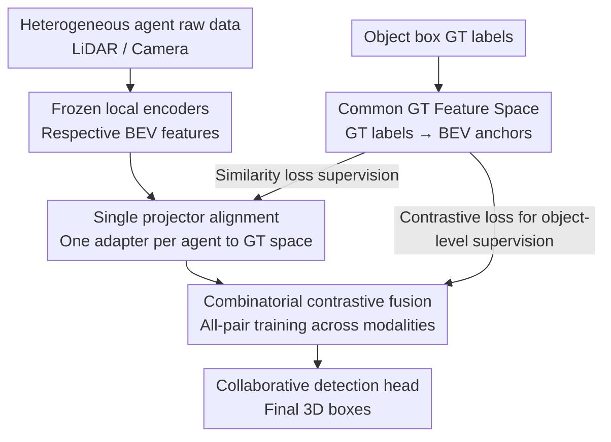

# GT-Space: Enhancing Heterogeneous Collaborative Perception with Ground Truth Feature Space

**Conference**: ICLR 2026  
**OpenReview**: [https://openreview.net/forum?id=fwTRpXMsxB](https://openreview.net/forum?id=fwTRpXMsxB)  
**Code**: https://github.com/KingScar/GT-Space (Available)  
**Area**: Autonomous Driving / V2X Collaborative Perception  
**Keywords**: Collaborative Perception, Heterogeneous Feature Alignment, Common Feature Space, Contrastive Learning, BEV Detection

## TL;DR
GT-Space utilizes ground truth annotations (object boxes) to construct a unified BEV "common feature space" as an alignment anchor. This allows each heterogeneous agent to map its features into this space for fusion via a lightweight projector. Combined with cross-modal combinatorial contrastive loss, the 3D detection accuracy for heterogeneous collaboration on OPV2V / V2XSet / RCooper significantly outperforms existing methods that require encoder retraining or pairwise adaptation.

## Background & Motivation
**Background**: Multi-agent collaborative perception (e.g., V2V, V2X) expands a single vehicle's field of view by sharing perceptual information. For communication efficiency, the mainstream approach is **intermediate fusion**, where agents exchange compressed BEV features rather than raw point clouds or images. When all agents use the same encoder and have aligned feature semantics and granularity, it is termed **homogeneous collaboration**. However, in reality, sensors (LiDAR vs. Camera) and model architectures often differ between vehicles and roadside units, resulting in **heterogeneous collaboration**, where features cannot be directly fused.

**Limitations of Prior Work**: Existing heterogeneous fusion schemes require feature adaptation before fusion, but the two primary paths are non-scalable: (1) **Retraining Encoders** (e.g., HEAL) — To align with the ego agent's feature space, collaborators must retrain their encoders. In open environments, maintaining multiple encoders for every potential partner is extremely costly, and retraining may degrade the original encoder's performance. (2) **Feature Interpreters** (e.g., PnPDA) — The ego agent must deploy a dedicated interpreter for every heterogeneous partner for pairwise projection, which leads to a complexity explosion as the number of partners grows. Furthermore, PnPDA only handles point clouds, ignoring sensor modality heterogeneity.

**Key Challenge**: Alignment in these categories is **ego-anchored and pairwise**, leading to two problems: first, deployment costs scale quadratically ($O(N^2)$) with agent types; second, the collaboration upper bound is bottlenecked by the ego model's capability. If the ego model is weak, even high-quality features from partners yield limited gains.

**Goal**: To establish a reference system that is **agent-independent and capable of multi-party alignment at once**, ensuring that (a) adding a new agent only requires training its own lightweight adapter, and (b) fusion quality is no longer dragged down by a weak agent.

**Key Insight**: The authors observe that since the "ground truth" (object position, size, orientation, category) for a detection task is the same for all agents, one could directly **encode the ground truth annotations themselves into a BEV feature space** to serve as an anchor. Ground truth provides precise object-level spatial and semantic information, naturally forming a clean, shared, and accurate anchor.

**Core Idea**: Replace "ego-anchored pairwise alignment" with a **Common Feature Space constructed from Ground Truth labels**. Each agent learns only one projector to map its features into this common space, and a modality-independent fusion network is trained using cross-modal combinatorial contrastive loss.

## Method

### Overall Architecture
The input to GT-Space consists of BEV feature maps encoded by multiple heterogeneous agents (from different sensors/models), and the output is the 3D detection boxes obtained from a collaborative detection head. The key is the insertion of a **Common Feature Space (GT Space)** generated from ground truth labels as a unified coordinate system. Training proceeds in three steps: first, pretrain and freeze single-agent perception networks (encoder + head); second, train a "GT Encoder" to map object box labels to GT BEV features, defining the common space; finally, when training the fusion network, features from each agent are mapped to the common space via their respective projectors, aligned using contrastive and similarity losses, and jointly optimized across various modality combinations. During inference, each heterogeneous agent uses its own projector to align features to the common space before passing them through a fusion transformer and detection head. When a new modality agent joins, one simply freezes all existing parameters and **only trains its modality-specific projector**.

### Key Designs

**1. Common GT Feature Space: Encoding Standard Answers as Unified Alignment Anchors**

To address the lack of scalability in pairwise alignment and the ego-bottleneck problem, GT-Space stops aligning heterogeneous features to each other and instead constructs a reference system shared by all agents. Specifically, each 3D box is represented as a vector $B_i=(x,y,z,l,w,h,r,c)$ (center, size, rotation, category). This is first encoded into an object representation $\beta_i=\mathrm{LayerNorm}(\mathrm{FC}(B_i))$ using two fully connected layers with LayerNorm. Objects are then projected onto a BEV grid, where the feature of each cell $c$ is $U_c=\mathrm{MLP}(\beta_i,\mathrm{PE}(x_c,y_c))$, with PE being sine-cosine positional encoding. If multiple objects cover the same cell, their features are **summed** to preserve overlapping information, forming the full GT BEV map $F_{GT}$. To ensure this map carries decodable information, it is passed through a detection head, supervised by an IoU loss:

$$L_{GT}=\frac{1}{K}\sum_{k=1}^{K}\big(1-\mathrm{IoU}_k\big),\quad \mathrm{IoU}_k=|P_k\cap G_k|/|P_k\cup G_k|.$$

The resulting $F_{GT}$ contains only clean, object-related features. Compared to supervision based solely on final detection outputs, it provides **feature-level intermediate supervision**, more directly bridging the domain gap between heterogeneous agents. Unlike a purely learned latent space, this space has clear physical meaning and is consistent for all agents.

**2. Single Projector Heterogeneous Feature Alignment: One Adapter per Agent**

To solve the non-scalability of maintaining specific interpreters for every pair or retraining encoders, GT-Space assigns **one** projector $\Phi_a$ to each agent. This maps the local BEV feature $F_a$ into the common space, aligned via a feature similarity loss to $F_{GT}$:

$$\Phi_a=\arg\min_\eta L_\eta(F_{GT},F_a),\quad L_\eta=\|F_{GT}-\eta(F_a)\|^2.$$

Since the alignment target is a fixed common space rather than a specific partner, the number of adapters scales linearly $O(N)$ with agent types instead of quadratically $O(N^2)$. Ablation studies show that removing the projector leads to the most significant performance drop (OPV2V mAP@70 falls from 0.814 to 0.683), confirming that fusing heterogeneous features without aligning them to a unified semantic space is ineffective.

**3. Combinatorial Contrastive Fusion: Modality-Agnostic Fusion via All-Pair Training**

To enable a single fusion network to handle arbitrary modality combinations and focus on object-related features, the authors use a transformer (multi-head self-attention + FC + LN) for fusion, supervised by contrastive learning. For the fused feature $F_{m,m'}$, object-level representations are obtained by pooling cells within object boxes. Temperature-scaled cosine similarity $s_{B,c,P}=(F^{B,c}_{m,m'})^\top \bar U_P/\tau$ is calculated between fused and GT features. A cross-entropy loss pulls the fused features of the **same object** closer to the GT features while pushing **different objects** apart:

$$L_{m,m'}=-\sum_{B\in\mathcal{B}}\sum_{c\in \mathrm{cells}(B)}\log\frac{\exp(s_{B,c,B})}{\sum_{l\in\mathcal{B}}\exp(s_{B,c,l})}.$$

The "combinatorial" aspect is key: instead of calculating this for only one modality pair, it is summed over **all possible modality pairs** $L_E= \sum_{m,m'}L_{m,m'}$ (e.g., pairing LiDAR-PointPillar, LiDAR-SECOND, and Camera-EfficientNet in all combinations). This joint optimization ensures the fusion network can handle any combination during inference, not just those seen during training.

### Loss & Training
During training, the local encoders and detection heads of each agent are **pretrained and frozen** (ensuring no impact on single-vehicle perception and enabling plug-and-play). To avoid noise from spatial misalignment, fusion training uses **homologous observation data from a single agent** (which is naturally aligned). The total loss consists of three parts: feature alignment loss $L_{\Phi_a}$ (Eq. 6), heterogeneous combinatorial contrastive loss $L_E$ (Eq. 9), and the basic BEV detection loss $L_B$:

$$L=\sum_a L_{\Phi_a}+L_E+L_B.$$

The GT BEV features are only involved **during training** through $L_\Phi$ and $L_E$. No additional networks or parameters are introduced during inference—the key to its zero extra deployment cost and scalability.

## Key Experimental Results

### Main Results
Datasets: OPV2V, V2XSet (simulation), and RCooper (real-world roadside). Metrics: AP@0.5 / AP@0.7. Four agent types: A1=SECOND(LiDAR), A2=PointPillar(LiDAR), A3=EfficientNet(Camera), A4=ResNet50(Camera).

For fusion of different heterogeneous pairs (ego fixed as A1, collaborating with A2/A3/A4), AP@70 on OPV2V:

| Ego A1 Collaborator | Metric | Ours | Prev. Best | Gain |
|---------------------|--------|------|------------|------|
| A2 (LiDAR-LiDAR)    | AP@70  | 0.810| 0.806 (STAMP)| +0.004|
| A3 (LiDAR-Camera)   | AP@70  | 0.766| 0.734 (STAMP)| +0.032|
| A4 (LiDAR-Camera)   | AP@70  | 0.762| 0.738 (STAMP)| +0.024|

Results show that **higher modality heterogeneity (LiDAR x Camera) leads to larger gains**, indicating GT-Space's advantage in bridging cross-domain representation gaps.

Simultaneous four-agent collaboration (OPV2V, AP@70, by agent perspective):

| Method   | A1    | A2    | A3    | A4    |
|----------|-------|-------|-------|-------|
| No Collab| 0.614 | 0.620 | 0.354 | 0.337 |
| HEAL     | 0.806 | 0.801 | 0.726 | 0.733 |
| STAMP    | 0.815 | 0.801 | 0.718 | 0.716 |
| GT-Space | 0.814 | 0.803 | **0.758** | **0.750** |

Gains are most prominent for **weak camera agents (A3/A4)**. While interpreter methods like STAMP provide limited enhancement for cameras, GT-Space significantly boosts weak agents by relying on the reliable common space reference.

### Ablation Study
Impact of components from Agent 1's perspective:

| Configuration       | OPV2V mAP@50 | OPV2V mAP@70 | Description |
|---------------------|--------------|--------------|-------------|
| Full version        | 0.892        | 0.814        | Complete model |
| w/o-GT feature      | 0.868        | 0.795        | Using PointPillar space instead of GT space |
| w/o-projector       | 0.791        | 0.683        | No alignment before fusion (largest drop) |
| w/o-contrastive loss| 0.845        | 0.721        | Detection loss only; no combinatorial contrast |

### Key Findings
- **Projector contributes the most**: Without it, mAP@70 drops from 0.814 to 0.683, proving that heterogeneous features cannot be fused effectively without first aligning to a unified semantic space.
- **GT feature space has less impact on LiDAR ego**: mAP@70 only drops from 0.814 to 0.795, as LiDAR features already capture high geometric detail. However, for weak agents like cameras, the GT space is far more critical.
- **Combinatorial contrastive loss serves two roles**: It performs cross-modal alignment and strengthens object-related representations simultaneously.
- **Robustness**: The model maintains a lead under pose errors (Gaussian noise) and communication latency (up to 500ms). Visualization shows enhanced object features and suppressed noise after fusion.

## Highlights & Insights
- **Clever use of "Standard Answers as Anchors"**: Ground truth is identical for all agents. Encoding it as a BEV space eliminates the "who to anchor to" debate and reduces complexity from $O(N^2)$ to $O(N)$. This idea is transferable to any scenario requiring multi-source alignment with shared ground truth.
- **Inference with zero extra cost**: "God's eye view supervision" is effectively distilled into the projector and fusion network. No GT or extra parameters are needed at runtime.
- **Modality-agnostic fusion via combinatorial training**: Jointly training across all modality pairs allows the network to generalize to any combination, avoiding the rigidity of end-to-end models that only handle seen combinations.

## Limitations & Future Work
- **Strong dependency on GT annotations**: The construction of the common space relies entirely on precise object box labels. Future work should explore weak supervision for real-world applicability.
- **Idealized communication/pose assumptions**: While robustness to noise was tested, the training avoids spatial misalignment by using single-agent data. The impact of real-world multi-agent spatial misalignment deserves deeper discussion.
- **Camera projector lacks feature enhancement**: Visualizations suggest projectors do not inherently "add" information; camera features remain less rich than LiDAR after projection.

## Related Work & Insights
- **vs. HEAL (Encoder Retraining)**: HEAL fixes fusion and retrains encoders; GT-Space freezes encoders and only trains a projector, preserving original perception capabilities.
- **vs. PnPDA (Feature Interpreters)**: PnPDA uses pairwise adapters for point clouds; GT-Space uses a common GT space for multi-modal alignment (including cameras).
- **vs. HM-ViT / End-to-End**: Those require retraining the whole model for specific modality sets; GT-Space is plug-and-play via the common space.

## Rating
- Novelty: ⭐⭐⭐⭐⭐ The use of GT labels as a common alignment anchor is a clean, scalable approach to the $O(N^2)$ problem.
- Experimental Thoroughness: ⭐⭐⭐⭐ Extensive testing across 3 datasets and various settings, though real-world verification (RCooper) is secondary.
- Writing Quality: ⭐⭐⭐⭐ Clear framework and comprehensive formulas.
- Value: ⭐⭐⭐⭐ Practical and lightweight for heterogeneous V2X, limited mainly by GT label dependency.

<!-- RELATED:START -->

## Related Papers

- [\[ICLR 2026\] SiMO: Single-Modality-Operable Multimodal Collaborative Perception](simo_single-modality-operable_multimodal_collaborative_perceptio.md)
- [\[ICLR 2026\] Rate-Distortion Optimized Pragmatic Communication for Collaborative Perception](rate-distortion_optimized_pragmatic_communication_for_collaborative_perception.md)
- [\[CVPR 2026\] IntrinsicWeather: Controllable Weather Editing in Intrinsic Space](../../CVPR2026/autonomous_driving/intrinsicweather_controllable_weather_editing_in_intrinsic_space.md)
- [\[ICLR 2026\] DriveMamba: Task-Centric Scalable State Space Model for Efficient End-to-End Autonomous Driving](drivemamba_task-centric_scalable_state_space_model_for_efficient_end-to-end_auto.md)
- [\[CVPR 2026\] CoLC: Communication-Efficient Collaborative Perception with LiDAR Completion](../../CVPR2026/autonomous_driving/colc_communication-efficient_collaborative_perception_with_lidar_completion.md)

<!-- RELATED:END -->
