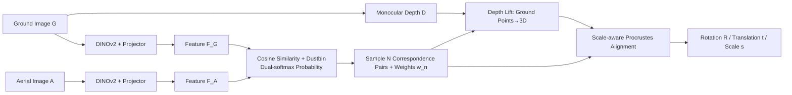

# Loc²: Interpretable Cross-View Localization via Depth-Lifted Local Feature Matching

**Conference**: ICLR 2026  
**OpenReview**: [https://openreview.net/forum?id=2ciXKn2UlS](https://openreview.net/forum?id=2ciXKn2UlS)  
**Code**: [https://github.com/vita-epfl/Loc2](https://github.com/vita-epfl/Loc2)  
**Area**: Autonomous Driving / Cross-View Visual Localization  
**Keywords**: Cross-view Localization, Local Feature Matching, Monocular Depth, Procrustes Alignment, Weak Supervision, Interpretability  

## TL;DR
Loc² directly learns local feature correspondences on the **pixel planes of ground and aerial images**, lifts matched points to BEV using monocular depth, and analytically solves for 3-DoF pose and depth scale via **scale-aware Procrustes alignment**. Supervised only by weak camera poses without pixel-level labels, it achieves SOTA results in challenging scenarios such as cross-area and unknown orientation, while matched points themselves serve as visual explanations for localization quality.

## Background & Motivation
**Background**: Fine-grained cross-view localization uses a ground image paired with an aerial image (identified via coarse GNSS) to estimate the camera's 3-DoF pose (2D position + yaw). This serves as a powerful supplement when GNSS errors reach tens of meters in dense urban areas. Mainstream approaches fall into two categories: those comparing **global descriptors** (e.g., CCVPE) and those warping ground images to BEV to align with aerial images (e.g., HC-Net, DenseFlow).

**Limitations of Prior Work**: These methods rarely provide explicit correspondences showing "which object in the ground view corresponds to which in the aerial view," leading to poor interpretability—making it difficult to diagnose failures. Recent work FG2 achieved ground-aerial local feature correspondence for the first time, but it performs **matching in BEV space**. Warping ground images to BEV introduces ray-direction distortion and loses height information, damaging matching quality, especially when localization significantly degrades under **unknown orientations**.

**Key Challenge**: The desire for both interpretability (explicit correspondence) and robustness (cross-area, unknown orientation) conflicts with the lack of ground-aerial pixel-level ground truth required to fine-tune general matchers. BEV matching inherently sacrifices information, while global descriptors are inherently uninterpretable.

**Goal**: Establish ground-aerial correspondences directly on the **original pixel planes** rather than BEV to maintain interpretability and avoid warp distortion, while training end-to-end with only camera pose as weak supervision.

**Core Idea**:
- **Direct Pixel-Plane Matching**: Two branches with shared structures extract feature maps for ground and aerial images respectively. Correspondences are obtained via cosine similarity + dustbin + dual-softmax, avoiding BEV warping.
- **Depth Lifting + Scale-aware Procrustes**: Matched ground points are lifted to 3D using monocular depth (metric or relative). Then, a differentiable scale-aware Procrustes alignment analytically solves for rotation, translation, **and depth scale** in one step, making "pose solving" an analytical, differentiable, and back-propagatable component.

## Method

### Overall Architecture
Loc² is an end-to-end differentiable "Match → Lift → Align" three-stage pipeline, trained using only 3-DoF pose supervision. It first finds local feature correspondences between ground image $G$ and aerial image $A$ (Sec 3.1), then lifts matched ground points to BEV using off-the-shelf monocular depth $D=\mathcal{D}(G)$, and finally solves for the 3-DoF pose via scale-aware Procrustes alignment (Sec 3.2). Since the pose is **analytically** calculated from correspondences, correspondence quality is directly equivalent to localization quality.

### Key Designs

**1. Pixel-Plane Local Feature Matching: Noise rejection with dustbin and mutual check with dual-softmax.** The two branches share an architecture, each consisting of a frozen DINOv2 feature extractor followed by a lightweight projection head (a few convolutional layers + one self-attention layer) to map $A$ and $G$ into feature maps $F_A$ and $F_G$. Matching scores are calculated using temperature-scaled cosine similarity $M=\mathrm{cosine}(F_A,F_G)/\tau$. Following SuperGlue, a learnable **dustbin** is added to each row and column of $M$, allowing the model to "discard" uncertain or unmatched points. A dual-softmax is applied to the extended matrix $M'$ to obtain matching probabilities:
$$\hat{M}'_{ij}=\frac{e^{M'_{ij}}}{\sum_k e^{M'_{ik}}}\cdot\frac{e^{M'_{ij}}}{\sum_l e^{M'_{lj}}}.$$
Finally, dustbin rows/columns are discarded, and $N=1024$ correspondence pairs are sampled. Their matching probabilities $w_n$ serve as weights for subsequent alignment—meaning good matches contribute more. This step bypasses BEV warping, preserving height information and original pixel geometry.

**2. Depth Lifting + Coordinate Assignment: Handling both metric and relative depth.** Monocular depth is inherently ill-posed: metric depth models (e.g., Unik3D) provide absolute scale, while relative depth models (e.g., Depth Anything) provide scale accurate only up to an **unknown per-image factor**. Loc² supports both. Let $(x^A_n,y^A_n)$ be the metric plane coordinates of the $n$-th aerial feature (origin at aerial center). Ground features are lifted to 3D positions $(x^G_n,y^G_n,z^G_n)/s$ based on depth and ray direction (origin at ground camera), where $s$ is the unknown scale from ground coordinates to aerial metric space; $s=1$ for metric depth. Notably, it **keeps all matched points without filtering by height** (ablations show that taking only building tops is worse, as side-view semantics might align better with aerial views).

**3. Scale-aware Procrustes Alignment: Pose solving as a differentiable analytical solution.** Given correspondences $\{(x^A_n,y^A_n),(x^G_n,y^G_n,z^G_n)/s\}$ and weights $w_n$, 2D scale-aware Procrustes solves for scale $s$, rotation $R$, and translation $t$ satisfying $Q=s(R\cdot P)+t$. After calculating weighted centroids, the weighted covariance matrix $C=\sum_n w_n\tilde P_n\tilde Q_n^\top$ is computed. SVD is applied ($C=U\Sigma V^\top$) to get $R=VU^\top$ for the yaw angle. The scale and translation are:
$$s^*=\frac{\mathrm{Tr}(\Sigma)}{\sum_n w_n\|\tilde P_n\|^2},\quad t=\bar Q-s^*(R\cdot\bar P).$$
Key derivation: Since $P=P'/s$, substituting this proves $s^*=s$. **Regardless of whether ground point scale is known, the alignment provides consistent pose estimation and recovers the true scale $s$.** The entire process is differentiable, allowing local features to be learned using only pose supervision, and relative depth can be used during inference.

**4. Loss & Training: VCE pose loss + correspondence-level infoNCE.** The pose is supervised with Virtual Correspondence Error (VCE): $N_v$ virtual points are placed in 2D metric space, and the mean Euclidean distance between points transformed by ground truth vs. estimated pose is minimized:
$$\mathcal{L}_{\mathrm{VCE}}=\frac{1}{N_v}\sum\|(R_{gt}P_v+t_{gt})-(RP_v+t)\|_2.$$
When metric depth is available, bidirectional infoNCE ($\mathcal{L}_{G2S}+\mathcal{L}_{S2G}$) is added to directly supervise correspondences. Total loss: $\mathcal{L}=\mathcal{L}_{\mathrm{VCE}}+\lambda(\mathcal{L}_{G2S}+\mathcal{L}_{S2G})/2$. No pixel-level ground-aerial labels are required.

## Key Experimental Results

### Main Results
Cross-area testing on KITTI (front-view, limited FOV, DepthAnythingV2 metric depth), mean localization error (meters):

| Orientation Noise | Method | $\rightarrow$ Loc Mean (m) | $\rightarrow$ Loc Median (m) |
|---|---|---|---|
| $\pm 10^\circ$ | FG2 | 7.31 | 4.15 |
| $\pm 10^\circ$ | DenseFlow | 7.97 | 3.52 |
| $\pm 10^\circ$ | **Ours** | **5.60** | **3.01** |
| $\pm 180^\circ$ | CCVPE | 13.94 | 10.98 |
| $\pm 180^\circ$ | **Ours** | **11.71** | **9.11** |

In the same-area $\pm 180^\circ$ difficult setting, mean error is significantly reduced from CCVPE's 6.88 m to **1.85 m**.

VIGOR (panorama, Unik3D training) unknown orientation:

| Setting | Method | $\rightarrow$ Loc Mean (m) | $\rightarrow$ Ori Mean ($^\circ$) |
|---|---|---|---|
| Unknown cross-area | FG2 | 8.95 | 15.02 |
| Unknown cross-area | CCVPE | 3.74 | 12.83 |
| Unknown cross-area | **Ours** | **3.94** | **9.54** |
| Unknown same-area | **Ours** | 4.23 | **11.67** |

Under unknown orientation, it significantly outperforms FG2, and orientation error remains the lowest in both same- and cross-area settings.

### Ablation Study
VIGOR same-area validation set, unknown orientation:

| Design Choice | Mean loc (m) | Median loc (m) | Mean ori ($^\circ$) |
|---|---|---|---|
| (1) Highest points only | 3.95 | 1.78 | 9.37 |
| (2) Scall-less (Orthogonal Procrustes) | 5.47 | 2.75 | 19.92 |
| **Ours (All points + Scale-aware)** | **3.86** | **1.75** | 9.30 |

### Key Findings
- **High Scale Invariance**: Artificially scaling metric depth by factors from 0.001 to 1000 changes localization error by $<1$ cm. Replacing metric depth with relative depth models (BiFuse++/UniFuse) without retraining only increases error by $<0.2$ m, enabling "plug-and-play" deployment.
- **Inlier Ratio Correlation**: Pose error drops sharply as the inlier ratio increases from 10% to 50%, then plateaus. This allows the RANSAC inlier count to serve as a confidence score for anomaly detection.
- **Cross-dataset Generalization**: Models trained on VIGOR generalize to CVACT (rural scenes, large domain gap), providing reasonable correspondences and good layout alignments.
- **Interpretability Byproduct**: Superimposing rescaled ground layouts onto aerial images helped the authors find errors in the VIGOR ground truth (e.g., cars being labeled on crosswalks instead of before them).

## Highlights & Insights
- **"Where to match" is the core decision**: FG2 matching in BEV introduces distortion and loses height data. Loc² reverts to matching on the original pixel plane, preserving both information and interpretability, with clear advantages under unknown orientations.
- **Decoupling geometry from the network**: Pose is not regressed by the network but analytically calculated via Procrustes. Thus, correspondence quality equals localization quality, making it inherently interpretable, RANSAC-compatible, and visualizable.
- **Elegant Procrustes Derivation**: Proving $s^*=s$ means the differentiable alignment is immune to the unknown scale of ground points, enabling the flexibility to "train with metric depth, infer with any relative depth."
- **Matching reflects semantics over appearance**: In scenes with repetitive highway markings, the model switches to using signs or lamp posts as anchors. Even occluded "bus" text can be matched correctly, indicating the learning of semantic correspondences.

## Limitations & Future Work
- **Orientation Estimation**: Since orientation is derived analytically from correspondences, it cannot utilize priors like "ground images in KITTI mostly align with the road." Orientation accuracy lags behind specialized modeling in SliceMatch/CCVPE.
- **Dependency on Monocular Depth**: Although robust to scale, geometric errors in depth still propagate through lifting to alignment. Distant areas/sky are filtered using simple thresholds.
- **Limited Information in Front-view**: KITTI's narrow FOV offers limited matchable info; gains are more significant in VIGOR panoramas, suggesting suitability for wide FOV applications.
- **Gravity Assumption**: Relies on reliable IMU/calibration to ensure the camera optical axis is orthogonal to gravity.

## Related Work & Insights
- **Comparison Targets**: Global descriptor methods (CCVPE, SliceMatch), geometric warpers (GGCVT, HC-Net, DenseFlow), and the most related FG2 (first ground-aerial local correspondence, but limited by BEV matching).
- **Technical Lineage**: Matching draws from SuperPoint/SuperGlue (dustbin + dual-softmax); pose solving follows the interpretable "correspondence + geometric solver" pipeline, replacing PnP solvers with a differentiable scale-aware Procrustes (Umeyama 1991).
- **Insight**: When facing the "interpretability vs. robustness" trade-off, analytically decoupling geometric solving from the black-box network often yields both interpretability and robustness to unknown scale/orientation. The choice of "representation space for matching" is a design variable that warrants constant re-evaluation.

## Rating
- **Novelty**: ⭐⭐⭐⭐ — The combination of pixel-plane matching and scale-aware Procrustes is a clean, convincing solution for cross-view localization. The $s^*=s$ derivation makes "train metric, test relative" viable.
- **Experimental Thoroughness**: ⭐⭐⭐⭐ — Covers KITTI/VIGOR datasets, same/cross-area, known/unknown orientation, various depth models, cross-dataset generalization to CVACT, and inlier-error correlation.
- **Writing Quality**: ⭐⭐⭐⭐ — Logical flow from motivation to method and explanation; Procrustes derivation is clear, and visual explanations are compelling.
- **Value**: ⭐⭐⭐⭐ — Interpretability + plug-and-play depth + weak supervision make it practical for autonomous driving/robotics deployment. Code is open-sourced.

<!-- RELATED:START -->

## Related Papers

- [\[CVPR 2026\] ELiC: Efficient LiDAR Geometry Compression via Cross-Bit-depth Feature Propagation and Bag-of-Encoders](../../CVPR2026/autonomous_driving/elic_efficient_lidar_geometry_compression_via_cross-bit-depth_feature_propagatio.md)
- [\[ICLR 2026\] Map as a Prompt: Learning Multi-Modal Spatial-Signal Foundation Models for Cross-scenario Wireless Localization](map_as_a_prompt_learning_multi-modal_spatial-signal_foundation_models_for_cross-.md)
- [\[ICCV 2025\] Where am I? Cross-View Geo-localization with Natural Language Descriptions](../../ICCV2025/autonomous_driving/where_am_i_cross-view_geo-localization_with_natural_language_descriptions.md)
- [\[ICLR 2026\] GT-Space: Enhancing Heterogeneous Collaborative Perception with Ground Truth Feature Space](gt-space_enhancing_heterogeneous_collaborative_perception_with_ground_truth_feat.md)
- [\[CVPR 2026\] VIRD: View-Invariant Representation through Dual-Axis Transformation for Cross-View Pose Estimation](../../CVPR2026/autonomous_driving/vird_view-invariant_representation_through_dual-axis_transformation_for_cross-vi.md)

<!-- RELATED:END -->
