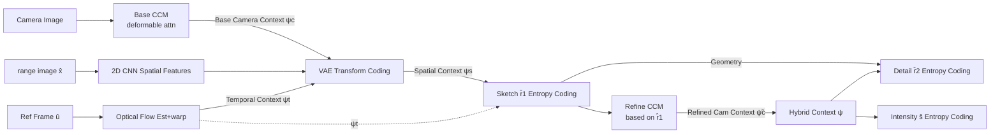

# Low-Latency Neural LiDAR Compression with 2D Context Models

**Conference**: ICLR 2026  
**OpenReview**: [https://openreview.net/forum?id=y1REtB4olw](https://openreview.net/forum?id=y1REtB4olw)  
**Code**: [https://github.com/rrui-song/RangeCM](https://github.com/rrui-song/RangeCM)  
**Area**: Autonomous Driving / LiDAR Point Cloud Compression  
**Keywords**: LiDAR Point Cloud Compression, 2D Context Models, range image, spatio-temporal-cross-modal context, joint geometry-intensity compression  

## TL;DR
RangeCM transitions LiDAR point cloud compression from expensive 3D contexts (voxel/octree) entirely to the 2D range image domain. It uses CNNs in 2D to aggregate spatial, temporal, and camera contexts simultaneously, utilizing a unified hybrid context to predict both geometry and intensity. While achieving better BD-Rate than SOTA, it reduces codec latency to approximately 0.1 seconds and accelerates intensity compression by over 100x compared to baselines.

## Background & Motivation
**Background**: Context modeling is the core of lossless/lossy LiDAR point cloud compression—given decoded context features, it predicts the probability distribution of the current symbol. The bit rate is determined by the cross-entropy between the ground truth and the estimated distribution; thus, more accurate contexts lead to lower bit rates. To pursue estimation accuracy, SOTA methods (RIDDLE, Unicorn, RICNet, etc.) generally use information-rich **3D contexts** (octree, voxel, or 3D feature extractors applied on range images) to characterize local geometry.

**Limitations of Prior Work**: The computational burden of 3D features is extremely heavy, with single-frame codec times often reaching hundreds of milliseconds. Sensors like Velodyne HDL-64E produce data at 10 FPS, making 3D solutions incapable of meeting real-time low-latency requirements. A few real-time methods (RENO) are fast enough, but their compression ratios lag significantly. Worse, geometry and intensity are usually processed using **two independent networks** for context calculation; intensity compression must recompute features after geometry is decoded, further slowing down the process (Unicorn takes about 5s for intensity inference).

**Key Challenge**: There is a conflict between low latency (requiring 2D/lightweight models) and high compression ratios (traditionally achieved via 3D contexts). Directly replacing 3D contexts with 2D backbones causes severe performance degradation due to the lack of precise 3D local context.

**Goal**: Construct a neural LiDAR compressor that operates entirely in the 2D domain, supporting high efficiency, fast encoding, and universal geometry-intensity compression.

**Key Insight**: **Compensate for 2D representation information loss with richer contexts.** After representing the point cloud as a range image, instead of "digging deeper 3D geometry" in spatial dimensions, the model horizontally aggregates three types of contexts in the 2D domain: **multi-scale spatial + optical flow temporal + cross-modal camera**. Furthermore, it uses **a single hybrid context to unifiedly predict geometry and intensity**, eliminating redundant calculations. Consequently, the 2D model significantly outperforms its 3D counterparts.

## Method

### Overall Architecture
RangeCM quantizes a continuous range image $x=\{r,s\}$ (range map $r$ + intensity map $s$) into $\hat{x}=\{\hat{r},\hat{s}\}$, where the range values are decomposed into "sketch + detail" layers via two-stage quantization $\hat{r}=\{\hat{r}_1,\hat{r}_2\}$. The entire encoding is based on a VAE performing transform coding and entropy modeling on the 2D range view, following the order $\hat{r}_1 \to \hat{r}_2 \to \hat{s}$. Each step takes aggregated spatial/temporal/camera contexts as input.

### Key Designs

**1. Pure 2D range-view paradigm + Sketch/Detail multi-scale: Eliminating 3D operators.** RangeCM's foundation is abandoning 3D operators like voxel/octree; all transforms and context models are completed using 2D CNNs on range images, structurally eliminating latency bottlenecks. To compensate for 2D precision, range values are split into sketch and detail layers via two-stage quantization: $\hat{r}_1=\lceil r/b_1\rfloor$ provides a coarse sketch, and $\hat{r}_2=\lceil(r-\hat{r}_1)/b_2\rfloor$ provides enhanced details, reconstructed as $\hat{r}=\hat{r}_1+\hat{r}_2$. Multi-scale context follows a coarse-to-fine next-scale strategy—estimation of the detail layer $\hat{r}_2$ is conditioned on the decoded sketch $\hat{r}_1$, with checkerboard partitioning (anchor/non-anchor) for parallel causal modeling within each layer. Randomized sampling of quantization step $b_2$ during training allows a single model to cover multiple bitrates.

**2. Cross-modal Camera Context (CCM): Using image semantics to supplement missing LiDAR info while ensuring causality.** In autonomous driving, cameras are almost always co-deployed with LiDAR. Images provide dense semantics (points of the same semantic instance often have similar range values), which compensates for the ambiguity in sparse point clouds. CCM uses 2D CNNs to extract LiDAR and camera features respectively, aligning them with **deformable attention**: LiDAR features act as queries $q_n$, and camera features act as keys, adaptively sampling $N$ key tokens for cross-attention:

$$\tilde{q}_n=\sum_{i=1}^{M} U_i \sum_{j=1}^{N} A_{ijn} V_i^T K(p_n+\Delta P_{ijn})$$

The reference point $p_n$ is obtained by lifting range pixels to 3D via the LiDAR-camera transform matrix and projecting them into the camera frame, providing an inductive bias for "sampling spatially adjacent camera pixels." The key constraint is **causality**: generating queries and reference points requires LiDAR geometry, which the receiver does not have initially. Thus, base camera context $\psi_c$ is first computed using full-precision geometry and transmitted as side information; after sketch $\hat{r}_1$ is decoded, a refined camera context $\tilde{\psi}_c$ is computed using another deformable attention based on $\hat{r}_1$, preserving causality without sacrificing alignment accuracy.

**3. Optical Flow Temporal Context: Inter-frame prediction inspired by video compression.** Treating continuous LiDAR frames as video frames, a lightweight optical flow network estimates motion $v$ between the current frame $\hat{x}$ and the reference frame $\hat{u}$ (previous decoded frame). Since $v$ is unavailable at the receiver, it is encoded as side information via VAE (latent $\hat{y}_v$ + hyperprior $\hat{z}_v$). After decoding $\hat{v}$, features of $\hat{u}$ are warped to the current view to obtain temporal context $\psi_t$. The transform coding for spatial priors is also conditioned on $\psi_t$: $y=g_a(\hat{x},\psi_c,\psi_t)$, with an entropy model $p(\hat{y}|\hat{z},\psi_t)=\prod_i (\mathcal{N}(\mu_i,\sigma_i^2)*\mathcal{U}(-0.5,0.5))(\hat{y}_i)$. The synthesis transform yields spatial context $\psi_s=g_s(\hat{y})$.

**4. Hybrid Context Driven Joint Geometry-Intensity Compression: One context for two modalities.** This is key to time saving. The hybrid context $\psi$ aggregates spatial $\psi_s$, temporal $\psi_t$, and refined camera $\tilde{\psi}_c$, already containing features relevant to both geometry and intensity. Consequently, the detail layer $\hat{r}_2$ and intensity $\hat{s}$ share the same $\psi$: intensity uses a lightweight prediction head to infer directly based on $\psi$, geometry context $\hat{r}$, and causal context $\hat{s}_{<i}$, avoiding the heavy recomputation of contexts seen in previous works. The overall training objective minimizes the total bitrate of range values, intensity, spatial latents, and optical flow:

$$\mathcal{L}=-\mathbb{E}_{x\sim p(x)}\Big(\sum_{i=1}^{2}\log p(\hat{r}_1^i|\pi_1^i,\psi_s,\psi_t)+\sum_{i=1}^{2}\log p(\hat{r}_2^i|\pi_2^i,\psi)+\sum_{i=1}^{2}\log p(\hat{s}^i|\hat{s}_{<i},\hat{r},\psi)+\dots\Big)$$

Where $\hat{r},\hat{s}$ are fitted using Discretized Mixed Logistic distributions, latents use Gaussian convolution uniform distributions, and hyperpriors use fully factorized density models.

## Key Experimental Results

Datasets: Waymo Open Dataset (WOD, with raw range maps, 5-view cameras, precise beam angles) and SemanticKITTI (2-view cameras, but test set lacks LiDAR-camera transform matrices, so camera priors are not used for KITTI). Metrics: D1/D2 PSNR; Hardware: single RTX A6000. Two models: RangeCM-G (geometry only) and RangeCM-GI (joint geometry-intensity).

### Main Results (BD-Rate vs. G-PCC, %, lower is better; Runtime in seconds)

| Method | Context Type | KITTI BD-Rate | WOD BD-Rate | Enc Infer. | Dec Infer. |
|---|---|---|---|---|---|
| G-PCC | Spatial | 0 | 0 | — | — |
| EHEM (octree) | Spatial | -31.12 | — | 1.38 | — |
| RENO (Real-time voxel) | Spatial | -12.47 | — | 0.04 | — |
| Unicorn | Spatio-temporal | -27.34 | — | 2.65 | 2.36 |
| RICNet (range) | Spatial | -45.82 | — | 0.40 | 0.40 |
| RIDDLE (range, SOTA) | Spatio-temporal | -48.05 | -54.21 | — | — |
| **Ours (RangeCM-G)** | Hybrid | **-56.07** | **-61.96** | **0.04** | **0.03** |
| Ours (RangeCM-GI) | Hybrid | -51.56 | -59.94 | 0.04 | 0.03 |

- Geometry Compression: Compared to SOTA RIDDLE, RangeCM-G/GI achieves **17.14% / 12.59%** BD-Rate Gain on WOD; encoding latency is ~0.1s, meeting real-time (10 FPS) requirements, comparable to RENO but with far superior compression.
- Intensity Compression: RangeCM-GI intensity inference takes only ~**10 ms**, whereas Unicorn needs ~5s to recompute contexts—**over 100x faster**, while maintaining compression ratios comparable to Unicorn (-20.93% on WOD vs. Unicorn's -12.16% on KITTI).

### Ablation Study (Stepwise removal, BD-Rate degradation relative to full model)

| Module Removed | Geometry (vs. RangeCM-G) | Intensity (vs. RangeCM-GI) |
|---|---|---|
| w/o Camera Context CC | +6.85% | +2.30% |
| w/o CC + Temporal TC | +22.02% | +21.88% |
| w/o CC + TC + Multi-scale MSC | +34.19% | +31.75% |

### Key Findings
- **All three context types are effective**: Camera context contributes 6.85% BD-Rate to geometry, temporal context contributes the most (15.17% / 19.58% for geometry/intensity), and multi-scale context is also significant.
- **Camera helps less for intensity (only 2.30%)**: Reflectance is strongly related to material, which is hard to identify from camera images, resulting in weak cross-modal correlation—aligning with intuition.
- **Structural Complementarity**: Octree/voxel methods excel at low bit rates (coarse reconstruction needs few symbols), while range image methods are more stable at high bit rates (fixed symbol count). RangeCM shows a clear advantage in the high bit rate range.
- The joint GI model is slightly inferior to the pure G model in geometry (training a universal model is harder), but the speed benefit far outweighs this minor loss.

## Highlights & Insights
- **Counter-intuitive "Reduction in dimension instead of increase in depth"**: The industry default is that 2D range domains lack information and must be supplemented with 3D operators. This paper proves that horizontally aggregating sufficiently rich spatio-temporal-cross-modal contexts allows pure 2D to significantly outperform 3D while hitting real-time latency targets.
- **Hybrid context reuse is the true lever for speed**: Merging context modeling for geometry and intensity saves heavy network recomputation on the intensity side, which is the source of the 100x acceleration rather than simple brute-force computation.
- **Elegant causality handling**: Camera context needs geometry as a query, but the receiver lacks it—using a two-stage approach of "base $\psi_c$ via side info + refined $\tilde{\psi}_c$ after sketch decoding" maintains causality and accuracy.
- **First effective use of camera context in point cloud compression**: A previous attempt (Lin et al. 2023) relied on depth estimation to lift images to 3D, limited to ~2% improvement due to inaccurate depth/alignment. Using deformable attention for direct 2D alignment here yields a 6.85% geometry gain.

## Limitations & Future Work
- **Camera-LiDAR must be encoded serially**: Dependency on camera context prevents parallel processing of modalities as in pure LiDAR methods. The author argues that GPU JPEG encoding of 5-way cameras takes only 2ms, so total latency remains far below baselines, but it does introduce dependency on camera availability/calibration.
- **Camera prior unusable on KITTI**: The test set lacks LiDAR-camera transform matrices, so camera gains are mainly validated on WOD; benefits in uncalibrated or single-modal scenarios are not fully demonstrated.
- **Joint GI slightly loses geometry precision**: The difficulty of training universal models leads to a slight geometry BD-Rate regression; future work could explore better geometry-intensity decoupling or multi-task training strategies.
- **Intensity gains negligibly from camera**: Cross-modal priors help little with reflectance; how to introduce material or semantic-level priors for intensity compression remains an open problem.

## Related Work & Insights
- **Three major data structures for PCC**: Octree (G-PCC, OctAttention, EHEM), Voxel (Unicorn, RENO), Range image (RICNet, RIDDLE). This work sides with range images but discards the previous practice of using "surreptitious" 3D feature extractors.
- **Contextual Video Compression** (Li et al. 2021/2024): Treating temporal frames as conditions for conditional VAE encoding; this paper almost directly ports this paradigm to LiDAR inter-frame prediction—suggesting that "treating point cloud sequences as video" is a research path worth further exploration.
- **LiDAR-Camera Fusion**: Multi-modal fusion ideas from perception (deformable attention, BEVFusion categories) are migrated to compression, implying that "fusion can not only improve perception accuracy but also directly reduce bitrates."
- Insight for practitioners: In latency-sensitive on-vehicle/robotic scenarios, **ask "can we reduce dimensions" before asking "should we add depth"**; rich cross-modal/temporal contexts are often more cost-effective than refined geometric operators.

## Rating
- Novelty: ⭐⭐⭐⭐ — The "pure 2D + multi-scale spatio-temporal cross-modal hybrid context + joint geometry-intensity" roadmap is clear. The two-stage cross-modal camera context handling is genuinely innovative, though components (deformable attn, optical flow, checkerboard) are largely migrated from mature modules.
- Experimental Thoroughness: ⭐⭐⭐⭐ — Dual datasets (WOD+KITTI), dual tasks (geometry+intensity), 6+ strong baselines, dual dimensions (BD-Rate + latency), and module-wise ablation. A minor weakness is camera gains mostly rely on WOD.
- Writing Quality: ⭐⭐⭐⭐ — Logical progression from motivation to contradiction to method. Equations and diagrams are well-coordinated, with reasonable analysis of why camera context fails for intensity.
- Value: ⭐⭐⭐⭐ — Successfully unifies SOTA compression ratios with real-time latency for the first time, offering direct value for on-vehicle storage/transmission in autonomous driving.

<!-- RELATED:START -->

## Related Papers

- [\[CVPR 2025\] RENO: Real-Time Neural Compression for 3D LiDAR Point Clouds](../../CVPR2025/autonomous_driving/reno_real-time_neural_compression_for_3d_lidar_point_clouds.md)
- [\[ICLR 2026\] Multi-Head Low-Rank Attention (MLRA)](multi-head_low-rank_attention.md)
- [\[AAAI 2026\] CompTrack: Information Bottleneck-Guided Low-Rank Dynamic Token Compression for Point Cloud Tracking](../../AAAI2026/autonomous_driving/comptrack_information_bottleneckguided_lowrank_dynamic_token_compres.md)
- [\[ICLR 2026\] MARC: Memory-Augmented RL Token Compression for Efficient Video Understanding](marc_memory-augmented_rl_token_compression_for_efficient_video_un.md)
- [\[CVPR 2026\] Neural Distribution Prior for LiDAR Out-of-Distribution Detection](../../CVPR2026/autonomous_driving/neural_distribution_prior_for_lidar_ood_detection.md)

<!-- RELATED:END -->
