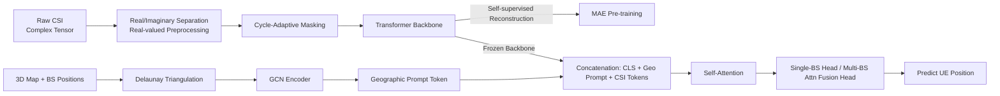

# Map as a Prompt: Learning Multi-Modal Spatial-Signal Foundation Models for Cross-scenario Wireless Localization

**Conference**: ICLR 2026  
**OpenReview**: [https://openreview.net/forum?id=0aBAAS0rRT](https://openreview.net/forum?id=0aBAAS0rRT)  
**Code**: To be confirmed  
**Area**: Wireless Localization / Multi-Modal Foundation Models  
**Keywords**: Wireless Localization, Channel State Information (CSI), Self-Supervised Pre-training, Masked Modeling, Prompt Tuning, 3D Map, Foundation Model  

## TL;DR
The authors propose **SigMap**, a method that feeds 3D maps as "soft prompts" into a wireless channel foundation model. Using cycle-adaptive masking for self-supervised pre-training and map-conditioned Graph Neural Network (GNN) prompts for parameter-efficient fine-tuning, the model achieves strong zero-shot/few-shot generalization in cross-scenario wireless localization.

## Background & Motivation
**Background**: Wireless localization, a core capability in the 5G/6G era supporting autonomous driving, XR, and smart manufacturing, is transitioning from traditional geometry/signal strength-based methods (ToA/TDoA/AoA/RSS + MUSIC/OMP) to data-driven deep learning, and recently toward foundation models and LLM paradigms (e.g., LWM, WirelessGPT, WirelessLLM).

**Limitations of Prior Work**: Traditional methods assume ideal propagation conditions and often exceed 100m error in urban multipath and Non-Line-of-Sight (NLoS) scenarios. Supervised deep models (MLP/CNN/LSTM) require massive labeling and generalize poorly across environments. Existing self-supervised methods using generic masking strategies allow models to exploit "periodic shortcuts" (CSI has strong periodicity, enabling reconstruction via local interpolation without learning global representations). Furthermore, map information, even when introduced, is often shallowly concatenated without utilizing 3D spatial topology, lacking interpretability.

**Key Challenge**: Wireless signals are highly dependent on environmental geometry (maps provide LoS/NLoS topological constraints) yet extremely sensitive to environmental changes. Capturing transferable general signal representations while injecting environmental geometry as a constraint for low-cost adaptation is the central difficulty.

**Goal**: Construct a cross-scenario wireless localization foundation model capable of low-labeling requirements, strong zero-shot generalization, and parameter-efficient adaptation to new environments and base station (BS) configurations.

**Core Idea**: **[Map as a Prompt]** Encode 3D maps and BS positions into a set of learnable "geographic prompt tokens" prepended to the input of a frozen channel Transformer. Combine this with **[Cycle-Adaptive Masking]** during self-supervised pre-training to break periodic shortcuts, achieving decoupling and fusion of "general signal representation + environmental geometric constraints."

## Method

### Overall Architecture
SigMap follows a two-stage paradigm: self-supervised pre-training on unlabeled CSI to learn general signal representations, followed by map-conditioned prompt tuning for specific localization tasks. The framework consists of three components: a Transformer backbone capturing long-range CSI dependencies, a cycle-adaptive masking module to prevent periodic shortcuts, and a geographic prompt tuning mechanism to inject environmental constraints. During fine-tuning, the backbone remains frozen, and only a tiny fraction of parameters are updated.

### Key Designs

**1. Cycle-Adaptive Masked Modeling: Learning global representations instead of periodic shortcuts.** CSI naturally exhibits strong periodicity along subcarrier/antenna dimensions. SigMap detects the dominant periodic shift $d_{final}$ for each sample via cross-correlation and generates masks as "slanted strips" along this shift: $M_{cycle}[i,j]=0$ when $|j-(j_0+i\cdot d_{final})|\le w$ (masked), and 1 otherwise, where $j_0$ is the start offset and $w$ is the strip width. This cycle-aligned dynamic mask breaks repeatable structures, forcing the model to reconstruct signals from global structures. The objective is a standard MAE loss: $L_{MAE}=\mathbb{E}_X\|X-f_{\theta_{dec}}(X_{masked})\|^2$.

**2. Geographic Prompt Tuning: Injecting 3D maps as soft prompts.** This is the core of "map-as-prompt." 3D building mesh vertices $\{v_i\}$ and $T$ base station positions $\{p_t\}$ are combined into a node set. **Delaunay triangulation** constructs adjacency edges in 3D space to form a heterogeneous graph $G=(V,E)$. Nodes are encoded via MLP and two GCN layers: $H^{(l+1)}=\sigma(\tilde{D}^{-\frac12}\tilde{A}\tilde{D}^{-\frac12}H^{(l)}W^{(l)})$. Global average pooling and a projection MLP produce the geographic prompt $g_{prompt}\in\mathbb{R}^{D_p}$. This prompt is prepended to the Transformer input sequence: $T_{input}=[t_{cls};T_{geo};T_{CSI}]+E_{pos}$, where $T_{geo}=g_{prompt}$. Only the geographic prompt tokens is trainable. This allows geometric constraints to influence the sequence via attention using frozen weights $W_Q,W_K,W_V$. Only GNN parameters $\theta_{gnn}$, projection MLP $\theta_{proj}$, and task heads $\theta_{task}$ are updated (approx. 0.4%–0.7% of total parameters).

**3. Task-Specific Adaptation: Single/Multi-BS localization modes.** For single-BS, the CLS token is passed through an MLP to regress position: $\hat{p}_{UE}=MLP_{single}(t_{cls})$. For multi-BS, an attention fusion mechanism is designed: CLS tokens from $T$ base stations are weighted by $\alpha_t=\frac{\exp(v^T\tanh(W_{attn}t_{cls}^{(t)}))}{\sum_j\exp(v^T\tanh(W_{attn}t_{cls}^{(j)}))}$. The final estimate is the weighted sum of individual BS predictions: $\hat{p}_{UE}=\sum_{t=1}^T\alpha_t\cdot MLP_{multi}^{(t)}(t_{cls}^{(t)})$.

## Key Experimental Results

Experiments use DeepMIMO (O1_3p5 urban scenario, ray-tracing). Metrics include MAE, RMSE, and CDF@1m. Baselines include OMP, CNN, SWiT, and LWLM.

### Main Results

Single-BS NLoS Localization (Most challenging):

| Method | MAE (m) | RMSE (m) | CDF@1m (%) |
|------|---------|----------|------------|
| **Ours (w/ map)** | **1.564** | **5.675** | **60.5** |
| Ours (w/o map) | 2.275 | 8.532 | 31.0 |
| LWLM | 2.382 | 5.822 | 25.3 |
| SWiT | 2.586 | 8.967 | 24.3 |
| CNN | 2.943 | 9.423 | 21.7 |
| OMP | 3.287 | 9.851 | 15.4 |

Ours with map reduces MAE by 34.4% compared to LWLM and more than doubles the CDF@1m.

Multi-BS (4-BS) Collaborative Localization:

| Method | MAE (m) | RMSE (m) | CDF@1m (%) |
|------|---------|----------|------------|
| **Ours (w/ map)** | **0.673** | **1.099** | **84.5** |
| Ours (w/o map) | 0.789 | 1.285 | 77.5 |
| LWLM | 0.828 | 1.178 | 75.6 |
| SWiT | 1.102 | 1.368 | 68.1 |
| CNN | 1.398 | 1.731 | 59.3 |
| OMP | 1.685 | 2.089 | 50.6 |

### Ablation Study

Masking Strategy (Multi-BS):

| Masking Strategy | MAE (m) | RMSE (m) | CDF@1m (%) |
|----------|---------|----------|------------|
| Grid Mask only | 0.770 | 1.176 | 80.3 |
| Strip Mask only | 0.753 | 0.972 | 75.3 |
| **Cycle-Adaptive Mask** | **0.673** | 1.099 | **84.5** |

Map Modality (Single-BS):

| Map Modality | MAE (m) | RMSE (m) | CDF@1m (%) |
|----------|---------|----------|------------|
| 3D Mesh | 1.564 | 5.675 | 60.5 |
| 2D Bird's Eye View | 1.692 | 6.128 | 55.7 |
| No Map (CSI-only) | 2.275 | 8.532 | 31.0 |

2D bird's eye view results in only ~8% MAE degradation compared to 3D mesh, suggesting most gains come from topological/LoS cues.

### Key Findings
- **Cross-environment Generalization**: On unseen DeepMIMO O2 and WAIR-D Scenario-2 (100 real urban scenarios), fine-tuning only the task head with ~100 samples achieves 1.026m (O2) and 1.880m (WAIR-D) MAE, outperforming LWLM by 53.2% and 44.3% while updating only 0.4% of parameters.
- **Parameter Efficiency**: Pre-training involves 11.73M parameters; fine-tuning involves only 0.085M (~0.7%). Inference time is 0.83 ms per sample.
- **Significant Map Gains**: In single-BS stages, MAE drops from 2.275m to 1.564m with map integration, identifying geometric constraints as the critical source of accuracy.

## Highlights & Insights
- **The "Map as a Prompt" analogy is effective**: Transferring soft prompt concepts from NLP/CV to wireless signals via GNN-encoded 3D geometry maintains parameter efficiency while allowing environmental constraints to enter attention mechanism interpretably.
- **Cycle-adaptive masking addresses CSI-specific issues**: Generic masking is vulnerable to periodic shortcuts. The use of cross-correlation to detect and break these patterns is simple yet targeted.
- **Robustness to 2D inputs**: Finding that 2D bird's eye views retain most gains provides a practical fallback when high-fidelity 3D meshes are unavailable.

## Limitations & Future Work
- **Validation on synthetic data only**: Results are based on DeepMIMO and WAIR-D (ray-tracing); the sim-to-real gap remains unknown.
- **Dependency on accurate maps**: Effectiveness decreases if maps or BS positions are inaccurate. Future work targets using visual modalities (images/point clouds) to supplement maps.
- **Task Scope**: Authors plan to extend the foundation model to channel estimation and beamforming.
- Single-BS RMSE remains high (5.675m), indicating outlier predictions that require improved robustness.

## Related Work & Insights
- **Wireless Foundation Models**: LWM and WirelessGPT use masked channel modeling for general representations; SWiT uses contrastive learning. These lack task-aware semantics or map integration.
- **SSL for Localization**: CrowdBERT and Signal-guided MAE reconstruct RSS/CIR but are often limited to single configurations. SigMap improves representation diversity via cycle-adaptive masking.
- **Wireless LLMs**: WirelessLLM uses RAG/prompting for protocol reasoning but suffers from hallucinations in low-level signal processing. SigMap uses soft geometric prompts rather than linguistic prompts, fitting low-level signal tasks better.
- **Insight**: Using domain structures (3D geometry) encoded via GNN as soft prompts for frozen foundation models is a universal, parameter-efficient "structure-conditioning" paradigm applicable to other physical/geometric constraint scenarios.

## Rating
- **Novelty**: ⭐⭐⭐⭐ "Map-as-prompt" and cycle-adaptive masking are creative solutions to real bottlenecks in wireless localization.
- **Experimental Thoroughness**: ⭐⭐⭐ Covers main experiments, ablations, and cross-dataset generalization, though lacks real-world CSI validation.
- **Writing Quality**: ⭐⭐⭐⭐ Clear structure with a tight motivation-gap-contribution chain.
- **Value**: ⭐⭐⭐⭐ High value for 5G/6G deployment; the parameter-efficient adaptation paradigm is highly attractive for practical application.

<!-- RELATED:START -->

## Related Papers

- [\[AAAI 2026\] Backdoor Attacks on Open Vocabulary Object Detectors via Multi-Modal Prompt Tuning](../../AAAI2026/autonomous_driving/backdoor_attacks_on_open_vocabulary_object_detectors_via_multi-modal_prompt_tuni.md)
- [\[ICLR 2026\] Loc²: Interpretable Cross-View Localization via Depth-Lifted Local Feature Matching](loc2_interpretable_cross-view_localization_via_depth-lifted_local_feature_matchi.md)
- [\[ICLR 2026\] AsyncBEV: Cross-modal Flow Alignment in Asynchronous 3D Object Detection](asyncbev_cross-modal_flow_alignment_in_asynchronous_3d_object_detection.md)
- [\[ICML 2026\] TSRBench: A Comprehensive Multi-task Multi-modal Time Series Reasoning Benchmark for Generalist Models](../../ICML2026/autonomous_driving/tsrbench_a_comprehensive_multi-task_multi-modal_time_series_reasoning_benchmark_.md)
- [\[CVPR 2026\] Towards Balanced Multi-Modal Learning in 3D Human Pose Estimation](../../CVPR2026/autonomous_driving/towards_balanced_multi-modal_learning_in_3d_human_pose_estimation.md)

<!-- RELATED:END -->
