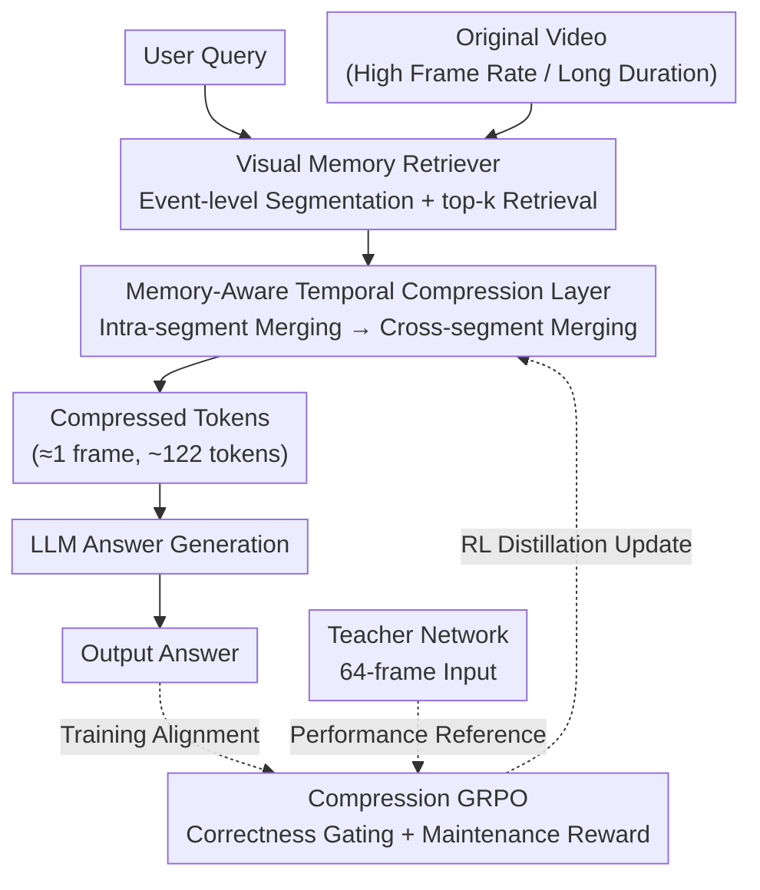

# MARC: Memory-Augmented RL Token Compression for Efficient Video Understanding

**Conference**: ICLR 2026  
**arXiv**: [2510.07915](https://arxiv.org/abs/2510.07915)  
**Code**: Available (Project Web / Code / Model provided)  
**Area**: Autonomous Driving  
**Keywords**: Video token compression, RL distillation, visual memory retrieval, GRPO, efficient inference  

## TL;DR

The MARC framework is proposed, utilizing a "retrieve-then-compress" strategy. It employs a Visual Memory Retriever (VMR) to select video segments most relevant to the query, and then utilizes Compression GRPO (C-GRPO) to distill the inference capabilities of a 64-frame teacher model into a student model using only 1 frame's worth of tokens. This achieves 95% visual token compression, a 72% reduction in GPU memory, and a 23.9% reduction in inference latency with virtually no performance loss (42.20 vs. 42.21).

## Background & Motivation

**Computational bottleneck of video understanding**: As VLMs extend from images to video, the explosion of token counts brought by high frame rates and long durations leads to a sharp increase in inference costs, severely limiting deployment in latency-sensitive scenarios such as autonomous driving and surveillance.

**Limitations of existing token compression methods**: Mainstream compression methods (e.g., MovieChat, VidCom, ByteVideoLLM) are mostly based on training-free token merging strategies. These handle redundant information independently in spatial or temporal dimensions, inevitably losing critical information during compression and leading to significant performance degradation.

**Independent processing of spatio-temporal redundancy**: Existing methods ignore the temporal organization and context-aware characteristics of human visual memory. Cognitive science research suggests that humans segment continuous experiences into discrete events, recalling and retrieving them via episodic memory.

**Performance challenges under extreme compression**: When compressing video to a token count equivalent to a single frame, naive geometric token reduction heuristics struggle to maintain the inference quality of teacher-level models.

**Lack of training-based compression schemes**: Most existing methods are training-free inference-time tricks, lacking end-to-end schemes that optimize compression quality through learning.

**Decoupling of retrieval and compression**: Video Retrieval-Augmented Generation (Video-RAG) and token compression are typically two separate technical routes. This paper is the first to tightly integrate structured retrieval with RL-based compression.

## Method

### Overall Architecture

MARC addresses a practical contradiction: high video token counts make VLM inference expensive, but crude token reduction loses key information and performance. The core idea is "retrieve then compress"—instead of blindly compressing the entire video, the most relevant segments are first selected, followed by meaningful compression within those segments.

The workflow is as follows: The original video is first segmented into event-level clips by the **Visual Memory Retriever (VMR)**, which retrieves the top-k segments most relevant to the query. These segments enter the **Memory-Aware Temporal Compression Layer** for two-stage temporal compression to meet the token budget. The resulting small set of tokens is fed to the LLM. During training, **Compression GRPO (C-GRPO)** uses a 64-frame teacher network as a reference to distill inference capabilities into the student network using RL.

### Key Designs

**1. Visual Memory Retriever (VMR): Retrieve relevant segments before compression**

Compressing the entire video directly often forces irrelevant redundancy into the process, diluting important information. VMR draws from cognitive science: humans recall experiences as discrete events rather than seamless flows. VMR uses a deep event detection network (Soucek & Lokoc, 2024) to identify temporal boundaries (scene changes, topic shifts), cutting video into semantically coherent segments. An embedding model (Bolya et al., 2025) then maps the query and segments to a shared latent space, using nearest neighbor search to select the top-k relevant segments (k=3). This significantly narrows the search space before compression begins.

**2. Memory-Aware Temporal Compression Layer: Merging redundancy within event boundaries**

The goal is to reduce frame counts without discarding evidence. This layer utilizes event boundaries provided by VMR to prioritize merging highly similar adjacent frames within the same event. It operates in two stages: Stage 1 (Intra-segment Merging) iteratively merges the most similar adjacent frame pairs within a short-term memory window $m$ using the mean $\mathbf{H}_{merge} = \frac{1}{2}(\mathbf{H}_a + \mathbf{H}_b)$ until the frame budget defined by ratio $\rho$ is met. Stage 2 (Cross-segment Merging) provides a lightweight global merge if the total frame count still exceeds the target $N_{target}$. Similarity is measured by patch-aligned mean cosine scores:

$$\text{sim}(\mathbf{H}_a, \mathbf{H}_b) = \frac{1}{P}\sum_{p=1}^{P} \frac{\mathbf{h}_a^{(p)} \cdot \mathbf{h}_b^{(p)}}{\|\mathbf{h}_a^{(p)}\| \|\mathbf{h}_b^{(p)}\|}$$

**3. Compression GRPO (C-GRPO): Turning compression into a teacher-alignment reward problem**

Geometric reduction fails to maintain teacher-level quality at extreme compression ratios. Standard GRPO focuses on correctness and format rather than teacher alignment. C-GRPO introduces a "maintenance alignment" reward signal to redefine compression as an alignment problem. It defines a **maintenance ratio** $\eta = a_{comp} / a_{full}$ to quantify how much teacher performance is preserved, resulting in a **compression reward** $r_c = \alpha \cdot \max(0, \eta - \tau)$, where $\tau$ is the minimum acceptable threshold. A **correctness gate** $R_i = r_i + \mathbb{1}[\text{correct}] \cdot r_c$ ensures that only semantically correct generations receive the maintenance reward, preventing reward hacking. Advantages are then normalized as $A_i = (R_i - \bar{R}) / \sigma_R$ for optimization.

### Loss & Training

$$\mathcal{L}_{\text{C-GRPO}} = \mathbb{E}\left[\frac{1}{G}\sum_{i=1}^{G}\left(\text{clip}\left(\frac{\pi_\theta(o_i|q)}{\pi_{\theta_{old}}(o_i|q)}, 1-\epsilon, 1+\epsilon\right) A_i\right) - \beta \text{KL}(\pi_\theta \| \pi_{ref})\right]$$

- **Teacher Network**: Qwen2.5-VL-3B with 64-frame input.
- **Student Network**: Same architecture, compressed to 1 frame worth of tokens (~122 tokens).
- **Training Data**: 5K samples randomly sampled from Video-R1-260K (video and image).
- **Group size** $G=8$, threshold $\tau=0.6$.
- Image data aids general reasoning but does not involve compression rewards.

## Key Experimental Results

### Main Results

| Model | Frames | VSI-Bench | VideoMMMU | MMVU | MVBench | TempCompass | VideoMME | Mean |
|------|------|-----------|-----------|------|---------|-------------|----------|------|
| Qwen2.5-VL-3B (baseline) | 64 | 32.93 | 35.33 | 48.64 | 44.77 | 38.05 | 53.55 | 42.21 |
| Qwen2.5-VL-3B | 16 | 27.63 | 30.78 | 45.28 | 43.89 | 37.95 | 44.37 | 38.32 |
| InternVL3.5-4B | 64 | 28.96 | 33.33 | 47.51 | 44.71 | 58.34 | 39.15 | 42.00 |
| Gemma-3-4B | 64 | 26.83 | 26.78 | 41.76 | 36.82 | 55.04 | 46.00 | 38.87 |
| ByteVideoLLM-3B | 64 | 21.33 | 22.33 | 28.63 | 22.56 | 35.55 | 22.70 | 25.52 |
| MovieChat-3B | 1 | 25.14 | 25.78 | 39.35 | 37.10 | 38.79 | 26.41 | 32.10 |
| VidCom2-3B | 64 | 25.50 | 23.89 | 31.08 | 29.88 | 35.23 | 21.48 | 27.84 |
| **Ours (MARC-3B)** | **1** | **27.55** | **33.11** | **51.99** | **45.82** | **55.34** | **39.44** | **42.20** |

**Key Data**: MARC-3B uses only 4.71% of visual tokens (122.69 vs. original 2589.93); the mean score of 42.20 is nearly identical to the 64-frame baseline of 42.21.

### Ablation Study

**$\tau$ Threshold Ablation**:

| $\tau$ | VSI-Bench | VideoMMMU | MMVU | MVBench | TempCompass | VideoMME | Mean |
|---|-----------|-----------|------|---------|-------------|----------|------|
| 0.4 | 28.27 | 31.66 | 49.12 | 45.21 | 54.72 | 39.07 | 41.34 |
| **0.6** | **27.55** | **33.11** | **51.99** | **45.82** | **55.34** | **39.44** | **42.20** |
| 0.8 | 28.23 | 31.78 | 49.34 | 45.89 | 54.12 | 39.03 | 41.40 |

**VMR and Training Strategy Ablation**:

| Method | Frames | Mean |
|------|------|------|
| Baseline (No VMR) | 64 | 42.21 |
| Baseline + VMR | 64 | 45.56 |
| SFT | 1 | 38.50 |
| SFT + VMR | 1 | 40.16 |
| **MARC (C-GRPO + VMR)** | **1** | **42.20** |

### Key Findings

1. **Near-zero loss at extreme compression**: 95% token compression (64 frames → 1 frame token) with mean performance of 42.20 vs. 42.21.
2. **Significant efficiency gains**: GPU memory reduced by 72.4% (41.63GB → 11.48GB), LLM generation latency reduced by 23.9%, and end-to-end latency reduced by 11.1%.
3. **VMR improves performance independently**: Without compression, VMR improves the baseline from 42.21 to 45.56 (+7.9%), with a 27.85% jump on MVBench.
4. **C-GRPO significantly outperforms SFT**: MARC mean 42.20 vs. SFT 38.50 (+9.6%).
5. **Outperforms baseline on some benchmarks**: MARC exceeds the 64-frame baseline on MMVU, MVBench, and TempCompass.
6. **Surpasses larger models**: MARC-3B mean exceeds InternVL3.5-4B (42.00) and Gemma-3-4B (38.87).
7. **$\tau=0.6$ is optimal**: 0.4 is too loose for maintenance, while 0.8 results in sparse signals that hinder learning.

## Highlights & Insights

- **Cognitive science-inspired retrieval**: VMR's event-level segmentation simulates human episodic memory encoding, aligning better with natural video structures than fixed windows.
- **Compression as an alignment problem**: The core insight is redefining token compression from a geometric operation to a teacher-student alignment problem guided by RL reward shaping.
- **Sophisticated correctness gating**: Only correct generations receive maintenance rewards, preventing reward hacking and the amplification of hallucinations.
- **Only 5K training samples**: The high data efficiency of C-GRPO is demonstrated by using a tiny fraction of the available dataset.
- **Retrieve-then-compress paradigm**: This pipeline ensures the compression module targets high-value evidence rather than blindly processing the entire video.

## Limitations & Future Work

1. **Performance loss on long videos**: On VideoMME, MARC retains only 74% of baseline performance (39.44 vs. 53.55), showing a cost for extreme compression in long-form understanding.
2. **Limited to 3B models**: Experiments were conducted on Qwen2.5-VL-3B; generalization to 7B+ models remains unverified.
3. **Dependency on VMR quality**: Misjudged event boundaries or poor semantic matching by VMR will degrade downstream compression.
4. **Fixed top-k=3**: The study did not explore adaptive selection strategies for retrieved segments.
5. **Fixed compression ratio**: $\rho$ was not adaptively adjusted based on video complexity.
6. **Separated training**: VMR and C-GRPO were trained separately rather than in a fully end-to-end joint optimization.

## Related Work & Insights

- **Video-RAG**: VMR serves as a video corpus retrieval solution, potentially integrable with Agent-Based systems like VideoAgent.
- **Scalability of GRPO**: C-GRPO's reward design can be generalized to other modalities like 3D point clouds or long documents.
- **Token Merging**: MARC improves upon the temporal merging found in MovieChat by leveraging event structures provided by VMR.
- **New Distillation Paradigm**: Unlike traditional KD using KL divergence on logits, C-GRPO presents a path for "behavioral-level" distillation via RL signals.

## Rating

| Dimension | Rating | Description |
|------|------|------|
| Novelty | ⭐⭐⭐⭐ | First application of RL (GRPO) to video token compression; novel retrieve-then-compress combo. |
| Experimental Thoroughness | ⭐⭐⭐⭐ | Comprehensive evaluation across 6 benchmarks and efficiency metrics, though lacks larger model variants. |
| Writing Quality | ⭐⭐⭐⭐ | Clear structure, complete mathematical derivations, and well-motivated. |
| Value | ⭐⭐⭐⭐⭐ | 95% compression with negligible loss represents high value for practical deployment. |

<!-- RELATED:START -->

## Related Papers

- [\[NeurIPS 2025\] StreamForest: Efficient Online Video Understanding with Persistent Event Memory](../../NeurIPS2025/autonomous_driving/streamforest_efficient_online_video_understanding_with_persistent_event_memory.md)
- [\[ICLR 2026\] SceneStreamer: Continuous Scenario Generation as Next Token Group Prediction](scenestreamer_continuous_scenario_generation_as_next_token_group_prediction.md)
- [\[ICLR 2026\] RAP: 3D Rasterization Augmented End-to-End Planning](rap_3d_rasterization_augmented_end-to-end_planning.md)
- [\[ICLR 2026\] Low-Latency Neural LiDAR Compression with 2D Context Models](low-latency_neural_lidar_compression_with_2d_context_models.md)
- [\[ICLR 2026\] EgoDex: Learning Dexterous Manipulation from Large-Scale Egocentric Video](egodex_learning_dexterous_manipulation_from_large-scale_egocentric_video.md)

<!-- RELATED:END -->
