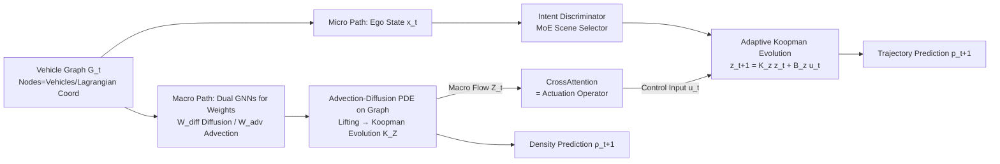

# Micro-Macro Coupled Koopman Modeling on Graph for Traffic Flow Prediction

**Conference**: ICLR 2026  
**OpenReview**: [https://openreview.net/forum?id=fhDqFk4DgI](https://openreview.net/forum?id=fhDqFk4DgI)  
**Code**: Paper committed to open source (anonymous repository)  
**Area**: Autonomous Driving / Traffic Flow Prediction / Dynamical System Modeling  
**Keywords**: Koopman Operator, Vehicle Trajectory Prediction, Traffic Flow PDE, Graph Neural Networks, Micro-Macro Coupling, History-free Prediction  

## TL;DR
The authors unify "microscopic vehicle trajectories" and "macroscopic traffic density" by lifting them into a linear Koopman observation space. By discretizing the Lighthill-Whitham-Richards (LWR) equations on a Lagrangian dynamic graph with vehicles as nodes, the model achieves trajectory prediction performance comparable to or better than history-dependent SOTA methods using only the current snapshot (no history required).

## Background & Motivation
**Background**: Traffic systems are inherently multi-scale. The microscopic level involves interactions between individual vehicles, while the macroscopic level describes the propagation of flow density fluctuations. These levels are nonlinearly coupled. Existing methods typically focus on one side: microscopic methods (multi-agent interaction, causal inference) capture local behaviors but fail to maintain global flow conservation and struggle with scalability; macroscopic methods use Partial Differential Equations (PDEs) like LWR to ensure conservation and continuity but are "blind" to individual vehicle-level perturbations.

**Limitations of Prior Work**: Few works bridge the micro-macro gap (e.g., game theory, kinematic limits), often assuming driver homogeneity or holding only in asymptotic limits, making them impractical. Moreover, mainstream trajectory predictors (BAT, MS-STGCN, etc.) rely on 3–8 seconds of historical trajectories, requiring continuous tracking, storage, and persistent object detection, which imposes significant real-time and engineering overhead.

**Key Challenge**: How to model the nonlinear, bidirectional coupling between micro and macro scales in a **unified, computationally feasible, and physically interpretable** framework?

**Goal**: Propose MMCKM (Micro-Macro Coupled Koopman Modeling) to jointly predict future vehicle trajectories and traffic density evolution within a single Koopman architecture without any reliance on historical trajectories.

**Key Insight**: **① Koopman Lifting and Linearization**—Both micro trajectories and macro flow are lifted to high-dimensional observation spaces where dynamics are approximately linear. Since the Koopman operator is Markovian when observation functions are time-invariant, extrapolation requires only the current state. **② Lagrangian Vehicle Graph Discretization**—Instead of discretizing PDEs on a fixed Euclidean grid, vehicles are treated as graph nodes (where the grid moves with the flow), preserving high-frequency micro-perturbations typically averaged out by grids. **③ Bidirectional Coupling**—Micro-perturbations affect macro flow via an added diffusion term in the LWR, while macro flow acts back on individual vehicles as an external input through a Koopman control term.

## Method

### Overall Architecture
MMCKM models the traffic environment as a weighted directed graph $G_t=(V_t,E_t,W_t)$ with vehicles as nodes. It employs two lifting paths: the macroscopic path lifts flow density to an observation space $Z$ for linear Koopman evolution; the microscopic path lifts individual vehicle states to $z$ for Koopman evolution with control. Control inputs are injected from macro states via CrossAttention, forming a bidirectional loop: "Micro → Macro (diffusion term)" and "Macro → Micro (control term)."

### Key Designs

**1. Vehicle-Centric Graph Advection-Diffusion PDE: Bringing Conservation to Lagrangian Coordinates.** Traditional PDEs are discretized on fixed Euclidean grids, where stochastic behaviors are averaged, losing high-frequency micro-disturbances. This work treats vehicles as nodes and discretizes in Lagrangian coordinates, yielding the graph dynamics $\dot\rho = -C_{adv}\rho + L_{diff}\rho$. The advection operator $C_{adv}=B^\top W_{adv}B$ is an antisymmetric matrix (describing flow direction and energy conservation), while the diffusion operator $L_{diff}=B^\top W_{diff}B$ is semi-positive definite (describing local perturbations). Edge weights $W_{adv}, W_{diff}$ are learned via GNNs with structured designs to ensure physical properties: diffusion edges are undirected with Softplus activation, and advection edges are directed and aligned with the velocity field. This explicitly models how each vehicle impacts flow propagation.

**2. Unified History-free Koopman Modeling + Spectral Alignment: Aligning Koopman and Graph-PDE Operators.** Inspired by the linear structure $\dot{\hat\rho}=(\mathrm{Diag}(\eta)-j\mathrm{Diag}(\xi))\hat\rho$ in projection space, graph features are lifted via an encoder $\phi_Z$, evolved linearly via $K_Z$, and decoded. Since $L_{diff}$ and $C_{adv}$ are generally non-commutative in real traffic, the authors utilize a commutator penalty $L_{JAD}=\|L_{diff}C_{adv}-C_{adv}L_{diff}\|_F^2$ to enhance numerical stability under Lie-Trotter operator splitting $e^{\Delta t(L_{diff}-C_{adv})}\approx e^{\Delta t L_{diff}}e^{-\Delta t C_{adv}}$. A spectral alignment loss $L_{spec}$ aligns the real part of $\theta=\frac{1}{\Delta t}\log(K)$ with the eigenvalues of $L_{diff}$ and the imaginary part with frequencies of $C_{adv}$, ensuring consistency between Koopman dynamics and the learned PDE operators.

**3. Physics-Guided Multimodal Micro-Dynamics: Scene Coverage via Operator Families + Intent Gating.** Driving intentions are discrete and abrupt (free flow, car following, lane changing). A single Koopman operator cannot efficiently cover all modes. This work constructs a family of Koopman operators composed of $2\times2$ complex blocks and real diagonal blocks. Variation is introduced via spectral radius upper bounds, oscillation frequency adjustments, and maximum actuation strength $B_{max}$. An MoE-based Intent Discriminator selects the best operator based on ego state $x_t^e$ and macro observations $Z_t$. Macro flow is injected via $z_{t+1}=K_z z_t + B_z u_t$, where $u_t=\mathrm{CA}(z_t,Z_t)$ acts as an actuation operator. Input-to-State Stability (ISS) is ensured by constraining $u_t$ and the spectral radius $\kappa(K_z)<1$, guaranteeing geometric error decay.

## Key Experimental Results

### Main Results (NGSIM, Trajectory RMSE, Lower is Better)

| Prediction Horizon (s) | BAT (w/ History) | MS-STGCN (w/ History) | Vit-Traj (w/ History) | CV (No History) | Ours 1.0s | Ours 0.1s |
|---|---|---|---|---|---|---|
| 1 | 0.27 | 0.42 | 0.39 | 0.64 | 0.54 | **0.33** |
| 2 | 0.90 | 1.00 | 0.95 | 1.48 | **0.98** | 0.92 |
| 3 | 1.43 | 1.66 | 1.58 | 2.63 | **1.57** | 1.63 |
| 4 | 2.76 | 2.44 | 2.22 | 4.33 | 2.26 | 3.17 |
| 5 | 3.80 | 3.05 | 2.89 | 5.62 | **2.93** | 4.65 |

The history-free MMCKM significantly outperforms the history-free CV baseline and achieves or exceeds the performance of SOTA methods that rely on 3–8s of history.

### Operator Interval Comparison (HighD, ADE)

| Interval | 0.04s | 0.1s | 0.2s | 0.4s(*) | 1s |
|---|---|---|---|---|---|
| ADE | 2.84 | 2.06 | 1.88 | **1.65** | 2.90 |

There is a trade-off between "high-frequency fidelity" and "numerical stability." Intervals that are too small (0.04s) lead to eigenvalues clustering near the unit circle, while intervals too large (1s) miss high-frequency maneuvers. 0.4s is optimal.

### Ablation Study (HighD, 0.2s Interval, Trajectory RMSE)

| Model | 1s | 2s | 3s | 4s | 5s |
|---|---|---|---|---|---|
| MMCKM (Full) | **0.29** | **0.60** | **1.21** | **1.72** | **2.73** |
| MMCKM-I (w/o Intent) | 0.74 | 1.39 | 1.96 | 2.90 | 3.81 |
| MMCKM-C (w/o Koopman Control) | 0.41 | 1.01 | 1.89 | 2.50 | 3.46 |
| MMCKM-IC (w/o Both) | 0.80 | 1.74 | 2.54 | 3.48 | 4.62 |

Diffusion Term Ablation (NGSIM, Macro Density Error): Full LC yields 3.2%→9.5%, while Advection-only (C) yields 6.1%→14.1%. Removing diffusion drastically degrades accuracy.

### Key Findings
- **Intent Discriminator governs short-term**: 29% improvement at 1s, but gains diminish long-term as intent classification accuracy decays.
- **Koopman Control governs long-term stability**: Reduces error by 37% at 5s, acting as the key to maintaining bidirectional coupling and constraining trajectories to physically reasonable manifolds.
- **Linear Error Growth**: Errors grow approximately linearly with iteration, unlike the exponential growth in recurrent architectures, allowing the model to outperform history-dependent methods in long horizons.
- **KDE Bandwidth Sensitivity**: 25m is optimal. Too small (10m) makes density labels noisy, causing $W_{diff}$ to amplify noise rather than physical gradients, making the diffusion term counterproductive.

## Highlights & Insights
- **First unified Koopman framework for joint vehicle trajectory and traffic density modeling** without history, making "real-time single-snapshot prediction" a viable solution.
- **Lagrangian vehicle graph discretization is a genuine physical contribution**, preserving micro-perturbations and allowing the injection of micro-randomness into the macro PDE.
- **Spectral Alignment + Commutator Penalty** anchors Koopman matrices to classical graph-PDE operators at the eigenvalue level, ensuring stability and interpretability.
- **Interpretable Edge Weights**: Learned weights quantify vehicle interaction intensity dynamically, providing useful insights for downstream planning/control.

## Limitations & Future Work
- **Density ground truth relies on KDE estimation**, lacking sensor-calibrated labels. Comparative Macro SOTA benchmarks remain future work.
- **Evaluated only on NGSIM/HighD (highways)**. Heterogeneous urban structures (intersections, pedestrians, signals) are not yet covered.
- **Intent Discriminator decay**: Maintaining precise intent requires synchronized updates of all neighbors, which is computationally expensive. Currently, Koopman control compensates for long-term stability.
- **Hyperparameter Sensitivity**: The framework is sensitive to discretization intervals and KDE bandwidth.

## Related Work & Insights
- **Koopman Operator Theory** (DMD, Neural Parameterization) serves as the foundation. The novelty lies in the spectral alignment with graph-PDE operators.
- **Macro LWR/PDE Traffic Models** provide the conservation law framework, while this work fixes their "blindness" to micro-events via Lagrangian discretization.
- **Micro Trajectory Prediction** (BAT, MS-STGCN) represents the history-dependent paradigm; this work proves that single-snapshot prediction can be competitive.
- **Insight**: For any multi-scale system where cross-scale interactions lack explicit forms, "Lifting + modeling cross-scale influence as control inputs" is a powerful general strategy.

## Rating
- **Novelty**: ⭐⭐⭐⭐⭐ — Innovative unification of micro/macro modeling with Lagrangian graphs and history-free prediction.
- **Experimental Thoroughness**: ⭐⭐⭐ — Solid on standard datasets but lacks urban scenarios and comparison with recent macro-density SOTAs.
- **Writing Quality**: ⭐⭐⭐⭐ — Clear physical motivation and well-explained design; some notations are dense.
- **Value**: ⭐⭐⭐⭐ — Highly attractive for real-time ITS; physical interpretability offers a distinct advantage over pure black-box methods.

<!-- RELATED:START -->

## Related Papers

- [\[AAAI 2026\] Meta Dynamic Graph for Traffic Flow Prediction](../../AAAI2026/autonomous_driving/meta_dynamic_graph_for_traffic_flow_prediction.md)
- [\[ICLR 2026\] Plan-R1: Safe and Feasible Trajectory Planning as Language Modeling](plan-r1_safe_and_feasible_trajectory_planning_as_language_modeling.md)
- [\[ICLR 2026\] FlowAD: Ego-Scene Interactive Modeling for Autonomous Driving](flowad_ego-scene_interactive_modeling_for_autonomous_driving.md)
- [\[ICLR 2026\] NeMo-map: Neural Implicit Flow Fields for Spatio-Temporal Motion Mapping](nemo-map_neural_implicit_flow_fields_for_spatio-temporal_motion_mapping.md)
- [\[ICLR 2026\] AsyncBEV: Cross-modal Flow Alignment in Asynchronous 3D Object Detection](asyncbev_cross-modal_flow_alignment_in_asynchronous_3d_object_detection.md)

<!-- RELATED:END -->
