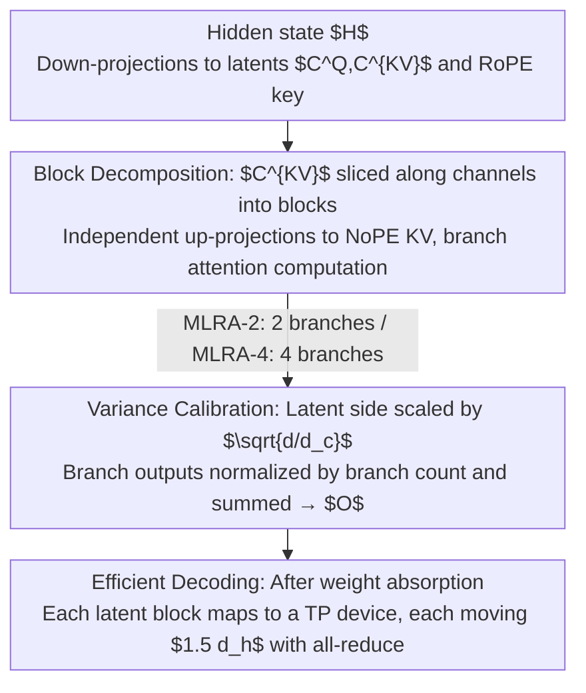

# Multi-Head Low-Rank Attention (MLRA)

**Conference**: ICLR 2026  
**arXiv**: [2603.02188](https://arxiv.org/abs/2603.02188)  
**Code**: [GitHub](https://github.com/SongtaoLiu0823/MLRA) / [HuggingFace](https://huggingface.co/Soughing/MLRA)  
**Area**: Autonomous Driving  
**Keywords**: KV Cache, Tensor Parallelism, Low-Rank Attention, Decoding Efficiency, Multi-Head Latent Attention  

## TL;DR

Multi-Head Low-Rank Attention (MLRA) is proposed, which decomposes the single latent head of MLA into multiple independently shardable latent heads and sums the attention outputs of each branch. This achieves native 4-way tensor parallelism support and a 2.8× decoding speedup while maintaining SOTA performance.

## Background & Motivation

**Long-context inference bottleneck**: During LLM inference, the decoding stage requires repeated transfers of KV cache from HBM (High Bandwidth Memory) to SRAM at each step. Data movement, rather than computation, becomes the primary source of latency for long-context inference.

**Success and Limitations of MLA**: Multi-Head Latent Attention (MLA) introduced by DeepSeek significantly reduces the total KV cache by compressing it into a single latent head (only $4.5 d_h$ per token). However, its single latent head is **non-shardable**—in Tensor Parallel (TP) decoding, each device is forced to redundantly load the complete KV cache.

**Performance Stagnation of MLA under TP**: Regardless of the TP degree, the per-device KV cache loading for MLA remains fixed at $4.5 d_h$, completely offsetting the weight sharding benefits brought by TP.

**Partial Solution of GLA-2**: GLA-2 bisects the latent head into two smaller latent heads, reducing it to $2.5 d_h$ under 2-way TP, but it fails to decrease further when TP > 2.

**Importance of Arithmetic Intensity**: A key metric for decoding efficiency is arithmetic intensity (FLOPs/byte). High computational density must be maintained while reducing memory loading to shift the workload from memory-bound to compute-bound.

**Variance Mismatch Problem**: A significant variance mismatch exists between RoPE keys and NoPE keys in MLA ($\text{Var}(K^{\text{RoPE}}) / \text{Var}(K^{\text{NoPE}}) \approx d/d_c$), which is particularly prominent when the latent dimension is much smaller than the hidden dimension.

## Method

### Overall Architecture

The pain point this paper addresses is that while MLA compresses the KV cache into a single latent head, the total volume is small but **non-shardable**. During TP decoding, each device is forced to redundantly load the full $4.5 d_h$ KV cache, offsetting the TP weight sharding dividend. The core idea of MLRA is to **explicitly decompose** this indivisible latent head into multiple independent latent blocks. Each block is independently up-projected into NoPE KV to compute branch attention, and the outputs are summed. Since branches are decoupled, they naturally map to multiple TP devices.

The forward pass starts with the hidden state $H$ being down-projected to obtain latents $C^Q$, $C^{KV}$, and the shared RoPE key. $C^{KV}$ is then sliced along the channel dimension into multiple blocks; each block is independently up-projected to calculate branch attention. Branch outputs are normalized by the number of branches and summed to obtain $O$. Variance calibration is performed through scaling on the latent side and normalization on the output side to ensure softmax logits do not become unbalanced after decomposition. Two variants are provided: **MLRA-2** uses 2 latent blocks, each serving half the attention heads, resulting in a 2-branch sum (suitable for 2-way TP); **MLRA-4** uses 4 latent blocks, each serving all attention heads, resulting in a 4-branch sum, natively supporting 4-way TP.

### Key Designs

**1. Block Decomposition: Splicing Indivisible Sums into Independent Branches**

The root cause of MLA's inability to shard is that it compresses the entire KV information into one latent head, requiring full block movement during decoding. MLRA breaks this via a neglected algebraic identity: the NoPE key/value for each head in MLA is equivalent to the sum of products of several sub-blocks (Eq. 2 in original paper). Since the result is a sum, this summation can be moved from the "KV calculation stage" to the "attention output stage." Specifically, the KV latent matrix $C^{KV} \in \mathbb{R}^{n \times d_c}$ is sliced into blocks $C_{:,(b)}^{KV}$ along channels, and the up-projection matrices $W^{UK}, W^{UV}$ are sliced into sub-blocks by row. The output of each head then becomes the sum of each branch's attention (using MLRA-4 as an example):

$$O_{:,i,:} = \sum_{b=0}^{3} \text{Softmax}\left(\tau Q_{:,i,:}^{\text{NoPE}} (C_{:,(b)}^{KV} W_{(b),(i)}^{UK})^\top + \tau Q_{:,i,:}^{\text{RoPE}} (K^{\text{RoPE}})^\top \right) (C_{:,(b)}^{KV} W_{(b),(i)}^{UV})$$

Crucially, each branch $b$ depends only on its own block $C_{:,(b)}^{KV}$ (size $d_h$). Branches are decoupled and can be assigned to different TP devices for independent computation, followed by a final sum—something MLA cannot achieve. This logic yields two variants: **MLRA-4** uses 4 blocks and 4 branches to serve all $h$ heads; **MLRA-2** follows the grouping logic of GLA-2 to bisect the latent head, where a mapping function $\gamma(i)$ determines which heads use which latent group, resulting in 2-way TP adaptation with lower decomposition overhead.

**2. Variance Calibration: Competing with the RoPE/NoPE Mismatch**

Decomposition is not free—it exacerbates the existing variance mismatch in MLA. Theoretically, the variance of the NoPE key is $d_c \sigma_w^2$ and the RoPE key is $d \sigma_w^2$. Their ratio is approximately $d/d_c$, which is already significant when the latent dimension is much smaller than the hidden dimension. Slicing latents and summing multi-branch outputs further changes the output variance scale. MLRA employs two explicit scaling steps: on the latent state side, $\alpha_q = \sqrt{d/d_c'}$ and $\alpha_{kv} = \sqrt{d/d_c}$ are used to pull the query/NoPE key variance back to a scale comparable to the RoPE key; on the output side, normalization is applied based on the branch count ($1/\sqrt{2}$ for MLRA-2, $1/2$ for MLRA-4) to counteract variance expansion. This strategy is derived from variance analysis rather than empirical tuning, although it relies on the i.i.d. Assumption 1 of weights.

**3. Efficient Decoding: Natural Device Mapping at $1.5 d_h$**

The previous steps translate into actual decoding speedup. Since latent blocks are independent, they map naturally to TP devices. In MLRA-4 with 4-way TP, each device loads only one latent block ($d_h$) plus the shared RoPE key ($0.5 d_h$). Thus, per-device KV loading drops from MLA's $4.5 d_h$ to $1.5 d_h$ (for comparison, GLA-2 only reaches $2.5 d_h$ at 2-way TP and stagnates thereafter). In implementation, the weight absorption technique from MLA is used to absorb up-projections into the query side, effectively reducing each device's workload to a standard MQA-style decoding followed by an all-reduce sum.

### Loss & Training

- **Initialization**: Output projection parameters use zero initialization (superior to standard $\mathcal{N}(0, 0.02)$); other parameters use standard initialization.
- **Optimizer**: AdamW, $(\beta_1, \beta_2)=(0.9, 0.95)$, weight decay 0.1, gradient clipping 1.0.
- **Learning Rate**: Peak $1.6 \times 10^{-4}$, linear warmup for 2000 steps, followed by cosine annealing to 10%.
- **Training Scale**: 2.9B parameters, FineWeb-Edu-100B dataset, 98.3B tokens, context length 2048, 8 × H100 GPUs.
- **Optional Gating**: Adding a gating mechanism before the attention output projection further reduces perplexity.

## Key Experimental Results

### Main Results

**Validation Perplexity (Average across 7 datasets, lower is better)**:

| Method | Wikipedia | C4 | Pile | RefinedWeb | Cosmopedia | FineWeb | FineWeb-Edu | **Average** |
|------|-----------|------|------|------------|------------|---------|-------------|----------|
| MHA | 14.624 | 16.575 | 12.929 | 18.698 | 9.102 | 15.656 | 9.434 | 13.860 |
| GQA | 15.057 | 16.628 | 13.758 | 18.885 | 9.504 | 15.713 | 9.427 | 14.139 |
| MLA | 14.567 | 16.345 | 12.965 | 18.523 | 8.966 | 15.440 | 9.284 | 13.727 |
| GLA-2 | 14.605 | 16.323 | 13.225 | 18.509 | 9.118 | 15.424 | 9.249 | 13.779 |
| **Ours (MLRA-4)** | **14.407** | **16.286** | **13.124** | **18.398** | **8.937** | **15.361** | **9.193** | **13.672** |

**Zero-shot Common Sense Reasoning Accuracy (%)**:

| Method | ARC-E | ARC-C | OBQA | BoolQ | HellaSwag | Winogrande | PIQA | **Average** |
|------|-------|-------|------|-------|-----------|------------|------|----------|
| MHA | 69.11 | 39.16 | 40.80 | 62.26 | 60.82 | 57.62 | 74.86 | 57.81 |
| GQA | 67.13 | 39.42 | 42.00 | 63.39 | 61.29 | 56.91 | 75.08 | 57.89 |
| MLA | 68.22 | 39.16 | 42.60 | 64.10 | 61.39 | 60.06 | 75.68 | 58.75 |
| **Ours (MLRA-4)** | 67.63 | 41.38 | **43.00** | 61.74 | **62.16** | **61.48** | 74.48 | **58.84** |

### Ablation Study

**Impact of Gating Mechanism on Perplexity (Average across 7 datasets)**:

| Method | w/o Gating | w/ Gating | Gain |
|------|--------|--------|------|
| GQA | 14.139 | 13.806 | -0.333 |
| MLA | 13.727 | 13.642 | -0.085 |
| GLA-2 | 13.779 | 13.701 | -0.078 |
| MLRA-2 | 13.804 | 13.651 | -0.153 |
| **MLRA-4** | **13.672** | **13.621** | -0.051 |

Other ablation findings:
- **Zero Init vs $\mathcal{N}(0, 0.02)$**: Zero initialization consistently outperformed random initialization across all models.
- **Variance Scaling**: MLA and GLA-2 see significant gains; MLRA-2 shows marginal gains as branching naturally mitigates variance mismatch.
- **Doubling Attention Heads**: Under constant parameter counts, doubling heads for GQA/MLA/GLA-2 harmed performance.

### Key Findings

1. **MLRA-4 is Globally Optimal**: It outperforms all baselines, including MLA, in perplexity (13.672) and zero-shot reasoning (58.84%).
2. **2.8× Decoding Speedup**: MLRA-4 achieves steady 2.8× acceleration in 128K-2M token long-context decoding compared to MLA.
3. **1.05-1.26× vs GQA**: Outperforms GQA in long-context decoding, with the gap widening as context length increases.
4. **TP=4 suffices for 1.5 $d_h$**: GQA and GTA require 8-way TP to achieve similar per-device KV loading; MLRA only needs 4-way.
5. **Gating Further Improves**: Adding gating reduces MLRA-4 perplexity to 13.621, remaining optimal.

## Highlights & Insights

- **Elegant Mathematical Motivation**: Starting from MLA's block decomposition, it moves the summation from within the KV calculation to the attention output level, providing a mathematically concise and intuitive solution.
- **Solid Variance Analysis**: Component variances are derived theoretically to provide clear calibration strategies, avoiding empirical tuning.
- **High Practicality**: MLRA shares the same total KV cache as MLA ($4.5 d_h$ per token); the difference lies solely in its ability to shard during distributed decoding, resulting in low migration costs.
- **Arithmetic Intensity Analysis**: The arithmetic intensity of MLRA-4 is approximately $2h$, matching MLA, demonstrating efficiency in computation while reducing memory load.
- **Full Engineering Implementation**: MLRA-4 kernels are implemented based on FlashAttention-3 and validated on real H100 clusters.

## Limitations & Future Work

1. **Validated at 2.9B Scale Only**: Experiments on 7B+ or larger scales were not conducted; whether MLRA's advantages hold at larger scales remains to be seen.
2. **Single Pre-training Dataset**: Only FineWeb-Edu-100B was used, lacking validation on multilingual or code-mixed data.
3. **Limitations of Assumption 1**: Variance analysis assumes weights are i.i.d. and independent of inputs, which is not strictly true during training.
4. **Fixed 4-way Decomposition**: MLRA-4 is tied to 4-way TP; 2-way or 8-way TP scenarios require MLRA-2 or further extension.
5. **Summation Approximation**: Moving the sum outside the softmax changes the attention distribution; while effective, it is not a strictly equivalent transformation.
6. **Instruction Tuning Not Evaluated**: Focus was on pre-training; SFT/RLHF stages were not covered.

## Related Work & Insights

- **MLA (DeepSeek-V2/V3)**: Direct predecessor to MLRA, using latent compression for KV cache, but lacking TP sharding support.
- **GQA**: Grouped Query Attention improves efficiency by reducing KV heads, but KV cache scales linearly with head count.
- **GLA-2 (Zadouri et al., 2025)**: First attempt to split MLA latent heads, but only supports 2-way TP.
- **TPA (Zhang et al., 2025)**: Tensor Product Attention constructs KV via linear combinations of shared heads, with limited TP support.
- **FlashMLA / FlashAttention-3**: High-efficiency attention kernels; MLRA's kernel is built on FlashAttention-3.
- **LongCat (2025)**: First observed the RoPE key variance mismatch; MLRA adopts and extends its scaling strategy.
- **Insight**: The logic of "lifting internal sums to multi-branch independent calculations" may be applicable to other scenarios requiring latent compression + TP, such as KV cache quantization or sparse attention.

## Rating

- **Novelty**: ⭐⭐⭐⭐ — Precise insights; elegantly solves MLA's shardability problem via branch decomposition.
- **Experimental Thoroughness**: ⭐⭐⭐⭐ — Comprehensive ablations, multi-dataset evaluation, and throughput tests, though limited to 2.9B scale.
- **Writing Quality**: ⭐⭐⭐⭐⭐ — Rigorous mathematical derivation, clear notation, and a complete logical chain from background to method.
- **Value**: ⭐⭐⭐⭐ — Directly addresses practical pain points in MLA deployment, offering significant value for DeepSeek-style models and large-scale inference.

<!-- RELATED:START -->

## Related Papers

- [\[AAAI 2026\] CompTrack: Information Bottleneck-Guided Low-Rank Dynamic Token Compression for Point Cloud Tracking](../../AAAI2026/autonomous_driving/comptrack_information_bottleneckguided_lowrank_dynamic_token_compres.md)
- [\[ICLR 2026\] Low-Latency Neural LiDAR Compression with 2D Context Models](low-latency_neural_lidar_compression_with_2d_context_models.md)
- [\[AAAI 2026\] Drive As You Like: Strategy-Level Motion Planning Based on A Multi-Head Diffusion Model](../../AAAI2026/autonomous_driving/drive_as_you_like_strategy-level_motion_planning_based_on_a_multi-head_diffusion.md)
- [\[ICCV 2025\] SRefiner: Soft-Braid Attention for Multi-Agent Trajectory Refinement](../../ICCV2025/autonomous_driving/srefiner_soft-braid_attention_for_multi-agent_trajectory_refinement.md)
- [\[CVPR 2026\] DriverGaze360: OmniDirectional Driver Attention with Object-Level Guidance](../../CVPR2026/autonomous_driving/drivergaze360_omnidirectional_driver_attention_with_object-level_guidance.md)

<!-- RELATED:END -->
