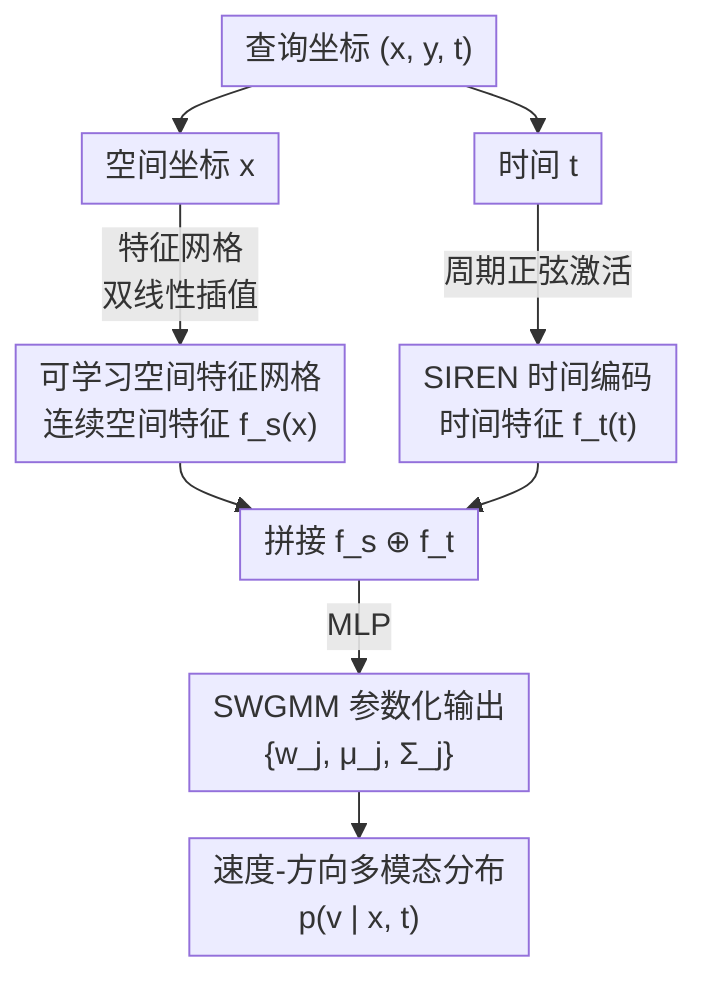

# NeMo-map: Neural Implicit Flow Fields for Spatio-Temporal Motion Mapping

**Conference**: ICLR 2026  
**arXiv**: [2510.14827](https://arxiv.org/abs/2510.14827)  
**Code**: None  
**Area**: Autonomous Driving  
**Keywords**: Dynamic Maps, Neural Implicit Representation, Semi-Wrapped Gaussian Mixture, Human Motion Patterns, Spatio-Temporal Continuity  

## TL;DR
The paper proposes NeMo-map, a continuous spatio-temporal dynamic map based on neural implicit functions. By directly mapping spatio-temporal coordinates to Semi-Wrapped Gaussian Mixture Model (SWGMM) parameters, it eliminates the constraints of spatial discretization and temporal segmentation in traditional methods, achieving lower NLL and smoother velocity distributions on real human tracking datasets.

## Background & Motivation

**Background**: Maps of Dynamics (MoD) assist robot navigation in crowded scenes by encoding statistical motion patterns of the environment. Existing methods like CLiFF-map and STeF-map fit local motion distributions on discrete grids.

**Limitations of Prior Work**: Grid discretization leads to information loss and boundary discontinuities; time is typically segmented by hour, failing to model smooth transitions across periods; and manual selection of grid resolution is environment-dependent.

**Key Challenge**: Discrete representations cannot query motion distributions at arbitrary spatio-temporal coordinates, and sparse regions require interpolation or padding.

**Goal**: (a) Eliminate spatial discretization; (b) enable continuous and smooth spatio-temporal querying; (c) maintain the multimodal nature of motion directions.

**Key Insight**: Model the mapping of $(x, y, t) \to$ SWGMM parameters as a continuous function using neural implicit representations.

**Core Idea**: Utilize a learnable spatial feature grid combined with SIREN temporal encoding and an MLP to directly output continuous spatio-temporal motion distribution parameters.

## Method

### Overall Architecture

This paper addresses the issue of MoDs being fragmented by grids and time intervals. Traditional methods decompose the environment into discrete grids and the day into intervals to fit local motion distributions, resulting in discontinuous boundaries, reliance on interpolation for sparse regions, and manual tuning of grid resolutions. NeMo-map treats the entire dynamic map as a continuous function $\Phi_\theta:(\mathbf{x}, t) \to$ SWGMM parameters, allowing direct queries at any spatio-temporal coordinate.

The pipeline operates as follows: When query coordinates $(\mathbf{x}, t)$ are input, the spatial component $\mathbf{x}$ undergoes bilinear interpolation on a learnable feature grid to extract continuous spatial features $\mathbf{f}_s(\mathbf{x})$. The temporal component $t$ is encoded into $\mathbf{f}_t(t)$ via a SIREN network. These features are concatenated and fed into an MLP, which outputs $J$ sets of Semi-Wrapped Gaussian Mixture (SWGMM) parameters $\{w_j, \bm{\mu}_j, \bm{\Sigma}_j\}$, describing the multimodal velocity-direction distribution at that spatio-temporal point.

### Key Designs

**1. Learnable Spatial Feature Grid: Achieving spatial continuity without losing local details**

Feeding coordinates $\mathbf{x}$ directly into an MLP makes it difficult to express sharp changes in local motion patterns, while discrete grids suffer from boundary discontinuities. NeMo-map compromises by maintaining a feature grid $\mathbf{G}_s \in \mathbb{R}^{H \times W \times C_s}$. At the query position $\mathbf{x}$, it performs bilinear interpolation on adjacent grid point features to obtain continuous spatial features $\mathbf{f}_s(\mathbf{x})$. The grid preserves the locality where "each region has its own motion characteristics," while bilinear interpolation ensures smooth transitions across grid cells—capturing local differences better than pure coordinate MLPs while eliminating discrete boundary issues.

**2. SIREN Temporal Encoding: Aligning with diurnal motion periodicity via periodic activation**

Human motion patterns naturally exhibit periodic cycles within a day (e.g., peak hours, lunch breaks). Traditional methods slice time into discrete hour-long segments, lacking smooth transitions. NeMo-map feeds continuous time $t$ into a SIREN network with periodic sine activation functions to obtain $\mathbf{f}_t(t)$. The sine activation itself is a periodic function, aligning highly with the inductive bias that "motion patterns repeat daily," thus allowing for continuous querying at any time without being constrained by segment boundaries.

**3. SWGMM Parameterized Output: Modeling the joint multimodal distribution of velocity and direction**

Pedestrians may travel in multiple directions at the same location, and velocity is often correlated with direction; therefore, the output cannot be a unimodal distribution. The MLP outputs weights, means, and covariances for each mixture component to model the **joint** distribution of velocity $\rho$ and direction $\theta$. The direction dimension is processed using "semi-wrapping" around a $2\pi$ period, introducing a winding number $k \in \{-1,0,1\}$ to correctly represent the circular topology. This is more refined than the discrete direction histograms (e.g., 8-bins) used in STeF-map, models velocity simultaneously, and is more flexible than VMGMM (which assumes velocity and direction are independent) by explicitly preserving the velocity-direction correlation.

### Loss & Training

Training utilizes negative log-likelihood (NLL) to make the SWGMM distribution predicted by the network fit the observed velocity vectors $\mathbf{v}_i$:

$$\mathcal{L}(\theta) = -\frac{1}{N}\sum_i \log p(\mathbf{v}_i \mid \Phi_\theta(\mathbf{x}_i, t_i))$$

The system is trained end-to-end, with full-day data training in under 20 minutes.

## Key Experimental Results

### Main Results (NLL↓ on ATC Shopping Center Dataset)

| Method | NLL↓ | vs NeMo NLL Gain |
|------|------|-----------------|
| **NeMo-map** | **0.775** | — |
| Online CLiFF-map | 1.527 | +0.752 |
| CLiFF-map | 1.964 | +1.189 |
| STeF-map | 5.576 | +4.801 |

### ETH/UCY Dataset Comparison

| Scenario | NeMo NLL | CLiFF NLL | Gain |
|------|----------|-----------|------|
| ETH | -0.384 | 0.112 | +0.496 |
| HOTEL | -0.838 | 0.701 | +1.539 |
| UNIV | 0.404 | 0.518 | +0.114 |
| ZARA | -0.342 | 0.068 | +0.410 |

Training Efficiency: NeMo-map trains on full-day data in less than 20 minutes.

### Key Findings
- NeMo significantly outperforms baselines across all datasets and scenarios (p < 0.001).
- In sparse regions, NeMo produces smoother velocity distributions, avoiding the discontinuities of discrete methods.
- The model translates into better performance in downstream trajectory prediction tasks.

## Highlights & Insights
- The capability for **continuous spatio-temporal querying** removes the core limitations of MoDs: no predefined grid resolution is needed, and temporal discontinuities are eliminated.
- The cylindrical visualization of SWGMM (direction wrapped around the circle, velocity along the cylinder axis) is highly intuitive and helps in understanding multimodal motion patterns.

## Limitations & Future Work
- The method was validated only on pedestrian scenarios and has not been tested on other dynamic objects like vehicles or bicycles.
- The resolution of the learnable spatial grid still requires manual configuration.
- A comprehensive comparison with deep-learning-based trajectory prediction models is missing.

## Related Work & Insights
- **vs CLiFF-map**: CLiFF uses discretized space and offline batch processing; NeMo uses continuous space and end-to-end training.
- **vs STeF-map**: STeF discretizes direction (8-bin) and does not model velocity; NeMo provides joint modeling of continuous direction and velocity.

## Rating
- Novelty: ⭐⭐⭐⭐ Introducing neural implicit representations to dynamic maps is a natural but effective innovation.
- Experimental Thoroughness: ⭐⭐⭐ Two datasets with statistical significance tests, though scene types are limited.
- Writing Quality: ⭐⭐⭐⭐ Clear and concise, with rigorous mathematical descriptions of SWGMM.
- Value: ⭐⭐⭐⭐ Practical contribution to motion modeling for robot navigation.

<!-- RELATED:START -->

## Related Papers

- [\[AAAI 2026\] I-INR: Iterative Implicit Neural Representations](../../AAAI2026/autonomous_driving/i-inr_iterative_implicit_neural_representations.md)
- [\[ICLR 2026\] UniSplat: Unified Spatio-Temporal Fusion via 3D Latent Scaffolds for Dynamic Driving Scene Reconstruction](unisplat_unified_spatio-temporal_fusion_via_3d_latent_scaffolds_for_dynamic_driv.md)
- [\[CVPR 2026\] SG-NLF: Spectral-Geometric Neural Fields for Pose-Free LiDAR View Synthesis](../../CVPR2026/autonomous_driving/sgnlf_spectralgeometric_neural_fields_for_posefre.md)
- [\[AAAI 2026\] Rethinking the Spatio-Temporal Alignment of End-to-End 3D Perception](../../AAAI2026/autonomous_driving/rethinking_the_spatio-temporal_alignment_of_end-to-end_3d_perception.md)
- [\[ICLR 2026\] Low-Latency Neural LiDAR Compression with 2D Context Models](low-latency_neural_lidar_compression_with_2d_context_models.md)

<!-- RELATED:END -->
