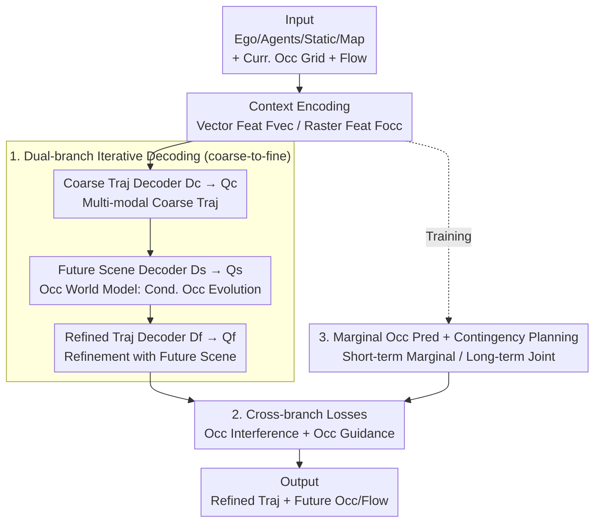

# OccDriver: Future Occupancy Guided Dual-branch Trajectory Planner in Autonomous Driving

**Conference**: ICLR 2026  
**OpenReview**: [https://openreview.net/forum?id=abJCjkIwi5](https://openreview.net/forum?id=abJCjkIwi5)  
**Code**: To be confirmed  
**Area**: Autonomous Driving / Trajectory Planning  
**Keywords**: Trajectory Planning, Occupancy Prediction, World Model, Dual-branch, Contingency Planning

## TL;DR
OccDriver adopts a dual-branch coarse-to-fine framework: a vectorized branch generates coarse trajectories, a rasterized branch acts as an occupancy flow world model to predict future scene evolution conditioned on each trajectory, and the vectorized branch سپس refines the trajectories accordingly. Combined with cross-branch losses and a contingency planning strategy, it achieves SOTA performance on the nuPlan closed-loop benchmark.

## Background & Motivation
**Background**: Trajectory planning in imitation learning mainly follows two paradigms: rasterized methods, which project scenes onto BEV grids to predict spatio-temporal occupancy, offering natural occlusion robustness and a probabilistic joint view; and vectorized methods, which use vectors and DETR-style queries to decode multi-modal trajectories, providing fine-grained individual semantics and high precision.

**Limitations of Prior Work**: Rasterized discretization loses individual details and geometric precision. Vectorized methods tend to oversimplify future interactions, requiring heavy feature engineering to approximate uncertainty. Crucially, most planners are "forward-only," decoding trajectories in one shot without the ability to correct errors during rollouts, often necessitating a heavy trajectory scoring module for safety.

**Key Challenge**: There is a representation trade-off between scene-level joint modeling (probabilistic, occlusion-robust) and individual-level fine modeling (high-precision trajectories). Furthermore, planners lack explicit anticipation of how ego-actions affect future scene evolution.

**Goal**: (1) Retain the probabilistic advantages of rasterized joint modeling while maintaining the individual fidelity of vectorized representations; (2) Enable the planner to explicitly use "future scene evolution" as guidance rather than blind forward execution.

**Key Insight**: Adopt a world model perspective—predict the consequences of ego-behavior before making informed decisions. The authors implement this in the occupancy space: a rasterized branch acts as a "2D occupancy world model," predicting future occupancy/flow induced by candidate trajectories, then distilling this interaction prior back to the vectorized branch for refinement.

**Core Idea**: A rasterized-vectorized dual-branch + coarse-to-fine architecture. The vectorized branch produces coarse trajectories, the rasterized branch predicts occupancy evolution conditioned on these trajectories, and this future scene information refines the final scene-consistent trajectories.

## Method

### Overall Architecture
The input $X$ includes history of the ego vehicle $E$, dynamic agents $A$, static objects $S$, and HD maps $M$. The current frame is projected into occupancy grids $\{O_e^0, O_a^0, O_m\}$ and backward flow $FL^0$ for the occupancy branch input $X_{occ}$. The output consists of $M$-modal ego future trajectories $Y=\{(y_i,\pi_i)\}$ and corresponding multi-modal future occupancy/flow $Y_{occ}$, denoted as $Y, Y_{occ}=f(X,X_{occ}\,|\,\theta)$.

The pipeline consists of three components: **Context Encoding** encodes heterogeneous inputs into individual vector features $F_{vec}$ and joint raster scene features $F_{occ}$; **Dual-branch Iterative Decoding** utilizes three serial decoders for coarse trajectories, future occupancy, and refined trajectories in a coarse-to-fine manner; **Marginal Occupancy Prediction** predicts short-term marginal occupancy for individual agents to support contingency planning. Dedicated losses explicitly inject spatial information from the occupancy branch into the trajectory branch.

### Key Designs

**1. Dual-branch Iterative Decoding: Coarse-to-fine loop (Coarse Traj → World Model → Refined Traj)**

This addresses the inability of "forward-only" planning to correct errors and the precision-probability trade-off. The framework maintains vector features $F_{vec}$ and occupancy features $F_{occ}$, using three serial decoders:

$$Q_c = D_c(Q=Q_{vec},\,K,V=F_{occ},\{F_S,F_M\})$$
$$Q_s = D_s(Q=F_{occ},\,K,V=Q_c,\{F_S,F_M\})$$
$$Q_f = D_f(Q=Q_c,\,K,V=Q_s,\{F_S,F_M\})$$

The coarse trajectory decoder $D_c$ extracts social interactions via self-attention, integrates static obstacles/maps $\{F_S,F_M\}$ via cross-attention, and queries $F_{occ}$ for spatial understanding, resulting in coarse trajectory queries $Q_c$. The future scene decoder $D_s$ acts as a BEV world model, using $F_{occ}$ as queries and $Q_c$ as key/values to decode "what happens conditioned on the ego coarse trajectory" into $Q_s$. The refined decoder $D_f$ then uses $Q_s$ as the key/value for its cross-attention, enabling refinement informed by future scenes. This "anticipate then correct" loop forms the backbone of the method.

**2. Cross-branch Losses: Explicit Injection of Occupancy Priors**

To ensure consistency beyond feature cross-attention, two types of losses bridge the branches. **Occupancy Interference Loss** enforces mutual exclusivity between ego and other occupancy: $L_{oe}=\mathrm{sum}(O_e^*\cdot O_a^{gt})/\mathrm{sum}(O_a^{gt})$ and symmetric $L_{oa}$, with $L_{oi}=L_{oe}+L_{oa}$. This teaches the ego to "plan in occupancy space." **Occupancy Guidance Loss** approximates the ego body using $N_v$ circles and performs coordinate projection + bilinear interpolation on the occupancy grid. The alignment term $L_{align}=\frac{1}{T_f}\sum_t\sum_i \max(0,\varepsilon-O_i^t)$ penalizes trajectory points falling in low ego-occupancy areas. The collision term $L_{collision}=\frac{1}{T_f}\sum_t\sum_i \max(0,\eta-d_i^t)$ penalizes points where the distance $d_i^t$ to other high-occupancy areas is below margin $\eta$. $L_{og}=w_1 L_{align}+w_2 L_{collision}$ effectively translates BEV priors into explicit trajectory constraints.

**3. Marginal Occupancy Prediction & Contingency Planning: Modeling Uncertainty without Efficiency Loss**

Joint occupancy alone cannot capture the uncertainty of individual agent sudden behaviors. An **Marginal Occupancy Encoder** generates individual behavior features $F_{m,i}$ using attention between scene features $F_s$ and single agent vector features, predicting short-term ($T_s < T_f$) marginal occupancy $O_{m,i}$. During **Contingency Planning**, instead of complex scene-tree construction, OccDriver performs probability operations in the dense occupancy space. Before calculating $L_{collision}$, it merges marginal occupancy into the joint occupancy for $t \le T_s$:

$$\tilde{O}_a^{*}=\begin{cases}\max\big(O_a^{t*},\ \max_{i=1}^{N_m} O_{m,i}^t\big), & t\le T_s\\[4pt] O_a^{t*}, & t>T_s\end{cases}$$

This makes the ego more sensitive to sudden risks from agent uncertainty in the short term (conservatism) while maintaining scene-compliant planning in the long term without redundant complexity.

## Key Experimental Results

### Main Results
Evaluation on nuPlan (1M frames training, 2s history / 8s prediction) using Non-Reactive (NR-S) and Reactive (R-S) scores.

| Benchmark | Metric | OccDriver | Prev. Best | Description |
|--------|------|------|----------|------|
| Val14 | NR-S | **0.896** | 0.899 (DiffusionPlanner) | Learning-based SOTA level |
| Val14 | R-S | **0.838** | 0.837 (BeTopNet) | Reactive closed-loop SOTA |
| Val14 | Collisions | **0.971** | 0.966 (BeTopNet) | Best safety score |
| Val14 | TTC | **0.938** | 0.933 (PLUTO) | Best safety score |
| Test14-Hard | NR-S | **0.794** | 0.787 (PLUTO) | SOTA on hard scenarios |
| Test14-Hard | R-S | **0.759** | 0.753 (PLUTO) | +10.3% over BeTopNet |

On Test14-Hard, OccDriver inference takes 23.03 ms, faster than BeTopNet (70 ms) and DiffusionPlanner (40 ms), achieving a better balance between safety and Progress.

### Ablation Study
Cumulative improvements on Val14 (MP=Marginal Prediction, CP=Contingency Planning):

| Config | Collisions | NR-S | R-S | Description |
|------|---------|------|------|------|
| Base Dual-branch | 0.933 | 0.859 | 0.787 | Near SOTA without MP |
| + MP | 0.938 | 0.863 | 0.800 | Models individual behavior uncertainty |
| + $L_{oi}$ | 0.943 | 0.864 | 0.807 | Occupancy interference improves Comfort |
| + $L_{collision}$ | 0.960 | 0.879 | 0.825 | Significant safety gain |
| + $L_{align}$ | 0.960 | 0.885 | 0.830 | $L_{align}$ improves Progress |
| + CP (Full) | **0.971** | **0.896** | **0.838** | Best safety via Contingency Planning |

### Key Findings
- **$L_{collision}$ is the primary contributor**: Its addition improved Collisions (0.943→0.960) and TTC (0.914→0.931), serving as the main driver for safety.
- **Occupancy guidance horizon $T$ has a sweet spot**: Scores improved as the horizon increased up to 6s (NR-S 0.845) but degraded at 8s due to increasing uncertainty in long-term occupancy.
- **Contingency Planning trades minor Progress for Safety**: CP makes the model cautious towards potential marginal behaviors of relevant agents, achieving top safety scores with a slight drop in Progress.

## Highlights & Insights
- **World Model in Occupancy Space**: $D_s$ does not just predict the future generically; it predicts occupancy evolution conditioned on specific candidate trajectories. This "anticipate-then-refine" loop provides a correction mechanism missing in forward-only planners.
- **Probabilistic Contingency Planning via Element-wise Max**: Rewriting scene-tree contingency planning as a probability operation in dense occupancy space avoids combinatorial explosion while maintaining multi-modality.
- **Loss-driven Consistency**: Alignment and collision losses translate BEV probability priors into explicit trajectory constraints, ensuring effective information transfer between branches.

## Limitations & Future Work
- Marginal occupancy prediction is only used during training and relies on rule-based pruning (future bbox intersection), which might miss high-risk agents that aren't currently on the predicted path.
- The method is sensitive to the prediction horizon; performance degrades beyond 6s as occupancy uncertainty accumulates.
- Evaluations are focused on nuPlan; generalization to other datasets or real-world vehicle deployment remains to be verified.

## Related Work & Insights
- **vs. Rasterized Methods (e.g., RasterModel)**: These methods drop individual details; OccDriver retains joint probabilistic modeling while restoring individual fidelity via the vectorized branch.
- **vs. Vectorized Methods (e.g., PLUTO)**: Pure vector methods are forward-only and oversimplify interaction; OccDriver's occupancy guidance outperforms them on safety and hard scenarios (Test14-Hard).
- **vs. Topology-guided (e.g., BeTopNet)**: BeTopNet uses implicit topology and suffers in Progress; OccDriver provides fine-grained spatial interactions, leading to a 10.3% R-S improvement.
- **vs. Diffusion-based (e.g., DiffusionPlanner)**: OccDriver (23 ms) is significantly faster than diffusion denoising (40 ms) while achieving higher driving scores.

## Rating
- Novelty: ⭐⭐⭐⭐ Conditioned occupancy world model and simplified contingency planning are novel.
- Experimental Thoroughness: ⭐⭐⭐⭐ Solid results on nuPlan Val/Test-Hard with comprehensive ablation.
- Writing Quality: ⭐⭐⭐⭐ Clear framework description and complete formulas.
- Value: ⭐⭐⭐⭐ SOTA closed-loop performance with deployment-friendly latency.

<!-- RELATED:START -->

## Related Papers

- [\[NeurIPS 2025\] Future-Aware End-to-End Driving: Bidirectional Modeling of Trajectory Planning and Scene Evolution](../../NeurIPS2025/autonomous_driving/future-aware_end-to-end_driving_bidirectional_modeling_of_trajectory_planning_an.md)
- [\[CVPR 2026\] Dr.Occ: Depth- and Region-Guided 3D Occupancy from Surround-View Cameras for Autonomous Driving](../../CVPR2026/autonomous_driving/drocc_depth_region_guided_3d_occupancy.md)
- [\[AAAI 2026\] Dual-branch Spatial-Temporal Self-supervised Representation for Enhanced Road Network Learning](../../AAAI2026/autonomous_driving/dual-branch_spatial-temporal_self-supervised_representation_for_enhanced_road_ne.md)
- [\[ICLR 2026\] BridgeDrive: Diffusion Bridge Policy for Closed-Loop Trajectory Planning in Autonomous Driving](bridgedrive_diffusion_bridge_policy_for_closed-loop_trajectory_planning_in_auton.md)
- [\[CVPR 2026\] KnowVal: A Knowledge-Augmented and Value-Guided Autonomous Driving System](../../CVPR2026/autonomous_driving/knowval_a_knowledge-augmented_and_value-guided_autonomous_driving_system.md)

<!-- RELATED:END -->
