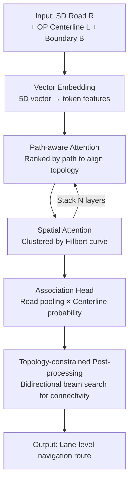

# Online Navigation Refinement: Achieving Lane-Level Guidance by Associating Standard-Definition and Online Perception Maps

**Conference**: ICLR 2026  
**OpenReview**: [https://openreview.net/forum?id=epbzV3FLcI](https://openreview.net/forum?id=epbzV3FLcI)  
**Code**: https://github.com/WallelWan/OMA-MAT  
**Area**: Autonomous Driving / HD Map / Lane-level Navigation  
**Keywords**: Lane-level Navigation, SD Map, Online Perception Map, Map Association, Transformer

## TL;DR
This paper proposes "Online Navigation Refinement" (ONR), a new task to refine road-level routes from SD maps into lane-level guidance. A lightweight Map Association Transformer (MAT) with path-aware and spatial attention is designed to perform "map-to-map" association between heterogeneous SD maps and on-vehicle online perception maps. MAT outperforms all map-matching baselines on the self-built OMA dataset with a latency of 34ms.

## Background & Motivation

**Background**: Lane-level navigation provides finer guidance than road-level navigation (e.g., "take the leftmost lane" instead of just "follow this road"), serving as a critical capability for GIS and autonomous driving. However, current lane-level navigation primarily relies on pre-built offline HD (High-Definition) maps.

**Limitations of Prior Work**: HD maps are expensive to build and maintain, and they update slowly. Real-world changes such as construction, detours, and accidents are often not reflected in time, leading to outdated navigation and safety risks. Another approach uses on-vehicle "online perception maps" (OP maps) to generate local lane geometry in real-time. While fresh and localized, these maps **contain only local geometry without global network topology**, making it impossible to determine which lane corresponds to the intended global route.

**Key Challenge**: SD maps provide global topology but only at the road level, whereas OP maps provide lane-level geometry without global topology. The two are **heterogeneous and not one-to-one**—a single road often corresponds to multiple lanes (many-to-one). Directly fitting SD routes onto OP maps (or vice-versa) ignores semantic differences. Furthermore, spatial jitter from GPS drift and scale variations, along with noise such as disconnections, missed detections, or errors in OP maps, causes traditional map matching (MM) to fail.

**Goal**: (1) Define and formalize the ONR task; (2) provide the first dataset and evaluation metrics with lane-to-road correspondence annotations; (3) design a real-time, noise-robust association model capable of handling many-to-one relationships.

**Key Insight**: The authors advocate for a "**map-to-map**" association paradigm instead of the traditional "trajectory-to-map" matching. By treating the problem as classifying each centerline into its corresponding road, many-to-one relationships are naturally supported, and spatial and topological constraints can be modeled separately.

**Core Idea**: The "road-lane association" is formulated as a many-to-one classification problem via a Transformer. It aligns topology using **path-aware attention** and fuses noisy geometry using **spatial attention**, followed by a topology-constrained post-processing step to ensure network connectivity consistency.

## Method

### Overall Architecture

The input to the Map Association Transformer (MAT) consists of three types of vectorized elements: roads $R$ from the SD map, centerlines $L$ from the OP map, and road boundaries $B$. Each vector $\vec{v}_i=[p^x_{i1},p^y_{i1},p^x_{i2},p^y_{i2},\theta_i]$ is parameterized by its start/end points and orientation $\theta_i$. The task is formalized as learning a mapping $f:\mathcal{L}\to\mathcal{R}$ that assigns each centerline uniquely to one road (uniqueness constraint), while one road can correspond to multiple centerlines (multiplicity constraint).

The pipeline begins with a two-layer MLP for vector embedding to obtain token features. These are passed through $N$ stacked MAT blocks, each alternating between **Spatial Attention (SA)**, **Path-aware Attention (PA)**, and an FFN to inject "geometric proximity" and "topological connectivity" contexts. Finally, the **association head** pools all tokens of the same road into a representative feature and computes similarity with each centerline token to obtain a probability distribution. A **topology-constrained post-processing** step decodes these probabilities into final lane paths satisfying network connectivity. Once the association is established, any route on the SD map can be mapped to corresponding lane paths on the OP map through topological sorting.

### Key Designs

**1. Path-aware Attention: Using topological order as an inductive bias to align topology**

For real-time inference, the framework uses **Group Attention** to reduce complexity from $O(N^2)$ to linear $O(N)$ by performing attention within local windows. Group attention effectiveness depends heavily on whether the token order is semantically meaningful. PA uses **topological order** as an explicit inductive bias: all valid paths are constructed from root to leaf nodes, and tokens are reordered by path indices so that topologically adjacent predecessors/successors are adjacent in the sequence. This ensures that group attention with window size $k$ focuses on topologically relevant neighbors. Tokens appearing in multiple paths are averaged after being restored to their original order. This mechanism addresses spatial jitter and semantic discrepancies by preserving connectivity even when spatial offsets exist.

**2. Spatial Attention: Using space-filling curves for geometric proximity**

While PA captures topological connectivity, it may miss segments that are **geometrically adjacent but topologically disconnected** (e.g., parallel lanes or disconnected boundaries). SA addresses this via **Vector Serialization** based on geometric proximity. First, each vector is discretized into 3D coordinates $(x,y,r)$ (quantized grid position + orientation). Then, a space-filling curve $\varphi^{-1}$ (e.g., Hilbert curve) maps these 3D coordinates to a 1D index, which preserves spatial locality better than simple scanning. Tokens are reordered by this 1D index for group self-attention. This allows entities that are physically close—even if they belong to different map layers—to fall into the same attention bucket, enhancing robustness to GPS drift.

**3. Association Head + Joint Cross-Entropy/CTC Loss: Formulating many-to-one association**

The association head computes a representative feature for each road $j$ by average-pooling its tokens $\bar{F}^{road}_j=\frac{1}{N}\sum_n F^{road}_{jn}$. The association probability for centerline $i$ and road $j$ is calculated as:

$$Prob_{ij}=\exp\!\left(\frac{F^{cl}_i\cdot\bar{F}^{road}_j}{\sqrt{d}}\right)\Big/\sum_{k=1}^{K}\exp\!\left(\frac{F^{cl}_i\cdot\bar{F}^{road}_k}{\sqrt{d}}\right)$$

By applying softmax across all $K$ roads for each centerline, a valid distribution is obtained. Training uses a weighted sum of Cross-Entropy $L_{CE}$ and Connectionist Temporal Classification $L_{CTC}$ loss: $L_{total}=\alpha L_{CE}+\beta L_{CTC}$ (where $\alpha=1, \beta=0.01$). The CTC term helps constrain sequence-level connectivity. Ablation shows CE+CTC improves performance by 0.3% over CE alone and 11.0% over CTC alone.

**4. Topology-constrained Beam Search Post-processing: Structured decoding**

Simply taking the maximum probability for each centerline might result in a disconnected path. Post-processing treats decoding as structured prediction for the entire centerline path $P_j$. It selects an initial centerline with the highest confidence as an anchor: $T_{max}=\arg\max_{l\in P_j}\max_{r\in R}P(l,r)$. A **bidirectional beam search** then starts from $T_{max}$. Instead of searching all roads, it only explores candidates that satisfy the network connectivity constraint $E_r$, ensuring the decoded road sequence is topologically consistent. This step adds +0.2% accuracy with negligible latency.

### Loss & Training
The model is trained for 50 epochs using the AdamW optimizer with a cosine decay learning rate and a 2-epoch linear warm-up. The initial learning rate is 0.0001, weight decay is 0.05, and batch size is 128. Training is performed on an NVIDIA A6000. MAT-T and MAT-L share the same architecture and training configuration, differing only in the number of Transformer blocks to balance efficiency and capacity.

## Key Experimental Results

### Main Results

The OMA dataset is derived from nuScenes (centerline geometry) and OpenStreetMap (road topology), with manual SD-OP association labels. It contains 30K+ scenes, 480K road paths, and 2.6M lane vectors. The validation set uses noise-free GT OP maps, while the test set uses noisy OP maps generated by MapTRv2, MapTR, and SeqGrowGraph. The primary metric is NR P-R (the mean F1 score across 10 thresholds from 0.5 to 0.95).

| Dataset | Metric | MAT-T | MAT-L | Prev. Best (EAM3) | Gain |
|--------|------|-------|-------|----------------|------|
| OMA Val | NR-F1$_{50:95}$ | 78.2 | **78.7** | 72.9 | +5.3~5.8 |
| OMA Val | Latency/ms | **34** | 70 | 345 | ~10× Faster |
| OMA Test (MapTRv2) | NR-F1$_{50:95}$ | 44.8 | **45.0** | 39.1 | +5.9 |
| OMA Test (SeqGrowGraph) | NR-F1$_{50:95}$ | 54.8 | **54.9** | 50.8 | +4.1 |
| OMA Test (MapTR) | NR-F1$_{50:95}$ | 41.5 | **41.9** | 36.3 | +5.6 |

MAT outperforms three categories of methods: map matching (HMM/DeepMM/MTrajRec/GraphMM/EAM3), graph matching (GMT), and point matching (FastMAC). It maintains a stable lead across different OP map generators without specific fine-tuning, demonstrating robustness to various noise distributions.

### Ablation Study

| Configuration | NR-F1$_{50:95}$ | Latency/ms | Note |
|------|-----------------|---------|------|
| Baseline (PTv3) | 61.8 | 59 | Without SA/PA |
| SA Only | 62.1 | 77 | Spatial attention only |
| PA Only | 74.1 | 61 | Path-aware attention only |
| SA+PA | 77.8 | 64 | Combined |
| + Boundary | 78.5 | 69 | With boundary input |
| + Post-processing (Full) | **78.7** | 70 | Full model |

| Configuration | NR-F1$_{50:95}$ | Note |
|------|-----------------|------|
| CE + Avg pool (Full) | **78.7** | Full |
| CTC Only | 67.7 | -11.0% |
| CE + Max pool | 78.5 | Avg pool (+0.2%) |

### Key Findings
- **PA is the primary driver**: PA only (74.1) significantly outperforms SA only (62.1), proving that topological awareness is core. SA+PA adds another +3.7%, showing geometric and topological contexts are complementary.
- **Post-processing is nearly free**: Topology-constrained beam search adds +0.2% accuracy with almost zero latency cost.
- **Insensitive to Loss/Pooling**: Performance remains similar across variation, suggesting effectiveness stems from architectural design rather than specific loss or pooling choices.
- **Data Efficiency**: Using 5% of training data achieves 77.1 (val), close to the full 78.7. However, performance drops sharply to 24.9 at 1%, indicating a minimum data threshold.
- **Cross-city Generalization**: Cross-validation between Boston and Singapore shows small drops on val sets, but larger differences on noisy test sets, indicating that noise amplifies regional discrepancies.

## Highlights & Insights
- **Redefining "Navigation Refinement" as Map-to-Map Classification**: Moving beyond the traditional P-M trajectory matching, this approach treats SD and OP as heterogeneous entities and explicitly handles many-to-one relationships, which better aligns with the structural reality of lane-level navigation.
- **Serializations as Inductive Biases**: By sorting tokens via "topological paths" (PA) and "Hilbert curves" (SA), the model effectively compresses global attention into linear group attention. This technique is highly transferable to other real-time Transformers operating on graphs or point clouds.
- **GT-independent Metric**: The NR P-R metric relies only on GT perception map annotations, allowing it to evaluate any map generation method independently of the generator's specific output format.

## Limitations & Future Work
- **Dependency on OP Map Quality**: Testing scores (40-55) are significantly lower than validation scores (78), indicating that accuracy is heavily constrained by upstream map generation noise.
- **Limited Data Sources**: OMA is currently derived only from two cities (Boston/Singapore) in nuScenes, which may not capture the diversity of global road networks and traffic regulations.
- **Data Threshold**: The performance collapse at 1% data indicates a dependency on annotation volume; zero-shot or low-resource scenarios remain unsolved.
- **Future Directions**: Exploring end-to-end joint training of upstream OP map generation and association to allow association signals to guide map denoising, or incorporating multi-frame temporal aggregation.

## Related Work & Insights
- **vs. Map Matching (HMM / EAM3)**: These focus on "Path-to-Map" trajectory matching assuming one-to-one correspondence. Ours performs "Map-to-Map" association, handling many-to-one relations with better balance between performance and latency (34ms vs 345ms).
- **vs. Online Mapping (HDMapNet / MapTR / TopoSD)**: These focus on **generating** OP maps or using SD priors for denoising. Ours focuses solely on the **association** stage, using topological optimization to resolve assignment ambiguity.
- **vs. Graph/Point Matching (GMT / FastMAC)**: These treat maps as pure graphs or point clouds for geometric alignment, ignoring SD-OP semantic heterogeneity. Ours explicitly models road-lane semantic hierarchies and topological constraints.

## Rating
- Novelty: ⭐⭐⭐⭐⭐ New ONR task + Map-to-map association paradigm + First annotated dataset.
- Experimental Thoroughness: ⭐⭐⭐⭐ Comprehensive baselines and generators; however, limited to two cities and low test scores leave room for improvement.
- Writing Quality: ⭐⭐⭐⭐ Clear task definition and diagrams; mechanisms are well-explained.
- Value: ⭐⭐⭐⭐⭐ High value for low-cost, real-time lane-level navigation in autonomous driving and GIS.

<!-- RELATED:START -->

## Related Papers

- [\[NeurIPS 2025\] SDTagNet: Leveraging Text-Annotated Navigation Maps for Online HD Map Construction](../../NeurIPS2025/autonomous_driving/sdtagnet_leveraging_text-annotated_navigation_maps_for_online_hd_map_constructio.md)
- [\[ICLR 2026\] Stability under Scrutiny: Benchmarking Representation Paradigms for Online HD Map Construction](stability_under_scrutiny_benchmarking_representation_paradigms_for_online_hd_map.md)
- [\[CVPR 2026\] DriverGaze360: OmniDirectional Driver Attention with Object-Level Guidance](../../CVPR2026/autonomous_driving/drivergaze360_omnidirectional_driver_attention_with_object-level_guidance.md)
- [\[CVPR 2025\] Online Video Understanding: OVBench and VideoChat-Online](../../CVPR2025/autonomous_driving/online_video_understanding_ovbench_and_videochat-online.md)
- [\[AAAI 2026\] PriorDrive: Enhancing Online HD Map Construction with Unified Vector Priors](../../AAAI2026/autonomous_driving/priordrive_enhancing_online_hd_mapping_with_unified_vector_p.md)

<!-- RELATED:END -->
## Related Papers

- [\[NeurIPS 2025\] SDTagNet: Leveraging Text-Annotated Navigation Maps for Online HD Map Construction](../../NeurIPS2025/autonomous_driving/sdtagnet_leveraging_text-annotated_navigation_maps_for_online_hd_map_constructio.md)
- [\[CVPR 2026\] DriverGaze360: OmniDirectional Driver Attention with Object-Level Guidance](../../CVPR2026/autonomous_driving/drivergaze360_omnidirectional_driver_attention_with_object-level_guidance.md)
- [\[ICLR 2026\] Stability under Scrutiny: Benchmarking Representation Paradigms for Online HD Map Construction](stability_under_scrutiny_benchmarking_representation_paradigms_for_online_hd_map.md)
- [\[CVPR 2025\] Online Video Understanding: OVBench and VideoChat-Online](../../CVPR2025/autonomous_driving/online_video_understanding_ovbench_and_videochat-online.md)
- [\[AAAI 2026\] PriorDrive: Enhancing Online HD Mapping with Unified Vector Priors](../../AAAI2026/autonomous_driving/priordrive_enhancing_online_hd_mapping_with_unified_vector_p.md)

<!-- RELATED:END -->
