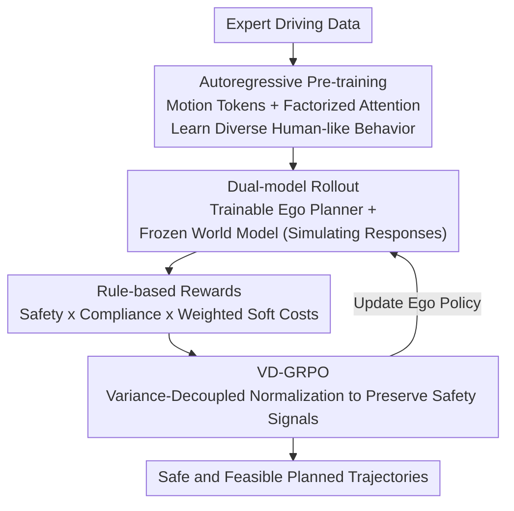

# Plan-R1: Safe and Feasible Trajectory Planning as Language Modeling

**Conference**: ICLR 2026  
**OpenReview**: [https://openreview.net/forum?id=uusTA1rBhR](https://openreview.net/forum?id=uusTA1rBhR)  
**Code**: https://github.com/XiaolongTang23/Plan-R1 (Available)  
**Area**: Autonomous Driving / Trajectory Planning  
**Keywords**: Trajectory Planning, Autonomous Driving, Reinforcement Learning Fine-tuning, GRPO, Safety Alignment

## TL;DR
The paper treats autonomous driving trajectory planning as "language modeling"—first pre-training a motion token predictor autoregressively on expert data to learn "driving like a human," and then applying reinforcement learning fine-tuning with rule-based rewards and an improved GRPO (VD-GRPO). This explicitly aligns the model with driving principles such as safety, comfort, and compliance, achieving SOTA on nuPlan, especially under interactive reactive settings.

## Background & Motivation

**Background**: Learning-based trajectory planning (Imitation Learning IL or Reinforcement Learning RL) has gained traction due to its adaptability and reduced reliance on manual rules. Most mainstream IL and RL approaches rely heavily on expert demonstrations for supervision—directly learning how humans drive.

**Limitations of Prior Work**: Relying solely on expert data has two major drawbacks. First, expert data rarely covers negative samples like collisions or boundary violations, leaving the model with no opportunity to learn "how to avoid accidents." Second, human demonstrations are often imperfect; the authors found that **over 10% of nuPlan training scenarios involve speeding**, alongside uncomfortable maneuvers and dangerous low time-to-collision (TTC). Consequently, models learn these bad habits without a clear concept of "safety."

**Key Challenge**: Planning must simultaneously optimize **multiple conflicting** objectives (collision avoidance must always take precedence over comfort). Imitation learning **couples** the learning of basic driving behaviors with the adherence to safety principles within the same expert data—correcting speeding behavior might interfere with the supervision signal for learning general behavior.

**Goal**: To decouple "behavior learning" from "principle alignment," allowing the model to retain natural human-like driving behavior while explicitly enhancing safety awareness and discarding bad habits found in demonstrations.

**Key Insight**: The authors draw inspiration from the two-stage paradigm of Large Language Models—first pre-training a general predictor via next-token prediction, then fine-tuning for alignment via RL. Since planning is essentially sequence generation, the same logic applies: pre-train as a trajectory predictor on expert data, then use RL to align trajectories with explicit planning principles.

**Core Idea**: Replace "pure expert supervision" with "autoregressive pre-training + rule-based reward RL fine-tuning," and modify GRPO into VD-GRPO to address long-tail safety issues in planning, ensuring rare but fatal safety violations are not overlooked.

## Method

### Overall Architecture
Plan-R1 is a two-stage, dual-model framework. **Stage 1 (Pre-training)**: Discretizes continuous trajectories into spatio-temporal "motion tokens" and uses a transformer decoder with factorized attention for multi-agent next-motion-token prediction. This allows the model to learn diverse, human-like driving behavior distributions without explicit principles. **Stage 2 (Fine-tuning)**: Fine-tunes the ego planner using Reinforcement Learning with a set of interpretable rule-based rewards (collision avoidance, drivable area, speed limits, comfort, progress) to align trajectories with safety and compliance principles. Two key components support the fine-tuning: **Dual-model rollout** (the trainable ego planner collaborates with a frozen world model to simulate realistic responses of surrounding vehicles) and **VD-GRPO** (a modified GRPO that preserves safety signals through improved advantage normalization).

The formalization of this decoupling expresses the joint future motion $p(Y\mid C,P)$ as a combination of an **ego planner** $\pi_e(y_{t,0}\mid y_{<t},C,P)$ (additionally conditioned on planning principles $P$) and an **agent predictor** $p_a(y_{t,n}\mid y_{<t},C)$ (surrounding vehicle prediction, assumed independent of ego principles). $\pi_e$ is initialized by $p_a$ and then fine-tuned via RL.

### Key Designs

**1. Decoupled Two-stage Paradigm: Pre-training for Behavior, RL for Principles**

To address the coupling of basic behavior and safety principles in expert data, the authors split planning into two steps. In pre-training, each agent's trajectory is discretized into motion tokens (segmented by time and clustered via K-disk clustering based on average vertex distance to form a vocabulary, where each token represents a prototype displacement and heading change). The model is trained using a next-motion-token prediction objective $L_{pretrain} = -\sum_{t=1}^{F}\sum_{n=0}^{N}\log p_a(y_{t,n}\mid y_{<t,0:N},C)$ to approximate the distribution of human behavior. This step only ensures the agent "drives like a human." Explicit principles are introduced via RL only in the fine-tuning stage. This ensures pre-training provides a strong behavior prior, while RL **focuses solely on specific aspects like safety/comfort/compliance**, avoiding the need to learn "normal driving" from scratch and correcting bad habits like speeding.

**2. Rule-based Rewards: Interpretable, Unbiased, and Safety-Prioritized**

Unlike existing paradigms (Gen-Drive, TrajHF) that train reward models on expensive human preference data, this work uses a set of **interpretable rule-based rewards** covering collision avoidance, drivable area compliance, comfort, speed limits, and progress. The reward structure is multiplicative: the total reward is the product of **multiplicative safety indicators** and the **weighted sum of soft costs**:

$$R(y_t) = \prod_{k\in I_{safe}} \mathbb{1}_{k,t} \cdot \sum_{j\in I_{cost}} w_j \cdot r_j(y_t),$$

where $\mathbb{1}_{k,t}\in\{0,1\}$ indicates if safety constraint $k$ is satisfied at step $t$. This structure ensures that if any critical safety condition is violated, the total reward is **zeroed out**, whereas soft goals like comfort and progress are only optimized when safety is maintained. This naturally achieves the priority of safety over comfort without extensive weight tuning.

**3. Dual-model Rollout: Trainable Ego Planner + Frozen World Model**

A major difficulty in RL fine-tuning is realistically simulating how surrounding agents react to ego actions. Traditional Ground Truth (GT) replay ignores ego interventions, leading to non-reactive simulations. The authors use a dual-model design: a **trainable ego planner** $\pi_e$ explores decisions, while a **frozen copy of the pre-trained model** $p_a$ serves as a **reactive world model**, predicting agent responses based on the evolving joint history. This separation ensures that ego policy updates do not disturb non-ego dynamics, resulting in stable, reactive, and interaction-aware rollouts. Ablations show this is critical: switching from GT replay to a reactive world model increases R-CLS from 87.44 to 90.04.

**4. VD-GRPO: Preserving Safety Signal Gradients**

Standard GRPO yields limited gains in planning because it normalizes rewards independently within each group: $\tilde{R}(y_t^g)=(R(y_t^g)-\mu_R)/\sigma_R$. This **erases scale differences between groups**. After pre-training, nearly 80% of trajectory groups contain no safety violations, making their reward variance dominated by secondary goals like comfort. Conversely, rare groups with safety violations have high variance. Normalization compresses these safe and unsafe groups into **similar advantage values**, diluting safety-critical gradients. **VD-GRPO** replaces group-wise normalization with **centralization plus a fixed global scaling constant $c$**:

$$\tilde{R}_{VD}(y_t^g) = \frac{R(y_t^g) - \mu_R}{c}.$$

By decoupling normalization from variance, absolute reward scales are preserved. Groups with high variance (catastrophic events) naturally generate larger gradients, amplifying safety signals even when such samples become extremely rare late in training. This reduces the proportion of unsafe groups during training from 6.7% to 4.7%.

### Loss & Training
The fine-tuning follows the GRPO framework, sampling $G$ future trajectories for each scenario from the old policy $\pi_{e_{old}}$:

$$L_{finetune} = -\frac{1}{GF}\sum_{g=1}^{G}\sum_{t=1}^{F}\left(\frac{\pi_e(y_t^g\mid C,P,y_{<t}^g)}{\pi_{e_{old}}(y_t^g\mid C,P,y_{<t}^g)}\hat{A}_t^g - \beta\, D_{KL}[\pi_e\|\pi_{ref}]\right),$$

where the cumulative advantage $\hat{A}_t^g = \sum_{\tau=t}^{F}\tilde{R}(y_\tau^g)$ uses the VD-GRPO term $\tilde{R}_{VD}$. A frozen pre-trained predictor serves as the reference policy $\pi_{ref}$, and the KL term constrains updates to preserve learned human behaviors. Pre-training uses 1M instances, while fine-tuning uses 100K scenarios to manage rollout costs.

## Key Experimental Results

### Main Results
Evaluated on the nuPlan benchmark using non-reactive closed-loop score (NR-CLS) and reactive closed-loop score (R-CLS) (0–100, higher is better).

| Setting | Split | Plan-R1 (Learning-based) | Diffusion Planner | Gain |
|------|------|------|------|------|
| R-CLS | Val14 | **87.69** | 82.80 | +4.89 |
| R-CLS | Test14-hard | **77.20** | 69.22 | +7.98 |
| R-CLS | Test14-random | **90.04** | 82.93 | +7.11 |
| NR-CLS | Test14-hard | **77.45** | 75.99 | +1.46 |

With post-processing refinement (Plan-R1*), the model achieves the highest scores on Val14 (NR-CLS 94.72 / R-CLS 93.54). Plan-R1 remains competitive with the strongest previous methods in non-reactive settings (indicating RL does not break human-like behavior) while leading significantly in reactive settings.

### Ablation Study

| Configuration | NR-CLS | Collision | TTC | Drivable | R-CLS |
|------|--------|-----------|-----|----------|-------|
| Pre-train Only | 85.61 | 94.83 | 90.04 | 94.64 | 82.81 |
| + GRPO | 88.65 | 93.87 | 91.57 | 96.93 | 88.35 |
| + VD-GRPO (Ours) | **91.23** | **97.32** | **95.02** | **97.32** | **90.04** |

World Model Ablation (R-CLS): Pre-train only 82.81 $\rightarrow$ Double model parameters 84.94 $\rightarrow$ GT replay 87.44 $\rightarrow$ Reactive World Model (Ours) 90.04.

### Key Findings
- **VD-GRPO is critical for safety**: Standard GRPO improves progress and speed compliance but causes the critical collision metric to **drop by -0.96**. VD-GRPO improves collision by +3.45 and R-CLS by +1.69 over standard GRPO, reducing unsafe groups from 6.7% to 4.7%.
- **Dual-model design > Scaling capacity**: The reactive world model provides a +7.23 R-CLS gain, whereas doubling parameters only provides +2.13, proving that interaction awareness is more important than model size.
- **Pre-training preserves human behavior**: Qualitative analysis shows expert trajectories often contain speeding segments which prior models like PLUTO and Diffusion Planner inherit. Plan-R1 is the only model that remains compliant throughout, proving RL fine-tuning can correct demonstration flaws.

## Highlights & Insights
- **Planning as Language Modeling**: The perspective is elegant—translating the entire LLM paradigm (tokenization, next-token pre-training, RL alignment) to planning makes it clean and scalable.
- **Multiplicative Safety × Additive Soft Costs**: The reward structure is clever—encoding "safety first" through the structure itself (zeroing out on violation) avoids the "weight-tuning hell" of multi-objective RL.
- **Diagnosis of VD-GRPO**: The identification of how group-wise normalization dilutes rare safety-critical gradients is a significant insight for any safety-critical RL task using GRPO.
- **Efficiency**: Reusing the pre-trained model as a frozen world model allows for reactive simulation without additional training or external complex simulators.

## Limitations & Future Work
- The reward items and weights are still manually designed. While "unbiased and consistent," the completeness of these rules and weight choices remains a potential bottleneck.
- The global scaling constant $c$ in VD-GRPO is a hyperparameter that requires selection; its sensitivity was not extensively discussed.
- Experiments were conducted in nuPlan (bicycle model + LQR, IDM reactive agents); the sim-to-real gap for actual road testing remains unverified.
- The world model assumes surrounding agents' behavior is independent of the ego's internal principles, which may fall short in high-stakes bargaining scenarios (e.g., yielding).

## Related Work & Insights
- **vs. Pure IL (PLUTO / PlanTF / Diffusion Planner)**: These inherit expert bad habits and lack explicit safety awareness; Plan-R1 uses RL to align with safety, leading in reactive settings.
- **vs. Imitation-regularized RL (BC-SAC / Carplanner)**: While stable, these still depend heavily on expert data; Plan-R1 uses rule-based rewards to break away from demonstration biases.
- **vs. Preference-based Fine-tuning (Gen-Drive / TrajHF)**: These rely on expensive human preference labeling for reward models; Plan-R1 uses consistent, unbiased rule-based rewards.
- **vs. Standard GRPO / Dr.GRPO**: While Dr.GRPO removes standard deviation to mitigate difficulty bias in LLMs, VD-GRPO addresses the scale dilution of rare catastrophic events in multi-objective safety RL.

## Rating
- Novelty: ⭐⭐⭐⭐ Translating the LLM paradigm is intuitive, but the diagnosis of GRPO's safety long-tail issues and the VD-GRPO fix is a solid original contribution.
- Experimental Thoroughness: ⭐⭐⭐⭐ Extensive nuPlan splits, NR/R settings, and reward/world model ablations; lacks real-world testing.
- Writing Quality: ⭐⭐⭐⭐ Clear motivation and intuitive visualization of VD-GRPO.
- Value: ⭐⭐⭐⭐ Safe and feasible planning is a core requirement; the rule-based RL + VD-GRPO combo is practical and transferable.

<!-- RELATED:START -->

- **DeepSeek-V3 Technical Report** (GRPO reference)
- **PLUTO: Predictive Learning with Universal Tokenized Outputs**
- **Gen-Drive: Generative Autonomous Driving with Large Language Models**

<!-- RELATED:END -->

## Related Papers

- [\[ICLR 2026\] SMART-R1: Advancing Multi-agent Traffic Simulation via R1-Style Reinforcement Fine-Tuning](advancing_multi-agent_traffic_simulation_via_r1-style_reinforcement_fine-tuning.md)
- [\[ICLR 2026\] DriveAgent-R1: Advancing VLM-based Autonomous Driving with Active Perception and Hybrid Thinking](driveagent-r1_advancing_vlm-based_autonomous_driving_with_active_perception_and_.md)
- [\[ICLR 2026\] BridgeDrive: Diffusion Bridge Policy for Closed-Loop Trajectory Planning in Autonomous Driving](bridgedrive_diffusion_bridge_policy_for_closed-loop_trajectory_planning_in_auton.md)
- [\[NeurIPS 2025\] Future-Aware End-to-End Driving: Bidirectional Modeling of Trajectory Planning and Scene Evolution](../../NeurIPS2025/autonomous_driving/future-aware_end-to-end_driving_bidirectional_modeling_of_trajectory_planning_an.md)
- [\[AAAI 2026\] DriveSuprim: Towards Precise Trajectory Selection for End-to-End Planning](../../AAAI2026/autonomous_driving/drivesuprim_towards_precise_trajectory_selection_for_end-to-end_planning.md)

<!-- RELATED:END -->
