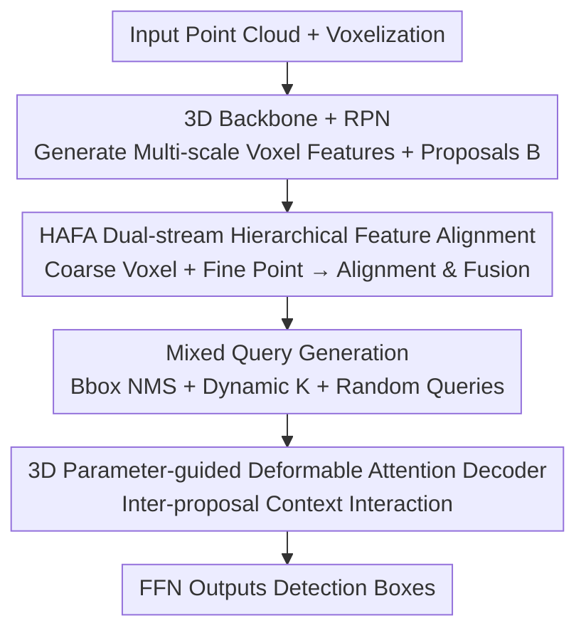

# PTN: Proposal-centric Transformer Network for 3D Object Detection

**Conference**: ICLR 2026  
**OpenReview**: [https://openreview.net/forum?id=ZOREAbteO5](https://openreview.net/forum?id=ZOREAbteO5)  
**Code**: https://github.com/ZhongJianPing1/ptnet.git  
**Area**: 3D Vision / Autonomous Driving Perception  
**Keywords**: LiDAR 3D Detection, Two-stage Detector, Proposal Refinement, Deformable Attention, Transformer

## TL;DR
PTN attributes the bottleneck of two-stage LiDAR detectors to "poor proposal quality"—geometric details are lost during pooling, and proposal refinements are isolated. The authors propose Hierarchical Attention Feature Alignment (HAFA) to recover fine-grained geometry and a Collaborative Proposal Refinement Module (CPRM) that enables context exchange between proposals via deformable attention. PTN achieves SOTA on Waymo and KITTI, particularly significantly improving pedestrian and cyclist detection in sparse point cloud and occluded scenarios.

## Background & Motivation
**Background**: Mainstream 3D object detection in autonomous driving follows the two-stage paradigm (e.g., Voxel R-CNN, PV-RCNN++): an RPN generates proposals (ROI) on BEV features, followed by ROI pooling to extract individual features, which are then refined for final bounding box regression. This approach offers a good compromise between performance and efficiency, serving as the current de facto standard.

**Limitations of Prior Work**: The authors precisely locate the "ceiling" of two-stage detectors in **insufficient proposal quality**, citing two specific reasons. First, **geometric details degrade during pooling**—to expand the receptive field, the detector pools features layer-by-layer, which filters out high-frequency geometric information like surface details and edge sharpness for objects with few or sparse points. This leads to blurry boundaries and incomplete structures (shown in Figure 1 with green boxes). Even methods using foreground-agnostic sampling to recover points often miss sparse foreground points. Second, **neighboring context is ignored during the refinement stage**—existing methods optimize each proposal independently using only local features, failing to borrow complementary information from adjacent or similar object proposals. This is particularly problematic in occluded scenarios: when a vehicle is blocked by a tree, its point cloud is segmented into several parts, each predicted as an independent proposal; without interaction, they lack accurate localization.

**Key Challenge**: Proposal features must simultaneously retain fine-grained geometry (point-level details) and discriminative semantics (voxel-level receptive field), which originate from different sources and are difficult to obtain via a single-stream extraction. Furthermore, the refinement stage treats proposals as isolated islands instead of collaborative nodes.

**Goal**: (1) To provide proposal features with both fine-grained geometry and semantic discriminative power; (2) To enable cross-proposal information exchange during refinement, especially to recover targets that are occluded or over-suppressed by NMS.

**Core Idea**: Proposals are explicitly treated as learnable queries within a DETR-like framework. Fine-grained geometric details are recovered via dual-stream hierarchical feature alignment, followed by context interaction between proposal queries using 3D parameter-guided deformable attention among spatially proximal and semantically related proposals.

## Method

### Overall Architecture
PTN is an enhancement for two-stage detectors based on Voxel R-CNN. The input is the raw point cloud $F_r$, which is voxelized and processed by a 3D sparse convolutional backbone to extract multi-scale voxel features $F_v^{N_v}$ at 2×/4×/8× scales. These are converted to BEV features where an RPN outputs a set of proposals $B=\{b_i\}_{i=1}^N$. Subsequently, each proposal enters **HAFA (Hierarchical Attention Feature Alignment)**: dual streams extract "coarse-grained voxel features" and "fine-grained point features," which are then aligned and fused to obtain the enhanced ROI feature $f_b$. This is followed by **CPRM (Collaborative Proposal Refinement Module)**: high-quality queries are selected from proposals and augmented with random queries, allowing these object queries to interact with the full context of all proposals using deformable attention. Finally, an FFN outputs the detection boxes. The key lies in "thickening each proposal feature first (HAFA), then ending the isolation between proposals (CPRM)."

### Key Designs

**1. HAFA: Coarse Voxel for Semantics, Fine Point for Geometry, then Align**

Addressing the loss of geometric detail in pooling, HAFA uses two complementary streams. The **Coarse-grained Voxel Feature Extraction (CVFE)** stream divides each proposal $b=(x,y,z,l,w,h,\theta)$ into $g\times g\times g$ grid points, extracts features $\{f_g^{b,i}\}$ via trilinear interpolation, and processes them as tokens in a Transformer encoder for intra-grid interaction, yielding semantic-oriented features $f_b^c=\mathrm{MLP}(\mathrm{Encoder}(Q_c,P_g))$, where $P_g$ is the learnable absolute position encoding. The **Fine-grained Point Feature Recovery (FPFR)** stream harvests geometry directly from unsampled raw foreground points: points within the proposal are transformed to a local coordinate system $P^*=R_\theta\cdot(P'-T_b)$ to eliminate size ambiguity, and Euclidean distances to the six faces of the box are calculated as additional features, forming $f_b^p=\mathrm{Concat}((p^*_x,p^*_y,p^*_z),f_a,(d_l,d_r,d_f,d_b,d_t,d_d))$. This is processed via MLP and max-pooling to get $f_b^r$. Finally, **Feature Alignment (FA)** projects the concatenated features into a unified space: $f_b=\mathrm{Conv}(\mathrm{Concat}(f_b^c,f_b^r))$. This ensures high-frequency details needed for localization are recovered—ablations show that for sparse objects at high IoU thresholds (0.7), TP increases by +10.9%.

**2. Mixed Query Generation: Bbox NMS + Dynamic K + Random Queries**

To prevent the accidental removal of ground truth targets and adapt to varying scene densities, CPRM generates object queries in three steps. **First, Bbox NMS replaces Center NMS**: Traditional Non-Local NMS uses proposal centers, which can delete nearby true positive proposals when classification is inaccurate in early training (red circles in Figure 3); PTN uses Bbox NMS with a low threshold (e.g., 0.5) to select more diverse candidates $B_{nms}$. **Second, Dynamic K Estimation**: Since the number of objects in 3D scenes varies, a fixed Top-K is suboptimal. PTN estimates the number of targets $CNT=\varphi(HM)=\mathrm{SUM}(HM>s_t)$ based on the RPN classification heatmap $HM$ ($s_t=0.3$, enabled only after epoch $\tau$). $CNT$ is mapped to three intervals $[0,20)/[20,40)/[40,200]$ with corresponding $K=180/240/300$. **Third, Random Queries**: To recover small targets suppressed by NMS, learnable random queries $Q_r$ with fixed scales $(0.05L,0.05W,0.5H)$ are initialized at grid centers in the BEV space. The final object query is $Q=\mathrm{Concat}(Q_p,Q_r)$. Ablations confirm that while increasing proposal queries alone (300 to 400) increases redundancy and drops performance (mAPH 57.79 to 55.94), adding 100 random queries reaches a new high in recall (mAPH 61.49).

**3. 3D Parameter-guided Deformable Attention Decoder: Neighborhood Context Aggregation**

To enable proposals to borrow complementary information from neighbors, this step facilitates interaction between object queries $Q$ and the full context of all proposal features $F_b$. The authors note that global cross-attention from DETR is inefficient for 3D detection due to target sparsity. Instead, 3D box parameters (position, size, orientation) of the object query generate spatial attention weights to dynamically adjust sampling offsets for deformable convolution. This allows the network to capture structural features of adjacent targets and inject scene-level dependencies: $Q'=\mathrm{Decoder}(Q,P_q,F_b)$. In heavy occlusion scenarios, PTN improves Recall@0.5 by 8.8% compared to Voxel R-CNN.

### Loss & Training
PTN is built upon Voxel R-CNN with training settings aligned with Deng et al. (2021). In CPRM, target counts $CNT$ are categorized into $K_1=180, K_2=240, K_3=300$. Dynamic K estimation starts after epoch $\tau$; earlier epochs use the maximum $C$ to ensure stability when classification scores are unreliable.

## Key Experimental Results

### Main Results

| Dataset | Metric | Ours (PTN) | Prev. SOTA | Gain |
|--------|------|----------|---------------|------|
| Waymo val | mAP/mAPH (L2) | 73.5 / 71.2 | DSVT 73.2/71.0 | +0.3/+0.2 |
| Waymo val | Pedestrian AP/APH L2 | 76.8 / 71.4 | DSVT 75.2/69.8 | +1.6/+1.6 |
| Waymo val | Cyclist AP/APH L2 | 75.0 / 73.9 | DSVT 73.6/72.7 | +1.4/+1.2 |
| Waymo test | mAP/mAPH (L2) | 72.7 / 70.6 | PV-RCNN++ 72.4/70.2 | +0.3/+0.4 |
| KITTI test | Car mAP | 84.11 | DPFusion 83.53 | +0.58 |
| KITTI test | Cyclist mAP | 72.11 | PASS-PV 69.93 | +2.18 |

Gains are primarily concentrated in **Pedestrian and Cyclist** classes, which are often sparse or occluded. For pedestrians, HAFA's recovery of point features significantly improves localization. For multi-frame input (4-frame), PTN achieves mAP/mAPH (L2) of 75.6/74.1.

### Ablation Study

| Configuration | mAP/mAPH (L2) | Description |
|------|---------------|------|
| Baseline | 60.00 / 57.45 | No components added |
| + HAFA | 63.52 / 60.19 | Addition of HAFA only |
| + CPRM | 64.45 / 61.57 | Addition of CPRM only |
| + HAFA + CPRM | 66.40 / 63.58 | Full model |
| Np=300, Nr=0 | 61.75 / 57.79 | No random queries |
| Np=300, Nr=100 | 64.45 / 61.57 | 100 random queries added |
| Np=400, Nr=0 | 59.78 / 55.94 | Excess queries causing redundancy |

(Ablations use 25% of the data for training/validation.)

### Key Findings
- **HAFA Internal Ablation (Table 8)**: Fine-grained point features (FPFR) contribute more to localization than voxel features (CVFE). The combination CVFE+FPFR+FA is essential for optimal performance (63.52).
- **Random Queries for Recall**: Without random queries, there is a trade-off between proposal diversity and similarity. Adding 100 random queries increases mAPH from 57.79 to 61.57.
- **Maximized Gains in Sparse/Occluded Scenes**: For sparse objects, high IoU (0.7) TP increases by 10.9%. For heavy occlusion, Recall@0.5 increases by 8.8%, validating HAFA for geometry and CPRM for context.
- PTN maintains a balance between performance and speed on an A100 (Figure 4).

## Highlights & Insights
- **Explicitly treating proposals as DETR queries**: Unlike DETR variants relying on dense feature matching, PTN allows proposals to interact as learnable queries via deformable attention, naturally blending the two-stage paradigm with Transformers.
- **Clear division of labor in dual streams**: Coarse voxels handle semantics/classification, while fine raw points handle geometry/regression. This task-oriented feature extraction is transferable to other detection tasks needing both classification and localization.
- **Random queries for missing detections**: Using grid-based random queries with spatial priors to recall true positives suppressed by NMS is a low-cost but effective trick, especially for small/occluded objects.
- **Tailored attention for 3D sparsity**: PTN recognizes the small footprint of 3D targets and restricts interaction to neighborhoods using 3D box parameters, representing a targeted refinement of DETR.

## Limitations & Future Work
- The authors admit that future work should use more learnable mechanisms to improve proposal quality at lower costs, as current dynamic K intervals and random query counts are somewhat empirical.
- The method is coupled with the Voxel R-CNN two-stage base; its transferability to other bases or pure single-stage detectors has not been fully verified.
- Dynamic K estimation depends on the RPN classification heatmap. While early epochs use a ceiling value, poor RPN quality could lead to inaccurate count estimation.
- PTN shows less of an advantage in the Waymo Vehicle category compared to some strong baselines (e.g., PV-RCNN++ test), with gains heavily concentrated on pedestrians and cyclists.

## Related Work & Insights
- **vs. Voxel R-CNN**: While both use voxel-based two-stage detection, PTN enhances proposal geometric quality and semantic consistency through hierarchical alignment and dynamic context refinement.
- **vs. DETR-like 3D Detectors (TransFusion / CMT / ConQueR / FocalFormer3D)**: These often rely on heatmap-guided queries or dense matching. PTN uses explicit proposals as queries and restricts global attention to neighborhood interaction to suit 3D sparsity.
- **vs. Foreground Sampling (PV-RCNN series)**: These methods often miss sparse foreground points. PTN's FPFR constructs features directly from unsampled raw points based on box face distances, better preserving sparse geometric structures.

## Rating
- Novelty: ⭐⭐⭐⭐ Proposal-as-query + 3D neighborhood deformable interaction + dual-stream geometry/semantic split. The combination is clean and targeted, though individual components are refinements of existing ideas.
- Experimental Thoroughness: ⭐⭐⭐⭐ Comprehensive evaluation on Waymo/KITTI with extensive ablations on sparsity, occlusion, multi-frame, and query counts.
- Writing Quality: ⭐⭐⭐⭐ Precise problem identification and intuitive illustrations, though some symbols (e.g., $F_r$) are slightly reused.
- Value: ⭐⭐⭐⭐ Provides a practical and reproducible solution to proposal quality bottlenecks in two-stage LiDAR detection, with open-source code.

<!-- RELATED:START -->

## Related Papers

- [\[ICLR 2026\] AsyncBEV: Cross-modal Flow Alignment in Asynchronous 3D Object Detection](asyncbev_cross-modal_flow_alignment_in_asynchronous_3d_object_detection.md)
- [\[AAAI 2026\] Towards 3D Object-Centric Feature Learning for Semantic Scene Completion](../../AAAI2026/autonomous_driving/towards_3d_object-centric_feature_learning_for_semantic_scene_completion.md)
- [\[CVPR 2026\] ReManNet: A Riemannian Manifold Network for Monocular 3D Lane Detection](../../CVPR2026/autonomous_driving/remannet_a_riemannian_manifold_network_for_monocular_3d_lane_detection.md)
- [\[CVPR 2025\] Cubify Anything: Scaling Indoor 3D Object Detection](../../CVPR2025/autonomous_driving/cubify_anything_scaling_indoor_3d_object_detection.md)
- [\[AAAI 2026\] Exploring Surround-View Fisheye Camera 3D Object Detection](../../AAAI2026/autonomous_driving/exploring_surround-view_fisheye_camera_3d_object_detection.md)

<!-- RELATED:END -->
