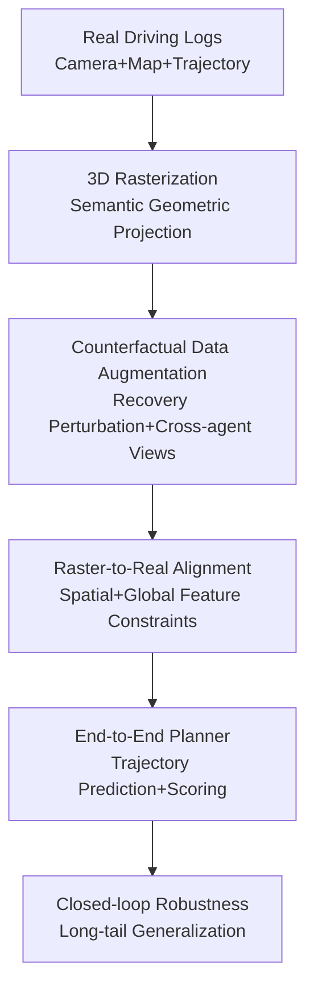

# RAP: 3D Rasterization Augmented End-to-End Planning

**Conference**: ICLR 2026  
**OpenReview**: [https://openreview.net/forum?id=a9bOgeqbdB](https://openreview.net/forum?id=a9bOgeqbdB)  
**Paper**: [Project Page](https://alan-lanfeng.github.io/RAP/)  
**Code**: Not provided in cache  
**Area**: Autonomous Driving / End-to-End Planning  
**Keywords**: End-to-End Autonomous Driving, 3D Rasterization, Data Augmentation, Raster-to-Real Alignment, Closed-loop Robustness

## TL;DR
RAP utilizes lightweight 3D rasterization to generate controllable counterfactual views and recovery scenes from real driving logs. It then stabilizes the transfer of these synthetic samples to real-image planners through feature-space Raster-to-Real alignment, significantly enhancing end-to-end planning robustness on closed-loop/long-tail benchmarks such as NAVSIM, WOD-E2E, and Bench2Drive.

## Background & Motivation
**Background**: End-to-End (E2E) autonomous driving planning typically maps multi-view camera inputs, historical ego states, and route information directly to future trajectories or control commands. The mainstream training paradigm remains offline imitation learning: models imitate expert trajectories in large-scale real driving logs. This approach achieves strong results on open-loop metrics and avoids multi-stage error propagation common in modular systems.

**Limitations of Prior Work**: A critical weakness of offline imitation learning is the narrow training distribution. Models primarily see samples where the expert has already performed correctly, with few examples of "how to recover after deviating from the expert route." Once deployed in a closed loop, even a slight prediction error leads to states not covered in the training set; small errors accumulate, eventually leading to collisions, boundary violations, or stagnation. This is the classic covariate shift and lack of recovery data in autonomous driving.

**Key Challenge**: A natural solution is generating counterfactual scenes using simulators or digital twins. However, photorealistic neural rendering, 3D Gaussian Splatting, or game-engine reconstruction are too slow, expensive, and waste training costs on pixel appearance. For planning, the critical elements are not texture and lighting, but lane geometry, agent positions, orientations, relative motion, and traffic signals. The core contradiction identifies that E2E planning requires large-scale, controllable data covering deviated states, but not necessarily photorealistic pixels.

**Goal**: The authors aim to construct a scalable data augmentation framework that allows camera E2E planners to learn not only real ego trajectories but also counterfactual recovery trajectories and perspectives from other agents. Simultaneously, synthetic inputs must effectively transfer to real-image inference without being rendered useless by the appearance gap between rasterized and real images.

**Key Insight**: RAP shifts the focus from "rendering the real world" to "rendering planning semantics." Instead of restoring sky, road textures, or complex lighting, it projects map polylines, vehicle/pedestrian cuboids, and traffic light states from log annotations onto the camera view to quickly generate RGB raster maps with geometric and dynamic information. It then aligns raster and real data in the feature space rather than the pixel space, enabling the planner to learn transferable structural representations.

**Core Idea**: Use controllable 3D rasterization as a replacement for expensive photorealistic rendering to expand the E2E planning training distribution, and resolve the transfer gap from synthetic perspectives to real images via Raster-to-Real feature alignment.

## Method

### Overall Architecture
RAP is an augmentation framework built around training data for autonomous driving planning. The inputs are multi-view cameras, ego trajectories, map annotations, and 3D states of agents from real driving logs. The output is a set of real/synthetic samples for training E2E planners and a planning model capable of absorbing supervision from both domains.

The process consists of three steps: converting log annotations into projectable 3D scene primitives, generating non-trivial augmented samples via rasterization, and transferring structural supervision from synthetic samples to the real image feature space through R2R alignment.

### Key Designs
**1. 3D Rasterization: Replacing Photorealism with Semantic Geometry**

RAP redefines what a "synthetic driving perspective" should preserve. While neural rendering attempts pixel-level realism, E2E planning relies on road topology, lane lines, drivable areas, and agent poses. Thus, static map elements are represented as polylines $M=\{P_k\}$, and dynamic objects (vehicles, pedestrians) as oriented cuboids with poses $T_i \in SE(3)$.

All 3D primitives are projected onto the image plane via camera intrinsics $K$ and extrinsics $T_{w\to c}$ using a standard pinhole model. Depth-aware compositing handles occlusions, and a distance-decay weight $\alpha=\max(0,1-d/d_{max})$ represents proximity. This representation retains the semantics, geometry, and depth cues needed for planning without the overhead of NeRF or 3DGS.

**2. Counterfactual Data Augmentation: Expanding Logs to Recovery and Multi-Agent Distributions**

To address the limitations of imitation learning, RAP generates states outside the logged trajectory. The first category is recovery-oriented perturbation: lateral/longitudinal offsets and Gaussian noise are added to the expert trajectory $\tau^*(t)$ to construct $\tilde{\tau}(t)=\tau^*(t)+\delta_{lat}(t)+\delta_{long}(t)+\epsilon_t$. Camera views are then re-rendered from these perturbed states to teach the model how to return to a reasonable path.

The second category is cross-agent view synthesis. RAP replaces other agent trajectories with the ego trajectory and re-renders from their perspectives. This expands the sample size and exposes the model to diverse interaction roles and relative motion patterns.

**3. Raster-to-Real Alignment: Bridging Geometric Primitives and Real Images**

To prevent the model from learning domain-dependent shortcuts (e.g., simplified colors), RAP aligns real and raster features. Given paired real samples $x_r$ and rasterized samples $x_s$, the encoder outputs $F^r=\phi(x_r)$ and $F^s=\phi(x_s)$, where $F\in\mathbb{R}^{N\times d'}$.

Spatial alignment uses MSE: $L_{spatial}=\frac{1}{N}\sum_{j=1}^{N}\lVert F^r_j-F^s_j\rVert_2^2$. Global alignment utilizes a domain classifier and a gradient reversal layer to ensure features are domain-invariant: $L_{global}=-\mathbb{E}_{(g,y)}[y\log D(g)+(1-y)\log(1-D(g))]$. The final objective is $L=L_{task}+\lambda_sL_{spatial}+\lambda_gL_{global}$.

**4. Agnostic Integration: RAP as a Training Recipe**

RAP is compatible with various E2E planning architectures. The high-performance version, RAP-DINO, uses a frozen DINOv3-H backbone with an iterative deformable attention decoder. The framework was also integrated into existing methods like RAP-iPad and RAP-DiffusionDrive, demonstrating that its gains come from the training paradigm rather than just model capacity.

### Loss & Training
$L_{task}$ includes supervision for future trajectories and trajectory scoring (PDMS scores). The alignment uses $\lambda_{spatial}=0.002$ and $\lambda_{global}=0.1$. Training utilizes data from OpenScene/nuPlan, extracting 7-second clips (2s input, 5s output). The final dataset comprises 85k real-raster pairs, 8.5k perturbed raster samples, and nearly 500k additional agent/trajectory raster samples.

## Key Experimental Results

### Main Results
RAP was validated on four major benchmarks: NAVSIM v1/v2, WOD-E2E, and Bench2Drive.

| Benchmark | Model | Key Metric | Ours | Prev. SOTA | Gain / Conclusion |
|------|------|----------|----------|------------|-------------|
| NAVSIM v1 navtest | RAP-DINO | PDMS ↑ | 93.8 | 92.1 (Centaur) | Highest among camera-only methods |
| NAVSIM v2 navhard | RAP-DINO | EPDMS ↑ | 36.93| 23.12 (LTF) | Significant lead in counterfactual eval |
| WOD-E2E | RAP-DINO | RFS Overall ↑ | 8.04 | 7.99 (Poutine) | Best overall, lowest ADE@5s (2.65) |
| Bench2Drive | RAP-ResNet | Driving Score ↑| 66.42| 65.02 (iPad) | Superior closed-loop Success Rate |

### Ablation Study
- **Raster Appearance**: Colored faces, depth decay, and black backgrounds provided the best performance. Natural backgrounds introduced interference.
- **Recovery Perturbation**: Adding 8.5k perturbed samples improved NAVSIM v2 EPDMS from 32.5 to 36.9, confirming its value for closed-loop counterfactuals.
- **R2R Alignment**: Combining spatial and global alignment achieved the lowest MinADE, bridging the domain gap effectively.
- **Scaling Law**: Cross-agent view synthesis followed a clear scaling law ($R^2=0.9942$), showing consistent gains as sample volume increased.

### Key Findings
- RAP's benefits are most pronounced in closed-loop evaluations (NAVSIM v2).
- Simplified rasterization (colored faces, depth decay) effectively captures planning-critical cues.
- R2R alignment allows the real image branch to absorb structural supervision from the "clean" raster domain.
- The framework is model-agnostic and improves diverse planners.

## Highlights & Insights
- **Semantic Scalability**: Prioritizing geometric/semantic expansion over photorealism allows for much cheaper data generation.
- **Recovery-Oriented Design**: Directly addresses the root cause of imitation learning failures by populating the training distribution with "error-correction" states.
- **Efficient Feature Alignment**: R2R alignment avoids the complexity of pixel-level sim-to-real while ensuring the planner extracts stable structures.
- **Scaling from Existing Logs**: Cross-agent synthesis extracts significantly more value from existing expert logs without new data collection.

## Limitations & Future Work
- **Imitation Paradigm**: Still relies on expert trajectories; does not fully explore self-improvement through interactive RL.
- **Label Dependency**: Accuracy is bounded by the quality of 3D boxes and map annotations in the logs.
- **Visual Cues**: Simplified rasters might miss un-annotated cues (e.g., temporary signs), though real-image training partially mitigates this.
- **Future Work**: Extending RAP to a truly closed-loop simulator for online reinforcement learning or active data aggregation.

## Related Work & Insights
- Compared to NeRF/3DGS for digital twins, RAP is faster and focuses on planning-centric geometry.
- Unlike CARLA, it uses real-world log structures directly rather than manual assets.
- It outperforms standard image-reprojection by supporting much larger view/state variations through 3D primitive re-rendering.

## Rating
- **Novelty**: ⭐⭐⭐⭐⭐ Clear problem definition and clever trade-off between realism and scalability.
- **Experimental Thoroughness**: ⭐⭐⭐⭐⭐ Extensive benchmarks and comprehensive ablation on all components.
- **Writing Quality**: ⭐⭐⭐⭐☆ Well-structured with strong evidence-based arguments.
- **Value**: ⭐⭐⭐⭐⭐ Highly practical recipe for improving E2E planning robustness via synthetic augmentation.

<!-- RELATED:START -->

## Related Papers

- [\[ICLR 2026\] VADv2: End-to-End Vectorized Autonomous Driving via Probabilistic Planning](vadv2_end-to-end_vectorized_autonomous_driving_via_probabilistic_planning.md)
- [\[AAAI 2026\] DriveSuprim: Towards Precise Trajectory Selection for End-to-End Planning](../../AAAI2026/autonomous_driving/drivesuprim_towards_precise_trajectory_selection_for_end-to-end_planning.md)
- [\[ICLR 2026\] ResWorld: Temporal Residual World Model for End-to-End Autonomous Driving](resworld_temporal_residual_world_model_for_end-to-end_autonomous_driving.md)
- [\[CVPR 2026\] ActiveAD: Planning-Oriented Active Learning for End-to-End Autonomous Driving](../../CVPR2026/autonomous_driving/activead_planning-oriented_active_learning_for_end-to-end_autonomous_driving.md)
- [\[ICLR 2026\] ReCogDrive: A Reinforced Cognitive Framework for End-to-End Autonomous Driving](recogdrive_a_reinforced_cognitive_framework_for_end-to-end_autonomous_driving.md)

<!-- RELATED:END -->
