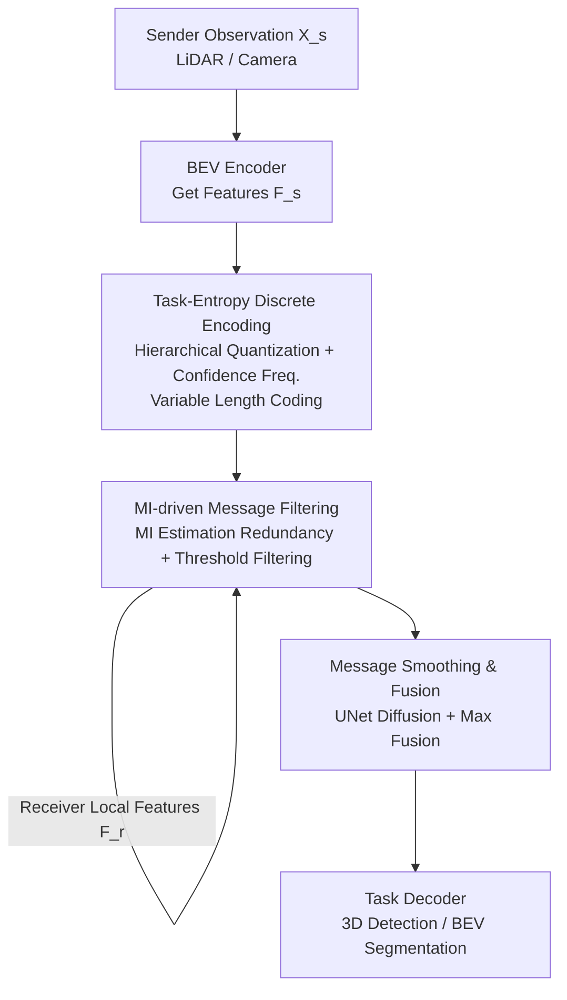

# Rate-Distortion Optimized Pragmatic Communication for Collaborative Perception

**Conference**: ICLR 2026  
**OpenReview**: [https://openreview.net/forum?id=920RxFvsMx](https://openreview.net/forum?id=920RxFvsMx)  
**Code**: https://github.com/gjliu9/RDcomm  
**Area**: Autonomous Driving / Collaborative Perception  
**Keywords**: Collaborative Perception, Rate-Distortion Theory, Information Theory, Communication Compression, Multi-Agent

## TL;DR
This paper extends the classic Shannon rate-distortion theory into a "pragmatic rate-distortion theory" oriented towards multi-agent collaborative perception. It derives two necessary conditions for optimal communication strategies: transmitting only task-relevant information and avoiding information redundant with the receiver's observations. Based on these, the RDcomm framework (task-entropy discrete encoding + mutual information-driven message filtering) is designed. It achieves SOTA accuracy in 3D detection and BEV segmentation across 4 datasets while compressing communication volume by up to 108x.

## Background & Motivation
**Background**: Multi-agent collaborative perception allows agents like vehicles and roadside units to share visual features, overcoming occlusions and limited fields of view in single-vehicle perspectives. It has shown significant advantages in tasks such as 3D detection and BEV segmentation. However, there is an inherent **Key Challenge**: the **trade-off between task performance and communication volume**. Sharing more information improves perception accuracy but increases bandwidth overhead, while excessive compression leads to the loss of task-critical information and performance degradation.

**Limitations of Prior Work**: Existing methods handle this trade-off primarily through heuristics. One category is spatial selection, which transmits only task-relevant regions (e.g., Where2comm sends high-confidence regions; CoSDH sends unobserved regions). Another is neural compression (VQ quantization, channel reduction, autoencoders). However, these methods rely on intuitive manual designs and **lack theoretical support**, failing to answer two fundamental questions: what to communicate and how to encode under bandwidth constraints.

**Key Challenge**: Although classic rate-distortion theory characterizes the optimal boundary of "bitrate vs. distortion," it is ill-suited for collaborative perception in two ways: first, it uses distortion based on reconstruction fidelity (e.g., MSE), measuring the similarity to the original signal, whereas collaborative perception focuses on task performance degradation; second, it considers single-source compression without accounting for the fact that multiple agents observe the same scene, making **inter-agent observations highly redundant**.

**Goal**: Establish a theory to directly guide the design of collaborative communication, transforming the decisions of "what to transmit" and "how to encode" from heuristics into optimal conditions.

**Key Insight**: Starting from information theory, this paper extends the Shannon rate-distortion framework in two directions: introducing "pragmatic distortion" (measuring information degradation by task performance rather than reconstruction error) and generalizing it to multi-agent distributed communication (explicitly modeling inter-agent redundancy).

**Core Idea**: Use "pragmatic rate-distortion theory" to derive two sufficient conditions for optimal communication (pragmatic-relevant and redundancy-less), then design two modules in RDcomm to approximate these conditions.

## Method

### Overall Architecture
The goal of RDcomm is to minimize the total bits transmitted between all agents given a task loss upper bound $L_{max}$. This goal is first formulated in a rate-distortion form: $\text{Rate}(\delta) = \min_{p(Z_{s\to r}|X_s)} I(X_s; Z_{s\to r})$ s.t. $D_Y[X_s, Z_{s\to r}|X_r] \le \delta$, where $I(X_s; Z_{s\to r})$ measures how much information the transmitted message retains from the original observation, and $D_Y$ is pragmatic distortion.

The core theoretical conclusion (Theorem 1) provides a closed-form decomposition of the minimum bitrate:

$$\text{Rate}(\delta) = H(X_s) - \underbrace{H(X_s|Y)}_{\text{Task-irrelevant info}} - \underbrace{I(Y; X_s; X_r)}_{\text{Redundant info with receiver}} - \delta$$

This decomposition indicates that to approach the minimum bitrate, the transmitted message must exclude both "task-irrelevant parts" and "redundant parts with the receiver." This leads to two optimal conditions: **Pragmatic-relevant**: $H(Z_{s\to r}|Y)=0$, meaning the message should contain no uncertainty given the task target (no task-irrelevant info); and **Redundancy-less**: $I(Z_{s\to r}; X_r)=0$, meaning the message has zero mutual information with the receiver's local observation.

The RDcomm system is built accordingly (see below): the perception pipeline first uses a BEV encoder to unify LiDAR/camera inputs into BEV features $F_s$. The **task-entropy discrete encoding** module corresponds to the pragmatic-relevant condition, assigning shorter codewords to task-related features. The **mutual information-driven message filtering** module corresponds to the redundancy-less condition, eliminating regions redundant with the receiver. Finally, the message is smoothed and fused with receiver features for the task decoder.

### Key Designs

**1. Pragmatic Rate-Distortion Theory: Replacing "Reconstruction Distortion" with "Task Distortion"**

The fundamental flaw of existing methods is the lack of a theoretical basis. This paper's first contribution is adapting classic theory for collaborative perception by redefining distortion: $D_Y[X_s, Z_{s\to r}|X_r] = B_{risk}[Y|Z_{s\to r}, X_r] - B_{risk}[Y|X_s, X_r]$, where $B_{risk}[Y|X] = \inf_f \mathbb{E}[L(Y, f(X))]$ is the Bayesian risk. Distortion is no longer about reconstruction similarity but how much the task prediction error increases when replacing $X_s$ with compressed $Z_{s\to r}$, conditioned on the receiver's observation $X_r$.

For BEV segmentation (pixel-wise cross-entropy) and 3D detection (CenterPoint loss), the authors instantiate pragmatic distortion as the difference in task entropy $H(Y|\cdot)$. Substituting this into the rate-distortion objective yields the three-term decomposition and the two optimal conditions.

**2. Task-Entropy Discrete Encoding: Shortening Task-Relevant Codewords**

This module aims to satisfy $H(Z_{s\to r}|Y)\to 0$. It involves two steps. First is **Hierarchical Vector Quantization**: using two codebooks for residual quantization of BEV features. A base codebook $B_{base}$ approximates coarse info, and a residual codebook $B_{res}$ captures quantization residuals: $F_s^q = f_{out}(Z_{res}^q + Z_{base}^q)$.

Second is **Task-Aware Priority and Variable Length Coding**. The authors observe that minimizing $H(Z_{s\to r}|Y)$ is equivalent to maximizing $p(Z_{s\to r}|Y)$. Since $p(Z_{s\to r}|Y)\propto p(Y|Z_{s\to r})p(Z_{s\to r})$, messages with high task confidence $p(Y|Z_{s\to r})$ should be prioritized. A confidence generator $\Phi_{conf}$ calculates a confidence map to select high-confidence features. Crucially, for Huffman coding, **confidence frequency** $p_c(e_i)=\sum \sum f_{filter}(\Phi_{conf}(F_s)[u,v])$ is used as weights. Embeddings with higher confidence frequency get shorter codewords. This differs from standard entropy coding by prioritizing pragmatic value over raw frequency.

**3. MI-driven Message Filtering: Eliminating Redundancy via Mutual Information Neural Estimation**

This module aims for $I(Z_{s\to r}; X_r)=0$. Since mutual information (MI) is hard to compute, **Mutual Information Neural Estimation** (MINE) is used. A coarse-grained "summary" $\hat{F}_{sc}^q$ is pre-sent to the receiver. A learnable estimator $\Phi_{MI}$ acts as a discriminator to identify if feature pairs $(s,r)$ are from the same spatial joint distribution (high MI) or random marginals. A redundancy map $R_{s\to r}$ is generated to mask out redundant regions, ensuring the sender only transmits what the receiver lacks.

**4. Message Smoothing and Fusion: Mitigating Semantic Fragmentation**

Dual masking (confidence and redundancy) makes $Z_{s\to r}$ sparse, which may break semantic integrity. A UNet $\Phi_{smth}$ performs smoothing and dilation to diffuse sparse signals. These are then merged with receiver features via max fusion: $\bar{Y}_r = \Phi_{task}(\Phi_{fusion}(F_r, \Phi_{smth}(Z_{s\to r})))$. Experiments show this improves detection AP50 by ~4% and segmentation IoU by ~10%.

### Loss & Training
RDcomm is trained in three stages: ① Train BEV encoder and task decoder using task loss $L_{task}$. ② Train VQ modules using $L_{task} + L_{recon}$ and update confidence frequencies. ③ Train the MI estimator using $L_{MI}$. During training, thresholds $\tau_c, \tau_{MI}$ are randomized to adapt to different bandwidths.

## Key Experimental Results

### Main Results
Evaluated on 4 datasets (DAIR-V2X, OPV2V, V2XSeq, V2V4Real), RDcomm achieves the best trade-off in all bandwidth settings.

| Scenario / Metric | RDcomm Performance | Gain / Advantage |
|--------|------|----------|
| DAIR-V2X Extreme Bandwidth (LiDAR/Cam) | Det. +11.49% / +19.82% | 50,000x compression vs. raw |
| OPV2V Extreme Bandwidth (LiDAR/Cam) | Det. +12.01% / +22.92% | Same as above |
| OPV2V Segmentation | +5.69% mIoU | At 1000x compression |
| Comm. Savings (vs. efficient baselines) | DAIR-V2X 15/13×, OPV2V 30/108× | V2XSeq 32×, V2V4Real 4× |

In terms of overhead, RDcomm is lightweight: 3.75 MB VRAM and 14.88 ms inference time, outperforming V2X-ViT (20.58 MB / 87.19 ms) in both efficiency and accuracy.

### Ablation Study

| Configuration | Key Metric | Description |
|------|---------|------|
| Task-Entropy vs. Constant Length | Savings 83%/57% | Shorter codes for task-valuable info |
| Task-Entropy vs. Freq-based Huffman | Savings 30%/25% | Standard Huffman wastes codes on frequent backgrounds |
| MI Filtering vs. Conf./Coverage Filtering | Savings 60%/50% | Summary provides richer redundancy cues |
| + Smoothing Module | AP50 +4%, IoU +10% | Mitigates degradation from high sparsity |

### Key Findings
- The two modules correspond directly to theory: encoding handles "what is relevant," while MI filtering handles "what is unique."
- Summary transmission accounts for only 9%–11% of communication but effectively identifies redundancy.
- High robustness: RDcomm ranks first under 200/400 ms latency and 0.2/0.4 m pose noise, aided by UNet smoothing.

## Highlights & Insights
- **Pragmatic Distortion** is the core insight: Collaborative perception values task utility over reconstruction fidelity. Using Bayesian risk difference aligns the theory with task objectives.
- **Confidence Frequency + Huffman** is a clever combination: It achieves "pragmatic compression" with zero performance loss and negligible overhead by simply reordering indices.
- **MINE for Inter-agent "Handshake"**: Modeling redundancy identification as a lightweight "handshake" between agents is a scalable approach for any multi-source communication.

## Limitations & Future Work
- The study focuses on perception (detection, segmentation). Future work should include navigation, manipulation, and multi-modalities like language.
- Pragmatic distortion derivation depends on specific task loss functions; switching tasks might require new theoretical derivations.
- MINE estimation errors and the scalability of "handshake" overhead in very large swarms (more than 5 agents) require further observation.

## Related Work & Insights
- **Compared to Spatial Selection (Where2comm, CoSDH)**: These rely on heuristic rules like detection confidence or unobserved regions. RDcomm provides information-theoretic conditions, saving 50–60% more communication.
- **Compared to Neural Compression (VQVAE)**: Standard compression ignores task utility. RDcomm-128 reaches 95% mIoU with 4 bpp, while VQVAE-128 only reaches 87% with 14 bpp.
- **Compared to Classic Theory (Shannon)**: This work shifts the focus from reconstruction fidelity to goal-oriented utility in multi-agent environments.

## Rating
- Novelty: ⭐⭐⭐⭐⭐ 
- Experimental Thoroughness: ⭐⭐⭐⭐⭐ 
- Writing Quality: ⭐⭐⭐⭐ 
- Value: ⭐⭐⭐⭐⭐ 

<!-- RELATED:START -->

## Related Papers

- [\[CVPR 2026\] CoLC: Communication-Efficient Collaborative Perception with LiDAR Completion](../../CVPR2026/autonomous_driving/colc_communication-efficient_collaborative_perception_with_lidar_completion.md)
- [\[ICLR 2026\] SiMO: Single-Modality-Operable Multimodal Collaborative Perception](simo_single-modality-operable_multimodal_collaborative_perceptio.md)
- [\[CVPR 2026\] CATNet: Collaborative Alignment and Transformation Network for Cooperative Perception](../../CVPR2026/autonomous_driving/catnet_collaborative_alignment_and_transformation_network_for_cooperative_percep.md)
- [\[CVPR 2026\] AdaRadar: Rate Adaptive Spectral Compression for Radar-based Perception](../../CVPR2026/autonomous_driving/adaradar_rate_adaptive_spectral_compression_for_radar-based_perception.md)
- [\[CVPR 2026\] Hybrid Robust Collaborative Perception with LiDAR-4D Radar Fusion under Adverse Weather Conditions](../../CVPR2026/autonomous_driving/hybrid_robust_collaborative_perception_with_lidar-4d_radar_fusion_under_adverse_.md)

<!-- RELATED:END -->
