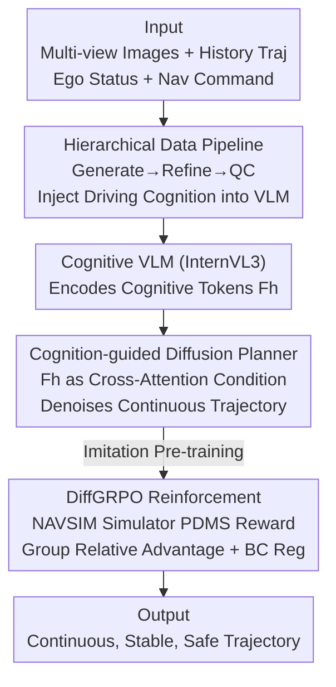

# ReCogDrive: A Reinforced Cognitive Framework for End-to-End Autonomous Driving

**Conference**: ICLR 2026  
**OpenReview**: [https://openreview.net/forum?id=JoXwhGbuMi](https://openreview.net/forum?id=JoXwhGbuMi)  
**Code**: https://github.com/xiaomi-research/recogdrive (ReCogDrive GitHub; refer to original text for exact repository address)  
**Area**: End-to-End Autonomous Driving / Vision-Language Models / Diffusion Planning / Reinforcement Learning  
**Keywords**: End-to-End Driving, VLM Cognitive Prior, Diffusion Planner, DiffGRPO, NAVSIM

## TL;DR
ReCogDrive replaces the "trajectory as text generation" paradigm with a "Cognitive VLM + Diffusion Planner" framework. It first injects human driving cognition into a VLM through a hierarchical data pipeline, then treats VLM hidden states as conditions for a diffusion planner to output continuous trajectories. Finally, a DiffGRPO reinforcement learning stage, tailored for diffusion policies, optimizes safety and comfort within the NAVSIM simulator. This achieves SOTA performance on both NAVSIM (PDMS 90.8) and Bench2Drive, while being 3.5× faster than pure text output.

## Background & Motivation
**Background**: End-to-End autonomous driving connects perception, prediction, and planning into a jointly optimizable pipeline, showing impressive performance in open-loop evaluations. Recently, to address poor generalization in long-tail scenarios, numerous works have introduced Vision-Language Models (VLMs) to leverage their internet-scale world knowledge and causal reasoning capabilities. These VLM solutions typically follow two paths: dual-system (VLM generates low-frequency trajectories or high-level instructions to guide an end-to-end system) or single-system (VLM directly regresses future trajectories).

**Limitations of Prior Work**: The dominant approach for single-system VLM solutions is to reformulate trajectory planning as a "language modeling" task, where the VLM autoregressively generates trajectory points in text format. This leads to three major issues: (1) **Domain Gap in Pre-trained Knowledge**—VLMs learn from general web data and lack the specialized knowledge required for driving; (2) **Modality Mismatch in Trajectory Generation**—the discrete linguistic space of VLMs is inherently conflicted with the continuous action space required for planning, and the probabilistic nature of autoregressive decoding often produces physically unfeasible or incorrectly formatted (unparseable) trajectories; (3) **Sub-optimal Policies from Imitation Learning**—heavy reliance on behavior cloning causes the model to converge to unsafe sub-optimal solutions in rare scenarios.

**Key Challenge**: The fundamental mismatch between language and action spaces, combined with a "pure imitation" approach that fails to explore better solutions, makes text-based VLM planning slow, potentially unfeasible, and insufficiently safe.

**Goal**: While retaining VLM cognitive and reasoning capabilities, this work aims to (a) supplement driving domain knowledge, (b) translate cognitive representations into continuous and stable trajectories, and (c) enable the planner to explore safer behaviors beyond expert data.

**Key Insight**: The authors decouple yet unify "understanding" and "planning." The VLM is responsible for cognition (outputting hidden states as driving priors), while the diffusion planner decodes these priors into continuous trajectories. Subsequently, reinforcement learning provides the planner with an optimization signal that transcends mere imitation.

**Core Idea**: Replace the old paradigm of "VLM writes trajectory as text" with a pipeline consisting of "Cognitive VLM hidden states → Diffusion Planner → DiffGRPO Reinforcement Learning."

## Method

### Overall Architecture
The input to ReCogDrive includes multi-view camera images, historical trajectories, ego-vehicle status (velocity/acceleration), and high-level navigation commands. The output is a continuous trajectory $\{(x_t, y_t, \theta_t)\}_{t=1}^{T}$ for future seconds (including heading angles to construct oriented bounding boxes for collision evaluation). The pipeline is trained in three stages: first, a hierarchical data pipeline adapts the VLM into a "driving-cognizant" backbone; second, cognitive tokens encoded by the VLM serve as conditions to train a diffusion planner to decode priors into trajectories (imitation learning stage); finally, DiffGRPO is used in the NAVSIM simulator to refine the planner based on real-world metrics like collisions, drivable area compliance, and comfort. InternVL3 is used as the backbone, encoding image-text data into hidden states $F_h$, which serve as cross-attention conditions for the Diffusion Transformer and provide stable context via mean-pooled global semantic embeddings $\bar F_h$.

### Key Designs

**1. Scalable Hierarchical Data Pipeline: Supplementing VLM with Human Driving Cognition**

To address the domain gap in **Limitations of Prior Work (1)**, the authors avoid using a general VLM directly. Instead, they automatically construct a large-scale, hierarchical driving VQA dataset (752K auto-labeled Q&A + 2.3M open-source driving data) to pre-train the VLM. The pipeline consists of three phases: **Generation**, which mimics the cognitive sequence of human drivers through four levels—L1 Basic Perception (static/dynamic elements, 3D detection, VRUs, traffic status), L2 Dynamic Understanding (multi-agent dynamics, behavior prediction), L3 Planning & Reasoning (feasible safe plans + concise rationale), and L4 Advanced Reasoning (counterfactual analysis, fine-grained trade-offs, spatial reasoning). Objective tasks use ground truth labels, while subjective tasks are labeled by a powerful teacher VLM. **Refinement** integrates open-source datasets with normalization, rewriting, and template augmentation to ensure consistency. **Quality Control** involves automatic scoring and filtering based on linguistic accuracy and visual clarity. This design ensures that the VLM learns a structured human decision chain rather than isolated Q&A, contributing +1.7 PDMS.

**2. Cognition-guided Diffusion Planner: Latent States bridge Cognition and Continuous Action**

Addressing the modality mismatch in **Limitations of Prior Work (2)**, the authors discard text-based trajectories in favor of a diffusion planner that decodes VLM latent semantic representations into continuous trajectories. Formally, given a noisy trajectory $x_t \in \mathbb{R}^{N\times 3}$, the denoising step is $x_{t-1} = D_{act}\big(\text{DiT}_\theta(z_t; F_h; S_{ego}; t)\big)$, where the fused latent $z_t = \text{concat}\big(E_{act}(x_t), E_{his}(I_{hist}), \bar F_h\big)$ combines the noisy action latent, historical trajectory latent, and VLM semantic prior. The diffusion network is trained with $L_{dif} = \mathbb{E}_{z_t,c}\|\epsilon - \epsilon_\pi(z_t, c)\|^2$ conditioned on $c=\{F_h, S_{ego}\}$. The planner backbone uses DiT blocks alternating between self-attention (modeling trajectory point relationships) and cross-attention (injecting semantic priors $F_h$ into trajectory space). Enhancements include SwiGLU FFN, RoPE for relative positions, and QK-Norm/RMSNorm for stability. VLM hidden states as "cognitive tokens" eliminate format errors (reducing error rates from non-zero to 0.00%) and accelerate inference by 3.5× compared to autoregressive text generation, adding +2.4 PDMS.

**3. DiffGRPO: Group Relative Policy Optimization for Diffusion Policies**

To address sub-optimal imitation in **Limitations of Prior Work (3)**, the authors introduce DiffGRPO. The motivation is specific: in rare scenarios like intersection turns, expert trajectories are multi-modal; imitation learning tends to learn an "average trajectory" that is neither expert-like nor safe. DiffGRPO treats the diffusion policy $\pi_\theta$ as an internal Markov Decision Process—generating a trajectory chain $x=(x_T, \dots, x_0)$ from Gaussian noise where each step is a Gaussian policy $\pi_\theta(x_{t-1}|x_t)=\mathcal{N}(x_{t-1}; \mu_\theta(x_t,t), \sigma_t^2 I)$. GRPO is selected because it naturally samples groups of candidate trajectories, fitting the multi-modal nature of driving. $G$ trajectories are sampled and evaluated in the NAVSIM simulator for metrics like collision and comfort to compute a PDMS reward $r_i$, followed by intra-group advantage normalization $\hat A_i = (r_i - \mu)/\sigma$. The loss combines a policy gradient term $L_{RL}$ and a behavior cloning regularizer $L_{BC}$:

$$L = -\frac{1}{G}\sum_{i=1}^{G}\frac{1}{T}\sum_{t=1}^{T}\gamma^{t-1}\log\pi_\theta\big(x_{t-1}^{(i)}|x_t^{(i)}\big)\hat A_i \;-\; \lambda\,\frac{1}{G}\sum_{i=1}^{G}\frac{1}{T}\sum_{t=1}^{T}\log\pi_\theta\big(\tilde x_{t-1}^{(i)}|\tilde x_t^{(i)}\big)$$

where $\gamma$ is a discount factor for early denoising steps and $\lambda$ is the BC weight. Unlike prior work using simple $\ell_2$ distance as a proxy reward, this uses simulator feedback. Ablations show DiffGRPO pushes PDMS from 86.5 to 90.8 (+4.3).

### Loss & Training
Three-stage training: (1) **Driving Pre-training**—adapts InternVL3 using hierarchical VQA; (2) **Imitation Learning**—trains the diffusion planner via $L_{dif}$ to fit expert trajectories (VLM can be frozen or fine-tuned); (3) **DiffGRPO Reinforcement Learning**—optimizes the planner on NAVSIM using PDMS rewards + BC regularization.

## Key Experimental Results

### Main Results

NAVSIM navtest closed-loop metrics (Camera input only):

| Method | Input | DAC↑ | EP↑ | PDMS↑ |
|------|------|------|-----|-------|
| PARA-Drive | Cam | 92.4 | 79.3 | 84.0 |
| DiffusionDrive | Cam+Lidar | 96.2 | 82.2 | 88.1 |
| WoTE | Cam+Lidar | 96.8 | 81.9 | 88.3 |
| AutoVLA | Cam | 95.6 | 81.9 | 89.1 |
| InternVL3-8B† (reproduction) | Cam | 92.4 | 78.9 | 83.3 |
| **ReCogDrive** | **Cam** | **97.3** | **87.3** | **90.8** |

ReCogDrive achieves SOTA with 90.8 PDMS using only cameras, outperforming camera+LiDAR methods like DiffusionDrive/WoTE by 2.7/2.5 points. On Bench2Drive (CARLA closed-loop), it achieves a Success Rate of 45.45% and a Driving Score of 71.36.

### Ablation Study

Component Ablation (Tab. 3, NAVSIM):

| Configuration | DAC | EP | PDMS | Note |
|------|-----|-----|------|------|
| Trajectory only | 91.3 | 77.2 | 82.4 | InternVL3 directly predicts trajectory |
| + Driving Pre-training | 93.1 | 79.1 | 84.1 | Injects cognitive QA, +1.7 |
| + Diffusion Planner | 94.7 | 80.9 | 86.5 | Continuous trajectory, +2.4 |
| + DiffGRPO | 97.3 | 87.3 | 90.8 | RL optimization, +4.3 |

Benchmark against text output (Tab. 4): Pure text output takes 1.07s/sample with 84.1 PDMS and 0.01% format errors; the diffusion planner takes ~0.31s (3.5× speedup), achieves 86.5 PDMS, and 0.00% format errors. RL Algorithm comparison (Tab. 6): DiffGRPO (90.8) > DPPO/REINFORCE (89.5), with the most significant advantage in EP (87.3 vs ~82.9).

### Key Findings
- The most significant single component is DiffGRPO (+4.3 PDMS), primarily improving EP (Ego-Progress) and DAC (Drivable Area Compliance), confirming that safety/progress trade-offs must be explored via RL.
- Switching modality from "text" to "diffusion" simultaneously improves speed (3.5×), feasibility (zero format errors), and accuracy (+2.4).
- Using real simulator feedback (PDMS) instead of $\ell_2$ proxy rewards in DiffGRPO leads to faster and more stable convergence.

## Highlights & Insights
- **VLM latents as "Cognitive Tokens"**: This is the core innovation—retaining VLM world knowledge while bypassing the discrete linguistic space allows for fast, robust continuous control. This "latents-as-condition" approach is transferable to any LLM/VLM task requiring continuous output.
- **Denoising chain as MDP**: Treating the denoising process as a policy chain and applying GRPO naturally fits the multi-modal nature of driving.
- **Hierarchical Cognition Pipeline**: Mimicking the "perception → understanding → planning → counterfactual" sequence is more effective than unstructured driving QA.

## Limitations & Future Work
- The reinforcement phase relies heavily on the NAVSIM simulator; any sim-to-real gap might degrade the safety transfer to real-world driving.
- DiffGRPO omits PPO clipping and uses only one update iteration; its stability under larger exploration scales requires further testing.
- Counterfactual/subjective portions of the 752K Q&A data are generated by a teacher VLM, which may distill biases or hallucinations into the model.

## Related Work & Insights
- **vs. Dual-Systems (DriveVLM / Senna)**: These use VLMs for low-frequency guidance; ReCogDrive is a unified framework where VLM latents directly guide diffusion planning.
- **vs. Single-System Text (GPT-Driver / EMMA)**: These treat trajectory as language modeling; ReCogDrive maintains CoT cognition but uses diffusion for 3.5× speedup and zero format errors.
- **vs. Reinforcement Learning for Driving (Drive-R1 / TrajHF)**: While many use GRPO for VLM policies, ReCogDrive is the first to adapt GRPO to a diffusion planner (DiffGRPO) using simulator PDMS instead of $\ell_2$ proxy rewards.

## Rating
- Novelty: ⭐⭐⭐⭐⭐ The combination of "VLM Latents + Diffusion Planner + DiffGRPO" is elegant, with DiffGRPO being an original adaptation.
- Experimental Thoroughness: ⭐⭐⭐⭐⭐ SOTA on multiple benchmarks with comprehensive ablation across architecture, speed, and RL algorithms.
- Writing Quality: ⭐⭐⭐⭐ Clear structure linking motivations to innovations; some architectural details (e.g., encoder dimensions) are slightly brief.
- Value: ⭐⭐⭐⭐⭐ Provides a fast, stable paradigm for mapping VLM cognition to continuous actions.

<!-- RELATED:START -->

## Related Papers

- [\[ICLR 2026\] VADv2: End-to-End Vectorized Autonomous Driving via Probabilistic Planning](vadv2_end-to-end_vectorized_autonomous_driving_via_probabilistic_planning.md)
- [\[ICLR 2026\] ResWorld: Temporal Residual World Model for End-to-End Autonomous Driving](resworld_temporal_residual_world_model_for_end-to-end_autonomous_driving.md)
- [\[CVPR 2026\] ResAD: Normalized Residual Trajectory Modeling for End-to-End Autonomous Driving](../../CVPR2026/autonomous_driving/resad_normalized_residual_trajectory_modeling_for_end-to-end_autonomous_driving.md)
- [\[ICLR 2026\] RAP: 3D Rasterization Augmented End-to-End Planning](rap_3d_rasterization_augmented_end-to-end_planning.md)
- [\[ICML 2026\] RoCA: Robust Cross-Domain End-to-End Autonomous Driving](../../ICML2026/autonomous_driving/roca_robust_cross-domain_end-to-end_autonomous_driving.md)

<!-- RELATED:END -->
