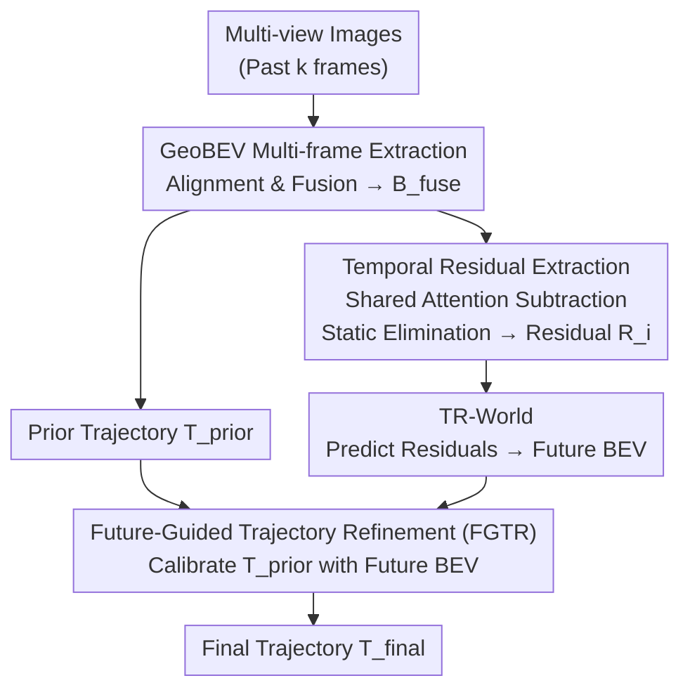

# ResWorld: Temporal Residual World Model for End-to-End Autonomous Driving

**Conference**: ICLR 2026  
**arXiv**: [2602.10884](https://arxiv.org/abs/2602.10884)  
**Code**: [https://github.com/mengtan00/ResWorld](https://github.com/mengtan00/ResWorld)  
**Area**: Autonomous Driving / World Models  
**Keywords**: Temporal Residuals, World Models, End-to-End Autonomous Driving, BEV Features, Trajectory Optimization  

## TL;DR
ResWorld proposes a Temporal Residual World Model (TR-World) that extracts dynamic object information by calculating temporal residuals of BEV scene representations (without detection/tracking), avoiding redundant modeling of static areas. Combined with a Future-Guided Trajectory Refinement (FGTR) module, it utilizes predicted future BEV features to correct planned trajectories, achieving SOTA planning performance on nuScenes and NAVSIM.

## Background & Motivation

**Background**: In end-to-end autonomous driving frameworks, world models are used as proxy tasks to enhance scene understanding, replacing traditional auxiliary modules such as detection, tracking, and prediction. A common practice is to predict future scene representations (BEV features) to indirectly improve planning accuracy.

**Limitations of Prior Work**: (a) The vast majority of information in scene representations belongs to static objects (ground, buildings), which world models model redundantly—static objects do not change positions in future frames and require no prediction; (b) Dynamic objects (vehicles, pedestrians) are critical for planning but are difficult to identify from the scene without relying on perception tasks; (c) Predictied future scene representations lack deep interaction with trajectories and are underutilized.

**Key Challenge**: World models waste computational resources on static objects while insufficiently modeling dynamic objects, and predicted future information cannot effectively feedback into trajectory planning.

**Goal**: (a) Enable the world model to focus on modeling dynamic objects; (b) Distinguish between dynamic and static objects without auxiliary perception tasks; (c) Use predicted future BEVs to directly correct trajectories.

**Key Insight**: By aligning BEV features from different timestamps to the same coordinate system and performing subtraction (temporal residuals), the difference naturally represents changes in dynamic objects.

**Core Idea**: "Subtraction"—utilizing temporal residuals to naturally separate dynamic and static objects, allowing the world model to predict only the future distribution of the dynamic components.

## Method

### Overall Architecture
The core problem ResWorld aims to solve is that world models spend significant computational power on static backgrounds that remain unchanged in future frames, while dynamic objects that truly affect planning are inadequately modeled. The overall mechanism is "subtraction"—since static objects remain nearly identical in aligned adjacent BEV frames, the difference left after subtraction consists only of dynamic object changes. Specifically, multi-view images are processed via GeoBEV to extract and fuse multi-frame BEV features. The fused features are used to predict a prior trajectory while simultaneously being sent to a residual calculation branch to obtain temporal residuals. TR-World predicts the future spatial distribution of dynamic objects based only on these residuals, which is then superimposed back onto the current fused BEV to obtain the complete future BEV. Finally, the FGTR module uses this future BEV to calibrate the prior trajectory and output the final plan.

### Key Designs

**1. Temporal Residual Extraction: Using Inter-frame Subtraction Instead of Detectors to Separate Dynamic/Static Objects with Zero Labels**

The most inefficient aspect of world models is that most information in scene representations consists of static objects like ground and buildings. These do not change position and theoretically do not require prediction, yet models expend capacity to reconstruct them. Conversely, dynamic objects crucial for planning are hard to isolate without perception tasks. Residual extraction addresses this by aligning BEV features $\{B_t, B_{t-1}, \dots, B_{t-k}\}$ from the past $k$ frames to the current frame's coordinate system. A shared spatial attention map (focusing on dynamic regions) is generated using the fused BEV feature $B_{\text{fuse}}$ to extract sparse scene queries $S_i$ from each frame, followed by calculating differences $R_i = S_i - S_{i-1}$. Under the same coordinate system, static objects remain identical across frames and are automatically eliminated after subtraction. The remaining residuals naturally represent dynamic object changes without any detection or tracking labels. Sharing the spatial attention map is critical: it ensures features are sampled from the same positions across frames, giving the difference physical meaning.

**2. TR-World: Focusing the World Model on "Parts that Change"**

With residuals containing only dynamic information, the world model no longer needs to reconstruct the entire scene. TR-World extracts information from each residual $R_i$ via self-attention, aggregates them across timestamps to obtain $\hat{R}$, and then uses a TokenFuser to map $\hat{R}$ back onto the fused BEV:

$$B_{\text{future}} = \text{MLP}(B_{\text{fuse}}) \otimes \hat{R} + B_{\text{fuse}}$$

Since $B_{\text{fuse}}$ already carries static scene information, superimposing the predicted dynamic changes yields a complete future BEV. This allows the world model's capacity to be fully invested in dynamic changes that require prediction, rather than repeatedly reconstructing static regions, making it both more efficient and effective.

**3. Future-Guided Trajectory Refinement (FGTR): Direct Trajectory Editing with Future Predictions and Indirect Supervision**

Previously, predicted future scenes in world models often served only as "proxy tasks" with little deep interaction with trajectories. FGTR fills this gap: it uses Deformable Attention to let trajectory queries $W$, using the prior trajectory $T_{\text{prior}}$ as reference points, sample information from $B_{\text{future}}$. It checks if the prior trajectory collides with dynamic objects or deviates from drivable areas, decoding a rectified final trajectory $T_{\text{final}}$. This design serves a dual purpose: it optimizes the trajectory directly using future information and provides sparse spatio-temporal supervision for the future BEV—where reference points provide spatial signals and multi-timestamp queries provide temporal signals—preventing prediction collapse. Notably, FGTR deliberately avoids applying direct ground-truth supervision to the future BEV: supervising a specific timestamp forces the model to memorize that frame's state, losing dynamic distribution info; driving it indirectly via downstream trajectory optimization gradients allows the future BEV to retain the most useful cross-timestamp information.

### Loss & Training
Only L1 loss is used to supervise both the prior and final trajectories: $\mathcal{L} = L1(T_{\text{prior}}, T_{\text{GT}}) + L1(T_{\text{final}}, T_{\text{GT}})$. No direct supervision is applied to future BEV features—an unconventional but experimentally validated design.

## Key Experimental Results

### Main Results
nuScenes planning evaluation (no auxiliary tasks, zero annotation dependency):

| Method | Auxiliary Tasks | L2 Avg (m)↓ | Collision Avg (%)↓ |
|------|---------|-------------|----------------|
| UniAD | Det&Track&Map&Motion&Occ | 1.03 | 0.31 |
| SSR | None | 0.74 | 0.31 |
| GenAD | Det&Map&Motion | 0.91 | 0.43 |
| **ResWorld** | **None** | **0.65** | **0.23** |
| **ResWorld (w/ ego status)** | **None** | **0.59** | **0.17** |

NAVSIM evaluation:

| Method | PDMS↑ |
|------|-------|
| LAW | 84.6 |
| World4Drive | 85.1 |
| DiffusionDrive | 88.1 |
| **ResWorld** | **87.3** (No Aux Tasks) |

### Ablation Study

| Configuration | L2 Avg↓ | Collision↓ | Note |
|------|---------|--------|------|
| Baseline (SSR) | 0.74 | 0.31 | No World Model |
| + TR-World | 0.69 | 0.27 | Temporal Residual World Model |
| + TR-World + FGTR | **0.65** | **0.23** | Future-Guided Refinement |
| Direct Supervision on B_future | 0.68 | 0.26 | Performance degrades |

### Key Findings
- TR-World reduces L2 from 0.74 to 0.69, and FGTR further reduces it to 0.65—the two modules are complementary.
- Indirect supervision for future BEV outperforms direct ground-truth supervision (0.65 vs 0.68), validating the "autonomous optimization of future representations" design.
- ResWorld outperforms multi-task supervised methods without relying on any auxiliary perception tasks (no detection/tracking/map labels).
- TR-World, by modeling only temporal residuals, is more efficient and effective than full-scene world models.

## Highlights & Insights
- **Isolating dynamic objects via "subtraction"** is elegant and simple: it requires no detectors, trackers, or segmentation—only differences between aligned BEV features. This trick is transferable to any scene representation task requiring dynamic/static separation.
- **The "less is more" supervision discovery** is insightful: direct supervision on future predictions restricts what the model learns (memorizing frame states), while indirect gradients from downstream planning allow the future BEV to learn the most useful cross-temporal information.
- **The dual-role design of FGTR** is clever: it utilizes future information to refine trajectories while simultaneously providing gradient signals to the world model to prevent collapse.

## Limitations & Future Work
- Validated only on open-loop benchmarks (nuScenes, NAVSIM); lacks closed-loop evaluation (e.g., Bench2Drive)—open-loop gains do not always translate to closed-loop.
- Temporal residuals assume perfect BEV alignment; sensor pose estimation errors in practice may degrade residual quality.
- The residual aggregation method (Eq. 6) is relatively simple; more complex temporal modeling (e.g., Transformers) could be considered.
- The world model only predicts a single future step; multi-step recursive prediction remains to be explored.

## Related Work & Insights
- **vs SSR (Li & Cui, 2025)**: ResWorld adds TR-World and FGTR to SSR, reducing L2 from 0.74 to 0.65 and collision rate from 0.31 to 0.23.
- **vs UniAD (Hu et al., 2023)**: UniAD requires 5 auxiliary tasks; ResWorld requires none yet achieves superior performance.
- **vs World4Drive (Zheng et al., 2025)**: As another end-to-end world model approach, ResWorld performs better on NAVSIM (87.3 vs 85.1 PDMS).

## Rating
- Novelty: ⭐⭐⭐⭐ The idea of using temporal residuals to extract dynamic objects is simple yet effective; the dual-role FGTR is cleverly designed.
- Experimental Thoroughness: ⭐⭐⭐⭐ Comprehensive evaluation on two benchmarks with detailed ablations, though closed-loop testing is missing.
- Writing Quality: ⭐⭐⭐⭐ Clear framework diagrams, smooth methodology descriptions, and well-explained motivations.
- Value: ⭐⭐⭐⭐ Provides an efficient design paradigm for world models—modeling only the parts that change.

<!-- RELATED:START -->

## Related Papers

- [\[CVPR 2026\] ResAD: Normalized Residual Trajectory Modeling for End-to-End Autonomous Driving](../../CVPR2026/autonomous_driving/resad_normalized_residual_trajectory_modeling_for_end-to-end_autonomous_driving.md)
- [\[ICLR 2026\] DriveMamba: Task-Centric Scalable State Space Model for Efficient End-to-End Autonomous Driving](drivemamba_task-centric_scalable_state_space_model_for_efficient_end-to-end_auto.md)
- [\[ICLR 2026\] ReCogDrive: A Reinforced Cognitive Framework for End-to-End Autonomous Driving](recogdrive_a_reinforced_cognitive_framework_for_end-to-end_autonomous_driving.md)
- [\[ICLR 2026\] VADv2: End-to-End Vectorized Autonomous Driving via Probabilistic Planning](vadv2_end-to-end_vectorized_autonomous_driving_via_probabilistic_planning.md)
- [\[CVPR 2026\] Percept-WAM: Perception-Enhanced World-Awareness-Action Model for Robust End-to-End Autonomous Driving](../../CVPR2026/autonomous_driving/percept-wam_perception-enhanced_world-awareness-action_model_for_robust_end-to-e.md)

<!-- RELATED:END -->
