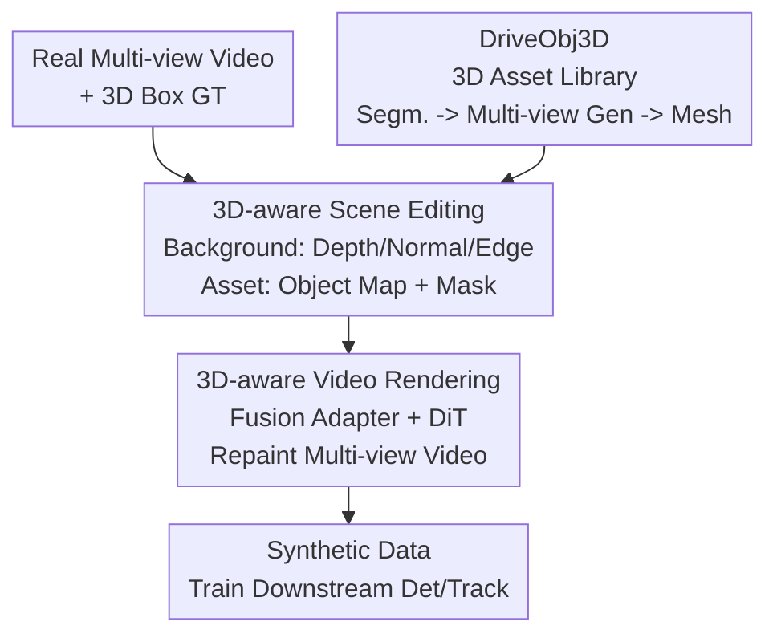

# Rethinking Driving World Model as Synthetic Data Generator for Perception Tasks

**Conference**: ICLR 2026  
**OpenReview**: [https://openreview.net/forum?id=z3cFADf6zZ](https://openreview.net/forum?id=z3cFADf6zZ)  
**Code**: https://wm-research.github.io/Dream4Drive/ (Project Page)  
**Area**: Autonomous Driving / World Models / Synthetic Data  
**Keywords**: Driving World Model, Synthetic Data, 3D Perception, Video Editing, Data Augmentation

## TL;DR
This paper points out that previous experiments using driving world models for synthetic data were based on "unfair training epochs." It proposes Dream4Drive—which decomposes real videos into dense 3D-aware guidance maps and renders 3D assets into them to fine-tune a world model for multi-view edited video generation. Under fair comparison with aligned epochs, adding less than 2% synthetic samples consistently improves 3D detection and tracking.

## Background & Motivation

**Background**: 3D detection and 3D tracking in autonomous driving rely heavily on large-scale annotated data, while collecting and annotating long-tail safety-critical scenarios (corner cases) is extremely expensive. Consequently, the community has turned to driving world models to create synthetic data: early methods used diffusion + ControlNet with BEV maps or 3D boxes as conditions; recent approaches have switched to the stronger Diffusion Transformer (DiT) to improve image quality.

**Limitations of Prior Work**: The authors summarize three categories of methods, each with significant drawbacks. First, layout generation methods depend on the original scene layout, offering weak control over object pose/appearance and poor geometric diversity, making it hard to create high-quality long-tail corner cases. Second, editing/insertion methods based on reference images + 3D boxes are mostly single-view and cannot support multi-view BEV perception. Third, reconstruction methods based on NeRF/3DGS provide geometric control but suffer from artifacts under sparse views and lack lighting modeling, leading to inconsistency between inserted objects and the background.

**Key Challenge**: More importantly, the evaluation itself is often unfair. Previous data augmentation typically adopted a strategy of "pre-training on synthetic data, then fine-tuning on real data," which effectively doubles the training epochs. The authors found that once the baseline is trained for the same number of epochs, the gains from synthetic data almost disappear—under 2× epochs, models trained on purely real data actually achieve higher mAP and NDS than those trained on a real+synthetic mixture. In other words, previous conclusions about the utility of synthetic data might simply be an "epoch dividend."

**Goal**: Re-examine and truly substantiate the value of synthetic data under a fair setting with strictly aligned epochs, while providing a generation framework capable of controllable, batch generation of multi-view corner cases.

**Key Insight**: Instead of using sparse 3D boxes/BEV for implicit control of object placement, it is better to edit directly in 3D space—decomposing the video into dense 3D-aware guidance maps (depth, normal, edges, object maps, masks), and letting the world model render the edited video accordingly. This preserves the geometric appearance of the original background while allowing arbitrary 3D assets to be inserted into the scene along any trajectory.

**Core Idea**: Replacing "direct generation from sparse 3D box conditions" with "decomposition into dense 3D-aware guidance maps + 3D asset rendering + world model fine-tuning/repainting," leveraging <2% synthetic data to boost perception performance under fair epoch conditions.

## Method

### Overall Architecture

The goal of Dream4Drive is to generate synthetic videos that can be directly used for training downstream perception models, given a real multi-view video with ground truth 3D box annotations and a target 3D asset. The pipeline consists of two main steps: **3D-aware scene editing** (decomposing the background into dense guidance maps and rendering the target asset into 3D space to obtain object maps and masks) and **3D-aware video rendering** (using a multi-condition fusion adapter to feed five types of guidance maps into a DiT to repaint realistic, multi-view, and cross-view consistent edited videos). Assets are sourced from a separately constructed **DriveObj3D** 3D asset library. The entire training process does not require expensive 3D annotations, only RGB videos and guidance maps generated in real-time by off-the-shelf tools.

### Key Designs

**1. Fair Comparison: Debunking False Gains via Epoch Alignment**

This is the foundational premise of the paper rather than just an engineering module. The authors observed that gains reported by methods like Panacea and SubjectDrive rely on "synthetic pre-training + real fine-tuning," which covertly doubles the training volume of the baseline. When the baseline is also trained for 2× or 3× epochs, purely real data at 2× epochs can outperform mixed data. Consequently, all experiments in this paper are compared under the same epoch budget (1×/2×/3×), redefining "useful synthetic data" as that which still brings improvement when epochs are aligned. Within this stricter framework, Dream4Drive achieves better results with just 420 samples (<2% of the real sample size) than older methods using full synthetic datasets and is the first to make synthetic data surpass purely real data at equal epochs.

**2. 3D-aware Scene Editing: Dense Guidance Maps for Geometric Control**

Addressing the issue that "3D boxes/BEVs are too sparse to control precise object pose and appearance," this paper moves away from using 3D box embeddings as conditions. Instead, it edits directly in 3D space. For an input RGB image $I \in \mathbb{R}^{H \times W \times 3}$, a depth map $D$ is extracted using Depth Anything, from which a normal map $N$ is derived. An edge map $E$ is extracted using OpenCV Canny. Depth, normal, and edge info within the foreground object regions are masked out, forcing the model to learn to "regenerate the foreground based on the target asset." Target 3D assets are placed into the original video's 3D space according to given 3D boxes $\{B_i\}_{i=1}^{T}$ and rendered frame-by-frame and view-by-view using calibrated camera intrinsics $K_v$ and extrinsics $E_v$ to obtain object maps $O$ and masks $M$. The resulting guidance set $\mathcal{C} = \{D, N, E, O, M\}$ encodes the asset's precise pose, geometry, and texture, ensuring geometric consistency.

**3. 3D-aware Video Rendering: Multi-Condition Fusion Adapter-Driven DiT**

After obtaining the five types of guidance maps, the world model must generate videos that are both realistic and cross-view consistent. This paper fine-tunes a multi-view video inpainting model from a Diffusion Transformer. The core is a multi-condition fusion adapter: the five conditions are first encoded by a VAE, patchified by individual 3D embedders, and then merged via channel-wise concatenation followed by a FusionNet:

$$F_{\text{fusion}} = \text{FusionNet}\left(\bigoplus_{k=1}^{5} \text{3DEmbedder}_k(\text{VAE}(C_k))\right),\quad C_k \in \{D, N, E, O, M\}$$

The fused features are injected into the DiT's control blocks (weights copied from base blocks) and then merged into the base blocks, providing instance-level spatial alignment, temporal consistency, and semantic fidelity. Additional spatial view attention enhances multi-camera consistency. Sampling uses rectified flow for stable generation and classifier-free guidance to balance text and multi-geometric conditions. The training objective adds a Foreground Mask Loss and LPIPS loss for instance-level fine control on top of the standard diffusion loss $L_{\text{diffusion}} = \mathbb{E}_{t,z_0,\epsilon}\big[\|\epsilon - \epsilon_\theta(z_t,t,c)\|^2\big]$: $L_{\text{total}} = \lambda_{\text{diffusion}} L_{\text{diffusion}} + \lambda_{\text{mask}} L_{\text{mask}} + \lambda_{\text{lpips}} L_{\text{LPIPS}}$, with weights empirically set to $1.0/0.1/0.1$.

**4. DriveObj3D: Automated High-Quality 3D Asset Library for Diversity**

The diversity of synthetic scenes is capped by the asset library. The paper uses a three-step pipeline: (i) 2D instance segmentation—using Grounded-SAM to locate and crop targets $I_{\text{target}}$ from scene images/videos; (ii) Multi-view image generation—using Qwen-Image to synthesize multi-view images $\{I_v\}_{v=1}^{N}$ based on $I_{\text{target}}$ to overcome occlusions; (iii) 3D mesh generation—feeding multi-view images into Hunyuan3D to reconstruct the final 3D mesh. Compared to Text-to-3D methods (like Trellis) which might not match driving data styles, or single-view methods (single-image Hunyuan3D) prone to incompleteness, this multi-view approach yields complete, high-fidelity assets even under heavy occlusion.

### Loss & Training

Training only requires RGB videos and their associated 3D-aware guidance maps, without expensive 3D labels. Guidance maps are generated in real-time using off-the-shelf tools, significantly reducing costs. The loss is the aforementioned $L_{\text{total}}$, a weighted sum of diffusion, foreground mask, and LPIPS losses ($\lambda$ values are 1.0, 0.1, and 0.1, respectively).

## Key Experimental Results

The dataset used is nuScenes (700/150/150 train/val/test, each scene being a 20-second 6-camera multi-view video); detection metrics are NDS/mAP/mAOE/mAVE, and tracking metrics are AMOTA/AMOTP/MOTA/Recall. Synthetic samples are fixed at 420 (+<2% of real sample size).

### Main Results

Low-resolution (256×512) detection, aligned at 1× epoch:

| Method | Samples | mAP ↑ | mAVE ↓ | NDS ↑ |
|------|------|-------|--------|-------|
| Real | 28130 | 34.5 | 29.1 | 46.9 |
| DriveDreamer | — | 35.8 | – | 39.5 |
| MagicDrive | — | 35.4 | – | 39.8 |
| Panacea | — | 37.1 | 27.3 | 49.2 |
| SubjectDrive | — | 38.1 | 26.4 | 50.2 |
| **Dream4Drive** | +420 | **36.1**(1×)/**38.7** | 28.9/26.8 | 47.8/**50.6** |

Note: High scores for Panacea/SubjectDrive correspond to 2× epochs; at 1× epoch alignment, Dream4Drive improves mAP from 34.5 to 36.1 and NDS to 47.8 with just +420 samples, reaching mAP 38.7 / NDS 50.6 in the 2× setting, surpassing older methods using entire synthetic datasets. For Tracking (Tab. 2), AMOTA improved from 30.1→31.2 (1×) and reached 34.4 at 2×.

High-resolution (512×768) detection across 1×/2×/3× epochs:

| Configuration | mAP ↑ | NDS ↑ |
|------|-------|-------|
| Real (1×) | 36.1 | 47.9 |
| Naive Insert (1×) | 40.1 | 51.3 |
| **Ours (1×)** | **40.7** | **52.0** |
| Real (3×) | 43.1 | 53.6 |
| **Ours (3×)** | **44.5** | **55.0** |

Gains are even larger at high resolution: at 1×, only 420 samples result in mAP +4.6 (12.7%) and NDS +4.1 (8.6%), with gains primarily coming from large vehicle categories like bus, construction vehicle, and truck. Crucially, Dream4Drive consistently outperforms purely real data at 1×/2×/3×, debunking the old conclusion that "synthetic data is useless after epoch alignment."

### Ablation Study

| Dimension | Configuration | mAP ↑ | NDS ↑ | Conclusion |
|------|------|-------|-------|------|
| Insertion View | Left vs Right | 40.2 vs 39.8 | 51.6 vs 50.7 | Left side yields more gain (mAOE also drops 5.7) |
| Insertion Distance | Near / Mid / Far | 39.7/40.3/40.5 | 50.5/50.9/51.3 | Far insertions are most effective |
| Asset Source | Trellis/Hunyuan3D/Ours | 39.8/40.2/40.7 | 50.8/50.9/52.0 | Multi-view assets perform best |
| Rendering Method | Naive Insert vs Ours(1×) | 40.1 vs 40.7 | 51.3 vs 52.0 | Generative repainting adds shadows/reflections |

### Key Findings
- **Replicating original layout is useless; inserting new 3D assets is effective**: Simply duplicating original layouts does not improve performance; enriching the scene with new assets is a valid augmentation strategy.
- **Far insertion is better than near**: Detectors already struggle with far objects; increasing far samples provides targeted reinforcement. Near insertions can easily occlude the field of view or interfere with the training of other instances.
- **Dataset bias can be exploited**: Inserting on the left brings more gain than on the right (where there are already more cars), suggesting that reinforcing high-frequency corner cases is more cost-effective than reinforcing rare sides, also exposing nuScenes' left-right bias.
- **In-domain assets reduce domain gap**: Using assets styled consistently with the training set reduces the synthetic-to-real domain gap.
- **Higher resolution yields larger gains**, and generative repainting provides better realism (shadows, reflections) compared to direct projection (naive insert), though naive insert can have lower mAOE because assets are perfectly aligned with original box headings.

## Highlights & Insights
- **Honest baseline "re-testing"**: The most valuable part of the paper is not just the model but the exposure of the evaluation loophole in "synthetic pre-train + real fine-tune" and bringing all comparisons back to the same epoch budget.
- **Dense 3D-aware maps instead of sparse 3D boxes**: Turning "where/what pose" from an implicit condition the network must guess into an explicit dense signal via 3D space projection.
- **Efficiency (<2% samples)**: 420 carefully edited corner cases outperform full-scale synthetic data, indicating that "quality and targeting of data augmentation are far more important than quantity."

## Limitations & Future Work
- Validated only on nuScenes; whether the "low domain gap" advantage of in-domain assets holds across datasets/cities remains uncertain.
- Gains are highly dependent on insertion strategies (view/distance/source), requiring manual or heuristic selection.
- The pipeline depends on multiple off-the-shelf models (Depth Anything, SAM, Qwen-Image, etc.); failure in any link (e.g., poor far-depth estimation) could contaminate synthetic data.
- Only detection and tracking were evaluated; gains for planning or terminal end-to-end tasks have not been verified.

## Related Work & Insights
- **vs Panacea / SubjectDrive (Layout Gen)**: They rely on original layouts and sparse BEV control; this paper uses dense maps for explicit 3D editing and proves gains under epoch alignment.
- **vs Object Insertion (e.g., MObI)**: They are often single-view; this work provides multi-view consistency.
- **vs NeRF/3DGS**: They have artifacts under sparse views; generative repainting here provides better realism.
- **vs Naive Insert**: Direct projection lacks realism and is outperformed by generative rendering.

## Rating
- Novelty: ⭐⭐⭐⭐ Combination of dense 3D-aware guidance + fair evaluation is novel and methodologically valuable.
- Experimental Thoroughness: ⭐⭐⭐⭐ Cross-epoch evaluation, dual resolutions, detection/tracking, and multi-dimensional ablation are systematic.
- Writing Quality: ⭐⭐⭐⭐ Clear arguments, complete charts, and well-explained pipeline.
- Value: ⭐⭐⭐⭐ Corrects evaluation biases and provides the DriveObj3D library.

<!-- RELATED:START -->

## Related Papers

- [\[ICCV 2025\] Unraveling the Effects of Synthetic Data on End-to-End Autonomous Driving](../../ICCV2025/autonomous_driving/unraveling_the_effects_of_synthetic_data_on_end-to-end_autonomous_driving.md)
- [\[CVPR 2026\] ClimaOoD: Improving Anomaly Segmentation via Physically Realistic Synthetic Data](../../CVPR2026/autonomous_driving/climaood_improving_anomaly_segmentation_via_physically_realistic_synthetic_data.md)
- [\[ICLR 2026\] DriveVLA-W0: World Models Amplify Data Scaling Law in Autonomous Driving](drivevla-w0_world_models_amplify_data_scaling_law_in_autonomous_driving.md)
- [\[ECCV 2024\] Reliability in Semantic Segmentation: Can We Use Synthetic Data?](../../ECCV2024/autonomous_driving/reliability_in_semantic_segmentation_can_we_use_synthetic_data.md)
- [\[ICLR 2026\] ResWorld: Temporal Residual World Model for End-to-End Autonomous Driving](resworld_temporal_residual_world_model_for_end-to-end_autonomous_driving.md)

<!-- RELATED:END -->
