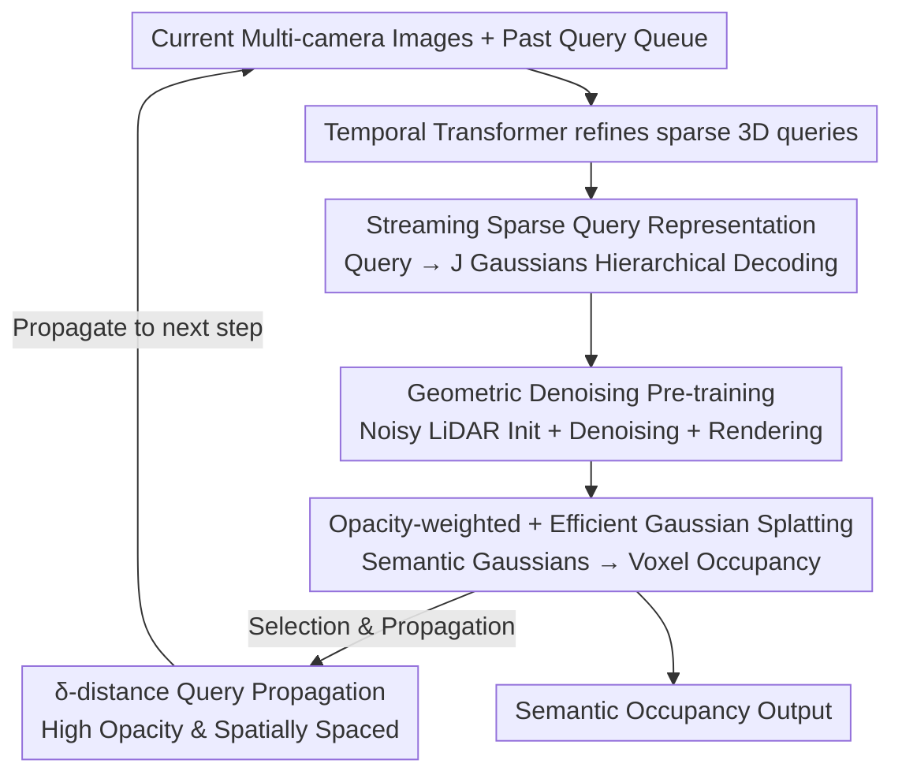

# S2GO: Streaming Sparse Gaussian Occupancy

**Conference**: ICLR 2026  
**OpenReview**: [https://openreview.net/forum?id=z8ggdMlSco](https://openreview.net/forum?id=z8ggdMlSco)  
**Area**: 3D Vision / Autonomous Driving / Occupancy Prediction  
**Keywords**: 3D Occupancy Prediction, Sparse Query, Semantic Gaussian, Streaming Perception, Denoising Pre-training

## TL;DR
S2GO uses a set of approximately 1k sparse 3D queries to summarize driving scenes in an online streaming fashion. In each frame, queries are decoded into dense semantic Gaussians and then "splatted" into voxel occupancy. Combined with a geometric denoising and rendering pre-training task, sparse queries learn to move toward occupied regions. It achieves a 2.7 IoU improvement over GaussianWorld on nuScenes/KITTI with 4.5× faster inference (real-time 26 FPS on a single 4090).

## Background & Motivation

**Background**: Vision-centric autonomous driving lacks dense 3D geometric priors, making 3D semantic occupancy estimation a key task for supplementing detection and mapping. Current mainstream occupancy methods are either based on regular voxel grids (voxel/BEV) or dense Gaussians (GaussianFormer series), both of which achieve high-fidelity details.

**Limitations of Prior Work**: Dense representations are slow and inflexible. Voxel methods perform redundant computations in vast empty areas and introduce grid artifacts. Although dense Gaussian methods focus computation on occupied regions, they typically require 25.6k to 144k Gaussians. Due to the high cost of global modeling, they are forced to use local sparse convolutions, making it difficult to efficiently fuse long-term temporal history, which hinders static infrastructure localization and dynamic object modeling.

**Key Challenge**: While sparse, query-based representations have proven efficient in detection (DETR series), applying them to dense, high-fidelity occupancy estimation faces three hurdles. First, detectors use hundreds of queries for ~30 objects via Hungarian matching, whereas occupancy must cover the entire scene; the mapping from sparse queries to dense semantic Gaussians is inherently ambiguous. Second, voxel occupancy performs classification at fixed positions, but queries must "move" to regions of interest before classification—a "chicken-and-egg" problem where a query's destination between a car and a road depends on its predicted class. Third, higher sparsity makes it more difficult for queries to align with occupied regions.

**Goal**: To use extremely few (~1k) sparse 3D queries to summarize and propagate a dense 3D world online, achieving both the high fidelity of Gaussian representations and the efficiency and temporal flexibility of sparse queries.

**Key Insight**: The authors observe that supervising query movement solely with occupancy labels is "weak and ambiguous," as queries fail to learn to move toward occupied areas (see Figure 2 in the paper; queries barely move without pre-training). Instead, a geometric denoising task with explicit supervision signals is used to teach the network how queries self-organize and move to surfaces.

**Core Idea**: Maintain a queue of past sparse queries, refine current queries using historical queries and current images, and hierarchically decode queries into denser semantic Gaussians. Using a "noisy LiDAR initialization + denoising + rendering" pre-training strategy, sparse queries learn to traverse empty zones and self-organize onto occupied surfaces.

## Method

### Overall Architecture

S2GO is a two-stage, streaming occupancy estimation framework. At each time step $t$, the scene is represented as a set of sparse 3D queries $Q_t=\{q_t^i\}_{i=1}^K$ and their 3D positions $\{p_t^i\}$. Current queries are refined through a temporal Transformer (following PETR / StreamPETR) using a **past query queue** $\bar Q_t$ and current multi-camera image features $F_t=\mathrm{CNN}(I_t)$. Each query predicts a position offset $o^i$, opacity $a^i$, and velocity $v^i$, deriving a cluster of finer Gaussians. These Gaussians are then "splatted" into nearby voxels to obtain semantic occupancy. A subset of queries is propagated to future frames, forming a streaming cycle.

The entire "image → query refinement → Gaussian decoding" pipeline is shared across both stages, differing only in supervision targets: **Stage 1 Geometric Denoising Pre-training** initializes queries with noisy LiDAR points and teaches movement and geometric construction through denoising + depth/RGB rendering (where each Gaussian predicts color independently). **Stage 2 Occupancy Estimation** uses learnable query initialization and only RGB images for inference, with Gaussians predicting shared semantic classes and splatting into voxel occupancy. Key improvements to Gaussian formulations and splatting algorithms are also introduced.

### Key Designs

**1. Streaming Sparse Queries + Hierarchical Gaussian Decoding: Summarizing the Dense World via ~1k Queries**

To address the slowness of dense representations and the cost of temporal fusion, S2GO no longer maintains tens of thousands of Gaussians. Instead, it compresses the scene into approximately 1k sparse 3D queries that propagate temporally. Each query does not function as a single Gaussian; instead, it **hierarchically** anchors a spatial region and derives $J$ fine Gaussians internally. The derivation formula is:
$$G_t = \{\{(p^i + o^i + o_j^i,\; v^i,\; r_j^i,\; s_j^i,\; a^i \cdot a_j^i)\}_{j=1}^{J}\}_{i=1}^{K}$$
The position of each Gaussian is the sum of the query position $p^i$, the query offset $o^i$, and the Gaussian-specific offset $o_j^i$. Velocity $v^i$ is inherited, and opacity is modulated by query-level $a^i$ and Gaussian-level $a_j^i$. This hierarchical decomposition allows sparse queries to carry long-term temporal context while preserving high-fidelity Gaussian representations, enabling better instance differentiation compared to methods like GaussianWorld.

**2. Geometric Denoising and Rendering Pre-training: Teaching Queries to Self-Organize**

This is the core design addressing the difficulty of aligning sparse queries with occupied regions. Training directly with occupancy labels is ineffective because queries must precisely align with geometry before fine Gaussians branch out. Since occupancy labels lack explicit query assignment, supervision is weak. The authors design a pre-training task initializing queries on **noisy LiDAR points**:
$$\{p^i\}_{i=0}^{K} = \mathrm{FPS}_K(\mathrm{pts}) + \epsilon,\quad \epsilon \sim U(-e, e)^{K\times 3}$$
Supervision is provided by three loss terms:
$$L = \lambda_1 \sum_{i=1}^{K}\|\mathrm{FPS}_K(\mathrm{pts}_t) - (p_t^i + o_t^i)\| + \lambda_2 L_{\text{depth}}(G, D) + \lambda_3 L_{\text{rgb}}(G, I)$$
The first term is the **denoising target**, forcing queries to return to true LiDAR points from noisy positions. The latter two render Gaussians into depth and RGB maps (using velocity $v$ to compensate for motion), teaching Gaussians to capture local geometry. This step ensures queries learn to move from empty space to occupancy and self-organize to cover the scene.

**3. Opacity-weighted Occupancy + Efficient Gaussian Splatting: Refining Formulas and Halving Training Time**

The authors identify two flaws in the GaussianFormer-2 splatting framework. First, opacity was previously only used for internal blending, allowing Gaussians in empty areas to maintain high opacity while shrinking their scale $s$ to hide between voxel centers. S2GO multiplies the occupancy probability by opacity:
$$\alpha(x; G) = a\,\exp\!\Big(-\tfrac{1}{2}(x-m)^T \Sigma^{-1}(x-m)\Big)$$
This forces Gaussians in empty space to predict low opacity, stabilizing scale supervision. Second, to optimize splatting, the authors implement 4×4×4 voxel block tiling for forward passes and bind threads to individual Gaussians for backward passes to avoid atomic operations. This results in a 1.5× forward and 20.4× backward speedup, reducing VRAM usage to 1/3 and halving training time.

**4. δ-distance Query Propagation: Balancing Confidence and Coverage**

Streaming pipelines must decide which queries to propagate. While selecting by top-k opacity propagates the most confident regions, it leads to temporal overlap and poor coverage. S2GO employs **$\delta$-distance top-k selection**, picking high-opacity queries that are at least distance $\delta$ apart. This ensures high-confidence regions are preserved while spreading queries across the scene.

### Loss & Training
Both stages are trained for 12 epochs. Stage 1 utilizes denoising, depth, and RGB losses with noisy LiDAR initialization. Stage 2 uses ground-truth semantic occupancy for splatted voxels with learnable query initialization and RGB-only inference. Both stages supervise adjacent frames and use predicted velocities for temporal alignment. S2GO-Small uses 900 queries × 10 Gaussians, while S2GO-Base uses 1800 queries × 20 Gaussians, both with ResNet50 backbones.

## Key Experimental Results

### Main Results

nuScenes-SurroundOcc Validation Set (S2GO at 256×704 resolution, baselines at 900×1600, measured on 4090):

| Method | IoU | mIoU | FPS |
|------|-----|------|-----|
| GaussianFormer-2 | 31.7 | 20.8 | 2.8 |
| QuadricFormer | 31.2 | 20.1 | 6.2 |
| GaussianWorld* | 32.8 | 21.8 | 4.4 |
| ALOcc-GF (grid SOTA) | 38.2 | 25.5 | 0.9 |
| **Ours (S2GO-Small)** | 34.3 | 22.1 | 26.1 |
| **Ours (S2GO-Base)** | 35.5 | 22.7 | 19.6 |

Compared to the previous Gaussian SOTA, GaussianWorld, S2GO-Small improves by 1.5 IoU and is 5.9× faster. S2GO-Base improves by 2.7 IoU and is 4.5× faster. While voxel-based ALOcc-GF has the highest mIoU, it is not real-time (0.9 FPS).

SSCBench-KITTI-360 Test Set (Monocular):

| Method | IoU | mIoU |
|------|-----|------|
| GaussianFormer | 35.4 | 12.9 |
| GaussianFormer-2 | 38.4 | 13.9 |
| **Ours (S2GO-Base)** | 40.8 | 15.1 |

### Ablation Study

| Configuration | mIoU | IoU | Description |
|------|------|-----|------|
| Direct Occupancy 12 ep | 13.02 | 25.73 | No pre-training, ambiguous supervision |
| Direct Occupancy 24 ep | 15.83 | 28.35 | Equal compute comparison |
| Learnable Init Pre-training | 12.42 | 26.64 | Worse than no pre-training |
| LiDAR Init Pre-training | 13.62 | 27.08 | Marginal improvement |
| LiDAR+ε Initialization | 20.55 | 32.68 | Significant gain via noise |
| + Denoising Loss (Full) | 21.60 | 33.91 | Complete pre-training |

### Key Findings
- **Pre-training initialization is the key to success**: Queries with learnable initialization stay away from geometry, receiving no effective supervision. "LiDAR+noise" provides meaningful supervision for both queries and Gaussians, jumping mIoU from 13 to 20.55.
- **Denoising loss is significant**: Depth supervision is strong, but denoising yields the final significant mIoU boost (20.55 → 21.60).
- **Velocity modeling is crucial in pre-training**: Motion modeling during the first stage is vital for the model's ability to extrapolate future occupancy.
- **Efficiency Gains**: The optimized splatting and opacity weighting enable single-GPU training within reasonable timeframes.

## Highlights & Insights
- **Migration of Streaming Sparse Queries to Dense Occupancy**: Replacing tens of thousands of Gaussians with ~1k queries while using hierarchical decoding to maintain fidelity is an elegant and effective approach.
- **Using Denoising for Supervision**: The insight that sparse queries fail to move because occupancy labels are too blurry is profound. Using "Noisy LiDAR → Recovery" as a geometric pre-training task decouples learning geometry from learning semantics.
- **Diagnostic Engineering**: Identifying that opacity should be multiplied into the occupancy probability to fix behavior in empty regions is a critical engineering insight.
- **Temporal Strategy**: The $\delta$-distance propagation strategy for balancing confidence and spatial coverage is valuable for any streaming query-based task.

## Limitations & Future Work
- Pre-training relies heavily on LiDAR point clouds (training only), which may limit its application in scenarios without LiDAR labels.
- Performance still lags behind offline, non-real-time grid-based SOTA (ALOcc-GF mIoU 25.5 vs S2GO-Base 22.7).
- There are multiple hyperparameters ($\delta$, query count, noise magnitude $e$) whose sensitivity analysis is partially relegated to the appendix.
- While velocity modeling allows for future extrapolation, the reliability of dynamic predictions in complex, long-term interactions remains to be verified.

## Related Work & Insights
- **vs GaussianFormer / GaussianFormer-2**: These methods refine massive amounts of dense Gaussians using local convolutions. S2GO uses hierarchical sparse queries for efficient global interaction and natural temporal propagation, winning in both IoU and FPS.
- **vs GaussianWorld**: Both are streaming, but GaussianWorld lacks object-level representation. Its local convolutions tend to merge nearby objects over time; S2GO's query-level operations maintain instance independence.
- **vs StreamOcc / ALOcc**: These methods use expensive voxel-query aggregations. S2GO’s pure query route enables real-time throughput.

## Rating
- Novelty: ⭐⭐⭐⭐⭐ 
- Experimental Thoroughness: ⭐⭐⭐⭐ 
- Writing Quality: ⭐⭐⭐⭐⭐ 
- Value: ⭐⭐⭐⭐⭐ 

<!-- RELATED:START -->

## Related Papers

- [\[CVPR 2026\] Generalizing Visual Geometry Priors to Sparse Gaussian Occupancy Prediction](../../CVPR2026/autonomous_driving/generalizing_visual_geometry_priors_to_sparse_gaussian_occupancy_prediction.md)
- [\[CVPR 2025\] GaussianWorld: Gaussian World Model for Streaming 3D Occupancy Prediction](../../CVPR2025/autonomous_driving/gaussianworld_gaussian_world_model_for_streaming_3d_occupancy_prediction.md)
- [\[ICCV 2025\] GaussianFlowOcc: Sparse and Weakly Supervised Occupancy Estimation using Gaussian Splatting and Temporal Flow](../../ICCV2025/autonomous_driving/gaussianflowocc_sparse_and_weakly_supervised_occupancy_estimation_using_gaussian.md)
- [\[CVPR 2026\] SparseWorld-TC: Trajectory-Conditioned Sparse Occupancy World Model](../../CVPR2026/autonomous_driving/sparseworld_tc_trajectory_conditioned_sparse_occupancy_world_model.md)
- [\[ECCV 2024\] Fully Sparse 3D Occupancy Prediction](../../ECCV2024/autonomous_driving/fully_sparse_3d_occupancy_prediction.md)

<!-- RELATED:END -->
