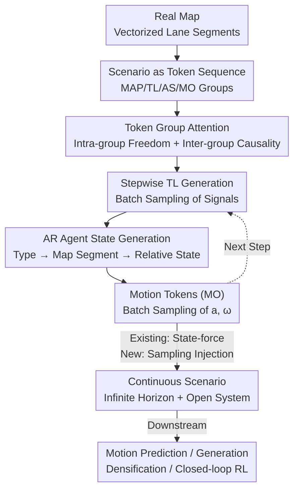

# SceneStreamer: Continuous Scenario Generation as Next Token Group Prediction

**Conference**: ICLR 2026  
**OpenReview**: [https://openreview.net/forum?id=IWt4ERrdYp](https://openreview.net/forum?id=IWt4ERrdYp)  
**Paper**: [Project Page](https://vail-ucla.github.io/scenestreamer/)  
**Code**: See project page  
**Area**: Autonomous Driving / Traffic Scenario Generation  
**Keywords**: Traffic simulation, autoregressive generation, token group prediction, closed-loop simulation, reinforcement learning planning

## TL;DR
SceneStreamer encodes entire driving scenarios (maps, traffic lights, agent states, motion) into a discrete token sequence, generating them by "predicting the next group of tokens" via a single autoregressive Transformer. This enables continuous traffic generation in open systems over infinite horizons with dynamic agent entry/exit, significantly enhancing the robustness and generalization of downstream RL planners as a high-fidelity simulator.

## Background & Motivation

**Background**: Training and evaluating autonomous driving systems rely heavily on traffic simulation. Dominant approaches either use log-replay (replaying recorded trajectories from real datasets) or treat simulation as a motion prediction problem—predicting future trajectories for all agents simultaneously given the map, signals, and initial agent history.

**Limitations of Prior Work**: Log-replay is realistic but lacks interactivity as background vehicles do not react to the ego vehicle (SDC), failing to support closed-loop evaluation. One-shot motion prediction models accumulate covariate shift when unrolled iteratively in simulations; small errors compound, pushing the simulator into out-of-distribution states. Existing autoregressive models mitigate this but still depend on externally provided initial agent layouts, losing the diversity inherent in those layouts.

**Key Challenge**: Other methods decouple "initial layout generation" and "motion prediction" (e.g., TrafficGen). This separation prevents context sharing between phases. Crucially, the **number of agents is fixed at initialization**, preventing new traffic participants from entering mid-scenario. Real-world traffic is an open system where vehicles constantly enter from feeder roads and exit, leading to a dynamically evolving agent population.

**Goal**: Develop a unified framework capable of (1) generating initial agent layouts, (2) continuously injecting/exiting agents over infinite horizons, and (3) supporting closed-loop interactions where background agents react to the ego vehicle.

**Key Insight**: The authors observe that since LLMs unify sequence tasks via "next token prediction," a complete, time-evolving driving scenario can similarly be flattened into a token sequence: starting with map tokens, followed by groups of traffic light, agent state, and motion tokens at each step. Scenario generation thus reduces to "next token group prediction."

**Core Idea**: Use a unified autoregressive Transformer to model scenario generation as **next token group prediction**. By placing initial agent states and motion trajectories into the same continuous token sequence and flexibly switching between "sampling" and "state-forcing," the model supports open-system, long-horizon, closed-loop continuous scenario generation.

## Method

### Overall Architecture

SceneStreamer is an encoder-decoder autoregressive model. A driving scenario is decomposed into a static map context $M$ (vector elements like lane segments) and time-evolving dynamic entities (traffic lights $\{l^{(k)}_t\}$ and agents $\{a^{(i)}_t\}$). The sequence is organized as: `<MAP>` tokens followed by groups of `(<TL>, <AS>, <MO>)` for each time step:

$$x_{1:T} = \big[\,\texttt{<MAP>};\ (\texttt{<TL>},\texttt{<AS>},\texttt{<MO>})_1;\ (\texttt{<TL>},\texttt{<AS>},\texttt{<MO>})_2;\ \dots\big]$$

Given all generated tokens $x_{<t}$, the model predicts and samples the next token group $p_\theta(x_t\mid x_{<t})$.

Specifically, at each step: the encoder first encodes map segments into fixed `<MAP>` tokens (serving as cross-attention K/V for the decoder). The decoder then generates all traffic light tokens `<TL>` in a batch, followed by agent state tokens `<AS>` sequentially (each agent uses 4 tokens: start, type, map segment ID, relative state), and finally all agent motion tokens `<MO>` in a batch. This "traffic light → agent state → motion" order reflects semantic causality—motion depends on state, and state depends on the map. For existing agents from previous steps, the model skips generation and uses **state-forcing** with reconstructed tokens; for new agents, it uses sampling. This flexible switching enables closed-loop simulation on variable-length agent sets.

### Key Designs

**1. Scenario as Token Sequence: Flattening dynamic scenarios into an autoregressive flow**

To address the split between initialization and motion, SceneStreamer tokenizes maps, lights, agent states, and motions into a single sequence. Map segments are encoded via PointNet-like structures with learnable map-ID embeddings and geometric information $g_i$ (position, orientation). Traffic light tokens $\texttt{<TL>}_{k,t}$ combine signal state, light ID, and map ID. Motion tokens encode labels, types, agent IDs, velocity, and shape. This unified representation allow new agents to be inserted as new tokens at any step, breaking the "fixed agent count" constraint.

**2. Relative State AR Generation: Map-anchored local coordinate generation**

Generating agent attributes in global coordinates leads to vocabulary explosion. This design splits each agent into four ordered tokens: `<SOA>` (start), `<TYPE>`, `<MS>` (map segment ID), and `<RS>` (relative state). The process samples type $c$, then selects a map segment as an "anchor" $\lambda_i$. Conditioned on this anchor, a small Transformer **Relative State Head** with AdaLN autoregressively outputs an 8D vector $r_i=(l,w,h,u,v,\delta\psi,v_x,v_y)$, where $(u,v)$ are longitudinal/lateral offsets relative to the lane centerline. This ensures agents are placed on valid lanes within a compact, learnable vocabulary.

**3. State-forcing: Unifying injection and continuation**

To allow both new agent injection and existing agent continuation in an infinite horizon, the model uses state-forcing. For existing agents, reconstructed state tokens are fed back to the model, bypassing the generation process. For new agents, normal sampling is performed. This "state-forcing" differs from teacher forcing as it uses the model's own reconstructed tokens during inference rather than ground-truth data, avoiding information leakage while supporting variable-length agent sets.

**4. Token Group Attention: Grouped causal masking and relative attention**

The model employs a custom grouped causal attention mechanism: (1) tokens within the same group can attend to each other freely; (2) tokens belonging to the same object in subsequent steps can attend to their own history; (3) each group attends to the current or previous context (e.g., `<MO>` sees current `<TL>`). Query-centric **relative attention** (offsets calculated from $(\Delta x, \Delta y, \Delta\psi, \Delta t)$) and KNN masking are used to ensure spatial locality and scalability.

### Loss & Training

All heads output class distributions (signals, types, map IDs, relative state fields, and motion labels are discretized/binned). The model is trained end-to-end using cross-entropy loss. Motion token ground-truth is derived by selecting the $(a,\omega)$ pair that minimizes Average Corner Error (ACE) against the actual trajectory, mitigating compounding errors. Inference uses top-p (nucleus) sampling. The model is trained on the Waymo Open Motion Dataset (WOMD) downsampled to 2Hz using ScenarioNet.

## Key Experimental Results

### Main Results

**Initial State Quality (MMD, lower is better)**: SceneStreamer is competitive with recent methods under the TrafficGen protocol, particularly with autoregressive decoding enabled.

| Method | Position | Heading | Size | Velocity |
|------|----------|----------|------|----------|
| TrafficGen | 0.1451 | 0.1325 | 0.0926 | 0.1733 |
| LCTGen | 0.1319 | 0.1418 | 0.1092 | 0.1948 |
| UniGen (Agent-Centric Road) | 0.1217 | 0.1095 | 0.0817 | 0.1679 |
| **Ours** | **0.1291** | **0.1270** | **0.0743** | 0.1970 |

**Motion Prediction (WOMD validation set, all agents)**: Autoregressive rollout for 8 seconds after state-forcing initial steps.

| Model | ADEavg ↓ | ADEmin ↓ | FDEavg ↓ | ADD ↑ | FDD ↑ |
|------|----------|----------|----------|-------|-------|
| SceneStreamer-Motion | 1.2100 | 0.8730 | 3.5336 | 2.2115 | 0.2459 |
| SceneStreamer-Full | 1.3382 | 0.9339 | 3.8740 | 2.6486 | 0.2567 |

The "Motion" version (trained only on motion) provides higher precision, while the "Full" version (all dynamic tokens) offers higher diversity (ADD/FDD).

### Ablation Study

Downstream RL planner training (2M steps using TD3 in SceneStreamer scenarios, tested on log-replay):

| Training Source | Reward ↑ | Success ↑ | Completion ↑ | Cost ↓ |
|----------|----------|-----------|--------------|--------|
| Log-Replay (Baseline) | 32.24 | 0.7244 | 0.6726 | 0.2852 |
| SceneStreamer-Full | 39.07 | **0.7620** | **0.7345** | **0.2610** |

### Key Findings
- **AR decoding is critical for agent realism**: Removing AR decoding (using parallel MLP heads) leads to invalid combinations like vehicles with conflicting headings and lateral velocities.
- **Scenario generation benefits RL planners**: SceneStreamer-generated scenarios outperform log-replay. Adaptive training (where background agents respond to the planner) further improves robustness and completion rates.
- **Precision-diversity trade-off**: The specialized "Motion" model excels in accuracy, while the "Full" model captures more diverse traffic behaviors.

## Highlights & Insights
- **Traffic as Next Token Group Prediction**: By flattening the scenario into tokens, the hard constraint of fixed agent counts disappears; a new agent is simply a new insertion in the sequence.
- **State-forcing Abstraction**: A single mechanism unifies agent injection and continuation, allowing the same weights to handle motion prediction, scenario generation, and closed-loop simulation.
- **Relative State Representation**: Anchoring agents to map segments avoids vocabulary explosion and naturally constrains agents to valid road areas.

## Limitations & Future Work
- **Limitations**: Relatively small model size may limit the precision of the "Full" model. Motion discretization using a bicycle model + discrete $(a,\omega)$ bins may restrict fine-grained control.
- **Future Work**: Scaling model and data size; incorporating more scene elements like construction zones or obstacles into the token stream; improving collision rates through more extensive closed-loop training.

## Related Work & Insights
Compared to two-stage methods like **TrafficGen**, SceneStreamer enables context sharing and dynamic agent population. Unlike **MotionLM** which assumes fixed agent sets, SceneStreamer models the agent generation process itself. It provides an efficient alternative to diffusion-based generators (e.g., **UniGen**) for stepwise closed-loop rollout.

## Rating
- Novelty: ⭐⭐⭐⭐⭐ 
- Experimental Thoroughness: ⭐⭐⭐⭐
- Writing Quality: ⭐⭐⭐⭐
- Value: ⭐⭐⭐⭐⭐

<!-- RELATED:START -->

## Related Papers

- [\[ICLR 2026\] Steerable Adversarial Scenario Generation through Test-Time Preference Alignment (SAGE)](steerable_adversarial_scenario_generation_through_test-time_preference_alignment.md)
- [\[ICCV 2025\] Long-term Traffic Simulation with Interleaved Autoregressive Motion and Scenario Generation](../../ICCV2025/autonomous_driving/long-term_traffic_simulation_with_interleaved_autoregressive_motion_and_scenario.md)
- [\[CVPR 2026\] TrafficAlign: Aligning Large Language Models for Traffic Scenario Generation](../../CVPR2026/autonomous_driving/trafficalign_aligning_large_language_models_for_traffic_scenario_generation.md)
- [\[ICLR 2026\] EnvSocial-Diff: A Diffusion-Based Crowd Simulation Model with Environmental Conditioning and Individual-Group Interaction](envsocial-diff_a_diffusion-based_crowd_simulation_model_with_environmental_condi.md)
- [\[CVPR 2025\] Generating Multimodal Driving Scenes via Next-Scene Prediction](../../CVPR2025/autonomous_driving/generating_multimodal_driving_scenes_via_next-scene_prediction.md)

<!-- RELATED:END -->
