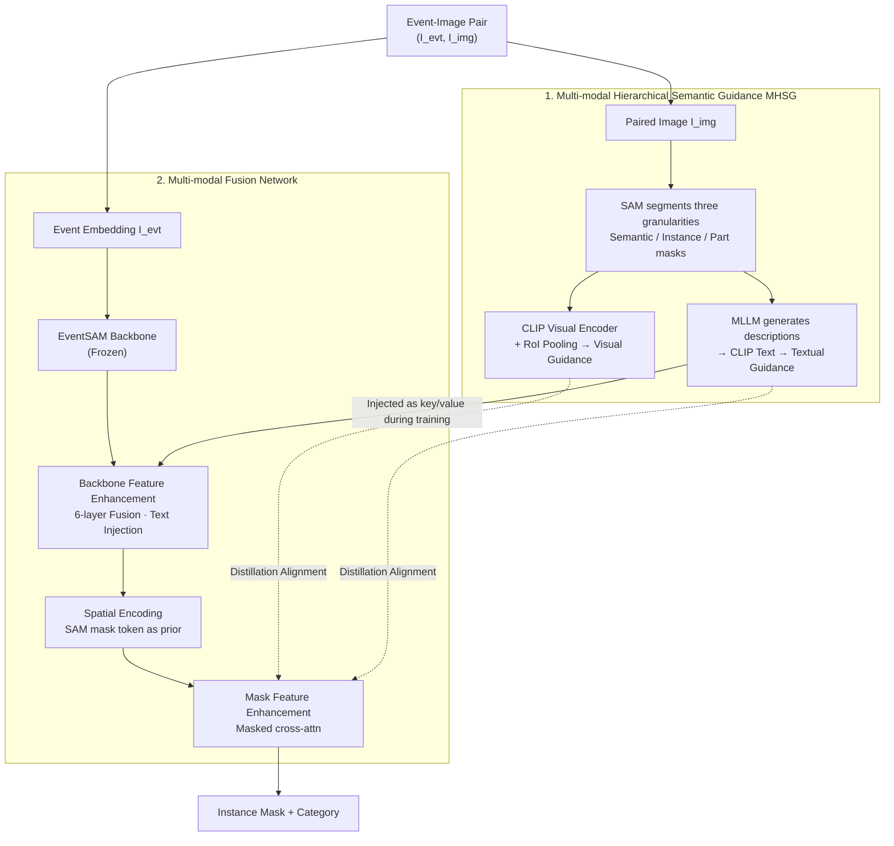

# SEAL: Segment Any Events with Language

**Conference**: ICLR 2026  
**arXiv**: [2601.23159](https://arxiv.org/abs/2601.23159)  
**Code**: [https://0nandon.github.io/SEAL](https://0nandon.github.io/SEAL) (Coming soon)  
**Area**: Autonomous Driving  
**Keywords**: Event Cameras, Open-Vocabulary Instance Segmentation, SAM, CLIP, Multi-modal Fusion, Annotation-free Training

## TL;DR

This work proposes the first Open-Vocabulary Event Instance Segmentation (OV-EIS) task and introduces the SEAL framework. By utilizing Multi-modal Hierarchical Semantic Guidance (MHSG) and a lightweight multi-modal fusion network, SEAL achieves multi-granularity (instance-level + part-level) semantic segmentation of event streams using only event-image pairs (without dense annotations), significantly outperforming all baseline methods with the fastest inference speed.

## Background & Motivation

**Advantages of Event Cameras**: Event cameras offer extremely high temporal resolution, ultra-low latency, high dynamic range, and low power consumption. They provide effective information in scenarios where traditional cameras fail, such as low light or overexposure.

**Limitations of Prior Work**: Existing Event Semantic Segmentation (ESS) methods are restricted to closed-set vocabularies, failing to recognize objects outside training categories, and are limited to semantic segmentation without distinguishing different instances of the same class.

**Open-Vocabulary Event Understanding is in its Infancy**: OpenESS only achieves open-vocabulary semantic segmentation without instance-level recognition; EventSAM achieves event instance segmentation but lacks semantic recognition capabilities.

**Lack of Benchmarks**: Previously, there were no multi-semantic benchmark datasets for event instance segmentation.

**Efficiency Requirements**: Event cameras are often deployed on edge devices, necessitating parameter-efficient and fast-inference model designs.

**Domain Gap Issues**: Directly applying image-domain pre-trained models to event streams, even via E2VID-reconstructed images, results in significant domain gaps due to noise and artifacts.

## Method

### Overall Architecture

SEAL follows an "Annotation-Free Domain Adaptation (AF-DA)" route: during training, it only uses time-synchronized event-image pairs $(I^{evt}, I^{img})$, distilling semantic knowledge from large-scale image models to the event branch without using any dense event annotations. During inference, the image branch is removed, and only the event embedding $I^{evt}$ is fed into the network to output instance masks and categories based on user point/box prompts. The system consists of two parts: the MHSG module processes paired images into multi-granularity semantic supervision signals, and the Multi-modal Fusion Network serves as a lightweight mask classifier, integrating backbone feature enhancement, spatial encoding, and mask feature enhancement to learn these supervisions into event features.

### Key Designs

**1. Multi-modal Hierarchical Semantic Guidance (MHSG): Replacing Expensive Event Annotations with Free Image Supervision**

Event streams lack dense annotations, but paired images can leverage existing large models. SEAL uses SAM to automatically segment paired images into semantic-level $M_s^{img}$, instance-level $M_i^{img}$, and part-level $M_p^{img}$ masks. It then uses a CLIP visual encoder to extract pixel-level features and performs RoI pooling according to each mask layer to obtain hierarchical visual guidance. Since classification requires textual anchors, an MLLM (from the LLaMA family) is used to generate rich descriptions for each mask, converted into hierarchical textual guidance via a CLIP text encoder. Unlike OpenESS which adheres to pre-defined class names, the vocabulary here is generated on-the-fly by the MLLM, making it more diverse and naturally supporting open-vocabulary—the three granularities perfectly match the requirements for both instance and part segmentation.

**2. Multi-modal Fusion Network: Welding Semantic and Spatial Priors into Event Features**

The fusion network performs three tasks on the frozen EventSAM backbone. The first step is backbone feature enhancement: stacking 6 multi-modal fusion modules (self-attention + cross-attention + FFN). During training, textual guidance $M_l^{text}$ is injected as key/value in cross-attention; during inference, it seamlessly switches to dataset class names or user-defined language, followed by RoI-Align to pool mask features from the language-fused features. However, pure semantic features have two weaknesses: *dead masks* (masks of small objects disappear after downsampling) and *semantic conflicts* (different semantic masks falling into the same region on low-resolution feature maps). Thus, the second step introduces spatial encoding, utilizing the shape and position priors of the SAM mask decoder's mask tokens. Spatial features $G_l^{evt}$ and semantic features $S_l^{evt}$ are concatenated and projected: $M_l^{evt} = \text{proj}(\text{concat}(G_l^{evt}, S_l^{evt}))$, making small and overlapping objects separable again. The third step uses masked cross-attention for mask feature enhancement, taking the language-fused backbone features with positional encoding as key/value and constraining attention to foreground regions, further binding semantic and spatial priors. This single-backbone design eliminates the redundancy of "mask generation + classification" backbones found in baselines, resulting in an inference time of only 22.28ms and 99.1M parameters.

### Loss & Training

Training is divided into two stages: Stage 1 follows the original scheme to train EventSAM, and Stage 2 freezes EventSAM to train only the fusion network using Mixed-24K (24,032 pairs from DDD17-Seg and DSEC-Semantic). The optimization objective is a cosine similarity distillation loss, aligning event mask features with both visual and textual guidance across three granularities:

$$\mathcal{L}_{distill} = \sum_{l \in \{s,i,p\}} \frac{1}{K_l}(1 - \cos(\hat{M}_l^{evt}, M_l^{img})) + \sum_{l \in \{s,i,p\}} \frac{1}{K_l}(1 - \cos(\hat{M}_l^{evt}, M_l^{text}))$$

The two terms pull the event features closer to image visual features and MLLM textual features respectively, injecting spatial structure and open-vocabulary semantics, thus supporting "annotation-free" training.

## Key Experimental Results

### Four Benchmarks

| Benchmark | Source | Test Scale | Resolution | Classes | Evaluation Dimension |
|------|------|---------|--------|--------|---------|
| DDD17-Ins | DDD17-Seg | 3,890 | 352×200 | 6 | Coarse Instance Seg |
| DSEC11-Ins | DSEC-Semantic | 2,809 | 640×440 | 11 | Medium Instance Seg |
| DSEC19-Ins | DSEC-Semantic | 2,809 | 640×440 | 19 | Fine Instance Seg |
| DSEC-Part | DSEC-Semantic | 2,809 | 640×440 | 9 (5+4) | Part-level Seg |

### Main Results (Table 1: Closed-Set Instance Segmentation, Box prompt AP)

| Method | Category | DDD17-Ins AP | DSEC11-Ins AP | DSEC19-Ins AP | Latency (ms) | Params (M) |
|------|------|-------------|--------------|--------------|------------|----------|
| OVSAM | AR-CDG | 21.6 | 22.2 | 11.6 | 102.27 | 314.7 |
| OpenSeg | Hybrid | 35.0 | 23.6 | 13.0 | 427.01 | 228.4 |
| MaskCLIP++ | Hybrid | 32.8 | 25.4 | 14.1 | 394.61 | 301.7 |
| frame2recon | AF-DA | 34.8 | 21.2 | 10.5 | 278.35 | 141.7 |
| frame2voxel | AF-DA | 33.6 | 21.3 | 11.3 | 88.19 | 109.1 |
| **SEAL (Ours)** | **AF-DA** | **38.2** | **28.8** | **14.8** | **22.28** | **99.1** |
| Gain | - | +3.2 | +3.4 | +0.7 | - | - |

### Part Segmentation Results (Table 2: DSEC-Part)

| Method | Point AP | Box AP |
|------|---------|--------|
| VLPart | 12.9 | 16.1 |
| **SEAL** | **13.6** | **18.3** |
| Gain | +0.7 | +2.2 |

### Ablation Study —— Hierarchical Semantic Guidance (Table 3)

- Removing part-level guidance → decreased part segmentation AP (DSEC-Part Box: 14.4~15.4 vs 18.3)
- Removing instance/semantic guidance → decreased instance segmentation AP
- **Optimal performance using all three granularities**, validating the necessity of hierarchical guidance.

### Ablation Study —— Model Architecture (Table 5)

| Fusion | SE | MFE | DDD17 Box AP | DSEC-Part Box AP |
|--------|-----|-----|-------------|-----------------|
| ✓ | | | 35.5 | 14.9 |
| ✓ | ✓ | | 35.7 | 15.7 |
| ✓ | | ✓ | 38.1 | 16.6 |
| ✓ | ✓ | ✓ | **38.2** | **18.3** |

### Efficiency Advantages

- SEAL inference time is **22.28ms**, significantly lower than all baselines (next best frame2voxel 88.19ms, **~4×** faster).
- Parameter count is **99.1M**, making it the most parameter-efficient scheme (next best frame2spike 95.9M but with much worse performance).
- Single-backbone architecture avoids the redundancy of baseline methods that require two different backbones (mask generation + classification).

## Highlights & Insights

1.  **First definition of the OV-EIS task**: Advances open-vocabulary event understanding from semantic to instance level, filling a research gap.
2.  **Elegant Hierarchical Semantic Guidance**: Utilizes SAM’s intrinsic three-layer mask mechanism to construct part/instance/semantic level supervision, a natural and effective approach.
3.  **Annotation-Free training framework**: Requires only event-image pairs without manual dense annotations, automatically generating supervision via CLIP + MLLM.
4.  **Efficiency-performance dual excellence**: 4 times faster than the fastest baseline with the smallest parameter count while achieving across-the-board highest AP—ideal for low-power edge deployment of event cameras.
5.  **Spatial Encoding module resolves dead masks and semantic conflicts**: Improves semantic features by introducing spatial priors from SAM mask tokens; UMAP visualizations clearly demonstrate the improved feature space.
6.  **Established four evaluation benchmarks**: Covers label granularity (6/11/19 classes) and semantic granularity (instance/part), providing a complete evaluation system for future research.

## Limitations & Future Work

1.  **Dependence on event-image pairs**: Training still requires time-synchronized event-image pairs, limiting application on pure event data.
2.  **Requirement for manual visual prompts**: Inference requires user-provided point/box prompts; the SEAL++ variant for prompt-free operation is only briefly mentioned in the appendix.
3.  **Benchmark limitations**: All four benchmarks are from driving scenarios (DDD17/DSEC), lacking validation in diverse scenes like indoor or industrial environments.
4.  **Limited number of categories**: Evaluation is closed-set with at most 19 classes, yet to demonstrate true large-scale open-vocabulary capabilities.
5.  **Impact of E2VID reconstruction quality**: MHSG hierarchical guidance depends on the quality of paired images, which might be suboptimal in extreme event conditions.
6.  **Two-stage training**: Requires training EventSAM followed by the fusion network, resulting in a relatively complex training pipeline.

## Related Work

| Direction | Representative Work | Relationship |
|------|---------|-----------|
| Event Semantic Segmentation | EV-SegNet, ESS, HALSIE, HMNet | Prior work, semantic-only |
| Event Instance Segmentation | EventSAM | Base model, category-agnostic segmentation |
| Open-Vocab Event Understanding | OpenESS, EventCLIP, EventBind | Semantic-level only; Ours advances to instance-level |
| Image Open-Vocab Segmentation | CLIP, MaskCLIP, OpenSeg, OVSeg | Mask classifiers used as baselines |
| SAM and its variants | SAM, OVSAM, Mask-Adapter | Provides spatial priors and baseline comparison |

## Rating

- **Novelty**: ⭐⭐⭐⭐ — First definition of the OV-EIS task; MHSG hierarchical guidance is original and effective.
- **Experimental Thoroughness**: ⭐⭐⭐⭐ — 4 benchmarks, 11 baseline comparisons, 3 sets of ablation studies, and robust visual analysis.
- **Writing Quality**: ⭐⭐⭐⭐ — Clear structure, rigorous problem definition, and well-articulated motivation.
- **Value**: ⭐⭐⭐⭐ — Opens new directions for open-world understanding in event vision; the framework is efficient and practical.

<!-- RELATED:START -->

## Related Papers

- [\[CVPR 2026\] HorizonForge: Driving Scene Editing with Any Trajectories and Any Vehicles](../../CVPR2026/autonomous_driving/horizonforge_driving_scene_editing_with_any_trajectories_and_any_vehicles.md)
- [\[ICCV 2025\] SAM4D: Segment Anything in Camera and LiDAR Streams](../../ICCV2025/autonomous_driving/sam4d_segment_anything_in_camera_and_lidar_streams.md)
- [\[CVPR 2025\] Segment Anything, Even Occluded](../../CVPR2025/autonomous_driving/segment_anything_even_occluded.md)
- [\[ICLR 2026\] Plan-R1: Safe and Feasible Trajectory Planning as Language Modeling](plan-r1_safe_and_feasible_trajectory_planning_as_language_modeling.md)
- [\[CVPR 2026\] TerraSeg: Self-Supervised Ground Segmentation for Any LiDAR](../../CVPR2026/autonomous_driving/terraseg_self-supervised_ground_segmentation_for_any_lidar.md)

<!-- RELATED:END -->
