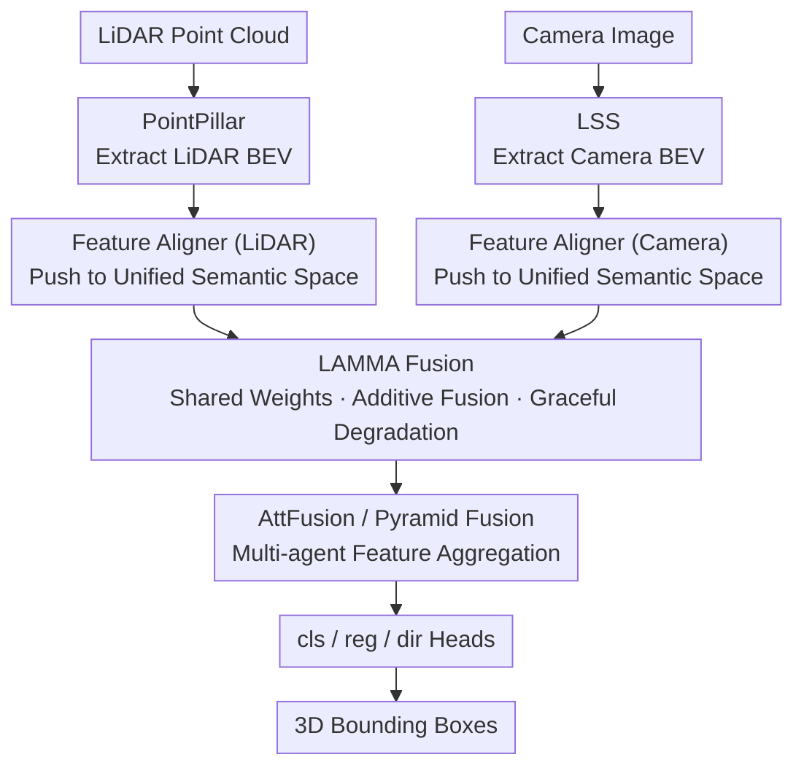

# SiMO: Single-Modality-Operable Multimodal Collaborative Perception

**Conference**: ICLR 2026  
**arXiv**: [2603.08240](https://arxiv.org/abs/2603.08240)  
**Code**: [dempsey-wen/SiMO](https://github.com/dempsey-wen/SiMO)  
**Area**: Collaborative Perception / Multimodal Fusion / Autonomous Driving  
**Keywords**: collaborative perception, multimodal fusion, modality failure, BEV, 3D detection  

## TL;DR

Ours proposes the SiMO framework, which utilizes the LAMMA fusion module and the PAFR training strategy to achieve a multi-agent collaborative perception system capable of operating under arbitrary modality loss (specifically when LiDAR fails and only cameras are available) for the first time. It functions like a parallel circuit—as long as one path exists, the system works.

## Background & Motivation

**Multi-agent collaborative perception (MACP)** expands perception range and overcomes occlusions by sharing features among multiple vehicles. However, existing multimodal methods resemble series circuits; the loss of any sensor (especially LiDAR) leads to system-wide failure.

**Root causes of modality failure**: Current fusion methods (concat / CNN / Transformer) result in inconsistent feature spaces before and after fusion. When a modality is missing, unfused single-modality features cannot match the downstream task heads designed for fused features, causing system collapse.

**Increased complexity in collaborative scenarios**: Unlike single-agent systems that only require local alignment, MACP requires transmitted features from different agents (e.g., ego vehicle using LiDAR + camera while a neighbor has only camera) to strictly reside in a unified semantic space for effective cross-agent interaction. Existing single-agent robust methods cannot guarantee this cross-agent semantic consistency.

**Overlooked modality competition**: During multimodal joint training, modalities with high information density (e.g., LiDAR for 3D tasks) converge faster and dominate the optimization process. This suppresses the thorough training of weaker modality branches (camera), preventing them from working independently.

**Limitations of Prior Work**: Methods like BM2CP, BEVFusion, and CoBEVFusion only focus on precision improvements via multimodal fusion, ignoring the independent availability of camera branches when LiDAR fails. Methods like MetaBEV or UniBEV explore modality robustness only in single-agent settings and cannot be generalized to multi-agent scenarios.

**Ours is the first work to systematically handle dynamic and heterogeneous modality loss in collaborative perception.**

## Method

### Overall Architecture

SiMO addresses the issue where "the entire system crashes once LiDAR is missing" in multi-agent collaborative perception. The Core Idea is to "align first, then fuse": ensuring both single-modality features and multimodal fused features fall into the same semantic space. This allows downstream task heads to process features normally without failure due to distribution shifts, regardless of the available modalities.

Regarding the data flow, LiDAR point clouds and Camera images extract BEV features via PointPillar and LSS (Lift-Splat-Shot), respectively. These two feature sets first pass through independent aligners to be pushed into a unified semantic space. The aligned features are then handed to LAMMA for length-adaptive fusion, resulting in a fused representation consistent with the single-modality space. Finally, multi-vehicle features are aggregated by AttFusion or Pyramid Fusion, and 3D detection boxes are output via cls/reg/dir heads. This forward chain is trained using the four-stage PAFR isolated training strategy to avoid modality competition.

### Key Designs

**1. Feature Aligner: Pushing Heterogeneous Modalities into a Unified Semantic Space**

LiDAR directly measures 3D geometry while Camera infers depth from 2D pixels. Their raw BEV feature distributions differ significantly, which is why previous methods fail without LiDAR—unfused single-modality features do not fall into task heads designed for fused features. SiMO inserts two independent 3-layer ConvNeXt aligners, $g_L$ and $g_C$, to map LiDAR and Camera features into a unified semantic space. Procrustes distance analysis validates this: after alignment and LAMMA, the discrepancy between camera and lidar features drops from 0.86 to 0.05.

**2. LAMMA Fusion Module: Graceful Degradation via Shared Weights and Additive Fusion**

The challenge is for the fusion module to consume two modalities while seamlessly degrading when only one remains, without semantic drift. LAMMA shares linear projections $W_Q, W_K, W_V$ for Q/K/V across all modalities to ensure consistent semantic processing. During the forward pass, it concatenates the Query of two modalities as $Q=[Z_A; Z_B]$ while keeping Key/Value separate. It performs multi-head attention for each modality (covering both self and cross-attention), followed by Split+Sum to get enhanced representations $Z_{fused\_m}$, and finally performs additive fusion to obtain $Z_{mm}$. Additive fusion, rather than concatenation or CNNs, avoids feature space shifts. Graceful degradation occurs because if a modality is missing (e.g., $Z_A=0$), the corresponding Query part zeroes out, and LAMMA naturally degrades to pure self-attention.

**3. PAFR Four-Stage Training: Avoiding Modality Competition via Isolated Training**

Even with the correct fusion structure, end-to-end joint training allows the high-information LiDAR branch to converge faster and dominate, "starving" the Camera branch. PAFR uses four-stage isolated training to circumvent this: Step 1 (Pretrain) loads pre-trained feature extractors and freezes them; Step 2 (Align) trains the LiDAR aligner to convergence and freezes it, then separately trains the Camera aligner and freezes it; Step 3 (Fuse) trains only LAMMA with multimodal inputs; Step 4 (RD) fine-tunes LAMMA with a 50% probability of randomly dropping a modality to adapt it to modality loss.

### Loss & Training

$$L(\hat{Y}, Y) = L_{Focal}(\hat{Y}_{cls}, Y_{cls}) + L_{SmoothL1}(\hat{Y}_{reg}, Y_{reg})$$

Focal Loss is used for classification and Smooth L1 for regression, following standard BEV 3D detection configurations.

## Key Experimental Results

### Main Results: OPV2V-H 3D Detection (AP%)

| Method | Modality | AP@30 | AP@50 | AP@70 |
|------|------|-------|-------|-------|
| BM2CP | L+C | 91.69 | 91.45 | 86.87 |
| BM2CP | L only | 91.55 | 91.31 | 86.80 |
| BM2CP | **C only** | **0** | **0** | **0** |
| BEVFusion+RD | L+C | 95.18 | 94.21 | 81.09 |
| BEVFusion+RD | **C only** | **0** | **0** | **0** |
| UniBEV+RD | L+C | 93.33 | 91.71 | 70.75 |
| UniBEV+RD | **C only** | **1.93** | **0** | **0** |
| HEAL (Pyramid) | L | 98.22 | 98.00 | 96.16 |
| HEAL (Pyramid) | C | 68.45 | 60.48 | 39.07 |
| **SiMO-PF+RD** | **L+C** | **98.30** | **97.94** | **94.64** |
| **SiMO-PF+RD** | **L only** | **97.32** | **97.07** | **94.06** |
| **SiMO-PF+RD** | **C only** | **80.81** | **69.63** | **44.82** |

**Key Findings**: BM2CP/BEVFusion/UniBEV fail completely when LiDAR is missing (Camera-only AP≈0). SiMO-PF achieves AP@30=80.81% in Camera-only mode, surpassing HEAL's Camera-only result by 12.36 points.

### Heterogeneous Modality Failure Experiment

| Mode | HEAL AP@50 | SiMO-PF AP@50 |
|------|-----------|---------------|
| L only | 0.98 | 0.97 |
| C only | 0.60 | 0.70 |
| C-ego (Hetero) | 0.82 | 0.85 |
| L-ego (Hetero) | 0.96 | 0.97 |

SiMO adapts to heterogeneous modality failure scenarios without additional fine-tuning.

### Ablation Study

| Learning Strategy | RD | LAMMA | AP@70 (L+C / L / C) | Adaptive to Modality Missing? |
|---------|-----|-------|---------------------|----------------|
| ✗ | ✗ | ✗ | 0.94 / 0.01 / 0 | ✗ |
| ✗ | ✔ | ✗ | 0.11 / 0 / 0 | ✗ |
| ✔ | ✗ | ✔ | 0.95 / 0.26 / 0 | ✗ |
| ✗ | ✔ | ✔ | 0.81 / 0.72 / 0 | ✗ |
| **✔** | **✔** | **✔** | **0.95 / 0.94 / 0.45** | **✔** |

All three components are indispensable: without the PAFR strategy, RD is harmful; without RD, the model cannot adapt to modality loss; without LAMMA, the Camera branch in models like BEVFusion+RD remains ineffective.

### Procrustes Analysis for Feature Alignment

| Comparison | BEVFusion | Before LAMMA | After LAMMA |
|------|-----------|---------|---------|
| cam vs lidar | 0.8645 | 0.6747 | **0.0472** |
| cam vs fused | 0.7297 | 0.3886 | **0.0215** |
| lidar vs fused | 0.5747 | 0.2773 | **0.0064** |

After LAMMA, the discrepancy between multimodal features drops from 0.67 to 0.05, validating high feature space unification.

## Highlights & Insights

1.  **Effective Parallel Circuit Analogy**: Designing the multimodal system as a parallel rather than series circuit—where one valid path is enough—is a simple yet practical concept.
2.  **New Understanding of Modality Competition**: Attributes modality competition to differences in "task-relevant information density" and bypasses it with isolated training rather than attempting balance, which is more deterministic than gradient regulation.
3.  **Graceful Degradation of LAMMA**: Naturally degrades to self-attention when a modality is missing without needing extra detection logic.
4.  **Plug-and-Play**: LAMMA can be adapted to different collaborative perception frameworks (AttFusion / Pyramid Fusion) without modifying the original methods.
5.  **Significant Camera Branch Empowerment**: SiMO-PF Camera-only results are 12.36/9.15/5.75 points higher than HEAL (AP@30/50/70), indicating previous frameworks underutilized camera features.

## Limitations

1.  **Single-Modality Performance Bound by Feature Extractors**: In single-view camera scenarios (e.g., DAIR-V2X), depth estimation is limited by the lack of multi-view parallax, a physical bottleneck SiMO cannot break.
2.  **Multi-stage Training Process**: The four-stage PAFR training inevitably increases total training time.
3.  **Lack of Smoothing in Additive Fusion**: Compared to the implicit smoothing of CNN fusion, additive fusion may be more sensitive to high-intensity sensor noise.
4.  **Limited Datasets**: Main experiments rely on the simulated OPV2V-H dataset; real-world datasets (DAIR-V2X/V2XReal) are only briefly validated in the appendix.

## Related Work

-   **Multimodal Collaborative Perception**: HM-ViT, HEAL, BM2CP, CoBEVFusion
-   **Single-agent Modality Robustness**: CMT, MetaBEV, UniBEV
-   **Multimodal Balanced Learning**: Gradient Blending, OGM, PMR, UMT
-   **Foundational Components**: PointPillar, LSS, BEVFusion, ConvNeXt, Pyramid Fusion

## Rating

⭐⭐⭐⭐ (4/5)

**Reasoning**: The problem definition is clear and practically valuable (modality failure is unavoidable in real-world driving). LAMMA is elegantly designed (shared weights + additive fusion + natural degradation), and the PAFR strategy offers deep insights into modality competition. Ablation studies prove the necessity of all components. Points are deducted because main experiments are still simulation-based and multi-stage training adds engineering complexity.

<!-- RELATED:START -->

## Related Papers

- [\[ICLR 2026\] Rate-Distortion Optimized Pragmatic Communication for Collaborative Perception](rate-distortion_optimized_pragmatic_communication_for_collaborative_perception.md)
- [\[NeurIPS 2025\] Layer-wise Modality Decomposition for Interpretable Multimodal Sensor Fusion](../../NeurIPS2025/autonomous_driving/layer-wise_modality_decomposition_for_interpretable_multimodal_sensor_fusion.md)
- [\[CVPR 2026\] CATNet: Collaborative Alignment and Transformation Network for Cooperative Perception](../../CVPR2026/autonomous_driving/catnet_collaborative_alignment_and_transformation_network_for_cooperative_percep.md)
- [\[CVPR 2026\] CoLC: Communication-Efficient Collaborative Perception with LiDAR Completion](../../CVPR2026/autonomous_driving/colc_communication-efficient_collaborative_perception_with_lidar_completion.md)
- [\[CVPR 2026\] Unsupervised Multi-agent and Single-agent Perception from Cooperative Views](../../CVPR2026/autonomous_driving/unsupervised_multi-agent_and_single-agent_perception_from_cooperative_views.md)

<!-- RELATED:END -->
