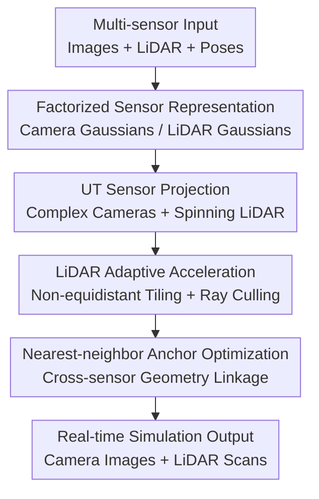

# SimULi: Real-Time LiDAR and Camera Simulation with Unscented Transforms

**Conference**: ICLR 2026  
**OpenReview**: [https://openreview.net/forum?id=osxP6FafPZ](https://openreview.net/forum?id=osxP6FafPZ)  
**Code**: None  
**Area**: Autonomous Driving  
**Keywords**: LiDAR Simulation, Camera Simulation, 3D Gaussian Splatting, Unscented Transform, Multi-sensor Reconstruction  

## TL;DR
SimULi utilizes factorized 3D Gaussian representations to separately carry camera and LiDAR information, extending 3DGUT to the irregular sampling of spinning LiDAR, thereby achieving real-time autonomous driving sensor simulation that supports complex camera models and LiDAR scanning simultaneously.

## Background & Motivation
**Background**: Autonomous driving systems increasingly rely on end-to-end policy models and closed-loop evaluation, yet real-world road data rarely covers all dangerous, rare, or edge-case scenarios. Consequently, neural simulators capable of reconstructing scenes from real sensor data and rendering camera and LiDAR observations from novel viewpoints and timestamps are becoming critical infrastructure for AV development. Previous NeRF-based methods offer attractive quality, while 3D Gaussian Splatting (3DGS) has pushed rendering speeds toward real-time.

**Limitations of Prior Work**: The issue is that autonomous driving is not a single pinhole camera rendering task. Real vehicle cameras often feature fisheye lenses, high distortion, and rolling shutters; LiDAR provides sparse, non-uniform measurements that vary over sweep time. Standard 3DGS rasterization is optimized for regular image planes and lacks native support for these non-linear projections. NeRF or ray-tracing routes are more flexible but often lack the speed required for large-scale simulation.

**Key Challenge**: Joint multi-sensor modeling encounters a more difficult conflict: camera and LiDAR data are never perfectly aligned in reality. Calibration errors, time synchronization offsets, rolling shutters, and object motion cause subtle geometric discrepancies between the two sensors for the same location. If camera color and LiDAR depth are forced into a single NeRF or set of Gaussians, optimization must trade off quality between the two modalities via loss weighting.

**Goal**: SimULi aims to achieve three objectives simultaneously: first, provide native support for arbitrary camera models and spinning LiDAR, including time-dependent effects; second, eliminate the requirement for a shared geometric carrier between camera and LiDAR to reduce quality degradation caused by cross-sensor inconsistency; and third, achieve real-time inference speeds suitable for practical AV simulation and evaluation.

**Key Insight**: The authors build upon 3DGUT rather than standard 3DGS or pure ray tracing. The critical advantage of 3DGUT is using the Unscented Transform to approximate the 2D footprint of Gaussians under complex projections, making it easier to integrate non-linear sensor models like fisheye or rolling shutters. This work observes that extending this concept to the azimuth-elevation space of LiDAR, combined with tiling and culling optimized for sparse LiDAR sampling, yields both flexible sensor modeling and high throughput.

**Core Idea**: Replace the "single representation shared by all sensors" with a "sensor-factorized Gaussian representation + LiDAR-specific UT rasterization," allowing camera and LiDAR to optimize their own sets of particles while maintaining geometric linkage through nearest-neighbor anchoring.

## Method
### Overall Architecture
SimULi takes multi-camera images, LiDAR scans, sensor poses, and dynamic object information as input, outputting camera images and LiDAR point clouds at novel views or timestamps. The framework decomposes the scene into a static background and dynamic actors, maintaining separate sets of 3D Gaussian particles for camera and LiDAR. During rendering, cameras follow the complex projection of 3DGUT, while LiDAR projects Gaussians onto an azimuth-elevation grid with acceleration via adaptive tiling and ray-based culling.

The scene representation follows dynamic scene decomposition: the background is one set of Gaussians, while dynamic objects (e.g., vehicles, pedestrians) have individual 3D bounding boxes and time-dependent $SE(3)$ poses. Gaussians belonging to dynamic objects are defined in local coordinates and transformed to world coordinates for specific timestamps. This ensures the simulator supports dynamic rendering based on object states rather than simple static reconstruction.

Camera rendering utilizes the camera Gaussian set $G_c$, while LiDAR rendering uses $G_l$. Both sets contain centers $\mu_i$, opacity $\alpha_i$, and covariance $\Sigma_i$, but carry different attributes: camera Gaussians use spherical harmonics for view-dependent color, while LiDAR Gaussians use them for intensity and ray-drop information. This prevents supervision from different modalities from directly competing on the same particles.

### Key Designs
**1. Factorized Sensor Representation: Transforming Conflicts from "Hard Sharing" to "Soft Association"**

Prior joint camera-LiDAR methods often compress all information into a single implicit field or Gaussian set, trained with simultaneous photometric and depth losses. While this shares geometry, it turns calibration and timing errors into optimization conflicts: LiDAR pulls particles toward laser return surfaces, while cameras may push them elsewhere for color or view consistency. SimULi splits these into $G_c$ and $G_l$, allowing each sensor to explain its own observations within its respective representation.

This split is not a simple disconnected training. The authors apply a nearest-neighbor anchor loss to keep camera Gaussians close to the surface geometry distilled from the LiDAR representation: $L_{anchor}=\frac{1}{n}\sum_i \|\mu_i-NN(\mu_i,G_l)\|_2$. To avoid full nearest-neighbor computations at every step, the system maintains $K=50$ neighbors for each camera Gaussian, updated every 1000 iterations. This provides camera particles with geometric constraints without forcing them onto sparse, potentially misaligned LiDAR depth rays.

This design yields two benefits. Qualitatively, it prevents one sensor's quality from being sacrificed for another's due to loss weights. Computationally, only the relevant subset of Gaussians is processed for a given sensor modality. Ablations show that factorized anchoring is more stable than direct depth supervision and improves LiDAR rendering throughput from $\sim 5$ MR/s to the $11$ MR/s range.

**2. UT Sensor Projection: Unified Handling of Fisheye, Rolling Shutter, and LiDAR Scanning**

Standard 3DGS speed comes from tile-based rasterization of 3D Gaussians projected onto a regular image plane, assuming a pinhole model. This is ill-suited for fisheye lenses, non-linear distortion, or time-varying poses. SimULi adopts the 3DGUT approach: instead of assuming linear projection, it samples 7 sigma points for each 3D Gaussian, projects them individually via the sensor-specific projection function, and estimates the resulting 2D conic footprint.

For cameras, this allows the projection function to incorporate arbitrary models and rolling shutter motion. For LiDAR, the projection space shifts from an image plane to azimuth $\phi$ and elevation $\theta$. A 3D point is transformed to the LiDAR frame, and spherical coordinates are derived via $\phi=\arctan2(y,x)$, $\theta=\arcsin(z/r)$, and $r=\sqrt{x^2+y^2+z^2}$. Since sigma points project independently, temporal changes in the sensor or object during scanning are natively handled by the projection function rather than post-hoc static approximations.

**3. LiDAR Adaptive Acceleration: Non-equidistant Tiling and Ray Culling**

LiDAR sampling is highly non-uniform compared to cameras. While horizontal coverage is typically $360^\circ$, the vertical field is narrow and beam distributions are often non-equidistant. Standard uniform tiling would result in highly imbalanced GPU workloads. SimULi constructs a normalized CDF based on the vertical beam distribution and splits elevation tiles at integer boundaries of this CDF, ensuring a balanced number of measurements per tile.

After determining elevation tiles, the system selects the number of azimuth tiles such that the number of beams per tile does not exceed a user-defined limit $M$. This tiling setup is performed once per sensor definition. To further optimize, SimULi uses a dual-resolution tiling strategy: a coarse resolution $T_r$ for rendering and a fine resolution $T_c$ for culling. A ray mask is built on the fine grid using a summed-area table via 2D prefix sums. Gaussians are only processed if their projected extent intersects a fine-grid region containing active rays, pushing LiDAR throughput to millions of rays per second.

**4. LiDAR Physics Modeling: Intensity, Ray Drop, and Beam Divergence**

Simulating only depth is insufficient for realistic LiDAR. SimULi's LiDAR Gaussians predict beam intensity via spherical harmonics and hit/drop probabilities through a two-channel softmax. Training incorporates intensity loss and binary cross-entropy ray-drop loss. Furthermore, the model addresses beam divergence—treating beams as having thickness rather than zero-width—to handle high-reflectivity small targets at range. 3D smoothing similar to anti-aliased Gaussian smoothing is applied to prevent depth supervision from creating dilation or floating artifacts.

### Loss & Training
SimULi randomly samples one image and one LiDAR frame per training step, optimizing $G_c$, $G_l$, a bilateral grid, and an environment map. The total loss is $L=L_{recon}+\lambda_{anchor}L_{anchor}+L_{reg}$ with $\lambda_{anchor}=0.01$.

Reconstruction loss consists of two parts. The camera side uses $L_1$ photometric and SSIM losses (weights $0.8$ and $0.2$). The LiDAR side uses $L_1$ losses for distance and intensity, and a BCE loss for ray drop (weights $0.01$, $0.1$, and $0.05$). Camera loss backpropagates only to $G_c$, and LiDAR loss only to $G_l$. Regularization terms encourage binary opacity and sparsity for LiDAR Gaussians and smooth temporal transitions for dynamic rendering.

## Key Experimental Results

### Main Results
SimULi was evaluated on Waymo Interp, Waymo Dynamic, and PandaSet regarding camera image quality, LiDAR scan quality (distance/intensity/ray drop), and rendering throughput.

| Dataset / Setting | Metric | SimULi | Main Strong Baseline | Gain |
|--------|------|------|----------|------|
| Waymo Interp | PSNR / CD | 30.15 / 0.136 | SplatAD 27.82 / 0.175 | PSNR +2.33 dB, Lower CD |
| Waymo Interp | Speed | 156.90 MP/s, 11.33 MR/s | SplatAD 49.98 MP/s, 2.40 MR/s | Cam ~3.1x, LiDAR ~4.7x |
| Waymo Dynamic | PSNR / CD | 32.35 / 0.148 | SplatAD 30.60 / 0.223 | PSNR +1.75 dB, Lower CD |
| Waymo Dynamic | Speed | 179.45 MP/s, 10.56 MR/s | SplatAD 52.28 MP/s, 2.94 MR/s | Cam ~3.4x, LiDAR ~3.6x |
| PandaSet Recon | PSNR / RayDrop / CD | 29.76 / 0.997 / 0.206 | SplatAD 28.58 / 0.974 / 0.336 | PSNR +1.18 dB, Accurate LiDAR |
| PandaSet NVS | PSNR / CD | 27.12 / 0.331 | SplatAD 26.73 / 0.346 | Slight Lead in NVS |

In Waymo Interp, SimULi exceeds all baselines by over 2 dB in PSNR while maintaining superior LiDAR chamfer distance, proving it does not sacrifice geometric accuracy for image quality.

### Ablation Study
| Configuration | Key Metric | Description |
|------|---------|------|
| Direct $\lambda_d=0$ | PSNR 26.61, CD 6.248, MR/s 5.55 | No LiDAR depth constraint; LiDAR geometry fails |
| Direct $\lambda_d=0.01$ | PSNR 26.39, CD 0.475, MR/s 4.97 | Direct depth supervision improves LiDAR but hurts Camera and speed |
| w/o Bilateral Grid | PSNR 25.99, CD 0.337, MR/s 12.07 | Removing color correction significantly degrades Camera quality |
| w/o Env. Map | PSNR 26.81, CD 0.336, MR/s 11.83 | Environment map helps background/distant areas |
| Full Method | PSNR 27.12, CD 0.331, MR/s 11.02 | Factorized representation + Anchoring provides best balance |

### Key Findings
- Factorized representation is the primary driver of quality. Hard-sharing LiDAR depth loss collapses camera PSNR and LiDAR speed.
- Adaptive LiDAR tiling and ray culling provide the speed increase, pushing throughput to $\sim 11$ MR/s compared to SplatAD's $1.2$ MR/s.
- Camera side gains come from anchoring, bilateral grids, and environment maps, which collectively reduce floaters caused by sparse depth supervision.
- SimULi handles fast motion and rolling shutters effectively in dynamic scenes, producing clearer details (e.g., text, reflections) compared to static temporal modeling.

## Highlights & Insights
- The shift from "hard sharing" to "soft anchoring" is the most valuable insight. SimULi demonstrates that when sensors have inherent inconsistencies, separation via factorized sets with linkage is more accurate than unified representations.
- Extending Unscented Transforms to LiDAR is a natural yet robust evolution, abstracting complex sensors as projection functions.
- Automatic tiling is a highly practical engineering innovation, converting manual tuning for different LiDAR models into systematic CDF-based grid optimization.
- The results prove "Real-time + High-fidelity + Multi-sensor" can be achieved without heavy post-processing CNNs or refinement networks.

## Limitations & Future Work
- Dependency on reconstructed scenes limits the model to replay and novel view scenarios rather than open-ended semantic generation.
- Factorized representations increase memory overhead and the number of optimization targets during the training phase.
- Anchoring assumes LiDAR is more geometrically reliable; however, LiDAR can have systematic biases in rain, fog, or on reflective surfaces (glass), requiring potential confidence modeling.
- Support for privacy as a native component of the representation is a suggested future direction, particularly regarding facial and license plate obfuscation within the learned model.

## Related Work & Insights
- **vs UniSim / NeuRAD**: These NeRF-based simulators use unified representations that are slower and prone to inter-sensor interference. SimULi uses Gaussians for speed and factorized sets for modality-specific optimization.
- **vs SplatAD**: SplatAD uses a shared representation and is limited by pinhole assumptions and heuristic tiling. SimULi improves upon this with complex camera support (via UT), automatic tiling, and decoupled particles.
- **vs LiDAR-RT / 3DGRT**: Ray tracing is flexible but slow. SimULi demonstrates that rasterization, when paired with UT and ray culling, can cover similarly complex sensor models.

## Rating
- Novelty: ⭐⭐⭐⭐⭐ The combination of factorized multi-sensor Gaussians and LiDAR-specific UT rasterization effectively addresses core AV simulation pain points.
- Experimental Thoroughness: ⭐⭐⭐⭐⭐ Comprehensive evaluation across three datasets with a focus on both quality and throughput metrics.
- Writing Quality: ⭐⭐⭐⭐☆ Clear methodology and visualization, though some specific details are relegated to the appendix.
- Value: ⭐⭐⭐⭐⭐ High potential for direct application in autonomous driving simulation and closed-loop evaluation.

<!-- RELATED:START -->

## Related Papers

- [\[CVPR 2026\] Unposed-to-3D: Learning Simulation-Ready Vehicles from Real-World Images](../../CVPR2026/autonomous_driving/unposed-to-3d_learning_simulation-ready_vehicles_from_real-world_images.md)
- [\[ICCV 2025\] GS-LIVM: Real-Time Photo-Realistic LiDAR-Inertial-Visual Mapping with Gaussian Splatting](../../ICCV2025/autonomous_driving/gs-livm_real-time_photo-realistic_lidar-inertial-visual_mapping_with_gaussian_sp.md)
- [\[CVPR 2025\] RENO: Real-Time Neural Compression for 3D LiDAR Point Clouds](../../CVPR2025/autonomous_driving/reno_real-time_neural_compression_for_3d_lidar_point_clouds.md)
- [\[CVPR 2026\] SimScale: Learning to Drive via Real-World Simulation at Scale](../../CVPR2026/autonomous_driving/simscale_learning_to_drive_via_real-world_simulation_at_scale.md)
- [\[CVPR 2025\] FreeSim: Toward Free-Viewpoint Camera Simulation in Driving Scenes](../../CVPR2025/autonomous_driving/freesim_toward_free-viewpoint_camera_simulation_in_driving_scenes.md)

<!-- RELATED:END -->
