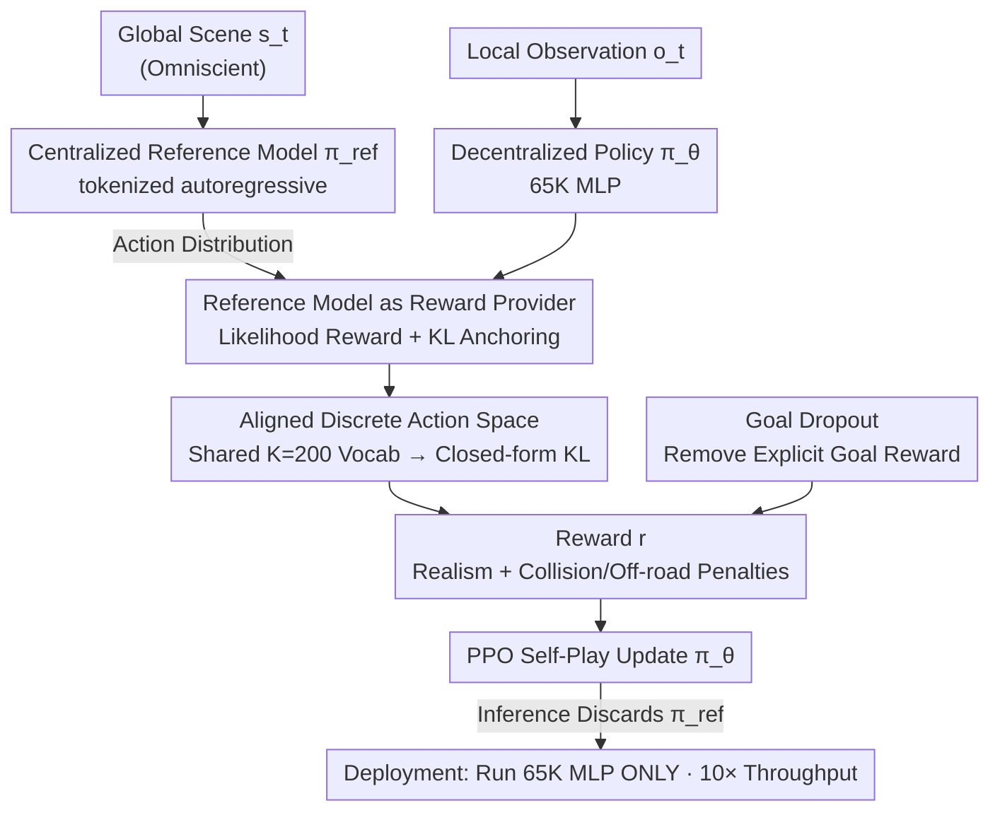

# SPACeR: Self-Play Anchoring with Centralized Reference Models

**Conference**: ICLR 2026  
**arXiv**: [2510.18060](https://arxiv.org/abs/2510.18060)  
**Code**: None  
**Area**: Autonomous Driving / Reinforcement Learning  
**Keywords**: Self-play Reinforcement Learning, Traffic Simulation, tokenized models, KL divergence alignment, human driving distribution  

## TL;DR
SPACeR proposes a "human-like self-play" framework that utilizes a pre-trained tokenized autoregressive motion model as a centralized reference policy. Through log-likelihood rewards and KL divergence constraints, it guides decentralized self-play RL policies to align with human driving distributions. It outperforms pure self-play methods on WOSAC while achieving 10x faster inference and 50x fewer parameters than imitation learning models.

## Background & Motivation

**Background**: Autonomous driving simulation requires realistic and reactive traffic agent policies. Two major paradigms have trade-offs: imitation learning (e.g., SMART, CAT-K) learns realistic human behavior but is computationally expensive and lacks closed-loop reactiveness; self-play RL is naturally suited for multi-agent interaction and efficient inference but often deviates from human driving norms.

**Limitations of Prior Work**: (a) Imitation learning models (Transformers) have slow inference and large parameter counts, making them unsuitable for large-scale closed-loop simulation; (b) self-play RL relies on manual reward shaping, and policies may learn unnatural behaviors (e.g., excessive acceleration toward target points); (c) existing methods combining RL and imitation learning are often "pre-train then fine-tune" rather than letting RL lead the process.

**Key Challenge**: How to maintain the speed and scalability of self-play RL while ensuring the human-like realism of the policy?

**Goal**: Construct a lightweight, fast, and scalable multi-agent simulation policy that maintains behavioral realism close to human driving distributions.

**Key Insight**: An RL-first approach—self-play serves as the foundation, while the imitation learning model acts solely as a reward provider (reference policy) rather than a target for fine-tuning.

**Core Idea**: Use a pre-trained tokenized model to provide human realism signals to anchor self-play RL, while the actual execution is handled by a 65K-parameter MLP.

## Method

### Overall Architecture
SPACeR aims to resolve the difficulty of achieving both "speed" and "human-likeness" in simulated traffic agents. While self-play RL is fast, it often learns unnatural driving; imitation learning is human-like but uses large models with poor closed-loop response. The approach splits these into two roles: the actual on-road decision-maker is a lightweight decentralized policy $\pi_\theta$ (65K parameter MLP) that observes local data; the pre-trained tokenized autoregressive motion model $\pi_{\text{ref}}$ provides "how humans drive" action distribution signals based on the global scene. During training, PPO is used for self-play, but the reference model's log-likelihood is added to the reward, and a KL divergence constraint toward the reference model is added to the objective. During inference, the large model is discarded, and only the small MLP is executed.

### Key Designs

**1. Centralized Reference Model as Reward Provider: Anchoring Self-Play with Probability Distributions Instead of Ground Truth Trajectories**

States generated by self-play are often absent from recorded trajectories, making traditional imitation supervision ineffective in these new states. SPACeR's solution is not to align with a specific trajectory but to let the pre-trained tokenized model (e.g., SMART/CAT-K) output an action distribution for every agent at every timestep, treating this distribution as a dense signal for "human realism." This signal enters policy training in two ways: a likelihood reward $\alpha \cdot \log \pi_{\text{ref}}(a_t|s_t)$ added to the reward function, and a distribution alignment $\beta \cdot D_{\text{KL}}(\pi_\theta \| \pi_{\text{ref}})$ subtracted from the training objective. Crucially, the reference model is centralized (observing the global scene), while the execution policy is decentralized (observing local data), forming a teacher-student privileged information architecture. Since signals are provided per-agent and per-action, it also solves the credit assignment problem in multi-agent settings.

**2. Aligned Discrete Action Space: Enabling Closed-Form KL Divergence Calculation**

To implement the likelihood reward and KL constraint, the policy and reference model must speak the same "action language." SPACeR forces the RL policy to adopt the discrete action vocabulary of the tokenized reference model (K-disk clustering with $K=200$). This allows the KL divergence to be calculated directly as a closed-form sum at each step: $D_{\text{KL}} = \sum_{a} \pi_\theta(a|o) \log \frac{\pi_\theta(a|o)}{\pi_{\text{ref}}(a|s)}$. This engineering alignment is essential for the framework's theoretical feasibility.

**3. Goal Dropout: Removing Explicit Goal Rewards to Improve Realism**

Traditional self-play methods only provide rewards when agents reach target points, which often leads policies to learn unnatural behaviors like abrupt acceleration. With the anchoring of the human distribution from the reference model, SPACeR randomly removes goal conditions during training or completely deletes explicit goal rewards, which actually increases realism. The intuition is that humans do not always drive toward a fixed target point; real behavior often involves flowing smoothly with traffic.

### Loss & Training
$$\mathcal{L}(\theta) = \mathcal{L}_{\text{PPO}}(\theta; A[r]) - \beta D_{\text{KL}}(\pi_\theta(\cdot|o_t) \| \pi_{\text{ref}}(\cdot|s_t))$$
Where the reward is defined as: $r = w_{\text{goal}} \cdot \mathbb{I}[\text{Goal}] - w_{\text{collision}} \cdot \mathbb{I}[\text{Collision}] - w_{\text{offroad}} \cdot \mathbb{I}[\text{Offroad}] + w_{\text{humanlike}} \cdot \log \pi_{\text{ref}}(a|s)$

## Key Experimental Results

### Main Results
WOSAC Validation Set (Vehicles):

| Method | Composite Realism↑ | Kinematics↑ | Interactive↑ | Collision↓ | Throughput (Scenes/sec)↑ |
|------|-----------|--------|------|------|------------------|
| PPO (Pure Self-Play) | 0.710 | 0.327 | 0.751 | 0.038 | **211.8** |
| HR-PPO | 0.716 | 0.341 | 0.756 | 0.044 | **211.8** |
| **SPACeR** | **0.741** | **0.411** | **0.779** | **0.036** | **211.8** |
| SMART (Imitation Learning) | 0.720 | 0.450 | 0.725 | 0.170 | 22.5 |
| CAT-K (Imitation Learning) | 0.766 | 0.490 | 0.792 | 0.060 | 22.5 |

### Ablation Study

| Configuration | Composite Realism | Explanation |
|------|-----------|------|
| PPO only | 0.710 | No human signal |
| + Likelihood Reward only | ~0.72 | Marginal improvement, unstable under multi-modal distributions |
| + KL Alignment only | ~0.74 | Significant improvement, maintains entropy while aligning |
| + Likelihood + KL (SPACeR) | 0.741 | Best |
| - Goal Reward + Anchoring | ~0.74 | Realism improves after removing goal rewards |

### Key Findings
- KL alignment contributes more than likelihood rewards—the latter reduces policy diversity (lower entropy), while KL alignment improves realism while maintaining entropy.
- The quality of the reference model has limited impact: even with a weak reference model (0.3M parameters, realism score 0.636), SPACeR achieves 0.732, proving the reference model acts as a "soft prior" rather than a "hard target."
- In closed-loop planner evaluation, SPACeR agents are more sensitive than CAT-K—showing lower correlation with PDM scores of GT logs, indicating they better penalize unsafe planners.
- A ~65K parameter MLP achieves realism close to a 3.2M parameter tokenized model with 10× throughput.

## Highlights & Insights
- **RL-first vs. finetune paradigm**: The choice is insightful: while most work performs RL fine-tuning on large models, SPACeR prioritizes RL and treats the large model as a reward signal source. This results in a 50× smaller inference model suitable for large-scale simulation.
- **Action space alignment**: The alignment of action spaces to make KL computable is the critical technical point that enables the framework. Without this, calculating and optimizing KL divergence in continuous spaces would be far more difficult.
- **Analysis of WOSAC metric limitations**: The paper points out that WOSAC rewards the reproduction of recorded trajectories rather than safety (e.g., both driving through a lot or going straight might be reasonable, but WOSAC only rewards the recorded choice), providing insights for improving field evaluation.

## Limitations & Future Work
- Composite realism remains lower than the strongest imitation learning method, CAT-K (0.741 vs 0.766), particularly in kinematics.
- Training requires 24-48 hours on a single GPU and does not support multi-GPU distributed training.
- VRU (pedestrians/cyclists) simulation metrics are lower than vehicles, requiring specialized rewards and evaluation metrics for VRUs.
- The policy does not use temporal history, which may limit performance in scenarios requiring long-term memory.

## Related Work & Insights
- **vs. HR-PPO (Cornelisse & Vinitsky, 2024)**: HR-PPO only aligns a decentralized BC model with limited effect. SPACeR uses a centralized tokenized model to provide stronger signals, increasing realism from 0.716 to 0.741.
- **vs. SMART/CAT-K**: SPACeR has lower collision and off-road rates (0.036 vs. 0.17/0.06), showing self-play is inherently suited for collision avoidance. Realism is slightly lower, but inference is 10× faster.
- **vs. GIGAFlow (Cusumano-Towner et al., 2025)**: GIGAFlow demonstrates the feasibility of large-scale self-play; SPACeR adds human realism anchoring on top of this foundation.

## Rating
- Novelty: ⭐⭐⭐⭐ The RL-first + large model as reward provider paradigm is novel, though the core techniques (KL alignment, PPO) are combinations of mature methods.
- Experimental Thoroughness: ⭐⭐⭐⭐⭐ Includes WOSAC benchmark, closed-loop planner evaluation, reference model quality ablation, VRU assessment, and efficiency comparisons.
- Writing Quality: ⭐⭐⭐⭐ Clear framework, deep experimental analysis, and insightful discussion on WOSAC metrics.
- Value: ⭐⭐⭐⭐⭐ Provides a practical solution for large-scale traffic simulation—10× speed with near-human realism, filling the gap between speed and authenticity.

<!-- RELATED:START -->

## Related Papers

- [\[ICML 2026\] Plug-and-Play Label Map Diffusion for Universal Goal-Oriented Navigation](../../ICML2026/autonomous_driving/plug-and-play_label_map_diffusion_for_universal_goal-oriented_navigation.md)
- [\[AAAI 2026\] FastDriveVLA: Efficient End-to-End Driving via Plug-and-Play Reconstruction-based Token Pruning](../../AAAI2026/autonomous_driving/fastdrivevla_efficient_end-to-end_driving_via_plug-and-play_.md)
- [\[ICCV 2025\] ETA: Efficiency through Thinking Ahead, A Dual Approach to Self-Driving with Large Models](../../ICCV2025/autonomous_driving/eta_efficiency_through_thinking_ahead_a_dual_approach_to_self-driving_with_large.md)
- [\[ICLR 2026\] Low-Latency Neural LiDAR Compression with 2D Context Models](low-latency_neural_lidar_compression_with_2d_context_models.md)
- [\[ICLR 2026\] Discrete Diffusion for Reflective Vision-Language-Action Models in Autonomous Driving](discrete_diffusion_for_reflective_vision-language-action_models_in_autonomous_dr.md)

<!-- RELATED:END -->
