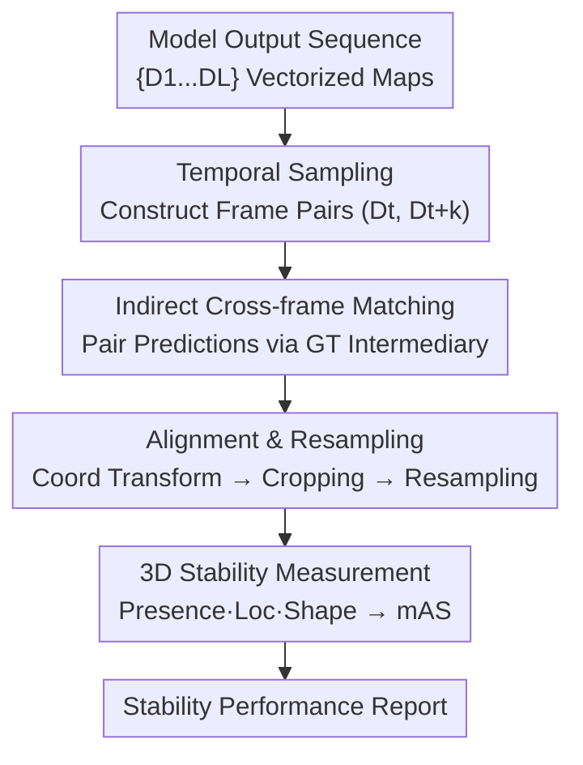

# Stability under Scrutiny: Benchmarking Representation Paradigms for Online HD Map Construction

**Conference**: ICLR 2026  
**OpenReview**: [https://openreview.net/forum?id=mxz5RqhCMe](https://openreview.net/forum?id=mxz5RqhCMe)  
**Code**: https://stablehdmap.github.io/ (Available)  
**Area**: Autonomous Driving / Online HD Mapping  
**Keywords**: Online HD Map, Temporal Stability, Benchmarking, mAS, Representation Paradigms

## TL;DR
This paper points out that the field of online high-definition (HD) mapping has exclusively focused on single-frame accuracy (mAP) while neglecting the issue of temporal stability (jittering/flickering) between consecutive frames. It proposes the first multi-dimensional stability evaluation framework (merging Presence, Localization, and Shape metrics into a mean Average Stability, mAS). Through large-scale evaluation of 42 models and variants, the study finds that mAP and mAS are largely independent. It systematically analyzes how design choices—such as sensors, backbones, BEV encoders, temporal fusion, and training duration—affect both accuracy and stability.

## Background & Motivation

**Background**: Online HD mapping is a fundamental module for autonomous driving, where vehicles construct local vectorized maps (lane lines, boundaries, crosswalks, etc.) in real-time using onboard sensors. Compared to offline pre-built HD maps, this approach saves expensive production and maintenance costs and adapts better to dynamic road conditions. Recent years have seen an influx of methods (MapTR, MapTRv2, StreamMapNet, MapTracker, PivotNet, BeMapNet, etc.) belonging to different representation paradigms. The community primarily uses mean Average Precision (mAP) on nuScenes to rank models, with accuracy scores steadily increasing.

**Limitations of Prior Work**: mAP only measures **single-frame** geometric accuracy and is blind to map stability in the temporal dimension. A model with high mAP might suffer from lane lines flickering in and out, boundaries jittering, or abrupt shape changes between consecutive frames—behaving like an "intermittently blind" guide. The paper illustrates the dangers with two scenarios: In Scenario A, a lane divider suddenly disappears during an overtaking maneuver, causing the vehicle to steer toward the curb; in Scenario B, flickering lane lines cause the system to misinterpret a neighbor's normal lane change as a collision course. Such jittering directly compromises the safety of downstream planning and decision-making.

**Key Challenge**: Accuracy (per-frame geometric accuracy) and stability (inter-frame consistency) are distinct properties. However, the field lacks both dedicated stability **metrics** and a unified stability **benchmark**. Consequently, it is often assumed that "high accuracy equals reliability," treating stability as a free byproduct of accuracy. This assumption has never been systematically verified.

**Goal**: (1) Define metrics to quantify temporal stability; (2) Establish the first stability benchmark across a wide range of representative models; (3) Decompose the impact of various architectural designs on accuracy vs. stability.

**Key Insight**: The essence of stability is whether "the same map element looks similar across adjacent frames." To quantify this, one must first match **corresponding** map elements in adjacent frames and then compare position and shape changes point-by-point in a unified coordinate system.

**Core Idea**: Under the theme "Beyond Accuracy: Under Scrutiny of Stability," the authors build an evaluation framework consisting of "cross-frame instance matching → geometric alignment → 3D stability measurement." This integrates detection consistency, geometric jitter, and shape preservation into a single mean Average Stability (mAS) score, serving as a core evaluation criterion alongside mAP.

## Method

Note: This is a **benchmark/evaluation framework** paper. The "Method" refers to the stability evaluation pipeline itself rather than a new map construction model. This framework serves as a tool to "check the health" of outputs from any existing online HD map model.

### Overall Architecture

The input to the framework is the frame-by-frame output sequence of a model $\{D_1, D_2, \dots, D_L\}$ (where each frame is a set of vectorized map elements, i.e., polylines with confidence scores). The output is a stability report including Presence, Loc, and Shape scores, along with the integrated mAS. The pipeline consists of four stages: **Temporal Sampling** to construct pairs with varying intervals; **Indirect Cross-frame Matching** using Ground Truth (GT) as an intermediary; **Geometric Alignment and Resampling** to transform polylines to a common coordinate system; and **3D Stability Measurement** to compute and fuse the final metrics.

### Key Designs

**1. Temporal Sampling: Constructing pairs with adjustable intervals to suit different scenarios**

Stability is not observed in a single frame but by how much the map changes over time. Given a continuous output $\{D_1,\dots,D_L\}$ and a preset maximum interval $M$, for each anchor frame $D_t$ (where $t \le L-M$), a frame $D_{t+k}$ is randomly sampled from the future window $\{D_{t+1},\dots,D_{t+M}\}$ to form the pair $(D_t, D_{t+k})$. The framework tests multiple values of $M$ ($M \in \{2,3,5,10\}$) to address different concerns—ranging from "short-term jitter" relevant to emergency evasion to "longer-term drift" relevant to path planning. This design renders stability as a curve changing over time intervals rather than a single fixed number.

**2. Indirect Cross-frame Matching: Using GT as "anchors" to bypass prediction inconsistency**

To compare the stability of the "same lane line" across frames, one must first identify matching predictions. Directly matching predictions from $D_t$ to $D_{t+k}$ is problematic because the predictions themselves are unstable; if the model is jittery, matching will fail. Specifically, the paper uses **indirect matching**: taking advantage of the fact that GT annotations are persistent and stable. First, within each frame, predictions are matched to GT instances using the Hungarian algorithm (based on geometric and semantic similarity). Second, using the persistent IDs of GT elements across frames, predictions matched to the same GT ID in different frames are linked as a pair. This results in a set of matched instance pairs $\{(\text{poly}_{t+k}(e), \text{poly}_t(e)) \mid e \in E\}$. Here, GT serves as a "matching medium" rather than an absolute geometric baseline, ensuring the evaluation is robust to minor jitter in GT annotations.

**3. Geometric Alignment and Resampling: Aligning polylines in a common coordinate system**

Matched polylines exist in different ego-coordinate systems and must be aligned fairly. This involves three operations: **Coordinate Transformation**—moving the historical polyline $\text{poly}_t(e)$ from its ego-system at $t$ through the world system to the current frame's ego-system at $t+k$, $\text{poly}_{t\to t+k}(e) = T_{\text{world}\to t+k}\cdot T_{t\to\text{world}}\cdot \text{poly}_t(e)$; **Perception Range Cropping**—clipping the transformed polyline to the current frame's perception boundaries; and **Uniform Resampling**—applying a **dynamic axis selection** mechanism to decide the primary sampling axis based on local geometry (avoiding a fixed x-axis), which ensures robust resampling for polylines of any orientation.

**4. 3D Stability Measurement: Quantifying Presence, Localization, and Shape**

On the resampled point sets $\text{poly}^{\text{sample}}_{t+k}(e)$ and $\text{poly}^{\text{sample}}_t(e)$, stability is characterized via three complementary dimensions. **Presence Stability** measures detection consistency: given a threshold $\tau$, if confidence scores in both frames are $\ge\tau$ or both $<\tau$, it's 1 (consistent); if it flickers (present in one, absent in the other), it's 0.5. **Localization Stability** measures point-wise spatial jitter, using the mean L1 distance (mapped to a $[0,1]$ score):

$$\text{Loc}(e) = 1 - \frac{1}{\beta}\cdot\frac{1}{N}\sum_{i=1}^{N}\left|y_{t+k}(x_i)-y_t(x_i)\right|,$$

where $\beta=15$ is a scaling parameter based on the map radius. **Shape Stability** compares curvature $\kappa$, approximated by the average angle between segments $\kappa(\text{poly})=\frac{1}{N-1}\sum_{j=1}^{N-1}\theta_j$, defined as $\text{Shape}(e)=1-\frac{|\kappa(\text{poly}^{\text{sample}}_{t+k})-\kappa(\text{poly}^{\text{sample}}_t)|}{\pi}$. These are fused as:

$$\text{Stability}(e) = \text{Presence}(e)\cdot\left[\omega\cdot\text{Loc}(e) + (1-\omega)\cdot\text{Shape}(e)\right],$$

with $\omega=0.7$ (favoring localization). **Presence acts as a multiplicative gate**: if detection is inconsistent, the score is penalized regardless of localization accuracy. Finally, scores are averaged across instances and classes to obtain the mAS. The authors emphasize that mAS **complements** rather than replaces mAP.

## Key Experimental Results

The evaluation covers **42 online HD map constructors and variants** on the nuScenes validation set, grouped by temporal fusion, input modality, BEV encoder, and training epochs.

### Main Results: mAP and mAS are largely independent

| Model | Temporal | Modal | mAP↑ | Presence↑ | Loc↑ | Shape↑ | mAS↑ |
|------|------|------|------|-----------|------|--------|------|
| MapTR | No | C | 44.1 | 91.2 | 65.4 | 90.6 | 71.6 |
| PivotNet | No | C | 57.1 | 100.0 | 71.4 | 97.2 | 84.3 |
| MapQR | No | C | 66.4 | 91.8 | 75.6 | 91.6 | 77.8 |
| StreamMapNet | Yes | C | 63.3 | 96.6 | 97.7 | 92.3 | **91.9** |
| MapTracker | Yes | C | **75.95** | 93.3 | 98.1 | 95.8 | 90.4 |
| HRMapNet | Yes | C | 67.2 | 92.3 | 70.5 | 91.5 | 75.9 |

Key findings: (1) **High mAP does not guarantee high mAS**—MapQR has higher mAP than PivotNet but significantly lower mAS, showing stability is not an automatic byproduct of accuracy. (2) **Large stability gaps between paradigms**—mAS ranges from 71.6 (MapTR) to 91.9 (StreamMapNet). Most models cluster in the 71.6–78.0 range, highlighting temporal consistency as a major weakness. Models with native temporal designs (StreamMapNet, MapTracker) are clearly superior.

### Ablation Study: Impact of Design Choices on Accuracy vs. Stability

| Design Dimension | Phenomenon | Typical Data |
|----------|------|----------|
| Sensor Modality | LiDAR fusion boosts accuracy, but stability impact is model-dependent. | MapTR +LiDAR: mAS +3.4%; GeMap +LiDAR: mAS −3.9% (despite higher accuracy). |
| BEV Encoder | Different encoders yield similar mAS but have different strengths. | GKT excels in Presence (91.2); BEVFormer/BEVPool excel in Loc (69.7/69.8). |
| Temporal Fusion | Effectiveness depends on architectural compatibility. | MapTR+GKT with temporal: mAS −7.0%; MapTR+BEVFormer with temporal: mAS +2.4%, mAP +28.1%. |
| 2D Backbone | Stronger backbones boost accuracy, but stability is unpredictable. | MapTR R18→R50: mAP +36.1% but mAS −1.6%, Loc −12.8%. |
| Training Duration | Three behaviors coexist. | Erosion (MapTR-50: mAP +22.8%, mAS −4.7%) / Saturation (MapQR +3.2%) / Sensitivity (MapTracker −1.0~1.4%). |

### Key Findings
- **Accuracy and Stability are Independent Dimensions**: mAS ranges from 66.6 to 91.9 and rankings often mismatch mAP, suggesting mAP overestimates model reliability.
- **Native Temporal Design > Post-hoc Temporal Modules**: Models like StreamMapNet and MapTracker that integrate temporal fusion into the architecture perform best. Adding temporal modules to non-temporal architectures (e.g., MapTR+GKT) can actually degrade stability (−7.0%).
- **Strong Backbones often show a Presence↑ but Loc↓ trade-off**: Upgrading backbones in MapTR improved Presence (+3.4%) but worsened Loc (−12.8%), suggesting stronger backbones favor semantic consistency over geometric consistency.
- **Stability does not emerge automatically with accuracy training**: Prolonged training almost always improves accuracy, but its effect on mAS varies (erosion, saturation, or sensitivity), suggesting stability must be **explicitly optimized**.
- **Map Priors favor Accuracy over Stability**: HRMapNet used map priors to boost mAP by +24.4%, but mAS only rose +1.1%, indicating dynamic temporal modeling is more critical for consistency than static priors.

## Highlights & Insights
- **"Indirect Matching" is highly effective**: Using persistent GT IDs as cross-frame anchors bypasses the "unstable predictions cause bad matching" chicken-and-egg problem and makes the evaluation immune to GT labeling jitter.
- **Presence as a Multiplicative Gate**: Placing "existence consistency" in a multiplicative position ensures that critical safety issues like flickering are amplified rather than averaged out by minor localization errors.
- **Contribution of the Benchmark itself**: The paper's primary value is identifying an overlooked evaluation blind spot and proving that "mAP ≠ Reliability" through empirical evidence across 42 models.
- **Categorization of Training Behaviors**: Classifying models into erosion/saturation/sensitivity types provides actionable insights; for "erosion" type architectures, simply extending training may secretly sacrifice stability.

## Limitations & Future Work
- **GT Dependency**: The indirect matching relies on nuScenes GT annotations, meaning the framework cannot be easily applied to unannotated real-world sequences for online monitoring.
- **Diagnostic rather than Remedial**: The paper provides a diagnostic tool (mAS) and analysis but does not propose a new method to optimize both accuracy and stability simultaneously.
- **Empirical Parameter Settings**: Values like $\beta=15$, $\omega=0.7$, and $M$ intervals are empirical settings. Their universality across different datasets or perception ranges remains to be fully verified.
- **Paradigm Coverage**: While 42 models were tested, some paradigms were excluded due to unavailable source code.

## Related Work & Insights
- **vs. Traditional Accuracy Metrics (mAP / mIoU)**: Traditional metrics only consider single-frame geometric/classification accuracy. mAS complements these by adding the temporal dimension.
- **vs. Robustness Benchmarks (RoboBEV, etc.)**: Previous robustness work focused on single-frame sensor corruptions or weather. This work is the first to systematize temporal stability across representation paradigms.
- **vs. Temporal Methods (StreamMapNet, MapTracker)**: This benchmark quantitatively validates the superiority of these native temporal designs (mAS 91.9 / 90.4) and explains the performance gap compared to post-hoc temporal additions.

## Rating
- Novelty: ⭐⭐⭐⭐⭐ First systematic temporal stability metric and benchmark for online HD mapping.
- Experimental Thoroughness: ⭐⭐⭐⭐⭐ Comprehensive ablation across 42 models and five design dimensions.
- Writing Quality: ⭐⭐⭐⭐ Clear framework and metric definitions; well-supported motivation.
- Value: ⭐⭐⭐⭐⭐ Directly impacts community standards by highlighting the limitations of mAP; tools will be open-sourced.

<!-- RELATED:START -->

## Related Papers

- [\[CVPR 2026\] AMap: Distilling Future Priors for Ahead-Aware Online HD Map Construction](../../CVPR2026/autonomous_driving/amap_distilling_future_priors_for_ahead-aware_online_hd_map_construction.md)
- [\[AAAI 2026\] PriorDrive: Enhancing Online HD Map Construction with Unified Vector Priors](../../AAAI2026/autonomous_driving/priordrive_enhancing_online_hd_mapping_with_unified_vector_p.md)
- [\[NeurIPS 2025\] SDTagNet: Leveraging Text-Annotated Navigation Maps for Online HD Map Construction](../../NeurIPS2025/autonomous_driving/sdtagnet_leveraging_text-annotated_navigation_maps_for_online_hd_map_constructio.md)
- [\[CVPR 2025\] MapGCLR: Geospatial Contrastive Learning of Representations for Online Vectorized HD Map Construction](../../CVPR2025/autonomous_driving/mapgclr_geospatial_contrastive_learning_of_representations_for_online_vectorized.md)
- [\[ECCV 2024\] Stream Query Denoising for Vectorized HD-Map Construction](../../ECCV2024/autonomous_driving/stream_query_denoising_for_vectorized_hd-map_construction.md)

<!-- RELATED:END -->
