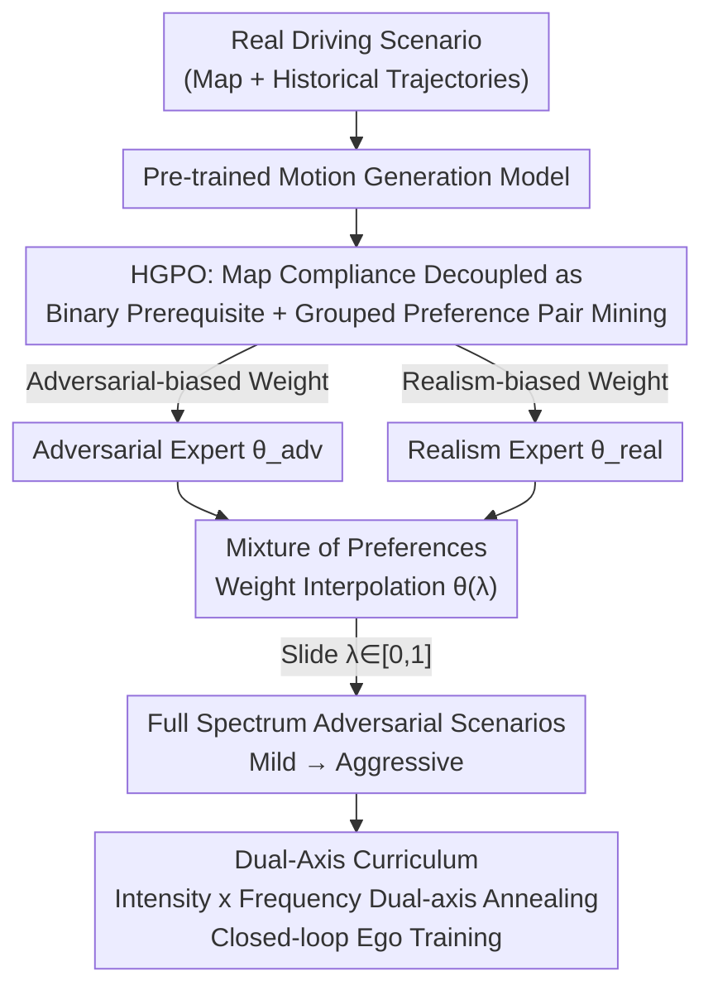

# Steerable Adversarial Scenario Generation through Test-Time Preference Alignment (SAGE)

**Conference**: ICLR 2026  
**arXiv**: [2509.20102](https://arxiv.org/abs/2509.20102)  
**Code**: [https://tongnie.github.io/SAGE/](https://tongnie.github.io/SAGE/)  
**Area**: Autonomous Driving / AI Safety  
**Keywords**: Adversarial scenario generation, preference alignment, multi-objective optimization, linear mode connectivity, closed-loop training  

## TL;DR
SAGE reformulates adversarial scenario generation for autonomous driving as a multi-objective preference alignment problem. By training two preference expert models and performing weight interpolation at inference time, it achieves a continuous and controllable trade-off between adversariality and realism. This allows for the generation of a full spectrum of scenarios from mild to aggressive without retraining, significantly enhancing closed-loop training performance.

## Background & Motivation

**Background**: Safety verification for autonomous driving requires a large number of safety-critical scenarios to test and train driving policies. Adversarial scenario generation, which efficiently creates long-tail corner cases by perturbing real driving trajectories, is a mainstream approach.

**Limitations of Prior Work**: Existing methods (RL, diffusion, direct optimization) face a core contradiction: the trade-off between adversariality and realism. Methods either optimize only for adversariality, leading to physically impossible trajectories (e.g., vehicles spinning in place to intercept the ego vehicle), or use linear weighting to balance multiple objectives, which is highly dependent on hyperparameter tuning.

**Key Challenge**: Each training session locks in a fixed trade-off point (a point on the Pareto front), which cannot be flexibly adjusted during inference. Generating scenarios with different intensities for varied needs (extreme stress testing vs. data augmentation) requires retraining, which is highly inefficient.

**Goal**: (a) How to efficiently learn the trade-off between adversariality and realism? (b) How to continuously control the attack intensity of generated scenarios during inference without retraining? (c) How to ensure map compliance (hard constraint) is not diluted by soft preferences?

**Key Insight**: Inspired by multi-objective alignment in LLMs (e.g., 3H principles) and model weight interpolation (linear mode connectivity), the authors treat adversarial scenario optimization as a preference alignment problem. They train expert models biased toward different extremes and traverse the Pareto front via linear weight interpolation during inference.

**Core Idea**: Transform adversarial scenario generation from "manual design of weighted objectives" to "learning a controllable preference landscape," enabling test-time continuous tuning through expert weight interpolation.

## Method

### Overall Architecture
SAGE addresses the pain point where adversarial scenario generation "locks in a single adversariality-realism trade-off point after training." It reformulates scenario generation as a preference alignment problem, making attack intensity continuously adjustable at inference time. The process consists of three steps. First, based on a pre-trained motion generation model, "perturbing an adversarial vehicle's trajectory to attack the ego" is formalized as a multi-objective optimization problem. The input is a real driving scenario (road map + historical trajectories), and the output is the adversarial perturbation trajectory of the adversary. Second, HGPO (Hierarchical Grouped Preference Optimization) is used to fine-tune two experts with opposite preferences—one adversarial-biased and one realism-biased—from the same pre-trained model. Finally, instead of retraining, the model weights of the two experts are linearly interpolated at inference time. Sliding a scalar knob allows sampling along the entire Pareto front, generating a full spectrum of scenarios from mild to aggressive; these scenarios are then used for closed-loop ego policy training.

### Key Designs

**1. Hierarchical Grouped Preference Optimization (HGPO): Decoupling map compliance from rewards as a binary prerequisite and mining grouped preference pairs.**

Existing methods mix "map compliance" and "adversariality vs. realism" into a linearly weighted reward, resulting in hard constraints being diluted by soft preferences—behaviors like driving through walls are not just "bad," but "completely invalid." HGPO treats map compliance as a binary feasibility condition $F(\tau, \mathcal{M}) \in \{0,1\}$ rather than a continuous penalty term. After sampling $N$ trajectories for each scenario, trajectories are first grouped by feasibility, and then two layers of preference pairs are constructed: one layer where any feasible trajectory is always superior to any infeasible one, and another layer where feasible trajectories are ranked internally by a soft preference score $R_{\text{pref}} = w_{\text{adv}} R_{\text{adv}} - w_{\text{real}} P_{\text{real}}$. This ensures hard constraints always dominate soft preferences, preventing the model from learning shortcuts like "exchanging map violation for adversarial gain." Another benefit of grouping is data efficiency: while standard DPO picks only one best/worst pair per scenario, HGPO extracts multiple preference pairs from a single set of samples, providing richer training signals.

**2. Test-time Controllable Generation via Mixture of Preferences: Using weight interpolation to place a knob on the Pareto front.**

To adjust attack intensity at inference without retraining, it is crucial that a smooth path exists between the two extremes. SAGE fine-tunes two experts $\pi_{\theta_{\text{adv}}}$ (adversarial-biased) and $\pi_{\theta_{\text{real}}}$ (realism-biased) from the same pre-trained model using opposite preference weights $w^*$. At inference, a mixture model is constructed directly in the weight space:

$$\theta(\lambda) = (1-\lambda)\,\theta_{\text{real}} + \lambda\,\theta_{\text{adv}}$$

By adjusting $\lambda \in [0,1]$, users can slide continuously along the Pareto front or even extrapolate to $\lambda > 1$ to generate extreme scenarios beyond the training convex hull. This works because the two experts are homologous (fine-tuned from the same pre-trained model for related tasks), and the Linear Mode Connectivity (LMC) hypothesis ensures they fall within the same low-loss basin, preventing weight interpolation from crossing high-loss "collapse" regions. This is supported by theoretical findings: Theorem 1 proves that the suboptimality of the interpolated model is proportional to the square of the distance between expert weights, and Proposition 1 proves that mixing in the weight space is superior to ensemble methods in the output space when the reward landscape is concave.

**3. Dual-Axis Curriculum for Closed-loop Training: Strengthening the ego policy without forgetting normal driving.**

When integrating SAGE into the closed-loop RL training of an ego policy, feeding extreme scenarios from the start leads to catastrophic forgetting of normal driving. The dual-axis curriculum gradually increases pressure along two dimensions: first, scenario intensity, by gradually increasing $\lambda$ to push adversaries from mild to aggressive; and second, the frequency of adversarial scenarios, training the ego with an increasing ratio of difficult cases relative to normal ones. By annealing both axes, the ego is forced to learn responses to extreme attacks while preserving its general driving ability through sufficient exposure to normal scenarios.

### Loss & Training
The HGPO loss function is essentially an extended DPO loss, taking the expectation over all grouped preference pairs:
$$\mathcal{L}_{\text{HGPO}}(\theta) = \mathbb{E}\left[-\log\sigma\left(\beta\left(\log\frac{\pi_\theta(\tau^w|c)}{\pi_{\text{ref}}(\tau^w|c)} - \log\frac{\pi_\theta(\tau^l|c)}{\pi_{\text{ref}}(\tau^l|c)}\right)\right)\right]$$
where $\beta$ controls the alignment strength, and $(\tau^w, \tau^l)$ are drawn from the hierarchical grouped sampling.

## Key Experimental Results

### Main Results
Evaluated in the MetaDrive simulator with the Waymo Open Motion Dataset, compared against 6 SOTA baselines.

| Method | Attack Success Rate↑ | Adversarial Reward↑ | Realism Penalty↓ | Kinematic Penalty↓ | Off-road Penalty↓ |
|------|-----------|----------|-------------|-----------|----------|
| Rule | 100.00% | 5.048 | 2.798 | 5.614 | 7.724 |
| CAT | 94.85% | 3.961 | 8.941 | 3.143 | 9.078 |
| GOOSE | 36.07% | 2.378 | 4.718 | 21.32 | 14.48 |
| SAGE (w=1.0) | 76.15% | 4.121 | **1.429** | **2.479** | **1.084** |

Closed-loop training evaluation (ego policy quality):

| Training Method | Reward↑ | Completion Rate↑ | Collision Rate↓ |
|---------|------|-------|--------|
| SAGE | **45.14** | **0.69** | **0.31** |
| CAT | 37.70 | 0.58 | 0.37 |
| Replay | 41.32 | 0.62 | 0.44 |
| Rule-based | 32.99 | 0.50 | 0.33 |

### Ablation Study

| Configuration | Key Effect | Description |
|------|---------|------|
| HGPO (Full) | Fast convergence + high reward | Grouped preference pairs provide rich signals |
| Replace with standard DPO | Slow convergence, low sample efficiency | Only one preference pair per scenario used |
| Remove map hard constraint | Map feasibility collapses | Model learns to exploit shortcuts |
| Map as weighted penalty | Improved feasibility but suboptimal | Confusion between hard and soft constraints |

### Key Findings
- SAGE reduces map violation penalties by over 85% while maintaining a high attack success rate, proving the effectiveness of decoupling hard constraints.
- The Pareto front generated by weight interpolation strictly outperforms mixing in logit or trajectory space, empirically validating LMC theory and Proposition 1.
- Ego policies trained with SAGE show the best generalization in cross-evaluation (maintaining high completion rates under different attack distributions).
- Weight extrapolation ($\lambda > 1$) can generate even more extreme scenarios beyond the training convex hull.

## Highlights & Insights
- **Clever hard constraint decoupling**: Elevating map compliance from a continuous penalty to a binary prerequisite fundamentally prevents the model from learning "shortcuts." This approach can be transferred to any multi-objective optimization scenario involving mixed hard and soft constraints.
- **Validation of LMC in motion generation models**: This work is the first to verify linear mode connectivity in motion generation models and use it to justify weight interpolation. This provides a theoretical basis for other generative models requiring multi-objective control.
- **Dual-axis curriculum to prevent catastrophic forgetting**: The design of simultaneously and gradually adjusting scenario intensity and frequency allows the ego policy to handle extreme scenarios without losing normal driving skills. This trick can be directly applied to other adversarial training pipelines.

## Limitations & Future Work
- The current framework considers only two objectives (adversariality vs. realism); the growth of the weight space dimension when extending to more objectives (e.g., scenario novelty, complexity) is yet to be explored.
- Linear interpolation depends on the LMC hypothesis, which may fail if expert models diverge too significantly.
- The physical realism of the MetaDrive simulator is limited; effects in higher-fidelity simulators or real-world settings need further verification.
- Future directions: Adaptive curricula based on ego policy learning progress (replacing manual annealing) and more advanced model merging techniques.

## Related Work & Insights
- **vs CAT (Zhang et al., 2023)**: CAT achieves adversarial generation through candidate resampling, but while the attack success rate is high, the realism penalty is massive (8.941 vs. SAGE's 1.429), and it lacks test-time control.
- **vs GOOSE (Ransiek et al., 2024)**: GOOSE uses RL for adversarial generation, but results in very high kinematic penalties (21.32) and physically implausible trajectories.
- **vs DPO/RLHF in LLMs**: SAGE is the first to transfer the multi-objective preference alignment concepts from LLM alignment to the field of motion generation, proving cross-domain feasibility.

## Rating
- Novelty: ⭐⭐⭐⭐⭐ First to introduce test-time multi-objective preference alignment to adversarial scenario generation with tight integration of theory and practice.
- Experimental Thoroughness: ⭐⭐⭐⭐⭐ Comprehensive coverage including open-loop, closed-loop, cross-evaluation, ablation, and theoretical validation.
- Writing Quality: ⭐⭐⭐⭐⭐ Clear logic, rigorous theoretical derivation, and highly informative charts.
- Value: ⭐⭐⭐⭐⭐ Provides a new, efficient, and theoretically sound paradigm for autonomous driving safety testing.

<!-- RELATED:START -->

## Related Papers

- [\[CVPR 2025\] CompoSIA: Composing Driving Worlds through Disentangled Control for Adversarial Scenario Generation](../../CVPR2025/autonomous_driving/composing_driving_worlds_through_disentangled_control_for_adversarial_scenario_g.md)
- [\[CVPR 2026\] Drive My Way: Preference Alignment of Vision-Language-Action Model for Personalized Driving](../../CVPR2026/autonomous_driving/drive_my_way_preference_alignment_of_vision-language-action_model_for_personaliz.md)
- [\[CVPR 2026\] TT-Occ: Test-Time 3D Occupancy Prediction](../../CVPR2026/autonomous_driving/test-time_3d_occupancy_prediction.md)
- [\[ICLR 2026\] AsyncBEV: Cross-modal Flow Alignment in Asynchronous 3D Object Detection](asyncbev_cross-modal_flow_alignment_in_asynchronous_3d_object_detection.md)
- [\[CVPR 2026\] TrafficAlign: Aligning Large Language Models for Traffic Scenario Generation](../../CVPR2026/autonomous_driving/trafficalign_aligning_large_language_models_for_traffic_scenario_generation.md)

<!-- RELATED:END -->
