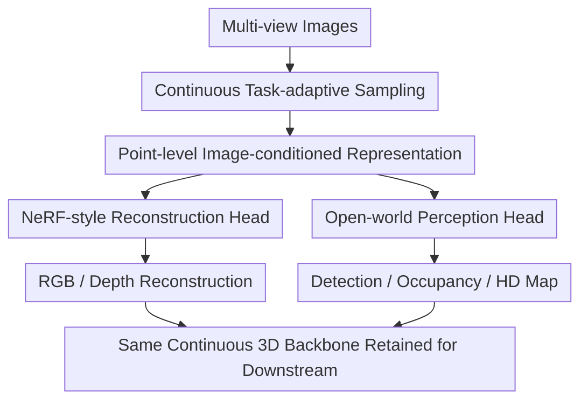

# To View Transform or Not to View Transform: NeRF-based Pre-training Perspective

**Conference**: ICLR2026  
**OpenReview**: [https://openreview.net/forum?id=G0HcRB3s3N](https://openreview.net/forum?id=G0HcRB3s3N)  
**Code**: No public code available yet  
**Area**: Autonomous Driving / 3D Perception / NeRF Pre-training  
**Keywords**: NeRF Pre-training, View Transformation, 3D Object Detection, Occupancy Prediction, Continuous Point Representation  

## TL;DR
NeRP3D argues that hard-linking NeRF pre-training to discrete BEV/voxel view transformation backbones compromises the advantages of continuous radiance fields. Thus, it directly utilizes NeRF-like continuous point queries to unify reconstruction pre-training and autonomous driving 3D perception. It outperforms existing NeRF pre-training methods in reconstruction, detection, occupancy prediction, and HD mapping tasks on nuScenes.

## Background & Motivation
**Background**: Mainstream 3D perception frameworks in vision-centric autonomous driving typically extract 2D features from multi-camera images and then project these features into a unified BEV or voxel space via view transformation. The advantage of this approach is straightforward: downstream tasks such as detection, occupancy prediction, and HD map construction can work on a metric 3D canvas with mature engineering interfaces.

**Limitations of Prior Work**: Recent works like UniPAD and SelfOcc introduce neural fields like NeRF or 3D Gaussian Splatting into pre-training, aiming to enhance 3D representations using self-supervised signals such as RGB, depth, and multi-view consistency. However, they usually perform view transformation first and then interpolate features for NeRF query points from discrete voxel features. The issue is that NeRF relies on adaptive functions at continuous coordinates, whereas view transformation feeds it discrete, rigid representations on a fixed grid; the results are often blurred reconstructed images, unclear depth boundaries, and adjacent objects sticking together in the 3D representation.

**Key Challenge**: The contradiction identified in this paper is not whether to use NeRF pre-training, but rather which type of 3D backbone NeRF pre-training should be attached to. If the backbone itself discretizes space into fixed voxels while NeRF is tasked with supplementing continuous geometry, their priors conflict. Furthermore, many methods use NeRF during pre-training but discard the NeRF network during downstream fine-tuning, incurring pre-training costs without fully transferring the continuous representation capabilities to detection and occupancy tasks.

**Goal**: The authors aim to construct an autonomous driving 3D backbone that does not rely on view transformation, allowing it to perform volume rendering along rays like NeRF during pre-training while covering the space around the vehicle like a 3D perception model during downstream stages, with both stages sharing the same continuous point representation and network parameters.

**Key Insight**: A key observation is that 3D perception in autonomous driving does not necessarily require the prior generation of BEV/voxel feature maps. As long as the model can retrieve locally relevant 2D context from multi-view images at any 3D coordinate and output the geometry, appearance, or semantic representation of that point, then ray-wise sampling and spatial sampling are merely different "sampling strategies" rather than two incompatible representation systems.

**Core Idea**: Replace the combination of "view transform + NeRF pre-training" with a NeRF-resembled point-based 3D detector, allowing the same continuous point representation to serve RGB/depth reconstruction and downstream tasks such as 3D detection, occupancy, and mapping simultaneously.

## Method
### Overall Architecture
The input to NeRP3D is multi-camera images at a single timestamp, and the output can be RGB/depth for rendering or 3D representations required by perception heads for detection, occupancy prediction, and HD map construction. Instead of constructing discrete BEV or voxel features first, it samples points directly in 3D space: sampling along camera rays during pre-training and uniformly in the space around the vehicle during fine-tuning. Regardless of the sampling method, each 3D point aggregates context from multi-view 2D features via the same coordinate encoding and deformable cross-attention, which is then fed into the rendering head or downstream perception heads.

The core of this diagram is "sample continuous points first, then retrieve image-conditioned features for the points." Compared to traditional pipelines, NeRP3D lacks the step of "transforming to voxels first, then interpolating from voxels for NeRF," so point-level geometry and appearance representations learned during pre-training are not discarded in downstream stages.

### Key Designs
**1. Continuous Task-adaptive Sampling: Converging Pre-training and Downstream Differences into Sampling Methods**

Traditional view transformation methods divide 3D space into fixed grids, which hardcodes engineering settings like distance, resolution, and sensor layout into the representation. NeRP3D conversely acknowledges that different tasks require different query points: for volume rendering, points should be distributed along camera rays in the form $x_{ij}=o_i+t_jd_i$; for 3D detection or occupancy prediction, points should cover the spatial volume around the vehicle. These appear different but, in NeRP3D, both simply involve taking points from continuous space $x\in R^3$, with the subsequent representation network fully shared.

To handle open spaces in autonomous driving, the authors also apply a contraction similar to Mip-NeRF 360 to the normalized coordinates $x'$. Proximal regions maintain real scale, while distal regions are compressed in a parity fashion: $p(x')=\alpha x'$ when $|x'|\leq 1$, while distant points are compressed into a finite range after direction normalization. This allows the model to retain metric geometry within the ROI around the vehicle without letting the unbounded background explode the representation space.

**2. Point-level Image-conditioned Representation: Replacing Voxel Interpolation with Deformable Cross-attention**

If 3D points are directly projected onto images to retrieve single-pixel features, dynamic scenes, occlusions, and projection errors make point representations unstable. If voxels are constructed first and then interpolated, it reverts to the discrete prior of view transformation. NeRP3D compromises by passing each 3D query point through coordinate encoding $\gamma(p(x'))$ and then learning several offsets $\Delta\pi$ around its projection position $\pi(x)$, using deformable cross-attention to retrieve locally relevant context from multi-view 2D features $F$.

The paper describes the point representation as a weighted aggregation of multi-head, multi-sample points: $z=\sum_h W_h\sum_s A_{h,s}W'_sF(\pi(x)+\Delta\pi_{h,s}(\gamma(p(x'))))$. Intuitively, each 3D point is not forced to rely on a fixed voxel but actively seeks evidence near the corresponding image region based on its spatial location. This locality inductive bias is particularly important for autonomous driving, as boundaries of adjacent vehicles, pedestrians, and poles are fine, and coarse interpolation can easily merge them.

**3. NeRF-style Reconstruction Head: Strengthening Geometric Boundaries with SDF, RGB, Depth, and Multi-view Consistency**

During the pre-training stage, NeRP3D samples multiple points along each camera ray and predicts RGB color $c_j$ and SDF value $s_j$ from the point representation $z_j$. The SDF is converted into opacity $\alpha_j$ via NeuS-style transformation, and volume rendering weights $w_j=T_j\alpha_j$ are obtained using transmittance $T_j$. The final color and depth are $\hat{C}(r_i)=\sum_j w_jc_j$ and $\hat{D}(r_i)=\sum_j w_jt_j$, respectively.

The focus here is not merely "adding a NeRF loss," but rather that the SDF prior makes object surfaces and boundaries clearer, RGB reconstruction makes appearance interpretable, LiDAR depth supervision provides sparse but reliable geometric anchors, and multi-view reprojection loss compensates for sparse LiDAR scans and difficulties in covering sky and transparent surfaces. This design is closer to NeRF's original continuous geometry learning method than NeRF pre-training based solely on voxel feature interpolation.

**4. Open-world Perception Head: Retaining the Pre-trained Network, with Continuous Representation Directly Connected to Detection, Occupancy, and Mapping Tasks**

A common awkward point for many NeRF-based pre-training methods is that a NeRF network is added for rendering during pre-training but removed during detection fine-tuning, leaving only the pre-trained backbone. NeRP3D's structure is more consistent: downstream tasks only need to distribute spatial points in the target area and reshape the representation $z$ of each point into a format consumable by task heads. For instance, occupancy prediction can be organized as $(X\times Y\times Z)\times C$, while detection and HD mapping connect to their respective heads.

This ensures that the geometric and appearance knowledge learned during pre-training does not become a one-off auxiliary loss but continues into downstream tasks as part of the same continuous point backbone. The cross-task analysis in the paper also supports this argument: even when using a backbone fine-tuned for occupancy prediction to perform volume rendering, NeRP3D still retains structural details, whereas view-transformation methods are prone to catastrophic forgetting, degrading into blurred average predictions.

### Loss & Training
The pre-training loss consists of three parts: RGB reconstruction, LiDAR depth supervision, and multi-view consistency: $L_{pretrain}=\lambda_{rgb}L_{rgb}+\lambda_{depth}L_{depth}+\lambda_{reproj}L_{reproj}$. Specifically, $L_{rgb}$ compares rendered color with ground truth pixel color, $L_{depth}$ constrains predicted depth where LiDAR is projectable, and $L_{reproj}$ projects 3D points on the current view's ray onto adjacent source images and compares color differences weighted by rendering weights.

In implementation, the authors trained on 4 NVIDIA A6000 GPUs based on MMDetection3D. Both pre-training and fine-tuning lasted for 24 epochs using the AdamW optimizer with an initial learning rate of $2e-4$ and weight decay of $0.01$. The three pre-training loss weights were set to $\lambda_{rgb}=\lambda_{depth}=\lambda_{reproj}=10$. Downstream tasks used existing task heads to maintain fair comparison: 3D detection based on UVTR-C, HD mapping based on MapTR, and occupancy prediction based on Occ3D/CTF-Occ, without additional enhancements like temporal stacking or class-balanced sampling.

## Key Experimental Results

### Main Results
The paper primarily evaluates two types of capabilities on nuScenes: the quality of RGB/depth reconstruction from pre-training itself, and downstream 3D perception tasks. The table below extracts the most illustrative results: NeRP3D not only significantly exceeds UniPAD and SelfOcc in reconstruction metrics but also leads consistently in detection, occupancy, and HD mapping.

| Task | Metric | NeRP3D | Main Comparison Method | Gain |
|------|--------|--------|------------------------|------|
| RGB Recon. | PSNR↑ / SSIM↑ / LPIPS↓ | 33.42 / 0.969 / 0.070 | UniPAD: 21.14 / 0.549 / 0.634 | PSNR +12.28, LPIPS -0.564 |
| Depth Est. | Abs Rel↓ / Sq Rel↓ / RMSE↓ | 0.183 / 2.274 / 7.884 | UniPAD: 0.218 / 2.512 / 7.937 | Abs Rel -0.035 |
| 3D Detection | NDS↑ / mAP↑ | 47.3 / 42.8 | UVTR-C + UniPAD: 45.5 / 41.6 | NDS +1.8, mAP +1.2 |
| Occupancy | mIoU↑ | 35.49 | UniPAD: 34.05; SelfOcc: 29.65 | +1.44 / +5.84 |
| HD Mapping | mAP↑ | 59.1 | UVTR-C + UniPAD: 57.8; TPVFormer + SelfOcc: 53.9 | +1.3 / +5.2 |

Cross-dataset generalization is also critical. The authors pre-trained on Argoverse 2 and performed zero-shot scene reconstruction directly on nuScenes to test whether continuous point representations are more resistant to sensor layout and data distribution shifts than fixed view transformations.

| Setting | Metric | NeRP3D | UniPAD | Description |
|---------|--------|--------|--------|-------------|
| AV2 → nuScenes Zero-shot Recon. | Abs Rel↓ | 0.626 | 0.985 | NeRP3D has lower depth error |
| AV2 → nuScenes Zero-shot Recon. | PSNR↑ | 28.238 | 18.668 | Continuous rep. is more stable for new camera geometry |
| AV2 → nuScenes Zero-shot Recon. | SSIM↑ / LPIPS↓ | 0.905 / 0.111 | 0.432 / 0.577 | Obvious gap in structural and perceptual quality |
| AV2 Pre-train → nuScenes Det. FT | mAP↑ | 27.46 | 26.29 | Still leading in transfer to detection |

### Ablation Study
Ablation numbers are mainly located in the appendix, while cached text retains key conclusions summarized by the authors. Evidence for effectiveness is organized by experimental questions, focusing on whether each design supports the claim that continuous point backbones are better suited for NeRF pre-training than view transformation.

| Ablation / Analysis Question | Observed Phenomenon | Note |
|------------------------------|---------------------|------|
| Cross-task Generalization | NeRP3D backbone after Occ fine-tuning still retains structural details in volume rendering | Continuous representation is not fully overwritten by a single downstream task |
| Voxel/Range Settings | View transformation is sensitive to range and voxel size; NeRP3D only needs to change the ROI | Continuous point queries reduce dependence on fixed grid priors |
| Reduced Labeled Data | NeRP3D maintains strong detection performance when data is reduced from full to $1/8$ subset | Geometric priors from NeRF pre-training reduce label dependency |
| LiDAR Depth Only | Sparse LiDAR scans are insufficient to recover dense geometry | Multi-view consistency and ray-wise sampling are necessary supplements |
| NeRF Pre-training on Point Detector | Knowledge transfer failed; authors attribute this to query mismatch | Unified pre-training/downstream query system is more important than simple NeRF attachment |
| SDF vs Density Prior | SDF is more conducive to clear object boundaries | Perception tasks require boundaries, not just renderable color |
| Deformable vs Standard Attention | Deformable attention is better | Local image evidence is key to point representation fidelity |

### Key Findings
- The real benefit of NeRF pre-training comes not just from extra RGB/depth losses, but from whether the pre-training model and the downstream 3D backbone share the same representation prior; NeRP3D is more consistent in this regard than "view transform followed by NeRF."
- The RGB reconstruction gap is massive, with PSNR improving from 21.14 (UniPAD) to 33.42, indicating that discrete voxel interpolation significantly damages high-frequency appearance and boundary details.
- While downstream gains are not as dramatic as reconstruction metrics, they cover 3D detection, occupancy prediction, and HD mapping, showing that continuous point representations translate into actual driving perception benefits.
- Zero-shot reconstruction results for AV2 → nuScenes are convincing, as sensor layout changes are where fixed view transformations typically overfit; NeRP3D's PSNR remains at 28.238, highlighting the transferability of its coordinate continuity and point query mechanism.
- Qualitative results show UniPAD and SelfOcc tend to reconstruct dense crowds, poles, and car boundaries as blurred blocks, while NeRP3D's features can be segmented into clearer instance boundaries via SAM after projection, consistent with the proposed "continuous fine-grained representation."

## Highlights & Insights
- The most valuable aspect of this paper is shifting the question from "is NeRF pre-training useful" to "what type of 3D backbone is suitable for NeRF pre-training." This perspective explains why existing methods learn something during reconstruction but see limited downstream gains due to structural fractures between pre-training and downstream representations.
- NeRP3D's design is restrained: it does not invent complex new tasks but integrates ray-wise and spatial sampling into the same continuous point framework. This unity makes the method feel like a 3D backbone rather than an auxiliary module that exists only during pre-training.
- Using an SDF prior in autonomous driving pre-training is natural but often overlooked. For detection, occupancy, and mapping, clear boundaries are more important than beautiful textures; SDF helps the model form a sense of surface, thereby improving object separation and fine structure recovery.
- Deformable cross-attention is a practical choice. It avoids the rigidity of voxel interpolation without subjecting each 3D point to unconstrained attention over the entire image, thus maintaining local geometric consistency in dynamic driving scenes.
- From a transfer perspective, continuous point representations may be more suitable for pre-training across datasets and camera layouts than fixed BEV grids. If autonomous driving models are to use multi-source data for foundation-style pre-training, such representations will offer more scalability than methods heavily dependent on specific grids.

## Limitations & Future Work
- The authors admit that depth estimation outside the ROI remains difficult for NeRP3D, and it relies on LiDAR depth supervision. It is not yet a completely self-supervised solution for recovering open driving worlds from multi-view RGB alone.
- Point-based architectures have high computational costs, especially when adapting NeRF-style outputs for existing detection heads. For real-time autonomous driving deployment, this is more sensitive than offline reconstruction metrics.
- The experiments mainly focus on single-timestamp multi-camera images without utilizing temporal information. Driving scenes possess natural temporal consistency; adding temporal RGB reconstruction or cross-frame point tracking could further mitigate occlusions and long-range depth instability.
- The method still borrows existing detection, mapping, and occupancy heads. While this ensures fair comparison, it also means downstream heads might not be the optimal consumers for continuous point representations; future work could design more native point/radiance-field-aware perception heads.
- Gaussian splatting or opacity filtering are potential directions mentioned by the authors. The former could improve real-time rendering and query efficiency, while the latter could reduce computations on invalid points, making continuous point representations closer to deployable systems.

## Related Work & Insights
- **vs UniPAD**: UniPAD is a representative method for NeRF-based pre-training in autonomous driving, but it attaches NeRF after view-transformed voxel features, enhancing the backbone during pre-training and discarding NeRF downstream. NeRP3D bypasses view transformation at the representation level and retains the same continuous point network for downstream tasks, resulting in stronger reconstruction and perception transfer.
- **vs SelfOcc / OccNeRF**: SelfOcc and related occupancy pre-training methods emphasize using multi-view consistency and NeRF-style rendering to learn occupancy or 3D representations, but they usually remain tied to discrete occupancy/voxel structures. NeRP3D's insight is that occupancy can be a downstream task output rather than the fundamental form of pre-training representation.
- **vs GaussianPretrain**: GaussianPretrain explores using 3D Gaussian representations for pre-training, similarly focusing on the utility of renderable 3D representations for perception. NeRP3D differs by emphasizing the unification of continuous point queries and a NeRF-like backbone over using Gaussians as the primary 3D representation unit.
- **vs PETR / BEVFormer / UVTR-C etc.**: These methods resolve how to construct downstream detection representations from multi-camera images, often relying on positional encoding, BEV queries, or voxel/BEV features. NeRP3D can be seen as a complement: it optimizes more than just the detection head by geometricizing 3D point representations through self-supervised reconstruction.
- **Insights for Future Work**: If an intermediate module of a pre-training task is discarded downstream, the knowledge transfer is likely diminished. Better pre-training designs should allow pretext and downstream tasks to share the same representation object, a principle applied here to NeRF pre-training and 3D perception.

## Rating
- Novelty: ⭐⭐⭐⭐☆ Clearly articulates the prior conflict between NeRF pre-training and view transformation and proposes a continuous point backbone to unify them.
- Experimental Thoroughness: ⭐⭐⭐⭐☆ Covers reconstruction, detection, occupancy, HD mapping, and cross-dataset transfer, providing a complete chain of evidence; however, detailed ablation figures are mostly in the appendix.
- Writing Quality: ⭐⭐⭐⭐☆ Motivation and illustrations are clear; Fig. 1/2 effectively show the blurred representation issue; some method formulas are dense and require careful reading.
- Value: ⭐⭐⭐⭐☆ Highly relevant for 3D pre-training in autonomous driving, particularly as a reminder not to simply plug continuous neural fields into discrete BEV pipelines.

<!-- RELATED:START -->

## Related Papers

- [\[CVPR 2026\] CycleBEV: Regularizing View Transformation Networks via View Cycle Consistency for Bird's-Eye-View Semantic Segmentation](../../CVPR2026/autonomous_driving/cyclebev_regularizing_view_transformation_networks_via_view_cycle_consistency_fo.md)
- [\[CVPR 2026\] DLWM: Dual Latent World Models enable Holistic Gaussian-centric Pre-training in Autonomous Driving](../../CVPR2026/autonomous_driving/dlwm_dual_latent_world_models_enable_holistic_gaussian-centric_pre-training_in_a.md)
- [\[CVPR 2025\] VisionPAD: A Vision-Centric Pre-training Paradigm for Autonomous Driving](../../CVPR2025/autonomous_driving/visionpad_a_vision-centric_pre-training_paradigm_for_autonomous_driving.md)
- [\[ICLR 2026\] ARINBEV: Bird's-Eye View Layout Estimation with Conditional Autoregressive Model](arinbev_birds-eye_view_layout_estimation_with_conditional_autoregressive_model.md)
- [\[CVPR 2026\] Dr.Occ: Depth- and Region-Guided 3D Occupancy from Surround-View Cameras for Autonomous Driving](../../CVPR2026/autonomous_driving/drocc_depth_region_guided_3d_occupancy.md)

<!-- RELATED:END -->
