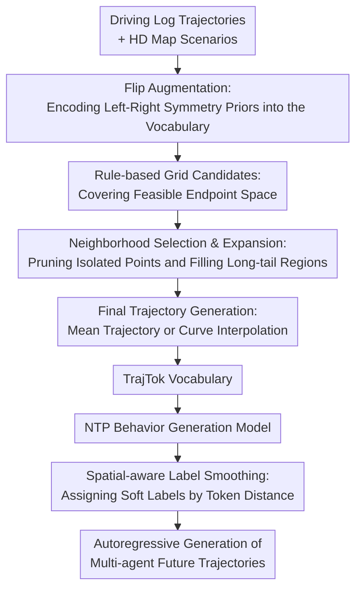

# TrajTok: What makes for a good trajectory tokenizer in behavior generation?

**Conference**: ICLR 2026  
**OpenReview**: [https://openreview.net/forum?id=Zvy2agYouY](https://openreview.net/forum?id=Zvy2agYouY)  
**Paper**: [OpenReview](https://openreview.net/forum?id=Zvy2agYouY)  
**Code**: https://github.com/Thinklab-SJTU/TrajTok  
**Area**: Autonomous Driving / Behavior Generation  
**Keywords**: trajectory tokenizer, behavior generation, next-token prediction, Waymo Open Sim Agents, spatial-aware label smoothing  

## TL;DR
TrajTok systematically analyzes coverage, utilization, symmetry, and robustness of trajectory tokenizers in autonomous driving behavior generation. By using "rule-based candidates + data-driven selection/expansion + spatial-aware label smoothing," it constructs a trajectory vocabulary better suited for next-token prediction, achieving first place in the Waymo Open Sim Agents Challenge 2025.

## Background & Motivation
**Background**: Behavior generation in autonomous driving simulation requires generating future multi-agent trajectories from real driving logs to construct evaluation scenarios, train closed-loop policies, or serve as reinforcement learning environments. In recent years, a dominant approach discretizes continuous trajectories into a finite vocabulary and performs next-token prediction (NTP) like a language model: the model predicts a trajectory token for each agent at regular intervals, which is then restored to future positions and headings.

**Limitations of Prior Work**: The key bottleneck of this approach lies not just in the Transformer itself, but in how trajectories are segmented into tokens. Data-driven tokenizers like VQ-VAE, K-means, and K-disks yield vocabularies concentrated in high-frequency regions found in training logs. While utilization is high, they lack coverage for long-tail maneuvers and are prone to absorbing noisy trajectories or sampling biases. Conversely, pure rule-based gridding covers a wider physical space and is naturally more stable, but many grids correspond to actions that rarely occur in reality, wasting model capacity under a fixed vocabulary size.

**Key Challenge**: A good trajectory vocabulary must pursue more than just low average discretization error. Behavior generation prioritizes having sufficient feasible alternative actions during closed-loop rollout, especially for long-tail cases like turns, yielding, atypical intersections, and rare interactions. The vocabulary must simultaneously cover reachable drivable space, ensure most tokens are utilized by training data, maintain left-right symmetric motion priors, and remain robust to anomalies in the logs.

**Goal**: The authors decompose the problem into two levels: first, identifying what makes a trajectory tokenizer improve NTP behavior generation model performance; and second, designing a plug-and-play tokenizer and a matching loss function based on these observations. The former involves analyzing coverage, utilization, symmetry, and robustness, while the latter involves the TrajTok vocabulary generation process and spatial-aware label smoothing.

**Key Insight**: Instead of treating tokenization as a pure clustering or quantization problem, the paper compares how data-driven and rule-driven methods utilize logged data. This perspective is valuable because behavior generation tokens are not just compressed representations; they directly determine the actions available to the model at each step. The geometric properties of the vocabulary are amplified by autoregressive rollout.

**Core Idea**: TrajTok uses a rule-based grid to provide a stable, symmetric, and physically broad candidate space. It then uses real-world log statistics for screening, denoising, and expansion. Finally, it redistributes label smoothing probabilities based on spatial distance, penalizing incorrect tokens closer to the ground truth less severely than distant ones.

## Method

### Overall Architecture
TrajTok is designed for discrete next-token-prediction behavior generation models. Given historical agent states and HD maps, the base model predicts a future trajectory token for each agent every $L$ frames. Each token is a sequence of length $L$ consisting of $(x, y, yaw)$ in an agent-centric coordinate system, which is then rolled into the next state segment via coordinate transformation.

The method consists of two parts: trajectory vocabulary generation and spatial-aware label smoothing during NTP model training. Vocabulary generation follows a "rule-first, then data" sequence: extracting and flipping real trajectories, establishing endpoint grid candidates, initial screening based on log landings, filtering isolated noise through neighborhood statistics, expanding long-tail gaps, and finally transforming selected grids into mean trajectories or interpolated curves.

### Key Designs
**1. Flip Augmentation: Encoding Left-Right Symmetry Priors into the Vocabulary**

An implicit problem with data-driven tokenizers is that training logs are not necessarily left-right balanced due to road structures, sampling segments, or city-specific driving habits. Direct clustering or sampling causes the vocabulary to inherit this asymmetry, making the model prone to lacking action options in unseen but physically feasible mirrored scenarios.

Before generating the vocabulary, TrajTok normalizes all effective trajectories of length $L$ to an agent-centric coordinate system, yielding $D \in \mathbb{R}^{N_D \times L \times 3}$. It then flips these along the $x$-axis and concatenates them with the original data: $\tilde{D}=\mathrm{Concat}(D,\mathrm{Flip}(D))$. This flip is more than simple data augmentation; it directly affects the vocabulary construction stage, ensuring the final vocabulary contains mirrored trajectory pairs. Ablation studies confirm that removing symmetry reduces the Realism Meta from 0.7702 to 0.7670 and worsens minADE from 1.3428 to 1.3611.

**2. Rule-based Grid Candidates: Covering Feasible Endpoint Space**

The issue with pure data-driven methods is not failing to fit data, but fitting the logged trajectories too closely, suppressing long-tail actions. TrajTok first establishes a rule-based grid on the endpoint plane: given $x_{min}, x_{max}, y_{min}, y_{max}$ and intervals $x_{interval}, y_{interval}$, each flipped trajectory is assigned to a cell based on its endpoint. A cell $(i,j)$ is initially marked valid if the number of trajectories $N^{traj}_{ij}$ meets a threshold $s_p$: $B_{ij}=\mathbb{1}[N^{traj}_{ij}\ge s_p]$.

The key is defining the boundaries of potentially considered actions using a rule-based space rather than letting cluster centers be determined solely by training distribution. Different grid ranges and resolutions are set for vehicles, cyclists, and pedestrians. In the submitted version, the vehicle vocabulary reached 8,040 tokens, cyclists 2,798, and pedestrians 3,001. This preserves stable boundaries while avoiding the low utilization of pure gridding by not including every possible grid in the vocabulary.

**3. Neighborhood Selection & Expansion: Pruning Isolated Points and Filling Long-tail Regions**

Initial screening based only on landing frequency leaves two problems: log noise might select isolated cells, while feasible but low-frequency adjacent regions might be missed. TrajTok corrects the initial screening via a neighborhood rule: for each cell, it counts selected neighbors within distance $k$, $N^{vb}_{ij}=\sum_{m=i-k}^{i+k}\sum_{n=j-k}^{j+k}B_{mn}$. Unselected cells with neighbor counts exceeding threshold $s_a$ are added; selected cells with neighbor counts below $s_r$ are removed.

This step balances coverage, utilization, and robustness through local statistics. Isolated noise typically lacks surrounding support and is removed; long-tail feasible trajectories often have continuous landing structures nearby, so even cells without enough direct samples are expanded into the vocabulary due to neighborhood density. Sensitivity analysis shows that the default $k=4, s_p=1, s_a=20, s_r=20$ yields 0.7702 Realism Meta, with only minor decreases when parameters are varied, indicating the rule set is not just a result of coincidental fine-tuning.

**4. Final Trajectory Generation and Spatial-aware Label Smoothing**

When a selected cell contains real trajectories, TrajTok uses the average of those logged trajectories as the token. For cells added via expansion without samples, it performs curve interpolation from the origin to the cell center and estimates the endpoint yaw from nearby grids. The final vocabulary $V_{TrajTok}=V_1\cup V_2$ contains both data-backed average trajectories and interpolated trajectories for coverage, preventing gaps between grids.

For training, the paper notes that standard label smoothing assigns equal probability to all non-ground-truth tokens, ignoring spatial semantics. TrajTok assigns probabilities to non-ground-truth tokens based on the inverse square of the average trajectory error: $k_i=1/\lVert c_i-c_j\rVert^2$. The ground truth token has probability $1-\epsilon$, while others have $y_i=\epsilon k_i / \sum_{m\ne j}k_m$. This makes the model more tolerant of spatially close tokens during training while still penalizing distant ones. With $\epsilon=0.1$, the total smoothing matches the standard setup in the original SMART.

### Loss & Training
The experiments use SMART-tiny as the base NTP behavior generation model. Input consists of 1s of history and maps, generating 8s of future states. Trajectory tokens have an interval $L=5$, representing re-planning every 0.5s. Compared to the original SMART, the authors use independent prediction heads for different agent types to match vocabulary sizes for vehicles, cyclists, and pedestrians.

Training was conducted on WOMD using 8 A100 80GB GPUs with the AdamW optimizer, a total batch size of 48, for 32 epochs. The initial learning rate was $5\times 10^{-4}$, decaying to $5\times 10^{-6}$ via cosine annealing. Spatial-aware label smoothing added negligible cost: a single epoch on 20% of the training set took 18m34s compared to 18m25s for standard smoothing.

## Key Experimental Results

### Main Results
The paper reports results on the Waymo Open Sim Agents Challenge 2025 leaderboard. TrajTok achieved a Realism Meta of 0.7852, taking first place during the submission period. Although SMART-R1 shows a slightly higher 0.7855, the paper identifies TrajTok as the winner and notes it reached the highest Map-based score of 0.9207.

| Method | Realism Meta ↑ | Kinematic ↑ | Interactive ↑ | Map-based ↑ | minADE ↓ |
|------|----------------|-------------|---------------|-------------|----------|
| SMART-R1 | 0.7855 | 0.4940 | 0.8109 | 0.9194 | 1.2990 |
| TrajTok (Ours) | 0.7852 | 0.4887 | 0.8116 | 0.9207 | 1.3179 |
| unimotion | 0.7851 | 0.4943 | 0.8105 | 0.9187 | 1.3036 |
| SMART-tiny-CLSFT | 0.7846 | 0.4931 | 0.8106 | 0.9177 | 1.3065 |
| SMART-tiny-RLFTSim | 0.7844 | 0.4893 | 0.8128 | 0.9164 | 1.3470 |

The value of the tokenizer is further demonstrated by replacing tokenizers within the same SMART model. Using 20% of the WOMD training set and evaluating on the full validation split, TrajTok achieved 0.7702 Realism Meta, outperforming VQ-VAE, K-means, K-disks, and Grid, while also achieving the lowest minADE.

| Tokenizer | Realism Meta ↑ | Kinematic ↑ | Interactive ↑ | Map-based ↑ | minADE ↓ |
|-----------|----------------|-------------|---------------|-------------|----------|
| VQ-VAE | 0.7596 | 0.4629 | 0.8101 | 0.8642 | 1.3982 |
| K-means | 0.7476 | 0.4375 | 0.7903 | 0.8635 | 1.4797 |
| K-disks | 0.7584 | 0.4602 | 0.8004 | 0.8748 | 1.3532 |
| Grid | 0.7527 | 0.4121 | 0.8099 | 0.8737 | 1.4137 |
| TrajTok | 0.7702 | 0.4867 | 0.8132 | 0.8769 | 1.3428 |

### Ablation Study
Generalization experiments show TrajTok is more stable across data sources and scales. When building the vocabulary with nuScenes and training/evaluating on WOMD, K-disks' Realism Meta dropped by 0.0234 (from 0.7584 to 0.7350), while TrajTok dropped only 0.0061 (from 0.7702 to 0.7641). Similarly, reducing WOMD log size for vocabulary construction from $10^7$ to $10^5$ trajectories caused only a 0.0027 drop for TrajTok, compared to 0.0142 for K-disks.

| Tokenizer | Logged Dataset / Size | Realism Meta ↑ | minADE ↓ | Description |
|-----------|-----------------------|----------------|----------|------|
| K-disks | Waymo | 0.7584 | 1.3537 | In-domain vocabulary |
| K-disks | nuScenes | 0.7350 | 1.4074 | Cross-dataset drop 0.0234 |
| TrajTok | Waymo | 0.7702 | 1.3428 | In-domain vocabulary |
| TrajTok | nuScenes | 0.7641 | 1.3681 | Cross-dataset drop 0.0061 |
| K-disks | $10^5$ WOMD trajectories | 0.7442 | 1.3696 | Significant degradation with small data |
| TrajTok | $10^5$ WOMD trajectories | 0.7675 | 1.3511 | Still close to full setting with small data |

Spatial-aware label smoothing benefited both K-disks and TrajTok. K-disks improved from 0.7443 to 0.7584, and TrajTok improved from 0.7597 to 0.7702, suggesting this loss design utilizes universal spatial similarity between trajectory tokens.

| Analyzer | Config | Realism Meta ↑ | minADE / Error ↓ | Conclusion |
|--------|------|----------------|------------------|------|
| Symmetry | TrajTok w/ symmetry | 0.7702 | minADE 1.3428 | Flip augmentation is best |
| Symmetry | TrajTok w/o symmetry | 0.7670 | minADE 1.3611 | Significant degradation without symmetry |
| Discretization Error | K-disks | 0.7584 | error 0.0204m | Low average error but poorer generation |
| Discretization Error | TrajTok | 0.7702 | error 0.0520m | Coverage/robustness are more important |

### Key Findings
- TrajTok's core gain comes from re-balancing coverage and utilization: it avoids zero-frequency tokens of pure gridding while filling long-tail gaps missed by data-driven clustering.
- Symmetry is a physical prior, not optional decoration. Mirror actions are often feasible despite absence in logs.
- Spatial-aware label smoothing provides consistent gains by allowing the loss to "see" geometric distances, preventing the model from treating "predictions near ground truth" and "distant errors" as identical.
- Average discretization error is not a sufficient metric for a good tokenizer. Evaluation must focus on long-tail actions and map constraint satisfaction during closed-loop rollout.

## Highlights & Insights
- TrajTok shifts trajectory tokenization from "how accurate is the clustering" to "what properties should the vocabulary possess for behavior generation."
- The combination of rules and data is restrained: rules provide stable candidate spaces, while data determines retention, expansion, or denoising.
- Neighborhood expansion captures the continuity of the endpoint space, recognizing that noise is often isolated while feasible actions are locally continuous.
- Spatial-aware label smoothing is a transferable trick applicable to any discrete action/token space with clear geometric distances.
- Average reconstruction or discretization error can be misleading; the "available action set" in the vocabulary determines if errors can be corrected in subsequent steps.

## Limitations & Future Work
- TrajTok still depends on log data quality. Systemic noise in logs might not be fully eliminated by neighborhood rules.
- Long-tail coverage remains limited by data diversity. If a logged dataset lacks a specific rare behavior, rule-based expansion can fill geometric holes but cannot synthesize complex interaction semantics.
- Currently, tokens are built on endpoint grids, with intermediate shapes determined by interpolation or averaging. This may be insufficient for cases with similar endpoints but different avoidance or yielding patterns.
- Future work could incorporate dynamic constraints, map topology, or interaction context into the tokenizer rather than relying solely on agent-centric geometry.

## Related Work & Insights
- **vs K-disks / Trajeglish**: K-disks samples tokens from logs to exclude neighbors (data-driven coverage). It yields lower average error but inherits log biases; TrajTok uses grids for boundaries and neighborhood statistics for selection.
- **vs K-means / VQ-VAE**: These emphasize data compression, performing well on high-frequency actions but poorly on long-tail and symmetric generalization. TrajTok prioritizes action set suitability over quantization error.
- **vs MotionLM / Grid tokenizer**: Pure gridding relies on manual definitions, leading to low utilization of tokens for unrealistic actions. TrajTok keeps grid boundaries but filters useless grids through data frequency.
- **vs SMART / CATK**: TrajTok is complementary to these architectures, providing a more robust underlying vocabulary and classification loss.
- **Insight for other fields**: For robotic behavior generation or discrete action policies, tokenizers should be viewed as action priors, not just compressors.

## Rating
- Novelty: ⭐⭐⭐⭐ 
- Experimental Thoroughness: ⭐⭐⭐⭐⭐ 
- Writing Quality: ⭐⭐⭐⭐ 
- Value: ⭐⭐⭐⭐⭐ 

<!-- RELATED:START -->

<!-- RELATED:END -->

## Related Papers

- [\[CVPR 2026\] RAG-TP: A General Framework for Vehicle Trajectory Prediction via Retrieval-Augmented Generation](../../CVPR2026/autonomous_driving/rag-tp_a_general_framework_for_vehicle_trajectory_prediction_via_retrieval-augme.md)
- [\[ECCV 2024\] Optimizing Diffusion Models for Joint Trajectory Prediction and Controllable Generation](../../ECCV2024/autonomous_driving/optimizing_diffusion_models_for_joint_trajectory_prediction_and_controllable_gen.md)
- [\[ICML 2025\] DriveGPT: Scaling Autoregressive Behavior Models for Driving](../../ICML2025/autonomous_driving/drivegpt_scaling_autoregressive_behavior_models_for_driving.md)
- [\[ICCV 2025\] Where, What, Why: Towards Explainable Driver Attention Prediction](../../ICCV2025/autonomous_driving/where_what_why_towards_explainable_driver_attention_prediction.md)
- [\[ICLR 2026\] SceneStreamer: Continuous Scenario Generation as Next Token Group Prediction](scenestreamer_continuous_scenario_generation_as_next_token_group_prediction.md)

<!-- RELATED:END -->
