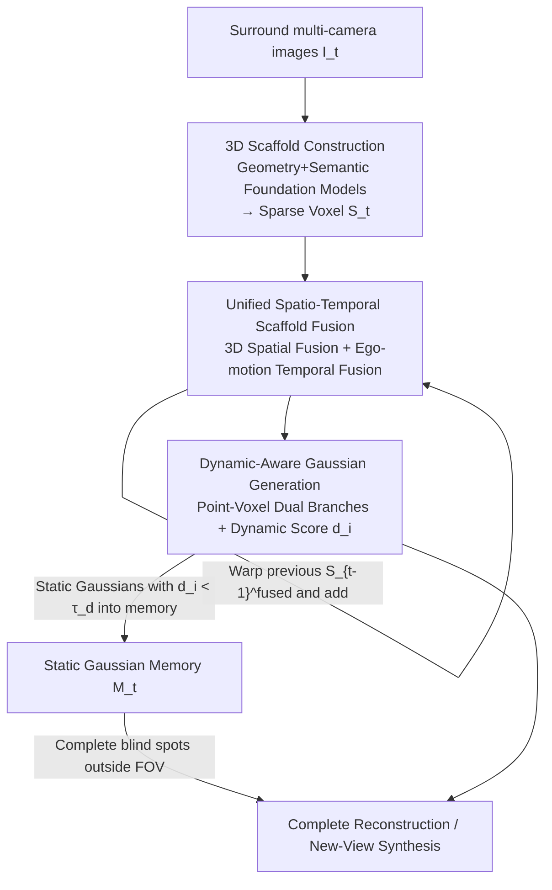

# UniSplat: Unified Spatio-Temporal Fusion via 3D Latent Scaffolds for Dynamic Driving Scene Reconstruction

**Conference**: ICLR 2026  
**OpenReview**: [https://openreview.net/forum?id=Ng2VDbKD4r](https://openreview.net/forum?id=Ng2VDbKD4r)  
**Paper**: [Project Page](https://chenshi3.github.io/unisplat.github.io/)  
**Code**: https://chenshi3.github.io/unisplat.github.io/ (Available, Open Sourced)  
**Area**: Autonomous Driving / 3D Vision  
**Keywords**: Feed-forward reconstruction, 3D Gaussian Splatting, Spatio-temporal fusion, Dynamic scenes, Implicit voxel scaffolds

## TL;DR
UniSplat performs multi-view spatial fusion and multi-frame temporal fusion simultaneously on a unified "3D implicit scaffold" (sparse voxel grid). It utilizes a point-voxel dual-branch decoder to generate Gaussians with dynamic attributes while maintaining a static Gaussian memory bank, achieving feed-forward SOTA new-view synthesis in sparse surround-view, highly dynamic driving scenarios like Waymo and nuScenes, and even completing blind spots outside the camera's field of view.

## Background & Motivation

**Background**: 3D reconstruction of driving scenes is a fundamental capability for simulation, scene understanding, and long-range planning. 3D Gaussian Splatting (3DGS) has become mainstream due to its real-time rendering and high fidelity. To avoid the high costs of per-scene optimization, feed-forward methods have emerged, which decode Gaussian primitives from sparse images in a single forward pass. These methods typically fuse inter-view information in the image domain using cross-attention or multi-view stereo (MVS) cost volumes before decoding Gaussians.

**Limitations of Prior Work**: Driving scenes present two combined challenges. First, there is almost no field-of-view (FOV) overlap between vehicle-mounted surround-view cameras, resulting in weak cross-view correspondences in the image domain, which hinders cross-attention or cost volume fusion. Second, street scenes contain numerous dynamic objects (moving vehicles, pedestrians), which cause "ghosting" artifacts during multi-frame aggregation. Existing works either perform geometric fusion while ignoring semantics and lacking dynamic processing mechanisms (e.g., EvolSplat uses 3D-CNNs to accumulate multi-frame depth), or only perform single-frame multi-view fusion without temporal aggregation and with coarse 3D details (e.g., Omni-Scene uses Triplane Transformers).

**Key Challenge**: The fundamental problem is the lack of a unified implicit representation that evolves smoothly over time. This representation needs to simultaneously carry multi-view spatial information and multi-frame temporal information, while distinguishing between dynamic and static content and handling occlusions or partial observations. Fusion in the 2D image domain is inherently misaligned for non-overlapping views, and decoupling spatial fusion, temporal fusion, and dynamic modeling into independent modules makes coordination difficult.

**Goal**: Construct a unified 3D representation where (i) multi-view spatial information is naturally aligned in 3D, (ii) historical frame information can be efficiently accumulated in a streaming fashion, and (iii) dynamic/static content can be separated to complete regions beyond camera coverage.

**Key Insight**: The core observation is that if the "battlefield" of fusion is moved from the 2D image domain to a voxel space with explicit 3D coordinates, information from different views corresponding to the same physical point will naturally fall into the same voxel. Similarly, historical frames can be directly superimposed in this 3D representation by using ego-poses for coordinate alignment.

**Core Idea**: Use a "3D implicit scaffold" (a sparse voxel grid constructed by geometric/visual foundation models) as a unified carrier to integrate spatial fusion, temporal fusion, and dynamic Gaussian generation within this 3D representation.

## Method

### Overall Architecture
UniSplat processes a continuous multi-camera video stream and maintains a unified 3D implicit representation that evolves over time. Each time step consists of three stages: **① 3D Scaffold Construction**—multi-view images are fed into geometric foundation models (to predict metric-scale point clouds) and visual foundation models (DINOv2 semantic features) to be voxelized into a sparse voxel body $S_t$ (the "scaffold") in the ego-centric coordinate system; **② Unified Spatio-Temporal Scaffold Fusion**—spatial fusion is first performed within the current scaffold using a sparse 3D U-Net to obtain $S_t^{spa}$, then the previous fused scaffold $S_{t-1}^{fused}$ is warped to the current coordinates using ego-pose and added via sparse tensor summation to obtain $S_t^{fused}$, which is cached back into the streaming memory; **③ Dynamic-Aware Gaussian Generation**—a point-voxel dual-branch decoder generates Gaussians from $S_t^{fused}$. Each Gaussian is assigned a dynamic score $d_i$, which is used to maintain a persistent static Gaussian memory bank $\mathcal{M}_t$ to complete blind spots outside the current FOV.

### Key Designs

**1. 3D Implicit Scaffold Construction: Aligning non-overlapping views into a 3D voxel body**

This step addresses the issue of sparse, non-overlapping surround-view images. Instead of estimating depth per view and fusing later, the authors use a feed-forward multi-view geometry foundation model (e.g., $\pi^3$) to predict dense 3D point maps $P_t^{init} \in \mathbb{R}^{N_{cam}\times H\times W\times 3}$, allowing multi-view correspondences to be solved internally. To fix scale ambiguity, a scale alignment branch predicts per-camera scale factors $\gamma = \mathrm{MLP}(\mathrm{AvgPool}(F_t^{geo}))\in\mathbb{R}^{N_{cam}}$, supervised by optimal scales calculated from LiDAR reference points via a ROE solver. The point cloud is voxelized into a cube $[p_{min}, p_{max}]$, where the initial feature $v_i^{init}$ of each voxel is the mean coordinate of its points. Voxel centers are projected back to each view to sample and concatenate fused geometry-semantic features $F_t$ (DINOv2 + geometry features). The resulting scaffold $S_t = \{(v_i\in\mathbb{R}^{C_s}, p_i\in\mathbb{R}^3)\}_{i=1}^{N_v}$ carries both explicit 3D structure and context.

**2. Unified Spatio-Temporal Scaffold Fusion: Alignment and accumulation in 3D**

This addresses misalignment in image-domain fusion and the lack of smooth temporal representation. **Spatial Fusion**: Features corresponding to the same physical point fall into the same voxel, so a sparse 3D U-Net $\phi$ directly integrates multi-view features $S_t^{spa}=\phi(S_t)$, avoiding cross-attention failures. **Temporal Fusion**: Rather than re-processing historical raw images, streaming aggregation is performed in the scaffold domain. The previous fused scaffold $S_{t-1}^{fused}$ is warped using ego-pose $T_{t-1}^t$, tagged with time-step embeddings, and integrated via sparse tensor addition:

$$S_t^{fused} = S_t^{spa} \oplus \mathrm{Warp}(S_{t-1}^{fused}, T_{t-1}^t)$$

The $\oplus$ operator performs element-wise summation at overlapping voxels and merges non-overlapping regions. A lightweight sparse convolution network then refines the output to capture complex temporal dependencies. Compared to explicit two-frame concatenation (24.72dB), this latent streaming propagation accumulates longer temporal context and more stable dynamic modeling.

**3. Dynamic-Aware Dual-Branch Gaussian Generation + Static Memory Completion**

This addresses the need for both detail and completeness while removing dynamic ghosting. **Dual-branch Decoder**: The point branch preserves detail—for each point $P_{t,i}$, 3D latent features $f_{t,i}^{3d}$ are retrieved from the scaffold and concatenated with 2D image features $f_{t,i}^{2d}$ to predict Gaussian parameters $\{(\Delta\mu_i,\alpha_i,\Sigma_i,c_i,d_i)\}$ via an MLP, yielding $G_t^{point}$. The voxel branch ensures completeness—it directly predicts $g$ sets of Gaussian parameters per voxel (where $g=4$), resulting in $G_t^{voxel}$ to fill gaps in point cloud coverage. **Dynamic-Aware Completion**: Each Gaussian has a dynamic attribute $d_i$. Given previous static memory $\mathcal{M}_{t-1}$, it is transformed to the current ego-coordinates and filtered to remove Gaussians currently visible in the FOV, resulting in $\mathcal{M}'_{t-1}$. The final reconstruction is $G_t^{complete}=G_t\cup\mathcal{M}'_{t-1}$. Memory updates only retain static Gaussians where the dynamic score is below a threshold: $\mathcal{M}_t=\mathcal{M}'_{t-1}\cup\{G_i\in G_t \mid d_i<\tau_d\}$ ($\tau_d=0.7$).

### Loss & Training
The total loss is defined on the rendering output of $G_t$. For input views $V_{input}$, it includes MSE reconstruction loss $L_{mse}$, LPIPS perceptual loss $L_{lpips}$, cross-entropy for dynamic scores $L_{dyn}$, and smooth-L1 for scale supervision $L_{scale}$. For novel views $V_{novel}$, only MSE on background-masked regions $B^v$ is used to prevent dynamic interference:

$$L = \sum_{v\in V_{input}}\!\big(\lambda_1 L_{mse}^v + \lambda_2 L_{lpips}^v + \lambda_3 L_{dyn}^v + \lambda_4 L_{scale}^v\big) + \sum_{v\in V_{novel}}\!\lambda_1 L_{mse}^v\odot B^v$$

Weights are set as $\lambda_1{=}1.0,\lambda_2{=}0.01,\lambda_3{=}0.01,\lambda_4{=}0.02$. The geometry model used is $\pi^3$, and semantics use DINOv2 ViT-small.

## Key Experimental Results

### Main Results
Evaluated on Waymo Open and nuScenes datasets using PSNR, SSIM, and LPIPS.

| Dataset | Task | Metric | Ours | Prev. SOTA | Gain |
|--------|------|------|----------|----------|------|
| Waymo (Multi) | Recon | PSNR↑ | 28.56 | 25.38 (DepthSplat) | +3.18 |
| Waymo (Multi) | Novel | PSNR↑ | 25.12 | 23.86 (DepthSplat) | +1.26 |
| Waymo (Multi)†| Novel | PSNR↑ | 25.98 | 23.86 (DepthSplat) | +2.12 |
| nuScenes | Novel | PSNR↑ | 25.37 | 24.27 (Omni-Scene) | +1.10 |
| nuScenes | Novel | SSIM↑ | 0.765 | 0.736 (Omni-Scene) | +0.029 |

UniSplat outperforms DepthSplat and Omni-Scene across all metrics. † denotes using LiDAR-derived optimal scale.

### Ablation Study

| Configuration | PSNR↑ | SSIM↑ | LPIPS↓ | Note |
|------|-------|-------|--------|------|
| Geometry Only | 24.78 | 0.73 | 0.35 | Perception drops without semantics |
| Semantic (DINO) Only | 24.85 | 0.72 | 0.31 | DINO implies some geometric priors |
| Geo + Sem (Full) | 25.08 | 0.74 | 0.30 | Complete scaffold features |
| Image-domain only | 24.14 | 0.68 | 0.32 | Baseline without Spa/Tem fusion |
| +Spatial Fusion | 24.50 | 0.70 | 0.32 | +0.36 PSNR |
| +Spatio-Temporal | 25.08 | 0.74 | 0.30 | +0.58 PSNR further enhancement |
| Point branch only | 24.62 | 0.72 | 0.38 | Poorer completeness |

### Key Findings
- **Spatio-temporal fusion is the primary contributor**: Moving from image-domain fusion to 3D spatial fusion (+0.36) and then adding temporal fusion (+0.58) yields consistent gains.
- **Semantic features primarily improve LPIPS**: Removing semantic features worsens LPIPS by 0.05, as perceptual similarity relies on high-level semantic representation.
- **Dual branches are complementary**: Using only the point branch degrades PSNR by 0.46 and increases LPIPS, as the voxel branch is necessary for filling gaps.
- **Blind spot completion**: Using temporal memory allows the model to complete the 360° coverage missing in Waymo's 5-camera setup and clear gaps between cameras.

## Highlights & Insights
- **Moving fusion to 3D voxels**: This solves the issue of non-overlapping views. In a voxel space with explicit coordinates, spatial fusion simplifies to a sparse 3D U-Net because corresponding points are naturally aligned.
- **Temporal fusion via sparse tensor addition**: Warping historical frames using ego-poses and performing sparse $\oplus$ is a lightweight yet effective way to maintain long-term memory.
- **Dynamic score-driven memory**: Learning a dynamic attribute $d_i$ per Gaussian allows the system to purposefully exclude moving objects from the static memory, enabling blind spot completion without ghosting.

## Limitations & Future Work
- **Dependency on ego-pose and frozen backbones**: Temporal fusion requires precise ego-poses, and scale alignment requires LiDAR during training. The performance cap is influenced by the generalization of frozen foundation models.
- **Dynamic handling is "filtering" rather than "modeling"**: Dynamic Gaussians are filtered to avoid ghosting but their trajectories are not explicitly modeled, which may affect consistency for fast-moving targets.
- **Future Directions**: Upgrading the memory bank to explicit 4D dynamic modeling and exploring self-supervised scale alignment to reduce LiDAR dependency.

## Related Work & Insights
- **vs EvolSplat**: UniSplat encodes both geometry and semantics and includes dynamic handling, whereas EvolSplat focuses on multi-frame depth accumulation.
- **vs Omni-Scene**: UniSplat achieves +1.10dB on nuScenes primarily due to its unified spatio-temporal fusion compared to Omni-Scene's single-frame focus.
- **vs MVSplat/DepthSplat**: UniSplat avoids the mismatch issues of image-domain cost volumes in non-overlapping views by performing fusion in 3D scaffold space.

## Rating
- Novelty: ⭐⭐⭐⭐⭐ 
- Experimental Thoroughness: ⭐⭐⭐⭐ 
- Writing Quality: ⭐⭐⭐⭐ 
- Value: ⭐⭐⭐⭐⭐ 

<!-- RELATED:START -->

## Related Papers

- [\[CVPR 2026\] STUR3D: Spatio-Temporal Unified Representation Learning for 3D Object Detection](../../CVPR2026/autonomous_driving/stur3d_spatio-temporal_unified_representation_learning_for_3d_object_detection.md)
- [\[ICLR 2026\] GaussianFusion: Unified 3D Gaussian Representation for Multi-Modal Fusion Perception](gaussianfusion_unified_3d_gaussian_representation_for_multi-modal_fusion_percept.md)
- [\[AAAI 2026\] CaTFormer: Causal Temporal Transformer with Dynamic Contextual Fusion for Driving Intention Prediction](../../AAAI2026/autonomous_driving/catformer_causal_temporal_transformer_with_dynamic_contextual_fusion_for_driving.md)
- [\[CVPR 2026\] DGGT: Feedforward 4D Reconstruction of Dynamic Driving Scenes using Unposed Images](../../CVPR2026/autonomous_driving/dggt_feedforward_4d_reconstruction_of_dynamic_driving_scenes_using_unposed_image.md)
- [\[ICLR 2026\] NeMo-map: Neural Implicit Flow Fields for Spatio-Temporal Motion Mapping](nemo-map_neural_implicit_flow_fields_for_spatio-temporal_motion_mapping.md)

<!-- RELATED:END -->
