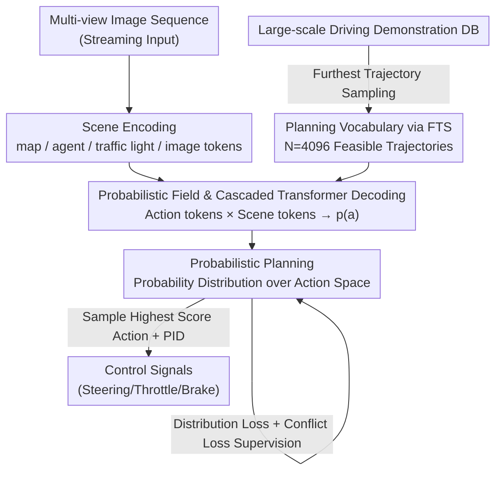

# VADv2: End-to-End Vectorized Autonomous Driving via Probabilistic Planning

**Conference**: ICLR 2026  
**OpenReview**: [https://openreview.net/forum?id=0a4dA6eUHN](https://openreview.net/forum?id=0a4dA6eUHN)  
**Code**: https://github.com/hustvl/VAD (Available)  
**Area**: Autonomous Driving / End-to-End Planning  
**Keywords**: End-to-end driving, probabilistic planning, planning vocabulary, probabilistic field, imitation learning

## TL;DR
VADv2 reformulates end-to-end driving planning from "regressing a single trajectory" to "learning a probability distribution over the action space." It first discretizes the continuous action space into a 4096-word planning vocabulary via furthest trajectory sampling, then uses a NeRF-inspired probabilistic field and cascaded Transformer to predict probabilities for each candidate action, and finally samples a trajectory for vehicle control. Using only camera inputs, it achieved a Driving Score of 85.1 on CARLA Town05 and led several benchmarks including Bench2Drive, NAVSIM, and 3DGS.

## Background & Motivation

**Background**: End-to-end autonomous driving aims to learn "human-like" driving policies directly from massive amounts of human driving demonstrations. Mainstream learning-based planning methods follow a deterministic paradigm—given scene observations, they directly regress a future trajectory (sequence of waypoints) or a set of control signals (throttle, brake, steering wheel).

**Limitations of Prior Work**: Human driving is inherently non-deterministic. When following a car, a driver might stay in the lane or change lanes to overtake; when facing oncoming traffic, one might yield or proceed. These "reasonable actions" are highly stochastic in timing and speed, influenced by many latent variables that cannot be accurately modeled. Deterministic regression assumes a one-to-one mapping between "scene → action," causing multiple human demonstrations for the same scene to become mutually contradictory regression targets.

**Key Challenge**: When the feasible solution space is non-convex (existing multiple separate reasonable actions, such as "bypassing left" or "bypassing right"), deterministic models attempt to fit all demonstrations by averaging them into a "compromise action"—which might unfortunately collide with obstacles in the middle. The root problem is: **fitting a multi-modal distribution with single-point regression inevitably leads to distortion**.

**Key Insight**: The authors remodel the planning policy as a scene-conditioned non-stationary stochastic process $p(a \mid o)$, where $o$ represents historical and current scene observations and $a$ is a candidate planning action. This perspective draws directly from Large Language Models: given a context, the next word is non-deterministic; LLMs learn the probability distribution of words conditioned on the context and then sample from that distribution. Driving uncertainty is isomorphic to this.

**Core Idea**: Use "probabilistic planning" instead of "deterministic regression"—rather than forcing the output of an optimal action, model a distribution over the entire action space and sample high-scoring items after ranking candidate actions. This naturally characterizes multi-modal/non-convex feasible solutions and downgrades the modeling task from "regression" to simpler "scoring."

## Method

### Overall Architecture
VADv2 is a streaming end-to-end model: it takes multi-view surround image sequences as input and outputs a probability distribution over the action space, then samples one action for the controller. The pipeline is divided into three stages—first, the **scene encoder** compresses sensor data into instance-level tokens; second, the **probabilistic planning** module discretizes the continuous action space into a planning vocabulary and scores each candidate action using a probabilistic field; finally, this distribution is supervised by massive driving demonstrations and scene constraints. During inference, high-scoring actions are sampled from the distribution and converted into control signals via PID. The planning target is a future trajectory of 3 seconds with 6 waypoints (0.5s interval).

### Key Designs

**1. Probabilistic Planning: Reformulating "Regressing a Trajectory" as "Learning a Distribution over Action Space"**

This is the core paradigm shift addressing the "averaging to hit a wall" issue of deterministic regression in non-convex feasible solutions. The authors model planning as a scene-conditioned stochastic process $p(a \mid o)$, where $o=(E_{\text{scene}}, E_{\text{navi}}, E_{\text{state}})$ represents features of the scene, navigation, and ego-state, and $a=(x_1,y_1,\dots,x_T,y_T)$ is the sequence of waypoints. Instead of "calculating" the optimal action, the model calculates a score for each candidate and samples from the ranked action space. This offers three benefits: it naturally expresses multi-modal/non-convex solutions; the modeling task is simpler than regression (characterizing correlation rather than solving for the optimum); and inference is flexible—it can output multi-modal results or integrate rule-based/optimized candidates for evaluation. Ablations (Table 8) verify that probabilistic planning outperforms deterministic variants across all traffic densities.

**2. Planning Vocabulary and Furthest Trajectory Sampling: Discretizing High-dimensional Continuous Action Space**

The action space is a high-dimensional continuous spatio-temporal space, making direct distribution modeling difficult. The authors discretize it into a planning vocabulary $V=\{a_i\}^N$ (default $N=4096$). Instead of grid sampling, they collect all actions from real human demonstrations as an action set $S$ and use **Furthest Trajectory Sampling** (FTS, similar to FPS) to pick $N$ representative trajectories whose endpoints are most dispersed. This has two key benefits: ① Every action in the vocabulary comes from real demonstrations, **naturally satisfying ego-vehicle kinematic constraints**; ② the dispersed endpoints ensure small discretization errors and uniform coverage. Unlike single-step vocabularies (which quantize movement per step and rollout iteratively), each token in VADv2 represents a **complete trajectory**, thus ensuring one-shot planning without accumulated errors.

**3. Probabilistic Field and Cascaded Transformer Decoding: Mapping Action Tokens to Probabilities**

With a discrete vocabulary, a scorer is needed to map a "candidate action + current scene" to a probability that is continuous with respect to small action perturbations ($\lim_{\Delta a\to 0}(p(a)-p(a+\Delta a))=0$). Inspired by NeRF's use of continuous radiance fields for 5D spaces, the authors propose a **probabilistic field**. They use positional encoding $\Gamma$ to lift coordinates of each trajectory to high-dimensional embeddings $E(a)$ to allow the field function to approximate high-frequency details. A **cascaded Transformer decoder** $\phi$ then uses $E(a)$ as queries and scene tokens $E_{\text{scene}}$ as keys/values for cross-attention. Combined with navigation and ego-state embeddings, an MLP + sigmoid yields the probability:

$$p(a) = \sigma\big(\mathrm{MLP}(\phi(E(a), E_{\text{scene}}) + E_{\text{navi}} + E_{\text{state}})\big)$$

This designs a continuous probability surface over the entire action space rather than scoring trajectories in isolation.

**4. Distribution Loss and Conflict Loss: Learning from Demonstrations and Correcting via Constraints**

Supervision consists of three parts. **Distribution Loss** is the primary driver: it uses KL divergence to approximate the predicted distribution to the data distribution. Since the data distribution $p_{\text{data}}$ is fixed, this is equivalent to cross-entropy $L_{\text{distribution}} = -\sum_{a\in V} p_{\text{data}}(a)\log p_{\text{pred}}(a)$. $p_{\text{data}}(a)$ is estimated by the frequency of the action being "hit" in demonstrations—for each frame, the closest vocabulary action to the ground truth is labeled 1 and others 0. **Conflict Loss** injects driving priors: if an action in the vocabulary conflicts with other agents' ground truth trajectories or road boundaries, its probability is suppressed: $L_{\text{conflict}} = \sum_{a\in V} \mathbb{1}_{\text{conflict}}(a)\log p_{\text{pred}}(a)$. **Scene Token Loss** supervises detection, mapping, and traffic lights to ensure tokens encode high-level information. Total loss $L = L_{\text{distribution}} + L_{\text{conflict}} + L_{\text{token}}$.

### Loss & Training
$L = L_{\text{distribution}} + L_{\text{conflict}} + L_{\text{token}}$. For CARLA Town05, ~3 million clips were collected using an official agent. For NAVSIM/3DGS, ~2000 hours of real human demonstrations were used for training. $T=6$, $D=256$. All experiments were conducted on 16 NVIDIA 4090 GPUs. During inference, the highest probability action is sampled and used with PID control.

## Key Experimental Results

### Main Results

CARLA Town05 Long closed-loop (camera only), DS is the primary metric (= RC × IS):

| Dataset | Metric | VADv2 | Prev. SOTA | Gain |
|--------|------|------|----------|------|
| Town05 Long | DS ↑ | **85.1** | Rao 2024 (Camera) 74.9 | +10.2 |
| Town05 Long | DS ↑ | 85.1 | DriveMLM (Camera+LiDAR) | +9.0 |
| Bench2Drive | DS ↑ | **76.15** | ETA 74.33 | +1.82 |
| NAVSIM navtest | PDMS ↑ | **89.3** | Hydra-NeXt 88.6 | +0.7 |
| NAVSIMv2 | EPDMS ↑ | **85.8** | PRIX 84.2 | +1.6 |
| 3DGS benchmark | CR ↓ | **0.270** | TransFuser 0.320 | -15.6% |

VADv2 surpasses the Camera+LiDAR model DriveMLM using only cameras (DS +9.0) and achieves a collision rate reduction of 15.6% relative to TransFuser on the 3DGS benchmark.

### Ablation Study

Ablation of key modules (Table 7, 50k clip training, 3s metrics):

| Configuration | L2 3s (m) ↓ | Collision 3s (%) ↓ | Description |
|------|------|------|------|
| Full (ID7) | **0.290** | **0.039** | Full model |
| w/o Distribution loss (ID1) | 3.153 | 0.746 | Lost demonstration supervision, failed |
| w/o Conflict loss (ID2) | 0.291 | 0.039 | Minimal impact, but lacks driving priors |
| w/o Agent token (ID3) | 0.327 | 0.085 | Lacks dynamic object info |
| w/o Map token (ID4) | 0.332 | 0.070 | Lacks static map info |

Planning method × Traffic density (Table 8, PDMS):

| Method | Low Density | Mid Density | High Density |
|------|------|------|------|
| Deterministic | 89.4 | 87.5 | 85.8 |
| Probabilistic | **90.6** | **89.0** | **87.7** |

### Key Findings
- **Distribution loss is the core**: Removing it causes 3s L2 to skyrocket from 0.290m to 3.153m (×10.9), indicating that "learning distributions from demonstrations" sustains the entire paradigm.
- **Stronger robustness in congested scenes**: In high-density traffic, the probabilistic approach achieves 87.7 PDMS vs 85.8 for the deterministic one, confirming its advantage in multi-modal action spaces.
- **High-quality multi-modal output**: While top-1 PDMS is 89.3, top-5 remains at 87.5, suggesting the leading candidates are all reasonable trajectories.

## Highlights & Insights
- **Transferring the LLM "Next-token distribution + sampling" paradigm to driving**: The planning vocabulary corresponds to a word list, matching the closest action corresponds to ground truth tokens, and cross-entropy corresponds to the language modeling loss—a very clean isomorphism.
- **Vocabulary from real demonstrations + FTS**: This solves discretization feasibility and coverage simultaneously. Every token is kinematically feasible, avoiding the manual design of trajectory anchors and the accumulated error of iterative rollout.
- **Clever use of NeRF-style probabilistic fields**: Using positional encoding for frequency lifting and cross-attention to build a continuous "action → probability" field is a transferable idea for any task requiring ranking and sampling in continuous candidate spaces.
- **Flexibility in inference**: Having a distribution over the entire space allows for rule-based filtering or optimization-based refinement during deployment, a benefit deterministic regression cannot provide.

## Limitations & Future Work
- Current CARLA simulations and 3DGS closed-loop environments have simplistic agent behaviors, which may limit the upper performance of VADv2.
- The use of a fixed vocabulary via FTS ($N=4096$) might have coverage blind spots for long-tail or extreme maneuvers (e.g., emergency evasion) if they are not well-represented in the demonstrations.
- The distribution loss currently uses a "hard" one-hot label for the single closest match. Exploring soft labels or energy-based distribution supervision could improve mono-frame multi-modality.

## Related Work & Insights
- **vs. Deterministic Regression Planning (VAD / UniAD)**: These direct regressions fail in non-convex solution spaces; VADv2 models distributions, making it more robust and simpler to model.
- **vs. Diffusion-based Planning (DiffusionDrive)**: Diffusion models rely on iterative denoising which can be computationally expensive; VADv2 provides one-shot scoring for a complete vocabulary.
- **vs. Single-step Vocabularies (MotionLM)**: These quantize per-step moves and rollout, leading to accumulated errors; VADv2 uses tokens representing complete, demonstration-derived feasible trajectories.

## Rating
- Novelty: ⭐⭐⭐⭐⭐ Reformulating planning from regression to distribution learning with a vocabulary + probabilistic field is highly coherent.
- Experimental Thoroughness: ⭐⭐⭐⭐⭐ Comprehensive evaluation across CARLA/Bench2Drive/NAVSIM/3DGS with density and ablation studies.
- Writing Quality: ⭐⭐⭐⭐ Clear motivation and LLM analogy; some implementation details are moved to the appendix.
- Value: ⭐⭐⭐⭐⭐ SOTA performance using only cameras; the paradigm's flexibility has direct implications for industrial deployment.

<!-- RELATED:START -->

## Related Papers

- [\[ICLR 2026\] ReCogDrive: A Reinforced Cognitive Framework for End-to-End Autonomous Driving](recogdrive_a_reinforced_cognitive_framework_for_end-to-end_autonomous_driving.md)
- [\[ICLR 2026\] ResWorld: Temporal Residual World Model for End-to-End Autonomous Driving](resworld_temporal_residual_world_model_for_end-to-end_autonomous_driving.md)
- [\[CVPR 2026\] ActiveAD: Planning-Oriented Active Learning for End-to-End Autonomous Driving](../../CVPR2026/autonomous_driving/activead_planning-oriented_active_learning_for_end-to-end_autonomous_driving.md)
- [\[CVPR 2026\] LEAD: Minimizing Learner-Expert Asymmetry in End-to-End Driving](../../CVPR2026/autonomous_driving/lead_minimizing_learner-expert_asymmetry_in_end-to-end_driving.md)
- [\[CVPR 2026\] GuideFlow: Constraint-Guided Flow Matching for Planning in End-to-End Autonomous Driving](../../CVPR2026/autonomous_driving/guideflow_constraint-guided_flow_matching_for_planning_in_end-to-end_autonomous_.md)

<!-- RELATED:END -->
