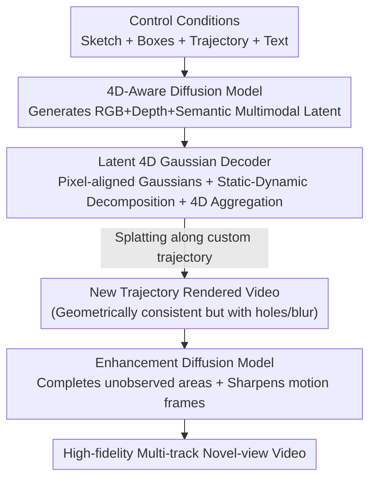

# WorldSplat: Gaussian-Centric Feed-Forward 4D Scene Generation for Autonomous Driving

**Conference**: ICLR 2026  
**Paper**: [Project Page](https://wm-research.github.io/worldsplat/)  
**Code**: See project page (Open-source link not yet specified)  
**Area**: Autonomous Driving / World Models / 4D Scene Generation / 3D Gaussian Splatting  
**Keywords**: Driving World Models, Feed-Forward 4D Gaussians, Novel View Synthesis, Latent Diffusion, Static-Dynamic Decomposition

## TL;DR
WorldSplat unifies "driving video generation" and "3D/4D scene reconstruction": it first utilizes a 4D-aware latent diffusion model to generate multimodal latents containing RGB, depth, and semantics from conditions such as layout, text, and trajectories. A feed-forward decoder then produces pixel-aligned 4D Gaussian fields in a single pass, enabling the rendering of geometrically consistent multi-track novel-view videos along arbitrary custom trajectories. Finally, an enhancement diffusion model completes imperfections, achieving new SOTA performance in both driving video generation and novel view synthesis on nuScenes.

## Background & Motivation
**Background**: Controllable driving scene synthesis is critical for scalable training and closed-loop evaluation of autonomous driving. One approach involves generative world models (MagicDrive, Vista, DriveDreamer, etc.), which excel at creating high-fidelity, user-controllable videos. Another approach involves urban scene reconstruction (StreetGaussian, OmniRe, EmerNeRF, etc.), which excels at geometrically consistent novel view synthesis (NVS) from real driving logs.

**Limitations of Prior Work**: Both approaches have inherent weaknesses. Video generation models operate in the 2D image domain and lack 3D consistency and novel view controllability—while a single angle may look reasonable, the scene collapses upon a viewpoint change. They also cannot guarantee visual coherence after a lateral ego-vehicle shift of $\pm N$m. Conversely, reconstruction methods are geometrically accurate but can only replicate captured data, lacking the generative capability to "imagine unseen scenes." Common compromises, such as "generate video then reconstruct," suffer from error accumulation across the two stages and reconstruction artifacts under sparse views.

**Key Challenge**: There is a structural opposition between generative "imagination" and reconstructive "geometric fidelity"—pure 2D video lacks geometry, while pure reconstruction lacks generation. To achieve both, a unified representation is required that can both generate from scratch based on conditions and possess an explicit 3D representation.

**Goal**: To build a feed-forward framework capable of directly generating a dynamic 4D Gaussian field from user conditions (road network sketches, text, dynamic object boxes, ego-trajectories), and then rendering spatio-temporally consistent multi-track novel-view videos in real-time along arbitrary camera trajectories without per-scene optimization.

**Key Insight**: The authors argue the issue lies in the intermediate representation. Instead of using point maps, which are geometrically sparse and difficult to render consistently, the output of the diffusion model should be directly mapped to an explicit, Gaussian-centric world representation. 3D Gaussians allow for fast rasterized rendering and explicitly carry geometry, making them a natural bridge between "generation + reconstruction."

**Core Idea**: A three-stage pipeline is proposed: "4D-aware diffusion generates multimodal latents $\to$ feed-forward decoding into pixel-aligned 4D Gaussians $\to$ enhancement diffusion refines rendering." By infusing generative imagination into explicit 4D Gaussian representations, geometrically consistent and controllable novel-view videos are obtained.

## Method

### Overall Architecture
The WorldSplat pipeline consists of three **independently trained** modules. The input is a set of structured control conditions $C=\{S,B,T,D\}$ (BEV road network sketches, 3D object boxes, ego-trajectories, text descriptions) plus noise latents; the output is a high-fidelity multi-track novel-view video rendered along a user-defined trajectory $T'$.

In the first step, a 4D-Aware diffusion model denoises the noise to generate a **multimodal latent**. It encodes not only RGB but also metric depth and dynamic object semantic masks, providing the subsequent reconstruction with the trio of "appearance + geometry + static-dynamic partitioning." In the second step, a latent Gaussian decoder transforms this latent into **pixel-aligned 3D Gaussians**, uses the semantic masks to separate Gaussians into static background and dynamic objects, and aggregates them across frames into a unified **4D Gaussian field**. In the third step, the Gaussian field is rendered into novel-view videos via fast Gaussian splatting along perturbed trajectories. Since splatting may produce blurriness or holes in unobserved regions or under strong ego-motion, the fourth step uses an **enhancement diffusion model** to refine the rendering results, filling holes and sharpening frames to obtain the final video.

### Key Designs

**1. 4D-Aware Multimodal Latent Diffusion: Embedding geometry and static-dynamic information directly into generated latents**

The pain point is that traditional driving video diffusion only generates RGB latents. When downstream 3D reconstruction is needed, there is neither depth nor static-dynamic partitioning, requiring post-hoc estimation which leads to cumulative errors. WorldSplat enables the diffusion model to generate latents that "carry 3D information." Specifically, for a video with $K$ views and $T$ frames, a pre-trained VAE encodes image latents $L_{img}$; a depth foundation model estimates metric depth (normalized to $[-1,1]$) to encode $L_{depth}$; and SegFormer generates dynamic category binary masks to encode $L_{seg}$. These are concatenated along the channel dimension as $L=\text{concat}\{L_{img},L_{depth},L_{seg}\}$ for decoding. The control side is a ControlNet-style dual-branch DiT (based on OpenSora v1.2): the main branch processes spatio-temporal video latents, while the ControlNet branch injects sketches, boxes, trajectories, and text, replacing standard self-attention with cross-view attention to ensure multi-view consistency. Text conditions use **DataCrafter**—splitting multi-view videos into clips, scoring them with a VLM, generating per-view captions, and fusing them via a consistency module to obtain structured descriptions including scene context (weather/time/layout) and object details. Training uses Rectified Flow instead of IDDPM scheduling, defining the interpolated state as $z(s)=(1-s)\epsilon+sx$, and letting the network $g_\psi(z,s,C)$ regress the vector field $x-\epsilon$. Inference is performed via backward integration $z(s_{k-1})=z(s_k)-\frac1N g_\psi(z(s_k),s_k,C)$, which is stable with fewer steps.

**2. Latent 4D Gaussian Decoder: Feed-forward pixel-aligned Gaussians and 4D aggregation**

This is the bridge from "generation" to "explicit 3D." The decoder is a transformer with stacked cross-view and temporal attention, followed by upsampling blocks to regress Gaussian parameters pixel-wise. To strengthen 3D spatial cues, Plücker ray maps $P$ (encoding per-pixel ray origin $R_o$ and direction $R_d$) are fed into the system. Each 3D Gaussian is parameterized as $g=(\mu,r,s,\alpha,c)$ (center, quaternion rotation, scale, opacity, color). The final layer of the decoder predicts per-pixel offsets $\delta$, $r,s,\alpha,c$, depth $d$, and static-dynamic classification logits $m$. The Gaussian centers are calculated as $\mu=R_o+d\odot R_d+\delta$. The mapping is denoted as $D_\phi:(L_{img},L_{depth},L_{seg},P)\mapsto\{(G_t,M_t)\}_{t=1}^T$. After obtaining per-frame Gaussians and dynamic masks, **4D aggregation** is performed: given ego-trajectory $T$, all 3D Gaussians are transformed into a unified coordinate system. At each time step, "static Gaussians consolidated from all frames" are merged with "dynamic Gaussians of the current frame":

$$G_{4D}=\Big\{(G_t\odot M_t)\cup\bigcup_{i=1}^{T}\big(G_i\odot(1-M_i)\big)\Big\}_{t=1}^{T}.$$

This is effective because single-frame 3D Gaussians are often too sparse, leading to holes and aliasing in novel views; cross-temporal aggregation densifies the static background over time while updating dynamic objects per frame, significantly improving spatio-temporal consistency. Notably, this decoder supports **input from more than 48 simultaneous views**, covering more complex scenes than previous feed-forward reconstruction models.

**3. Enhancement Diffusion Model: Compensating for splatting defects via "reconstruction as restoration + mixed condition augmentation"**

Gaussian splatting without per-scene optimization leads to two types of artifacts: unobserved regions (occluded sky, back of buildings) lack content, and rendering becomes blurred under strong ego-motion. The enhancement diffusion model treats "refining rendered video" as a conditional generation task. It shares the same architecture as the 4D-aware diffusion but uses $C'=\{R,S,B,T,D\}$ (adding the rendered video $R$) as conditions and clean image latents $E(I)$ as the regression target, adding details and consistency in the latent space. A key training trick involves **mixed condition augmentation**: while ReconDreamer only uses degraded renderings as input (weakening condition-output alignment), WorldSplat mixes degraded renderings with high-quality views during training to balance controllability and fidelity. Combined with **custom trajectory selection** (§3.5), which applies lateral shifts $\Delta y\in\{\pm1,\pm2,\pm4\}$m to the original trajectory, and **re-projecting** sketches and boxes as $S',B'$ to form new conditions $C'$, explicit cross-view/cross-frame geometric constraints are enforced to further improve novel-view quality.

### Loss & Training
The three modules are trained separately. 4D-Aware diffusion uses the vector field regression loss of Rectified Flow (Eq. 2). The Gaussian decoder's supervision consists of: binary cross-entropy for predicted static-dynamic masks against SegFormer masks; and after projecting 4D Gaussians to the target rendering time, RGB is supervised via L1 photometric loss + LPIPS perceptual loss, while depth is supervised via L1 loss in metric space. The overall objective is:

$$\mathcal{L}=\mathcal{L}_{recon}+\lambda_1\mathcal{L}_{lpips}+\lambda_2\mathcal{L}_{depth}+\lambda_3\mathcal{L}_{seg}.$$

The enhancement diffusion architecture and training strategy are consistent with 4D-aware diffusion, varying only in conditions and targets. The backbone uses pre-trained OpenSora-VAE-1.2, focusing on fine-tuning the cross-view attention blocks in the diffusion transformer.

## Key Experimental Results

The dataset is nuScenes (700 scenes for training / 150 for validation, labels upsampled from 2 Hz to 12 Hz). Metrics include FVD, FID, and domain gap evaluation for downstream perception tasks.

### Main Results

Original view video generation (nuScenes validation set, three condition settings):

| Condition Setting | Method | FVD_multi ↓ | FID_multi ↓ |
|----------|------|-------------|-------------|
| w/o first cond | DriveDreamer-2 | 105.10 | 25.00 |
| w/o first cond | Panacea | 139.00 | 16.96 |
| w/o first cond | **Ours** | **74.13** | **8.78** |
| w first cond | DriveDreamer-2 | 55.70 | 11.20 |
| w first cond | **Ours** | **16.57** | **4.14** |
| w noisy latent | UniScene | 70.52 | 6.12 |
| w noisy latent | **Ours** | **60.84** | 6.51 |

Novel view synthesis (lateral shifts of $\pm1/\pm2/\pm4$m, baseline from DiST-4D):

| Method | ±1m FID/FVD ↓ | ±2m FID/FVD ↓ | ±4m FID/FVD ↓ |
|------|---------------|---------------|---------------|
| OmniRe | 31.48 / 152.01 | 43.31 / 254.52 | 67.36 / 428.20 |
| DiST-4D | 10.12 / 45.14 | 12.97 / 68.80 | 17.57 / 105.29 |
| **Ours** | **8.25 / 40.17** | **11.26 / 47.41** | **13.38 / 64.07** |

The advantage becomes more pronounced as the shift increases ($\pm4$m). While reconstruction baselines see FVD spike to 400+, WorldSplat maintains 64.07, demonstrating that explicit 4D Gaussian representations are more robust for viewpoint extrapolation.

### Ablation Study
Ablation of components under $\pm2$m novel view synthesis (Version F is the full model):

| Version | Configuration | FVD ±2m ↓ | FID ±2m ↓ | Note |
|------|------|-----------|-----------|------|
| A | No 3D Gs (Baseline) | 260.07 | 41.40 | Pure 2D generation |
| B | + 3D Gs | 75.26 | 16.31 | Explicit Gaussians, FVD −184.81 |
| C | + 4D Aggregation | 50.73 | 11.60 | Cross-frame densification, FVD −24.53 |
| D | No 4D Gs (Enhancement only) | 107.58 | 26.73 | Control group |
| E | No Condition Re-projection | 51.64 | 12.07 | Without re-projection, FVD +8.9% |
| F | Full Model | 47.41 | 11.26 | Incl. mixed and enhancement diffusion |

### Key Findings
- **Explicit 3D Gaussians are the primary driver**: Introducing 3D Gaussians (A $\to$ B) caused FVD to drop from 260.07 to 75.26 (−184.81), proving that grounding generation in explicit geometric representation is the fundamental source of geometric consistency for novel views.
- **Enhancement diffusion is the second largest contributor**: In D $\to$ F, FVD dropped from 107.58 to 47.41 (−60.17) and FID dropped by 15.47, indicating that filling unobserved areas and sharpening motion frames is vital for final fidelity.
- **4D aggregation solves sparsity and holes**: Single-frame Gaussian sparsity causes aliasing; cross-frame aggregation (B $\to$ C) further reduced FVD by 24.53.
- **Downstream gains**: Generated data achieved 38.49% mIoU / 29.34% mAP on BEVFormer, exceeding DiVE by +2.53 / +4.79. Incorporating generated data into StreamPETR training (Real + Ours) yielded +4.0 mAP and +3.2 NDS, outperforming Panacea's gains.

## Highlights & Insights
- **"Generating multimodal latents" instead of "generating RGB"**: Encoding depth and static-dynamic semantics into latents during the diffusion stage allows the generation model to directly produce geometric information for feed-forward reconstruction, bypassing the error chain of "estimating geometry from RGB." This approach is transferable to any task involving reconstruction after generation.
- **Gaussian-centric world representation**: Compared to point maps, pixel-aligned 3D Gaussians allow for fast splatting and explicitly carry geometry. The authors demonstrate that this representation is superior for consistent novel-view video generation, acting as the bridge between imagination and geometric fidelity.
- **Mixed condition augmentation**: Training the enhancement diffusion model with mixed degraded and high-quality renderings elegantly solves the dilemma where degraded-only inputs weaken condition-output alignment—a reusable training trick.

## Limitations & Future Work
- Failure cases: When the custom trajectory enters **completely unobserved regions** (e.g., moving the trajectory inside a building), the enhancement diffusion can produce artifacts or blanks due to the lack of geometric priors from the Gaussian rendering. This is a common issue with reconstruction-based NVS.
- The three modules are **trained separately** rather than end-to-end, which may lead to sub-optimal inter-stage performance. Inference is sequential, and overall latency and error propagation require attention.
- Depth and semantics rely on external foundation models (depth estimator, SegFormer), whose errors propagate to Gaussian geometry. Evaluation was primarily conducted on the nuScenes dataset, leaving cross-domain generalization not fully verified.
- Future directions: The authors suggest introducing geometric inpainting or learned priors for heavily occluded regions, or exploring joint fine-tuning of the three modules.

## Related Work & Insights
- **vs. Video Generative World Models (MagicDrive / Vista / DriveDreamer-2)**: These generate high-fidelity videos in the 2D domain but lack 3D consistency, collapsing under viewpoint changes. WorldSplat feed-forwards a 4D Gaussian field directly, ensuring consistency after lateral shifts and significantly leading in NVS FVD/FID.
- **vs. Urban Scene Reconstruction (OmniRe / StreetGaussian / EmerNeRF)**: These are geometrically accurate but lack generative capabilities and require per-scene optimization. WorldSplat is feed-forward and can generate unseen scenes from conditions, outperforming these benchmarks at large lateral shifts ($\pm4$m).
- **vs. Two-stage "Generation + Reconstruction" (DreamDrive / InfiniCube / MagicDrive3D)**: Two-stage methods are hampered by error accumulation; sparse views remain inconsistent. WorldSplat unifies generation and reconstruction in a single feed-forward pass, outputting 4D Gaussians directly to avoid accuracy loss in intermediate video stages.
- **vs. Feed-Forward Reconstruction (DiST-4D etc.)**: DiST-4D uses point maps. WorldSplat utilizes Gaussian-centric representations and supports 48+ view inputs, showing overall superiority in novel view synthesis.

## Rating
- Novelty: ⭐⭐⭐⭐⭐ Unifying multimodal geometric latent generation, feed-forward 4D Gaussians, and enhancement diffusion into a feed-forward framework bridging generation and reconstruction is highly novel.
- Experimental Thoroughness: ⭐⭐⭐⭐ Comprehensively achieves SOTA across original/novel views, ablations, and downstream experiments, though limited to the nuScenes dataset.
- Writing Quality: ⭐⭐⭐⭐ The three-module structure is clear, diagrams are effective, and mathematical notation is standardized.
- Value: ⭐⭐⭐⭐⭐ Provides a controllable, geometrically consistent multi-track data synthesizer for autonomous driving with significant downstream perception benefits.

<!-- RELATED:START -->

## Related Papers

- [\[CVPR 2026\] UFO: Unifying Feed-Forward and Optimization-based Methods for Large Driving Scene Modeling](../../CVPR2026/autonomous_driving/ufo_unifying_feed-forward_and_optimization-based_methods_for_large_driving_scene.md)
- [\[CVPR 2025\] PanSplat: 4K Panorama Synthesis with Feed-Forward Gaussian Splatting](../../CVPR2025/autonomous_driving/pansplat_4k_panorama_synthesis_with_feed-forward_gaussian_splatting.md)
- [\[ICCV 2025\] DiST-4D: Disentangled Spatiotemporal Diffusion with Metric Depth for 4D Driving Scene Generation](../../ICCV2025/autonomous_driving/dist-4d_disentangled_spatiotemporal_diffusion_with_metric_depth_for_4d_driving_s.md)
- [\[CVPR 2026\] GaussianDWM: 3D Gaussian Driving World Model for Unified Scene Understanding and Multi-Modal Generation](../../CVPR2026/autonomous_driving/gaussiandwm_3d_gaussian_driving_world_model_for_unified_scene_understanding_and_.md)
- [\[CVPR 2025\] UniScene: Unified Occupancy-centric Driving Scene Generation](../../CVPR2025/autonomous_driving/uniscene_unified_occupancy-centric_driving_scene_generation.md)

<!-- RELATED:END -->
