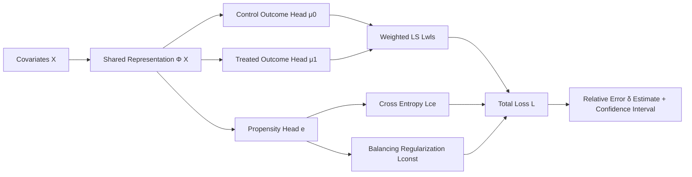

# A Relative Error-Based Evaluation Framework of Heterogeneous Treatment Effect Estimators

**Conference**: ICLR 2026  
**OpenReview**: [https://openreview.net/forum?id=gubSyVxWdG](https://openreview.net/forum?id=gubSyVxWdG)  
**Code**: To be confirmed  
**Area**: Causal Inference / Heterogeneous Treatment Effect Evaluation  
**Keywords**: HTE, Relative Error, Semiparametric Efficiency, Propensity Score, Doubly Robust, Dragonnet  

## TL;DR
This paper proposes an HTE estimator evaluation framework based on **relative error**. Through a carefully designed weighted least squares loss + balancing regularization + Dragonnet-style neural network, the relative error estimation remains $\sqrt{n}$-consistent, asymptotically normal, and provides valid confidence intervals even when the **outcome regression model is misspecified** (provided the propensity score model is correct). This allows for reliable comparison of different HTE estimators and yields an aggregated HTE learning algorithm.

## Background & Motivation
**Background**: Estimation of Heterogeneous Treatment Effects (HTE, $\tau(x)=\mathbb{E}[Y(1)-Y(0)\mid X=x]$) has flourished across fields like economics, medicine, and marketing (Causal Forest, X/S-Learner, TARNet, Dragonnet, etc.). However, the question of "how to evaluate which estimator is better" has been long overlooked. The challenge lies in the absence of ground truth for HTE, as only one potential outcome is observed for each individual.

**Limitations of Prior Work**: Traditionally, absolute error (MSE) $\phi(\hat\tau)=\mathbb{E}[(\hat\tau(X)-\tau(X))^2]$ is used for evaluation, but it explicitly depends on the unknown $\tau$ and is sensitive to its estimation error. Gao (2025) proposed using **relative error** $\delta(\hat\tau_1,\hat\tau_2)=\phi(\hat\tau_1)-\phi(\hat\tau_2)$ to quantify the performance difference between two estimators, which only depends on the first-order term of $\tau$ and is more robust to $\tau$ estimation errors.

**Key Challenge**: The relative error estimator in Gao (2025) requires **all** nuisance models (propensity score $e(x)$ and outcome regression $\mu_a(x)$) to be consistent at a rate faster than $n^{-1/4}$ (Condition 2). However, outcome regressions $\mu_a(x)$ trained on treated/control groups must extrapolate to the entire sample. When distributions differ significantly between groups, extrapolation becomes highly unreliable—a condition that is often too strict in practice. In contrast, propensity scores are learned across the full sample without extrapolation, making them much more robust.

**Goal**: Relax the consistency requirement for the outcome regression model while maintaining the desirable properties of Gao (2025), such as semiparametric efficiency, allowing $\mu_a(x)$ to be biased.

**Core Idea**: **By leveraging the algebraic association between the propensity score and the outcome regression model**, the authors derive "key moment conditions" that make the relative error estimation robust to biases in $\mu_a$. They then design specific loss functions and neural networks to approximate these conditions, ensuring that "as long as the propensity score is correct, the outcome regression model can be misspecified"—achieving an evaluator that is **doubly robust with respect to the outcome model**.

## Method

### Overall Architecture
The method retains the algebraic form of the Gao (2025) estimator $\check\delta=\frac1n\sum_i\varphi(Z_i;\check\mu_0,\check\mu_1,\check e)$ to inherit semiparametric efficiency, but fits the nuisance parameters differently. The core workflow consists of three steps: ① Perform a Taylor expansion on $\check\delta$ to derive three sets of expected moment conditions required for robustness against $\check\mu_a$ bias (Eq. 4); ② Design a "weighted least squares loss" so the outcome regression head automatically satisfies the first condition, and a "balancing regularization" so the propensity head satisfies the latter two; ③ Use a Dragonnet-style three-headed network with a shared representation $\Phi(X)$ for joint optimization to output nuisance estimates for relative error calculation.

### Key Designs

**1. Robustness Moment Conditions: Translating "outcome model bias robustness" into executable targets.** The authors perform a first-order Taylor expansion of $\check\delta(\hat\tau_1,\hat\tau_2;\check\gamma,\check\beta_0,\check\beta_1)$ around its probability limits $(\bar\gamma,\bar\beta_0,\bar\beta_1)$. They find that the first-order term $\Delta_\gamma^\top(\check\gamma-\bar\gamma)+\Delta_{\beta_0}^\top(\check\beta_0-\bar\beta_0)+\Delta_{\beta_1}^\top(\check\beta_1-\bar\beta_1)$ is critical for robustness. Since the estimator converges to its probability limit, setting the expectations of the three gradients to zero $\mathbb{E}[\Delta_\gamma]=\mathbb{E}[\Delta_{\beta_0}]=\mathbb{E}[\Delta_{\beta_1}]=0$ ensures the first-order term is $o_P(n^{-1/2})$. This yields the three moment constraints in Eq. (4), transforming the goal of maintaining $\sqrt{n}$-asymptotics under misspecification into optimizable equality constraints.

**2. Weighted Least Squares Loss: Ensuring the outcome head automatically satisfies the first moment constraint.** For $(\beta_0, \beta_1)$, the authors design a weighted squared loss:
$$L_{wls}=\frac1n\sum_i(\hat\tau_1(X_i)-\hat\tau_2(X_i))\Big[\tfrac{(1-A_i)\check e(X_i)\{Y_i-\Phi(X)^\top\beta_0\}^2}{1-\check e(X_i)}+\tfrac{A_i(1-\hat e(X_i))\{Y_i-\Phi(X)^\top\beta_1\}^2}{\hat e(X_i)}\Big].$$
The weights strategically incorporate the propensity score $\check e$ and the estimator difference $\hat\tau_1-\hat\tau_2$. Setting the derivative of this loss with respect to $\beta_a$ to zero at the probability limit is exactly equivalent to the first constraint in Eq. (4). Essentially, rather than requiring the outcome model to be "predictively accurate," it is required to satisfy a specific weighted orthogonality condition.

**3. Soft-slack Balancing Regularization: Handling over-constrained propensity parameters.** The last two constraints in Eq. (4) impose $2d$ linear constraints on $\gamma$, but $\gamma\in\mathbb{R}^d$ has only $d$ degrees of freedom. This system is over-constrained and generally insoluble. Borrowing from the soft-margin concept in SVMs, the authors introduce slack variables $\xi,\eta\in\mathbb{R}^d$ for controlled deviation and convert the constrained optimization into an unconstrained one: cross-entropy $L_{ce}$ plus a balancing regularization $L_{const}=c\sum_j(\xi_j+\eta_j)+\rho\cdot\|\max(\cdot,0)\|^2$. This encourages the property where covariate functions weighted by inverse propensity have equal expectations across groups, reducing sensitivity to the exact propensity model specification.

**4. Dragonnet Tri-head Network + Aggregated HTE Learning.** The network follows Dragonnet: inputs produce a shared representation $\Phi(x)$ via fully connected layers, splitting into three heads—control outcome $\mu_0$, treated outcome $\mu_1$, and propensity $e$ (sigmoid). Total loss $L=L_{wls}+\lambda_1 L_{ce}+\lambda_2 L_{const}$. Furthermore, since every pair of estimators $(\hat\tau_k,\hat\tau_{k'})$ can output a set of outcome regressions $\check\mu_a(x;\hat\tau_k,\hat\tau_{k'})$, a new HTE estimate is defined as $\check\tau(x;\hat\tau_k,\hat\tau_{k'})=\check\mu_1-\check\mu_0$. Averaging over all candidate pairs yields an aggregated estimate $\check\tau(x)=\frac{2}{|K|(|K|-1)}\sum_{k,k'}(\check\mu_1-\check\mu_0)$, which surprisingly outperforms any single candidate estimator. Theoretically (Theorem 1 / Proposition 2), $\check\delta$ is $\sqrt{n}$-consistent even if the outcome model is misspecified.

## Key Experimental Results

Datasets used: semi-synthetic IHDP (747 samples), real-world Twins (5271 samples), and Jobs (job training). Metrics include coverage (90% CI) and selection accuracy for $\delta$ evaluation, and $\sqrt{\epsilon_{PEHE}}$ and $\epsilon_{ATE}$ for HTE estimation.

### Main Results (HTE Estimation performance, lower is better)

| Method | IHDP $\sqrt{\epsilon^{out}_{PEHE}}$ | IHDP $\epsilon^{out}_{ATE}$ | Twins $\sqrt{\epsilon^{out}_{PEHE}}$ | Twins $\epsilon^{out}_{ATE}$ |
|---|---|---|---|---|
| X-Learner | 0.987 | 0.207 | 0.294 | 0.024 |
| Dragonnet | 0.867 | 0.134 | 0.290 | 0.092 |
| DRCFR | 0.760 | 0.185 | 0.288 | 0.076 |
| ESCFR | 0.841 | 0.135 | 0.288 | 0.076 |
| **Ours** | **0.670** | **0.105** | **0.286** | **0.009** |

The aggregated HTE estimator significantly leads all baselines in PEHE and ATE on both IHDP and Twins.

### Ablation Study ($\delta$ Inference with different nuisance fitting methods)

| Nuisance | IHDP Coverage | IHDP Selection Acc. | Twins Coverage | Twins Selection Acc. |
|---|---|---|---|---|
| Regression | 0.94 | 0.44 | 0.94 | 0.88 |
| Boosting | 0.95 | 0.48 | 0.94 | 0.86 |
| **Ours** | 0.96 | **0.80** | 0.94 | **0.94** |

While all methods achieve coverage close to the target, the proposed method dominates in selection accuracy (0.80 vs 0.44/0.48 on IHDP), indicating that the custom loss/regularization significantly improves the ability to "pick the true winner."

### Key Findings
- **Controllable Runtime**: Increases from 2.5s to 3.1s as sample size grows (30 to 700); increases from 1.1s to 12.2s as the number of candidate estimators grows from 2 to 5 (quadratic growth due to pairwise comparison).
- **Valid Coverage + Superior Selection**: Validates that relaxing outcome model consistency does not sacrifice inference validity.
- **Aggregated Strategy**: Highly effective, surpassing any single candidate estimator.

## Highlights & Insights
- **Extended "Doubly Robust" Thinking to Meta-evaluation**: While DR is typically used for ATE/HTE estimation, this paper creatively applies it to the meta-task of "evaluating which HTE estimator is better."
- **Backward Loss Design from Taylor Expansion**: Deriving moment conditions for robustness first, then reverse-engineering Weighted LS + Balancing Regularization to satisfy them, creates a tight link between theory and algorithm.
- **No Sample Splitting**: Unlike Gao (2025) which relies on cross-fitting, this work uses a full-sample derivation that is numerically more tractable.
- **Evaluator as a Learner**: A reliable evaluation framework naturally derives an aggregated HTE learning algorithm.

## Limitations & Future Work
- **Dependency on Propensity Score Specification**: Robustness is "one-sided" (outcome model only). Theoretical guarantees may fail if the propensity model is misspecified.
- **Pairwise Computational Complexity**: The number of pairs grows quadratically with candidate estimators, necessitating random sub-sampling for large candidate sets.
- **Limited Data Scale**: Experiments are based on classic small-to-medium causal inference datasets, lacking validation in high-dimensional, massive-scale scenarios.
- **Shared Representation Sensitivity**: Sensitivity to the $\Phi(X)$ architecture is only briefly analyzed in the appendix; hyperparameter tuning remains necessary in practice.

## Related Work & Insights
Direct motivation comes from **Gao (2025)** on relative error; the architecture follows **Dragonnet** (Shi et al., 2019); balancing regularization is rooted in **Imai & Ratkovic (2014)**; semiparametric efficiency and nuisance convergence rates draw from **Chernozhukov et al. (2018)**. The key insight is that **"evaluation" itself is an undervalued research problem**—when ground truth is unavailable, designing a relative comparison framework robust to nuisance bias is a powerful alternative to pursuing absolute accuracy.

## Rating
- **Novelty**: ⭐⭐⭐⭐ Applying doubly robust logic to estimator evaluation and deriving losses via Taylor expansion is a novel perspective.
- **Experimental Thoroughness**: ⭐⭐⭐ Covers three classic datasets plus ablation/sensitivity/runtime, but remains small-scale without high-dimensional verification.
- **Writing Quality**: ⭐⭐⭐⭐ Clear logical chain from motivation to theoretical conditions, loss design, and theoretical guarantees.
- **Value**: ⭐⭐⭐⭐ Provides a practical robust framework for HTE evaluation without ground truth and yields a superior learner as a byproduct.

<!-- RELATED:START -->

## Related Papers

- [\[ICLR 2026\] Matching without Group Barrier for Heterogeneous Treatment Effect Estimation](matching_without_group_barrier_for_heterogeneous_treatment_effect_estimation.md)
- [\[ICLR 2026\] Modeling Interference for Treatment Effect Estimation in Network Dynamic Environment](modeling_interference_for_treatment_effect_estimation_in_network_dynamic_environ.md)
- [\[ICLR 2026\] Overlap-Adaptive Regularization for Conditional Average Treatment Effect Estimation](overlap-adaptive_regularization_for_conditional_average_treatment_effect_estimat.md)
- [\[ICLR 2026\] Overlap-Weighted Orthogonal Meta-Learner for Treatment Effect Estimation over Time](overlap-weighted_orthogonal_meta-learner_for_treatment_effect_estimation_over_ti.md)
- [\[ICLR 2026\] Debiased Front-Door Learners for Heterogeneous Effects](debiased_front-door_learners_for_heterogeneous_effects.md)

<!-- RELATED:END -->
